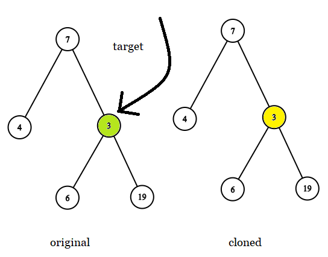
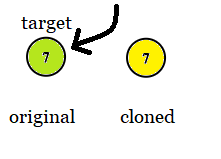
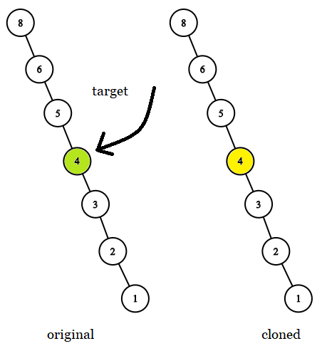

### 1. Description

Given two binary trees `original` and `cloned` and given a reference to a node `target` in the original tree.

The `cloned` tree is a **copy of** the `original` tree.

Return *a reference to the same node* in the `cloned` tree.

### 2. Function Contract

**Methods**

- `TreeNode(x)`: Initializes the data structure.
- `getTargetCopy(original: TreeNode, cloned: TreeNode, target: TreeNode) -> `TreeNode``: Executes operation.

### 3. Note

that you are **not allowed** to change any of the two trees or the `target` node and the answer **must be** a reference to a node in the `cloned` tree.

### 4. Examples

#### Example 1

- **Input:** $tree = [7,4,3,null,null,6,19], target = 3$
- **Output:** `3`
- **Explanation:** In all examples the original and cloned trees are shown. The target node is a green node from the original tree. The answer is the yellow node from the cloned tree.

#### Example 2

- **Input:** $tree = [7], target = 7$
- **Output:** `7`

#### Example 3

- **Input:** $tree = [8,null,6,null,5,null,4,null,3,null,2,null,1], target = 4$
- **Output:** `4`

### 5. Constraints

- The number of nodes in the `tree` is in the range $[1, 10^{4}]$.

- The values of the nodes of the `tree` are unique.

- `target` node is a node from the `original` tree and is not `null`.

**Follow up:** Could you solve the problem if repeated values on the tree are allowed?
