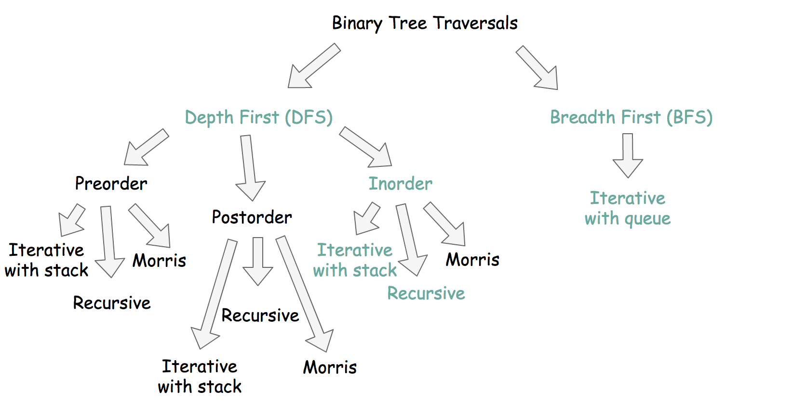
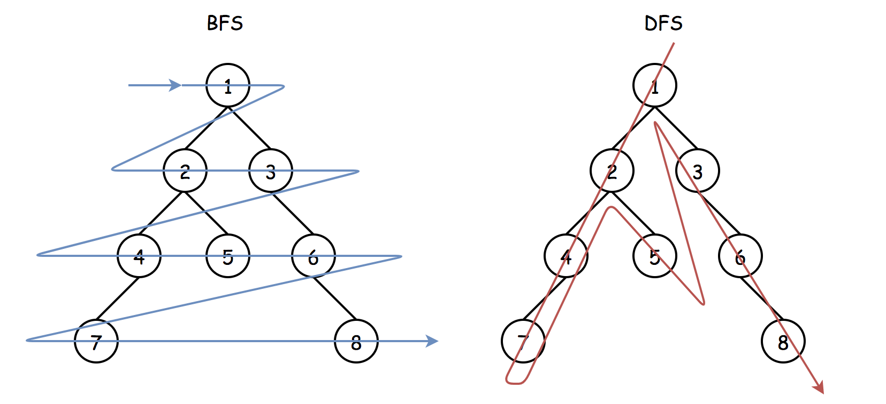
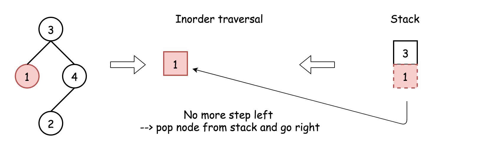
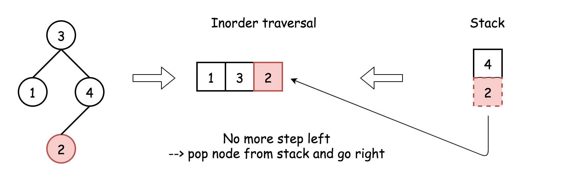
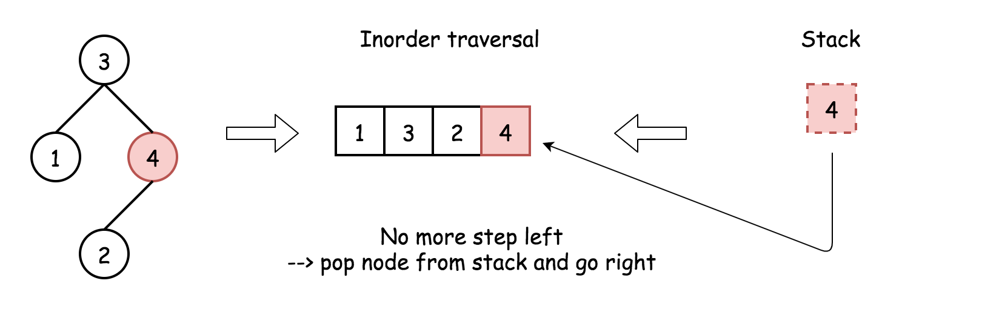

[TOC]

## Solution

---

### Overview

**How to Solve**

Let's traverse both trees in parallel, and once the target node is identified in the first tree, return the corresponding node from the second tree.

**How to Traverse the Tree: DFS vs BFS**

There are two ways to traverse the tree: DFS _depth first search_ and BFS _breadth first search_. Here is a small summary



Both start from the root and go down, both use additional structures, what's the difference? Here is how it looks at the big scale: BFS traverses level by level, and DFS first goes to the leaves.



> Description doesn't give us any clue which traversal is better to use here. Interview-simple solutions are DFS in order traversals.

In Approach 1 and Approach 2, we're going to discuss recursively inorder DFS and iterative inorder DFS traversals. They both need up to $\mathcal{O}(H)$ space to keep stack, where $H$ is a tree height.

In Approach 3, we provide a BFS solution. Normally, it's a bad idea to use BFS during the interview, unless the interviewer would push for it by adding new details into the problem description.

**Could We Solve in Constant Space?**

No. The problem could be solved in constant space using the DFS Morris inorder traversal algorithm, but it modifies the tree, and that isn't allowed here.

**Follow up: Repeated Values are Allowed**

If duplicate values are not allowed, one could compare node values:

```python
if node_o.val == target.val:
    # TODO
```

Otherwise, one has to compare the nodes:

```python
if node_o is target:
    # TODO
```

<br />
<br />

---
### Approach 1: DFS: Recursive Inorder Traversal.

Recursive inorder traversal is extremely simple: follow `Left->Node->Right` direction, _i.e._, do the recursive call for the _left_ child, then do all the business with the node (= check if the node is a target one or not), and then do the recursive call for the _right_ child.


*Figure 1. The nodes are enumerated in the order of visits. To compare different DFS strategies, follow `1-2-3-4-5` direction.*

**Implementation**

```python
class Solution:
    def getTargetCopy(self, original: TreeNode, cloned: TreeNode, target: TreeNode) -> TreeNode:
        def inorder(o: TreeNode, c: TreeNode):
            if o:
                inorder(o.left, c.left)
                if o is target:
                    self.ans = c
                inorder(o.right, c.right)

        inorder(original, cloned)
        return self.ans
```

**Complexity Analysis**

* Time complexity: $\mathcal{O}(N)$. Since one has to visit each node, where $N$ is the number of nodes.

* Space complexity: $\mathcal{O}(N)$. In the degenerative tree case (where the tree is shaped like a linked list), all nodes will be on the run-time stack while the deepest node is being processed. If the tree is balanced, the space complexity will be nearer to $\mathcal{O}(\log N)$, but remember that for the purposes of complexity analysis, we mostly consider the worst case.

<br />
<br />

---
### Approach 2: DFS: Iterative Inorder Traversal.

Iterative inorder traversal is straightforward: go left as far as you can, then one step right. Repeat till the end of nodes in the tree.










**Implementation**

[Don't use Stack in Java, use ArrayDeque instead](https://docs.oracle.com/javase/8/docs/api/java/util/Stack.html).

```python
class Solution:
    def getTargetCopy(self, original: TreeNode, cloned: TreeNode, target: TreeNode) -> TreeNode:
        stack_o, stack_c = [], []
        node_o, node_c = original, cloned

        while stack_o or node_c:
            while node_o:
                stack_o.append(node_o)
                stack_c.append(node_c)

                node_o = node_o.left
                node_c = node_c.left

            node_o = stack_o.pop()
            node_c = stack_c.pop()

            if node_o is target:
                return node_c

            node_o = node_o.right
            node_c = node_c.right
```

**Complexity Analysis**

* Time complexity: $\mathcal{O}(N)$. Since one has to visit each node.

* Space complexity: $\mathcal{O}(N)$. In the degenerative tree case (where the tree is shaped like a linked list), all nodes will be on the stack while the deepest node is being processed. If the tree is balanced, the space complexity will be nearer to $\mathcal{O}(\log N)$, but remember that for the purposes of complexity analysis, we mostly consider the worst case.

<br />

---

### Approach 3: BFS: Iterative Traversal.

**Algorithm**

Here we implement standard BFS traversal with the queue:

- Add root into queue.

- While queue is not empty:

- Pop out a node from queue.

- If the node is a target, we're done.

- Add first _left_ and then _right_ child node into queue.

**Implementation**

[Don't use Stack in Java, use ArrayDeque instead](https://docs.oracle.com/javase/8/docs/api/java/util/Stack.html).

```python
class Solution:
    def getTargetCopy(self, original: TreeNode, cloned: TreeNode, target: TreeNode) -> TreeNode:
        queue_o = deque([original,])
        queue_c = deque([cloned,])

        while queue_o:
            node_o = queue_o.popleft()
            node_c = queue_c.popleft()

            if node_o is target:
                return node_c

            if node_o:
                queue_o.append(node_o.left)
                queue_o.append(node_o.right)

                queue_c.append(node_c.left)
                queue_c.append(node_c.right)
```

**Complexity Analysis**

* Time complexity: $\mathcal{O}(N)$ since one has to visit each node.

* Space complexity: up to $\mathcal{O}(N)$ to keep the queue. Let's use the last level to estimate the queue size. This level could contain up to $N/2$ tree nodes in the case of [complete binary tree](https://leetcode.com/problems/count-complete-tree-nodes/).