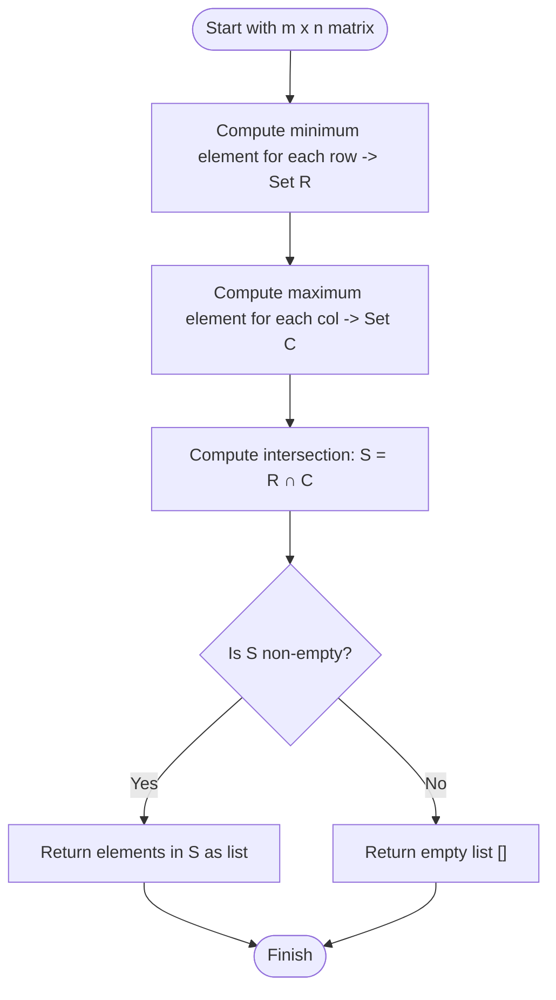

# Guided Example: Lucky Numbers in a Matrix

We trace the step-by-step execution of the row-minimum and column-maximum dual extremum search on a representative matrix instance:

- **Input:** `matrix = [[3, 7, 8], [9, 11, 13], [15, 16, 17]]`
- **Required output:** `[15]`

This instance is chosen because each row and column possesses a unique extremum, demonstrating the interplay between horizontal row minimization and vertical column maximization, and validating the minimax saddle-point condition.

---

## 1. Instance & Teaching Goal

Given an $m \times n$ matrix containing globally distinct integers, a **lucky number** is defined as an element that is simultaneously:
1. The minimum element in its row.
2. The maximum element in its column.

For `matrix = [[3, 7, 8], [9, 11, 13], [15, 16, 17]]`:
- Row $0$: $[3, 7, 8] \implies \min = 3$ (at column $0$).
- Row $1$: $[9, 11, 13] \implies \min = 9$ (at column $0$).
- Row $2$: $[15, 16, 17] \implies \min = 15$ (at column $0$).
- Column $0$: $[3, 9, 15] \implies \max = 15$ (at row $2$).
- Column $1$: $[7, 11, 16] \implies \max = 16$ (at row $2$).
- Column $2$: $[8, 13, 17] \implies \max = 17$ (at row $2$).

The element $15$ at coordinate $(2, 0)$ satisfies both properties simultaneously: it is the smallest in row $2$ and the largest in column $0$. Hence, the only lucky number is $15$.

The primary teaching goal is to recognize the saddle-point duality: because matrix elements are distinct, there is at most one lucky number in any matrix, and it corresponds precisely to the case where $\max_i (\min_j M[i][j]) = \min_j (\max_i M[i][j])$.

---

## 2. Conceptual Foundation & Invariants

Let $M$ be an $m \times n$ matrix. Define:
- The row minimum vector: $R_{\min}[i] = \min_{0 \le j < n} M[i][j]$ for each row $i \in \{0, \dots, m-1\}$.
- The column maximum vector: $C_{\max}[j] = \max_{0 \le i < m} M[i][j]$ for each column $j \in \{0, \dots, n-1\}$.

An element $M[r][c]$ is a lucky number if and only if:
$$
M[r][c] = R_{\min}[r] \quad \text{and} \quad M[r][c] = C_{\max}[c]
$$

```
Matrix Layout and Extrema:
                Col 0   Col 1   Col 2     Row Min
Row 0:        [   3,      7,      8   ] ->   3
Row 1:        [   9,     11,     13   ] ->   9
Row 2:        [  15*,    16,     17   ] ->  15*
                 |       |       |
Col Max:        15*     16      17

Intersection: Element 15 is row minimum (row 2) AND column maximum (col 0)!
```

We track state using the following parameters:

| Parameter | Mathematical Meaning | Value on Instance |
|---|---|---|
| Row Minima Set | $\{ R_{\min}[0], \dots, R_{\min}[m-1] \}$ | $\{3, 9, 15\}$ |
| Column Maxima Set | $\{ C_{\max}[0], \dots, C_{\max}[n-1] \}$ | $\{15, 16, 17\}$ |
| Candidate Set Intersection | $\{ x \mid x \in \text{RowMinima} \land x \in \text{ColMaxima} \}$ | $\{15\}$ |
| Saddle Point Value | $\max_i R_{\min}[i] = \min_j C_{\max}[j]$ | $15$ |

> **Invariant.** Because all elements in $M$ are distinct, if a lucky number exists, it is unique and equals both the maximum of all row minima and the minimum of all column maxima.

---

## 3. Step-by-Step Worked Execution

### Step 1: Compute Row Minima

We iterate over each row $i \in \{0, 1, 2\}$ and find the minimal element:
- Row $0$: $\min(3, 7, 8) = 3$.
- Row $1$: $\min(9, 11, 13) = 9$.
- Row $2$: $\min(15, 16, 17) = 15$.

The collected row minima set is:
$$
\mathcal{S}_{\text{row}} = \{3, 9, 15\}
$$

| Row Index ($i$) | Row Elements | Minimum Value | Coordinates |
|---|---|---|---|
| $0$ | $[3, 7, 8]$ | $3$ | $(0, 0)$ |
| $1$ | $[9, 11, 13]$ | $9$ | $(1, 0)$ |
| $2$ | $[15, 16, 17]$ | $15$ | $(2, 0)$ |

---

### Step 2: Compute Column Maxima

We iterate over each column $j \in \{0, 1, 2\}$ and find the maximal element:
- Column $0$: $\max(3, 9, 15) = 15$.
- Column $1$: $\max(7, 11, 16) = 16$.
- Column $2$: $\max(8, 13, 17) = 17$.

The collected column maxima set is:
$$
\mathcal{S}_{\text{col}} = \{15, 16, 17\}
$$

| Column Index ($j$) | Column Elements | Maximum Value | Coordinates |
|---|---|---|---|
| $0$ | $[3, 9, 15]$ | $15$ | $(2, 0)$ |
| $1$ | $[7, 11, 16]$ | $16$ | $(2, 1)$ |
| $2$ | $[8, 13, 17]$ | $17$ | $(2, 2)$ |

---

### Step 3: Intersect Extrema Sets

We compare the two sets to identify common values:
$$
\mathcal{S}_{\text{row}} \cap \mathcal{S}_{\text{col}} = \{3, 9, 15\} \cap \{15, 16, 17\} = \{15\}
$$

- Value $3$: In $\mathcal{S}_{\text{row}}$, absent from $\mathcal{S}_{\text{col}}$.
- Value $9$: In $\mathcal{S}_{\text{row}}$, absent from $\mathcal{S}_{\text{col}}$.
- Value $15$: In $\mathcal{S}_{\text{row}}$ and $\mathcal{S}_{\text{col}}$. Valid lucky number!

The resulting list is `[15]`.

---

## 4. Complete Execution Trace

| Phase | Action Description | Candidate Set / Evaluated State | Result |
|---|---|---|---|
| Phase 1 | Row minimum scan | Rows $0, 1, 2 \to$ values $3, 9, 15$ | $\mathcal{S}_{\text{row}} = \{3, 9, 15\}$ |
| Phase 2 | Column maximum scan | Columns $0, 1, 2 \to$ values $15, 16, 17$ | $\mathcal{S}_{\text{col}} = \{15, 16, 17\}$ |
| Phase 3 | Set intersection | $\{3, 9, 15\} \cap \{15, 16, 17\}$ | Element $15$ matched |
| Output | Result compilation | Single lucky value formatted as list | `[15]` |

---

## 5. Algorithmic Correctness & Complexity Derivation

### Uniqueness and Saddle Point Proof

Suppose there exist two distinct lucky numbers $A = M[r_1][c_1]$ and $B = M[r_2][c_2]$.
- Since $A$ is minimum in row $r_1$: $A \le M[r_1][c_2]$.
- Since $B$ is maximum in column $c_2$: $M[r_1][c_2] \le B$.
- Therefore, $A \le B$.

By symmetric reasoning:
- Since $B$ is minimum in row $r_2$: $B \le M[r_2][c_1]$.
- Since $A$ is maximum in column $c_1$: $M[r_2][c_1] \le A$.
- Therefore, $B \le A$.

Combining both inequalities yields $A \le B \le A \implies A = B$.
Because all elements in the matrix are distinct, two lucky numbers cannot exist at distinct positions. Thus, the number of lucky numbers is either $0$ or $1$.

### Asymptotic Complexity

- **Time Complexity:** $\mathcal{O}(m \cdot n)$. Finding all row minima visits each of the $m \cdot n$ elements once. Finding all column maxima similarly visits each of the $m \cdot n$ elements once. Intersecting the two sets of sizes $m$ and $n$ takes $\mathcal{O}(m + n)$ time. Total time is $\mathcal{O}(m \cdot n)$.
- **Auxiliary Space Complexity:** $\mathcal{O}(m + n)$. Storing the sets or vectors of row minima and column maxima requires space proportional to the sum of the dimensions. (Alternatively, $\mathcal{O}(1)$ space by comparing $\max_i R_{\min}[i]$ with $\min_j C_{\max}[j]$).

---

## 6. Traps & Edge Cases

- **Distinct Elements Guarantee:** The problem guarantees distinct entries. If duplicate elements were permitted, multiple equal saddle points could appear across different rows and columns.
- **Empty Result Case:** If $\max(\text{row minima}) \ne \min(\text{col maxima})$, no saddle point exists, and the output is the empty list `[]`.
- **Single Row or Column ($1 \times n$ or $m \times 1$):** In a $1 \times n$ matrix, the row minimum is automatically the column maximum for its column (which contains only one element), so the minimum element is always lucky.
- **Strict Inequalities:** An element must be strictly the maximum and minimum among distinct values; partial ties cannot occur due to the uniqueness constraint.

---

## 7. Accessible Mermaid Diagram


