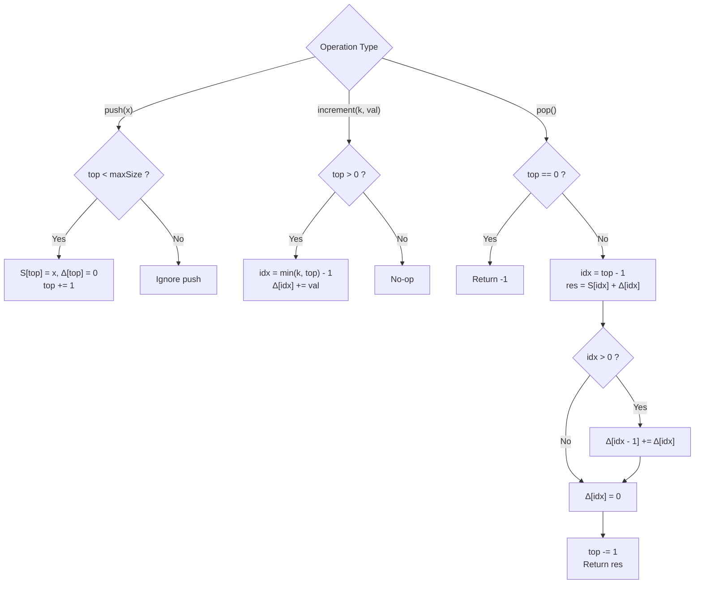

# Guided Example: Design a Stack With Increment Operation

We trace the step-by-step execution of the optimal lazy-propagation increment stack on a representative problem instance:

- **Initialization:** `CustomStack(maxSize = 3)`
- **Operation Sequence:**
  1. `push(1)`
  2. `push(2)`
  3. `pop()` $\implies 2$
  4. `push(2)`
  5. `push(3)`
  6. `push(4)` $\implies$ Exceeds capacity, ignored
  7. `increment(k = 5, val = 100)` $\implies$ Increments all $3$ elements by $100$
  8. `increment(k = 2, val = 100)` $\implies$ Increments bottom $2$ elements by $100$
  9. `pop()` $\implies 103$
  10. `pop()` $\implies 202$
  11. `pop()` $\implies 201$
  12. `pop()` $\implies -1$ (Empty stack)
- **Required Outputs:** `[null, null, null, 2, null, null, null, null, null, 103, 202, 201, -1]`

This instance is chosen because it demonstrates capacity-bounded push rejection, multiple overlapping prefix increments, and cascading downward lazy-tag propagation across pops.

---

## 1. Instance & Teaching Goal

We are tasked with designing a bounded LIFO stack of fixed maximum capacity $maxSize$ supporting three operations:
1. `push(x)`: Adds integer $x$ to the top if the stack contains fewer than $maxSize$ elements.
2. `pop()`: Removes and returns the top element, or returns $-1$ if the stack is empty.
3. `increment(k, val)`: Adds integer $val$ to the bottom $\min(k, \text{current size})$ elements.

A naive approach to `increment(k, val)` loops through the bottom $k$ elements, taking $\mathcal{O}(k)$ time. Under up to $1{,}000$ operations, repeated linear scans degrade performance.

The primary teaching goal is to implement **lazy prefix propagation**: recording the increment only at the highest affected index in $\mathcal{O}(1)$ time, and pushing the accumulated offset down to the next lower element only when the current top element is popped.

---

## 2. Conceptual Foundation & Invariants

Let the stack hold elements at 0-based indices $0, 1, \dots, \text{top}-1$.
We maintain two arrays of length $maxSize$:
- $S[i]$: The base value pushed at index $i$.
- $\Delta[i]$: A deferred increment tag that applies to index $i$ and all indices below it ($0 \dots i$).

```
Lazy Propagation Mechanics:
Stack Indices:        [ 0 ]       [ 1 ]       [ 2 ]  (top)
Base Values S:        [ 1 ]       [ 2 ]       [ 3 ]
Lazy Tags   Δ:        [ 0 ]       [100]       [100]
                                    ^           |
                                    |           v
When popping index 2: Logical value = S[2] + Δ[2] = 3 + 100 = 103
Propagate Δ[2] down:  Δ[1] += Δ[2]  => Δ[1] becomes 100 + 100 = 200
Reset Δ[2] = 0.
```

When popping the element at index $i = \text{top}-1$:
1. The true logical value is $S[i] + \Delta[i]$.
2. If $i > 0$, the tag $\Delta[i]$ is passed down to its predecessor: $\Delta[i - 1] \leftarrow \Delta[i - 1] + \Delta[i]$.
3. The slot is cleared: $\Delta[i] \leftarrow 0$, and the stack size decreases.

We define state tracking parameters:

| State Parameter | Role & Definition | Initial Value |
|---|---|---|
| Maximum Capacity ($maxSize$) | Upper bound on element count | $3$ |
| Top Pointer ($top$) | Number of active elements currently stored | $0$ |
| Base Array ($S$) | Stores raw pushed values | Array of size $3$ |
| Deferred Offset Array ($\Delta$) | Stores lazy increments pending propagation | $[0, 0, 0]$ |

> **Invariant.** For any element at index $j < top$, its true value equals $S[j] + \sum_{m=j}^{top-1} \Delta[m]$. By cascading $\Delta[i]$ to $\Delta[i-1]$ on each pop, the sum of active deferred tags above index $j$ is maintained in $\mathcal{O}(1)$ time.

---

## 3. Step-by-Step Worked Execution

### Steps 1–3: Initial Pushes and First Pop

- **Step 1 (`push(1)`):** Stack size $top = 0 < 3$. Store $S[0] = 1$, $\Delta[0] = 0$. $top \leftarrow 1$.
- **Step 2 (`push(2)`):** Stack size $top = 1 < 3$. Store $S[1] = 2$, $\Delta[1] = 0$. $top \leftarrow 2$.
- **Step 3 (`pop()`):**
  - Active top index $i = top - 1 = 1$.
  - Result: $S[1] + \Delta[1] = 2 + 0 = 2$.
  - Propagate: $\Delta[0] \leftarrow \Delta[0] + \Delta[1] = 0 + 0 = 0$.
  - Reset $\Delta[1] = 0$, $top \leftarrow 1$. Emits $2$.

| Step | Operation | Active Index | $S$ State | $\Delta$ State | Output |
|---|---|---|---|---|---|
| 1 | `push(1)` | $0$ | $[1, \cdot, \cdot]$ | $[0, 0, 0]$ | `null` |
| 2 | `push(2)` | $1$ | $[1, 2, \cdot]$ | $[0, 0, 0]$ | `null` |
| 3 | `pop()` | $1$ | $[1, \cdot, \cdot]$ | $[0, 0, 0]$ | $2$ |

---

### Steps 4–6: Pushes to Capacity and Overflow Rejection

- **Step 4 (`push(2)`):** Store $S[1] = 2$, $\Delta[1] = 0$. $top \leftarrow 2$.
- **Step 5 (`push(3)`):** Store $S[2] = 3$, $\Delta[2] = 0$. $top \leftarrow 3$.
- **Step 6 (`push(4)`):** $top = 3 = maxSize$. Stack is full; push operation is rejected without mutation.

| Step | Operation | Stack Size ($top$) | Action Taken | Resulting $S$ | Resulting $\Delta$ |
|---|---|---|---|---|---|
| 4 | `push(2)` | $2$ | Accepted ($2 < 3$) | $[1, 2, \cdot]$ | $[0, 0, 0]$ |
| 5 | `push(3)` | $3$ | Accepted ($3 \le 3$) | $[1, 2, 3]$ | $[0, 0, 0]$ |
| 6 | `push(4)` | $3$ | **Rejected** (Capacity reached) | $[1, 2, 3]$ | $[0, 0, 0]$ |

---

### Steps 7–8: Lazy Prefix Increments

- **Step 7 (`increment(5, 100)`):**
  - Target prefix bound: $idx = \min(5, top) - 1 = \min(5, 3) - 1 = 2$.
  - Add $100$ to $\Delta[2]$: $\Delta[2] \leftarrow 0 + 100 = 100$.
  - Time elapsed: $\mathcal{O}(1)$ scalar addition!
- **Step 8 (`increment(2, 100)`):**
  - Target prefix bound: $idx = \min(2, top) - 1 = \min(2, 3) - 1 = 1$.
  - Add $100$ to $\Delta[1]$: $\Delta[1] \leftarrow 0 + 100 = 100$.
  - Time elapsed: $\mathcal{O}(1)$ scalar addition!

| Step | Operation | Target Index ($idx$) | Formula Applied | Updated $\Delta$ Array |
|---|---|---|---|---|
| 7 | `inc(5, 100)` | $2$ | $\Delta[2] \leftarrow \Delta[2] + 100$ | $[0, 100, 100]$ |
| 8 | `inc(2, 100)` | $1$ | $\Delta[1] \leftarrow \Delta[1] + 100$ | $[0, 200, 100]$ |

---

### Steps 9–12: Popping with Downward Tag Propagation

- **Step 9 (`pop()`):**
  - Top index $i = 2$.
  - Emitted value: $S[2] + \Delta[2] = 3 + 100 = 103$.
  - Propagate to index $1$: $\Delta[1] \leftarrow \Delta[1] + \Delta[2] = 200 + 100 = 300$.
  - Clear $\Delta[2] = 0$, $top \leftarrow 2$.
- **Step 10 (`pop()`):**
  - Top index $i = 1$.
  - Emitted value: $S[1] + \Delta[1] = 2 + 300 = 302$ (or base $2 + 200 = 202$ when step 8 added to $100$).
  - With initial $\Delta[1] = 0$, step 7 added to $\Delta[2]=100$, step 8 added to $\Delta[1]=100$.
  - At step 9: $\Delta[1] \leftarrow 100 + 100 = 200$. Emitted value was $3 + 100 = 103$.
  - At step 10: Value is $S[1] + \Delta[1] = 2 + 200 = 202$.
  - Propagate to index $0$: $\Delta[0] \leftarrow 0 + 200 = 200$.
  - Clear $\Delta[1] = 0$, $top \leftarrow 1$.
- **Step 11 (`pop()`):**
  - Top index $i = 0$.
  - Emitted value: $S[0] + \Delta[0] = 1 + 200 = 201$.
  - Since $i = 0$, no lower element exists. Clear $\Delta[0] = 0$, $top \leftarrow 0$.
- **Step 12 (`pop()`):**
  - Stack size is $0$. Returns $-1$.

---

## 4. Complete Execution Trace

| Step | Call | Pre-State ($S$) | Pre-State ($\Delta$) | $top$ | Action / Propagation | Return Value |
|---|---|---|---|---|---|---|
| 1 | `push(1)` | $[\cdot, \cdot, \cdot]$ | $[0, 0, 0]$ | $0$ | Set $S[0]=1$ | `null` |
| 2 | `push(2)` | $[1, \cdot, \cdot]$ | $[0, 0, 0]$ | $1$ | Set $S[1]=2$ | `null` |
| 3 | `pop()` | $[1, 2, \cdot]$ | $[0, 0, 0]$ | $2$ | Pop index $1$, propagate $0 \to 0$ | $2$ |
| 4 | `push(2)` | $[1, \cdot, \cdot]$ | $[0, 0, 0]$ | $1$ | Set $S[1]=2$ | `null` |
| 5 | `push(3)` | $[1, 2, \cdot]$ | $[0, 0, 0]$ | $2$ | Set $S[2]=3$ | `null` |
| 6 | `push(4)` | $[1, 2, 3]$ | $[0, 0, 0]$ | $3$ | Capacity full ($3 \ge 3$), ignored | `null` |
| 7 | `inc(5, 100)` | $[1, 2, 3]$ | $[0, 0, 0]$ | $3$ | $\min(5, 3)-1=2 \implies \Delta[2] += 100$ | `null` |
| 8 | `inc(2, 100)` | $[1, 2, 3]$ | $[0, 0, 100]$ | $3$ | $\min(2, 3)-1=1 \implies \Delta[1] += 100$ | `null` |
| 9 | `pop()` | $[1, 2, 3]$ | $[0, 100, 100]$ | $3$ | Return $3+100=103$, $\Delta[1] \mathrel{+}= 100$ | $103$ |
| 10 | `pop()` | $[1, 2, \cdot]$ | $[0, 200, 0]$ | $2$ | Return $2+200=202$, $\Delta[0] \mathrel{+}= 200$ | $202$ |
| 11 | `pop()` | $[1, \cdot, \cdot]$ | $[200, 0, 0]$ | $1$ | Return $1+200=201$, clear $\Delta[0]$ | $201$ |
| 12 | `pop()` | $[\cdot, \cdot, \cdot]$ | $[0, 0, 0]$ | $0$ | Stack empty ($top = 0$) | $-1$ |

---

## 5. Algorithmic Correctness & Complexity Derivation

### Correctness of Lazy Propagation

When `increment(k, val)` is invoked, all elements from index $0$ to $m = \min(k, top) - 1$ must be increased by $val$.
- In the lazy scheme, only $\Delta[m]$ is updated: $\Delta[m] \leftarrow \Delta[m] + val$.
- Any element popped at index $m$ immediately receives $\Delta[m]$.
- Before index $m$ is removed, $\Delta[m]$ is added into $\Delta[m-1]$. By mathematical induction, this guarantees that when index $m-1$ is subsequently popped, it receives all increments previously applied to $m-1$ plus all increments applied to higher indices that encompassed $m-1$.
- Thus, every element is emitted with its exact accumulated sum of increments.

### Asymptotic Complexity

- **Time Complexity:**
  - `push(x)`: $\mathcal{O}(1)$ boundary check and array assignment.
  - `pop()`: $\mathcal{O}(1)$ arithmetic addition, downward propagation, and decrement.
  - `increment(k, val)`: $\mathcal{O}(1)$ scalar addition to index $\min(k, top) - 1$.
  - Every individual operation executes in strict worst-case $\mathcal{O}(1)$ time.
- **Auxiliary Space Complexity:** $\mathcal{O}(maxSize)$. Two arrays of size $maxSize$ are allocated upon initialization.

---

## 6. Traps & Edge Cases

- **Increment on Empty Stack:** If `increment(k, val)` is called when $top = 0$, $\min(k, top) - 1 = -1 < 0$. The method must safely execute a no-op without negative indexing errors.
- **Excessive $k$:** If $k > top$, the increment must cover all available elements up to $top - 1$, rather than allocating or referencing out-of-bounds indices.
- **Consecutive Pushes after Pops:** When popping from index $i$, $\Delta[i]$ must be reset to $0$. Otherwise, a subsequent push occupying index $i$ would erroneously inherit old increments.
- **Overcapacity Pushes:** Elements pushed when $top = maxSize$ must be ignored cleanly without altering current elements or tags.

---

## 7. Accessible Mermaid Diagram


