## Solution

---

### Approach 1: Array

#### Intuition

At its core, a stack is essentially a list with limited access where we can only interact with the topmost element. For a comprehensive understanding of stacks, refer to this LeetCode [Explore Card](https://leetcode.com/explore/learn/card/queue-stack/230/usage-stack/) for an in-depth explanation.

Let's keep a pointer `topIndex` to point to the top element. We'll simulate the stack using an array since we can access each index of the array in constant time.

- `push()`:
  The push operation adds an element to the top of the stack, which corresponds to the end of our array. We increment `topIndex` to the next available position in the array and insert the new element there.

- `pop()`:
  The pop operation removes and returns the element currently at the top of the stack. We return the element that `topIndex` points to and then decrement `topIndex` to indicate the new top element. There's no need to physically remove the element from the array; when `topIndex` next reaches that position, the element will simply be overwritten.

- `increment()`:
  This operation is unique to our custom stack implementation, as it manipulates elements other than the topmost one. Here, our array representation proves advantageous. We iterate through the first `k` elements (or all elements if the array's length is less than `k`) and increase each element by the given value.

#### Algorithm

- Initialize
  1. an integer array `stackArray` to store the stack elements.
  2. an integer variable `topIndex` to -1, representing an empty stack.

- In the constructor, initialize `stackArray` with the given `maxSize`.

- In the `push` method:
   - Check if `topIndex` is less than the last index of `stackArray`.
   - If true, increment `topIndex` and add the new element `x` at that index.

- In the `pop` method:
   - Check if `topIndex` is greater than or equal to `0`.
   - If true, return the element at `topIndex` and decrement `topIndex`.
   - If false, return `-1` to indicate an empty stack.

- In the `increment` method:
   - Calculate the `limit` as the minimum of `k` and $topIndex + 1$.
   - Iterate from `0` to $limit - 1$:
     - For each iteration, add `val` to the element at index `i` in `stackArray`.

#### Implementation

```python
class CustomStack:
    def __init__(self, max_size: int):
        # Array to store stack elements
        self._stack = []
        # Index of the top element in the stack
        self._max_size = max_size

    def push(self, x: int) -> None:
        if len(self._stack) < self._max_size:
            self._stack.append(x)

    def pop(self) -> int:
        return self._stack.pop() if self._stack else -1

    def increment(self, k: int, val: int) -> None:
        for i in range(min(k, len(self._stack))):
            self._stack[i] += val
```

#### Complexity Analysis

- Time complexity: $O(1)$ for `push` and `pop`, $O(k)$ for `increment`

    The `push` and `pop` methods both perform a single comparison and at most one array operation, all of which are constant time operations.

    The `increment` method iterates over $k$ elements in the worst case, thus having a $O(k)$ time complexity.

- Space complexity: $O(\text{maxSize})$

    The overall space complexity is $O(\text{maxSize})$, due to the `stackArray` which can store at most $\text{maxSize}$ elements.

---

### Approach 2: Linked List

#### Intuition

In the previous approach, the array has a fixed size (`maxSize`), regardless of whether the stack ever reaches full capacity. This can lead to wasted space. A more efficient solution is to use a data structure that grows dynamically with the stack while still allowing constant-time operations on its end element. A linked list is well-suited for this purpose.

The linked list implementation is similar to the array-based approach, but it optimizes space usage. Instead of modifying the element at a specific `topIndex`, the push operation adds a new node to the tail of the linked list, and the pop operation removes the tail node. The increment operation remains largely the same: we iterate through the first `k` elements (or all elements if the list has fewer than `k` nodes) and update their values.

#### Algorithm

- Initialize
  - a list named `stack` to store the elements of the custom stack.
  - a variable `maxSize` to hold the maximum capacity of the stack.

- In the constructor:
  - Set `maxSize` to the provided parameter value.

- In the `push` method:
  - Check if the current size of `stack` is less than `maxSize`:
- If true, add the new element to the end of `stack`.

- In the `pop` method:
  - If the `stack` is empty, return -1.
  - Else, remove and return the last element of `stack`.

- In the `increment` method:
  - Iterate over the first `k` elements of the stack (or all elements if `k` exceeds the `stack` size).
- For each element, update its value by adding `val`.

#### Implementation

```python
class CustomStack:
    def __init__(self, maxSize: int):
        # Initialize the stack as a deque for efficient add/remove operations
        self.stack = deque()
        self.max_size = maxSize

    def push(self, x: int) -> None:
        # Add the element to the top of the stack if it hasn't reached max_size
        if len(self.stack) < self.max_size:
            self.stack.append(x)

    def pop(self) -> int:
        # Return -1 if the stack is empty, otherwise remove and return the top element
        return self.stack.pop() if self.stack else -1

    def increment(self, k: int, val: int) -> None:
        # Increment the bottom k elements (or all elements if k > stack size)
        for i, _ in zip(range(k), self.stack):
            self.stack[i] += val
```

#### Complexity Analysis

- Time complexity: $O(1)$ for `push` and `pop`, $O(k)$ for `increment`

    The `push` and `pop` operations modify the last node in the list, both taking constant time.

    In the worst case, the `increment` method updates $k$ elements, taking $O(k)$ time.

- Space complexity: $O(\text{maxSize})$

    The stack can store $\text{maxSize}$ elements in the worst case.

---

### Approach 3: Array using Lazy Propagation

#### Intuition

In the previous approach, the `increment` operation modified the bottom `k` elements directly, which can become inefficient for large stacks or frequent increments. To improve this, we can use lazy propagation, a technique where updates are delayed until absolutely necessary.

Instead of immediately updating all affected elements during an increment, we store the increment value and apply it only when needed. This is useful when dealing with a range of elements but without the need for immediate updates.

We introduce an additional array, `incrementArray`, that tracks the increment values. Each index `i` in this array holds the cumulative value by which the elements `[0, i]` in the stack will be incremented.

- `push()`:
  The push operation remains the same as before. No changes are needed in the `incrementArray` because pushing doesn't involve any increment adjustments.

- `pop()`:
  When popping an element, we return the value at the top of the stack, including any increments that apply to it. This is where lazy propagation is used.

  First, we retrieve the value at `topIndex` and add the corresponding increment from `incrementArray`. Since this top position is being removed, the increment for it needs to be passed down to the next element below. We do this by adding the increment at `topIndex` to `incrementArray[topIndex-1]`, preserving the necessary increments for future pops.

  Then, we decrement `topIndex` to remove the current top element.

- `increment()`:
  Instead of directly modifying the bottom `k` elements, we simply update the value at index `k-1` in `incrementArray`. If the stack size is less than `k`, we update the increment at `topIndex` instead. This avoids unnecessary modifications and applies the increments only when the affected elements are accessed.

Check out the algorithm in action in the slideshow below:

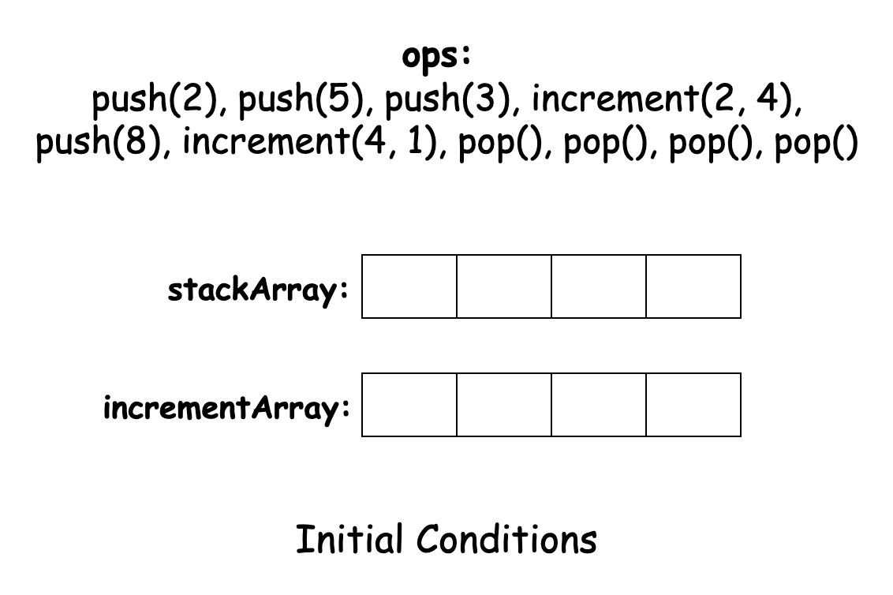

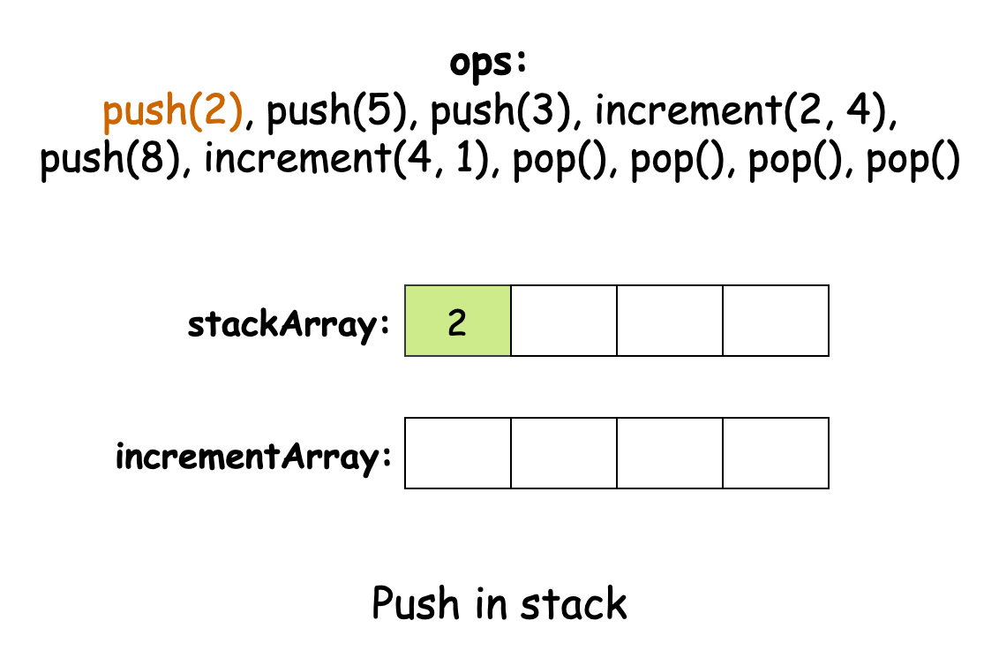

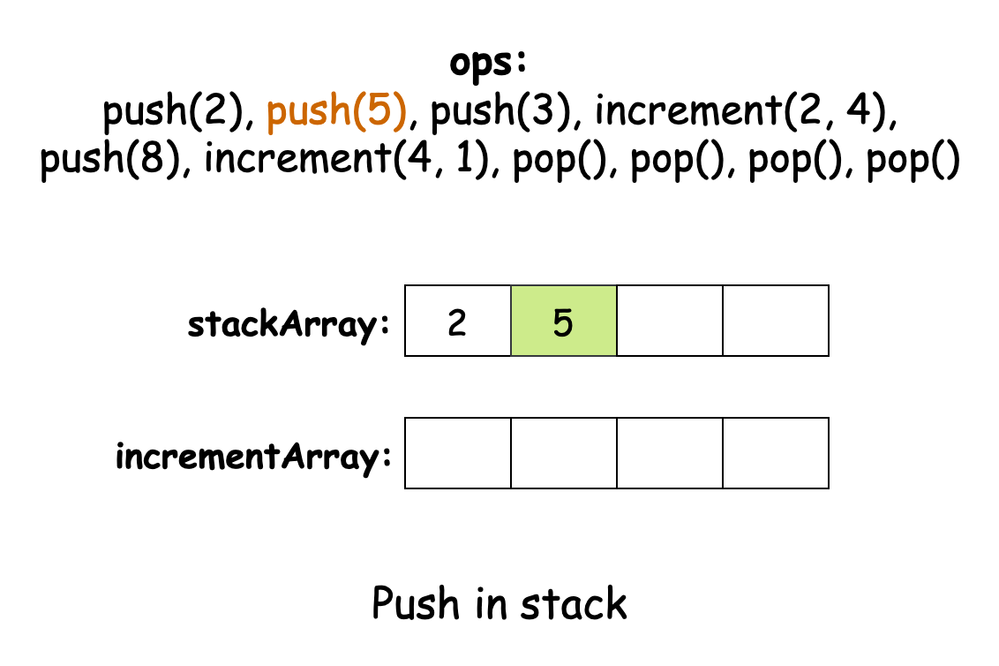

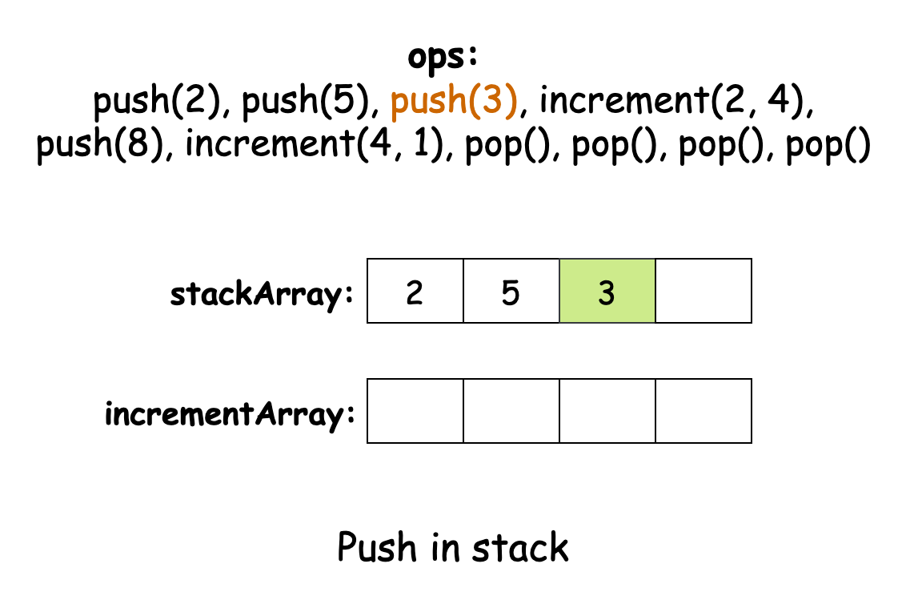

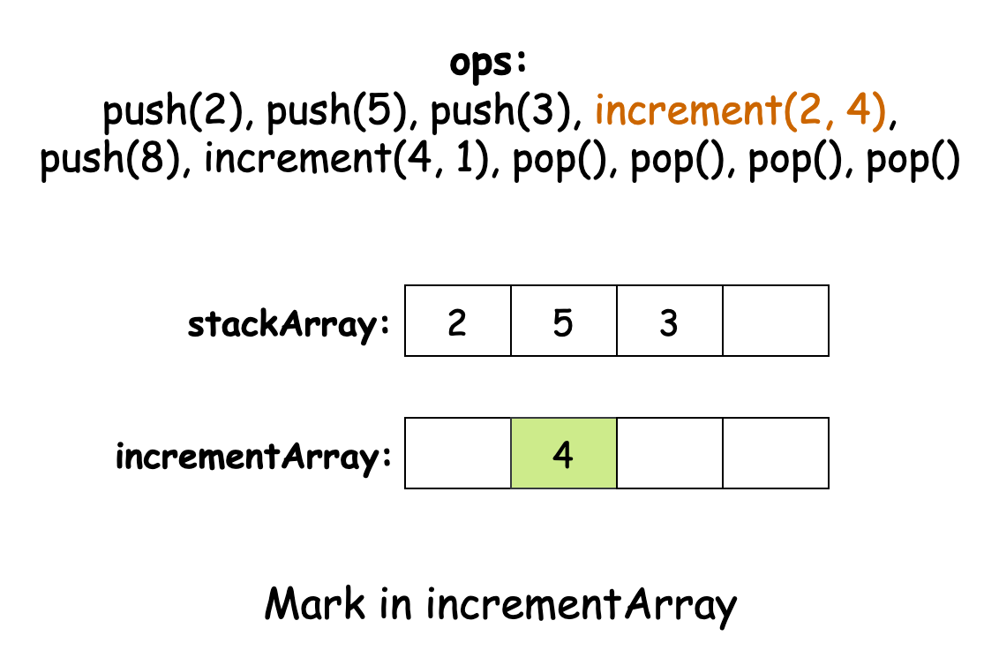

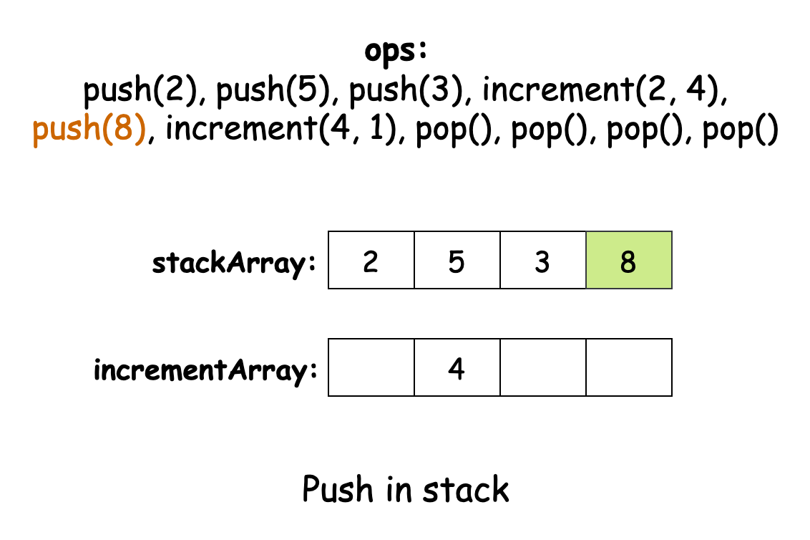

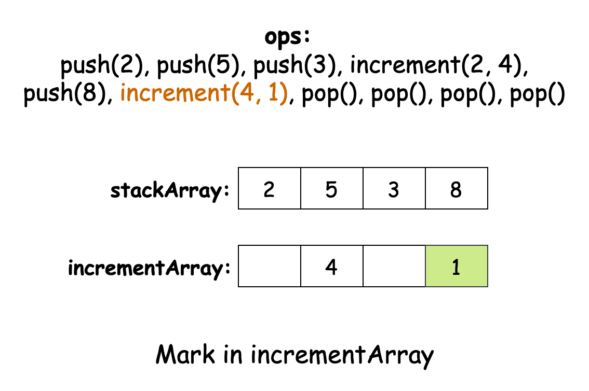

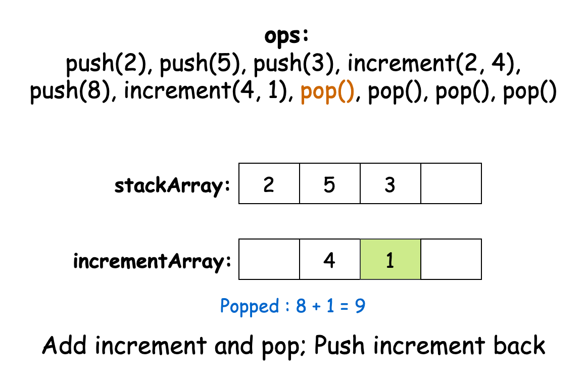

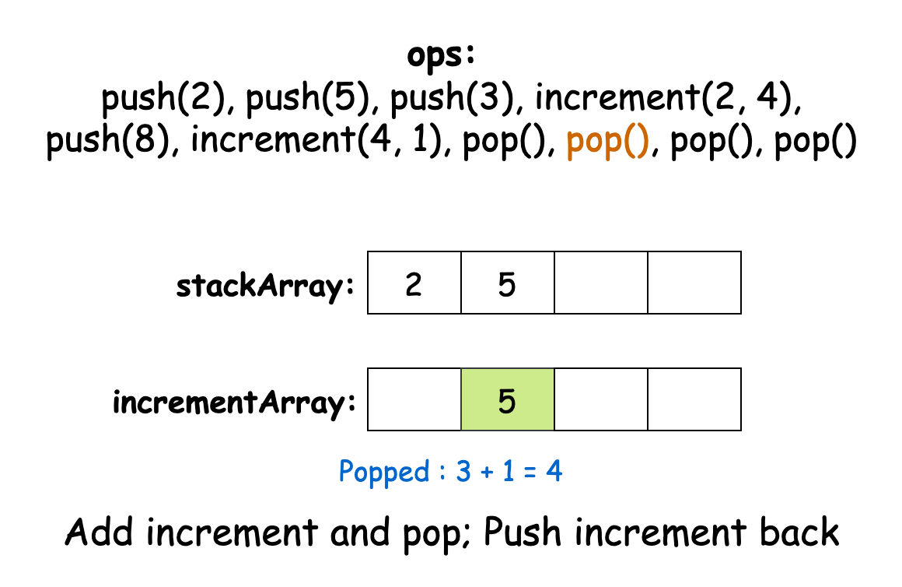

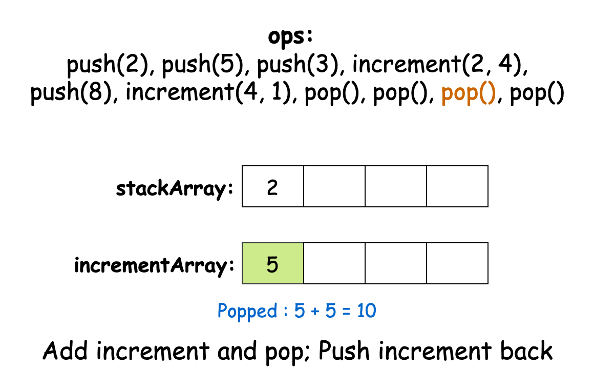

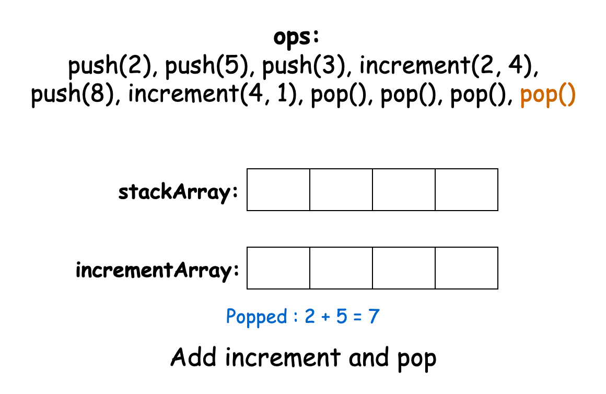

#### Algorithm

- Initialize
  1. an integer array `stackArray` to store the stack elements.
  2. an integer array `incrementArray` to store increments for lazy propagation.
  3. an integer variable `topIndex` to `-1`, representing an empty stack.

- In the constructor:
   - Initialize `stackArray` with the given `maxSize`.
   - Initialize `incrementArray` with the same `maxSize`.
   - Set `topIndex` to `-1`.

- In the `push` method:
   - Check if `topIndex` is less than the last index of `stackArray`.
   - If true, increment `topIndex` and add the new element `x` at that index in `stackArray`.

- In the `pop` method:
   - Check if `topIndex` is less than 0.
   - If true, return `-1` to indicate an empty stack.
   - Calculate the actual value by adding $\text{stackArray}[topIndex]$ and $\text{incrementArray}[topIndex]$.
   - If `topIndex` is greater than 0, add $\text{incrementArray}[topIndex]$ to $incrementArray[topIndex - 1]$.
   - Reset $\text{incrementArray}[topIndex]$ to `0`.
   - Decrement `topIndex`.
   - Return the calculated result.

- In the `increment` method:
   - Check if `topIndex` is greater than or equal to `0`.
   - If true, calculate `incrementIndex` as the minimum of `topIndex` and $k - 1$.
   - Add `val` to $\text{incrementArray}[incrementIndex]$.

#### Implementation

```python
class CustomStack:
    def __init__(self, max_size: int):
        # List to store stack elements
        self._stack = [0] * max_size
        # List to store increments for lazy propagation
        self._inc = [0] * max_size
        # Current top index of the stack
        self._top = -1

    def push(self, x: int) -> None:
        if self._top < len(self._stack) - 1:
            self._top += 1
            self._stack[self._top] = x

    def pop(self) -> int:
        if self._top < 0:
            return -1

        # Calculate the actual value with increment
        result = self._stack[self._top] + self._inc[self._top]

        # Propagate the increment to the element below
        if self._top > 0:
            self._inc[self._top - 1] += self._inc[self._top]

        # Reset the increment for this position
        self._inc[self._top] = 0
        self._top -= 1
        return result

    def increment(self, k: int, val: int) -> None:
        if self._top >= 0:
            # Apply increment to the topmost element of the range
            index = min(self._top, k - 1)
            self._inc[index] += val
```

#### Complexity Analysis

* Time complexity: $O(1)$ for all operations

    The `push`, `pop`, and `increment` methods perform only constant time operations (comparisons and array operations).

* Space complexity: $O(\text{maxSize})$

    The `stackArray` and the `incrementArray` arrays both have a size of $\text{maxSize}$. Thus, the overall space complexity of the algorithm is $O(2 \cdot \text{maxSize}) = O(\text{maxSize})$

---