## Solution

---

### Overview

We need to balance a binary search tree rooted at the `root` such that the difference between the depths of the two subtrees of every node never exceeds one. As a reminder, the depth of a given node in a tree is the number of edges from the root of the tree to that node.

> Note: Binary search trees (BSTs) are structured such that the value of each node is greater than all values in its left subtree and less than all values in its right subtree. Please refer to LeetCode's Explore Card on binary trees for a more detailed explanation: [**Binary Trees**](https://leetcode.com/explore/learn/card/data-structure-tree/)

We call such BSTs balanced BSTs. Balanced BSTs are efficient because they keep the tree height low, usually in logarithmic proportion to the number of nodes. This balance allows operations like insertion, deletion, and lookup to be done in logarithmic time on average. Keeping the tree balanced prevents it from becoming too deep, which would otherwise slow these operations down to linear time. This efficiency makes balanced BSTs ideal for tasks that need fast updates and quick searches.

There are two main approaches to balance a BST.

The first approach is to traverse and store all the BST nodes in a sorted array, then reconstruct the BST from scratch. Storing the values in sorted order ensures the new tree maintains the BST properties, where each node's left subtree contains only values less than the node's value, and the right subtree contains only values greater.

The second approach is to balance the BST in-place by restructuring it without additional storage. This involves performing rotations and rearrangements directly on the existing nodes to achieve balance while preserving BST properties.

This approach is more complex and is unlikely to be asked in an interview setting. However, it's worth understanding for deeper insights into tree rotations, balancing techniques, and the workings of self-balancing trees like AVL and Red-Black trees.

---

### Approach 1: Inorder Traversal + Recursive Construction

#### Intuition

In the overview, we mentioned the need to traverse and store the nodes of the BST in increasing order. This can be achieved by iteratively visiting each node in the following order: first the left subtree, then the node itself, and finally the right subtree, known as an inorder traversal.

If you are not familiar with the three main traversal methods (inorder, preorder, and postorder), we encourage you to read about them here:

* [Inorder Traversal](https://leetcode.com/problems/binary-tree-inorder-traversal/editorial/)
* [Preorder Traversal](https://leetcode.com/problems/binary-tree-preorder-traversal/editorial/)
* [Postorder Traversal](https://leetcode.com/problems/binary-tree-postorder-traversal/editorial/)

We can perform the inorder traversal either recursively or iteratively. In this editorial, we will use the recursive approach for its simplicity and brevity, though you are encouraged to try both methods.

With the nodes of the BST stored in an array in increasing order, we can now reconstruct the BST to be balanced.

The stored values in the array have a convenient property: for any given element that serves as the root, all elements to its left belong to the left subtree, and all elements to its right belong to the right subtree. To construct a balanced BST, we pick the middle element of the array as the root, ensuring the number of elements in the left and right subtrees differs by at most one. We then recursively apply the same process to the left and right subarrays to build the left and right subtrees. This approach ensures the balanced property of the BST.

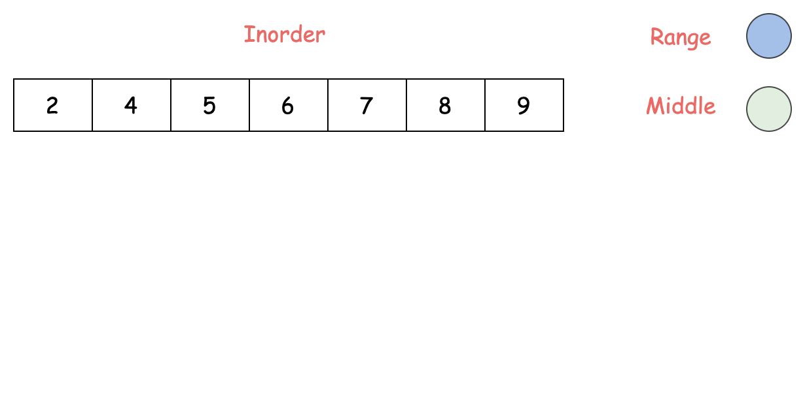

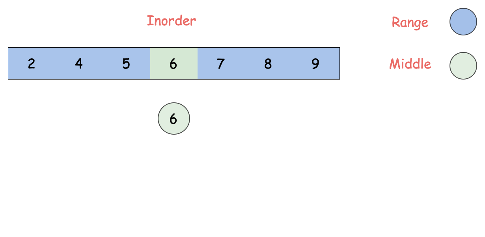

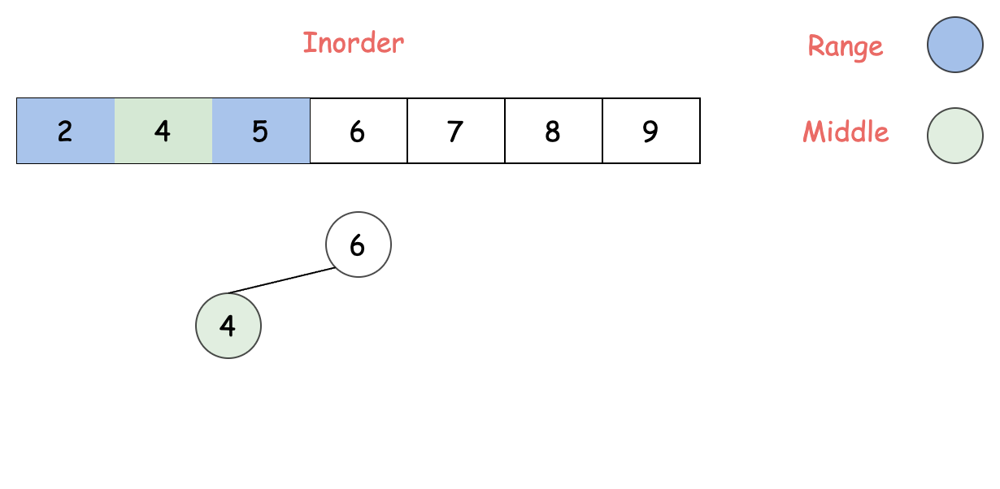

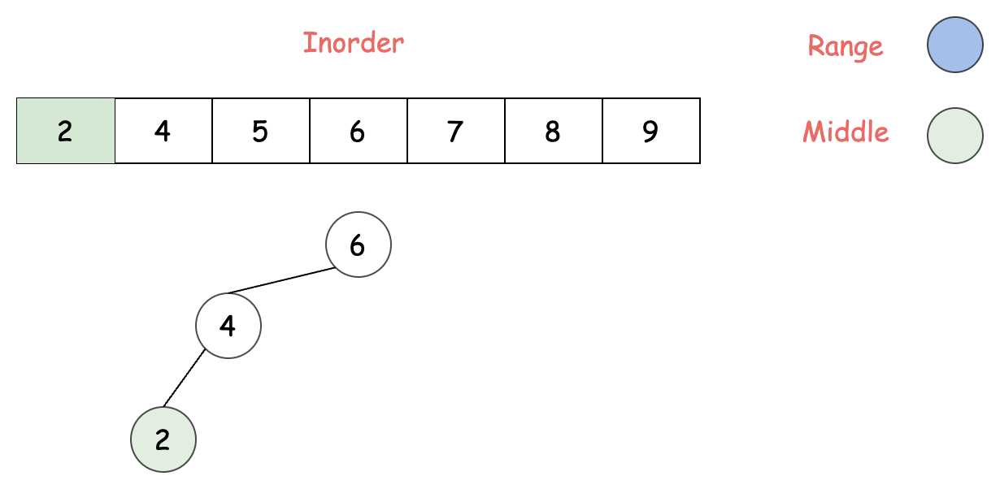

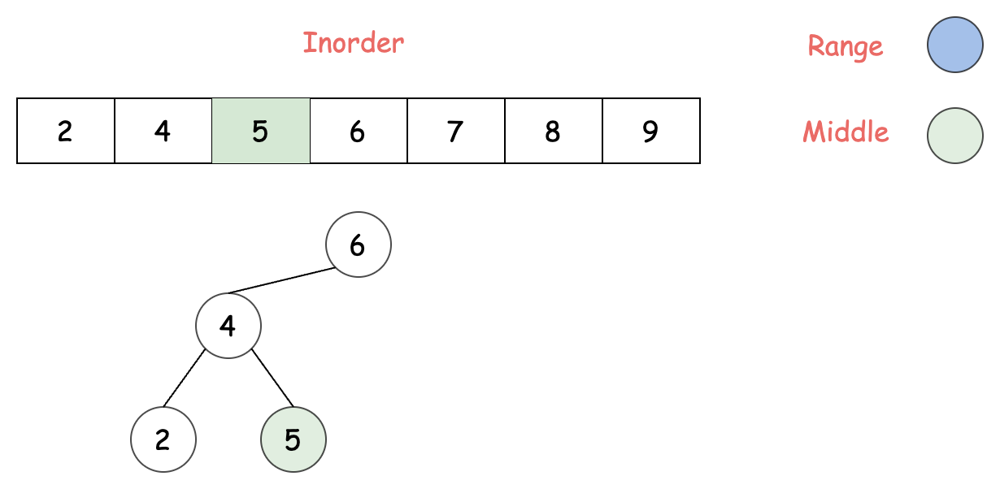

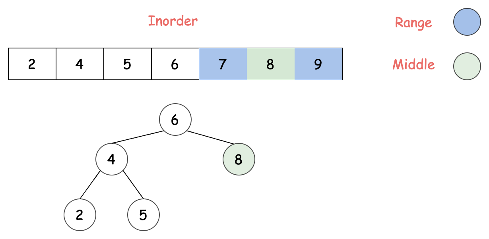

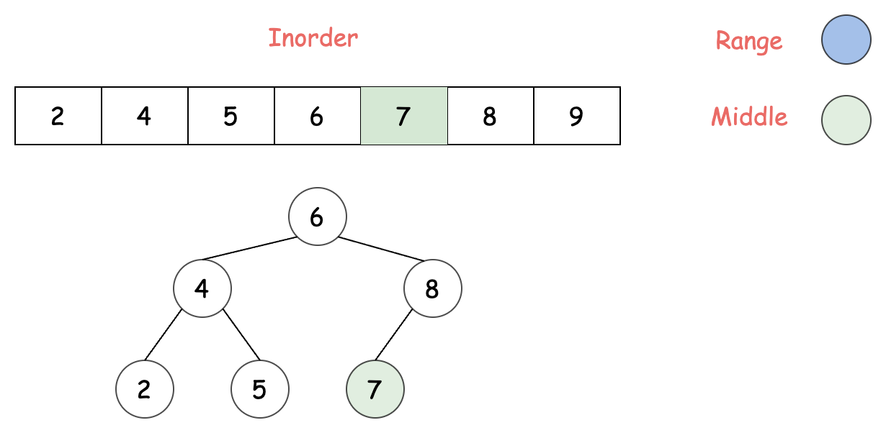

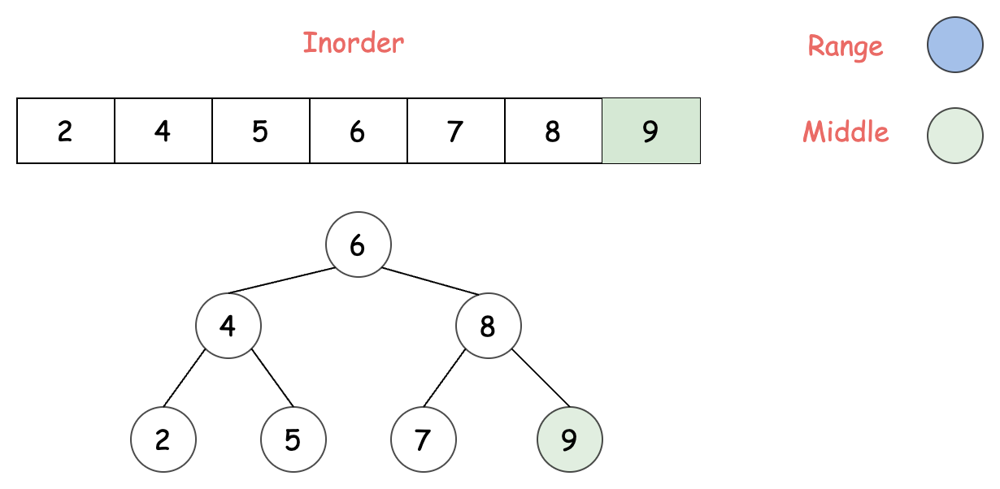

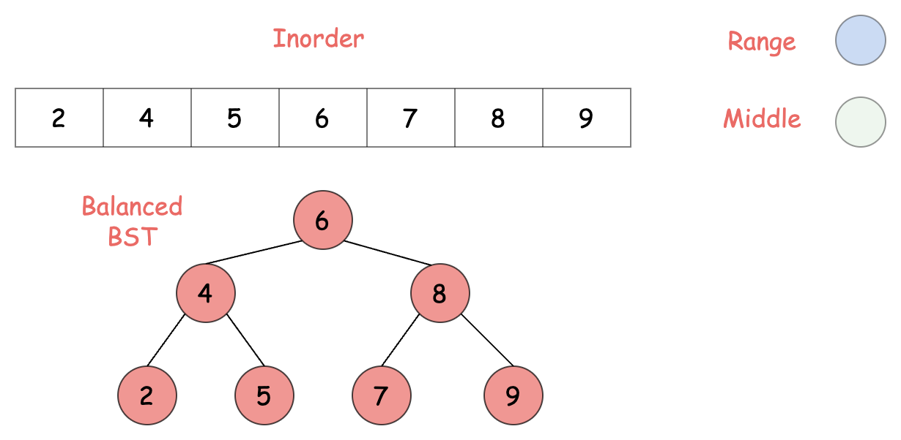

#### Algorithm

1. Initialization:
- Create an empty list `inorder` to store the nodes' values after the inorder traversal.
2. Perform inorder traversal:
- Traverse the BST and populate the `inorder` list with the node values in sorted order.
3. Reconstruct the balanced BST:
- Define a recursive function `createBalancedBST` that takes the `inorder` list, `start` index, and `end` index as parameters.
- If `start` is greater than `end`, return `null` (or equivalent).
- Calculate the `mid` index as the middle of the current range.
- Create a new tree node with the value at the `mid` index.
- Recursively build the left subtree using the left half of the current range.
- Recursively build the right subtree using the right half of the current range.
4. Return the root of the newly constructed balanced BST.

#### Implementation

```python
class Solution:
    def balanceBST(self, root: TreeNode) -> TreeNode:
        # Create a list to store the inorder traversal of the BST
        inorder = []
        self.inorder_traversal(root, inorder)

        # Construct and return the balanced BST
        return self.create_balanced_bst(inorder, 0, len(inorder) - 1)

    def inorder_traversal(self, root: TreeNode, inorder: list):
        # Perform an inorder traversal to store the elements in sorted order
        if not root:
            return
        self.inorder_traversal(root.left, inorder)
        inorder.append(root.val)
        self.inorder_traversal(root.right, inorder)

    def create_balanced_bst(
        self, inorder: list, start: int, end: int
    ) -> TreeNode:
        # Base case: if the start index is greater than the end index, return None
        if start > end:
            return None

        # Find the middle element of the current range
        mid = start + (end - start) // 2

        # Recursively construct the left and right subtrees
        left_subtree = self.create_balanced_bst(inorder, start, mid - 1)
        right_subtree = self.create_balanced_bst(inorder, mid + 1, end)

        # Create a new node with the middle element and attach the subtrees
        node = TreeNode(inorder[mid], left_subtree, right_subtree)
        return node

```

#### Complexity Analysis

Let $n$ be the number of nodes in the BST.

- Time Complexity: $O(n)$

    The `inorderTraversal` function visits each node exactly once, resulting in a time complexity of $O(n)$.

    Constructing the balanced BST with the `createBalancedBST` function also involves visiting each node exactly once, resulting in a time complexity of $O(n)$.

    Therefore, the overall time complexity is $O(n)$.

- Space Complexity: $O(n)$

    The `inorderTraversal` function uses an additional array to store the inorder traversal, which requires $O(n)$ space.

    The recursive calls in the `inorderTraversal` and `createBalancedBST` functions contribute to the space complexity. In the worst case, the recursion stack can grow to $O(n)$ for a skewed tree.

    Therefore, the overall space complexity is $O(n)$.

---

### Approach 2: Day-Stout-Warren Algorithm / In-Place Balancing

#### Intuition
> **Note:** This approach is very advanced and would not be expected in an interview. We have included it for completeness.

The Day-Stout-Warren (DSW) algorithm provides an in-place method for balancing Binary Search Trees (BSTs). To understand DSW, we first need to grasp the concept of rotations, which are fundamental operations for restructuring the tree to reduce its height and improve balance.

Rotations come in two forms:

* Right Rotation: This operation elevates the left child of a node to take its place, while the original node becomes the right child of its former left child.
* Left Rotation: Conversely, this operation elevates the right child of a node to take its place, with the original node becoming the left child of its former right child.

It's important to note that right and left rotations are inverse operations, each undoing the effect of the other.

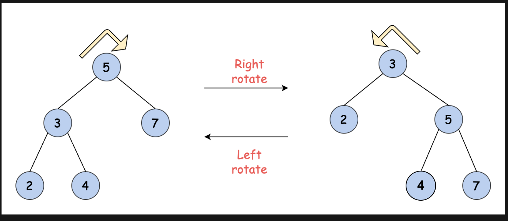

With this foundation, we can now explore how DSW leverages these rotations. The algorithm employs a three-phase approach to balance a BST:

1. Create the Backbone (vine)

In this initial phase, DSW transforms the BST into a right-skewed tree, resembling a vine or linked list. This is achieved through a series of right rotations. The process involves traversing the tree and performing a right rotation whenever a node with a left child is encountered, continuing until the entire tree is right-skewed.

The slideshow is shown below:


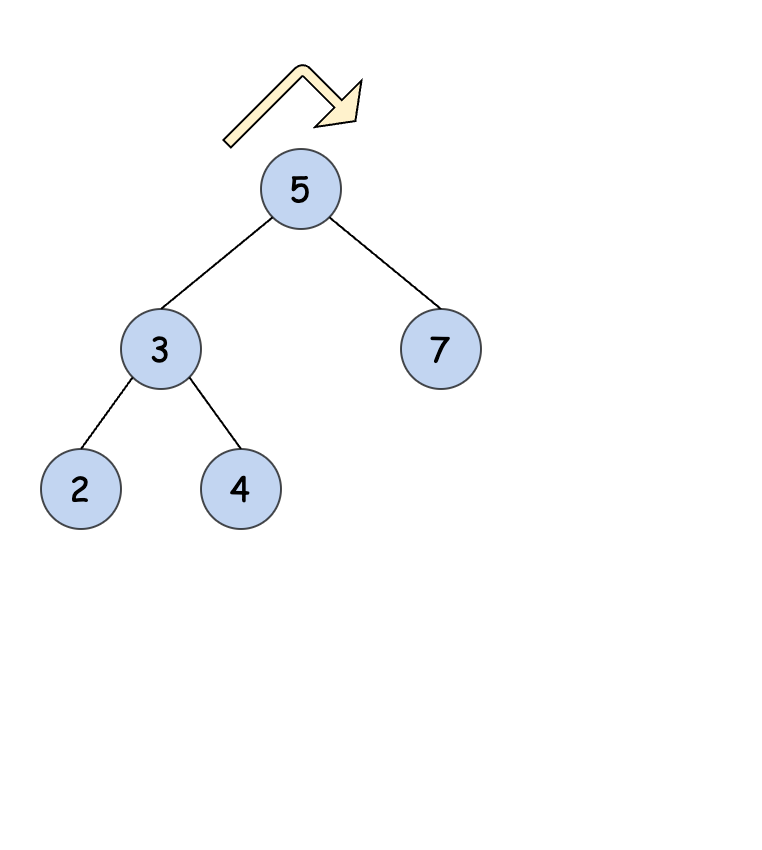

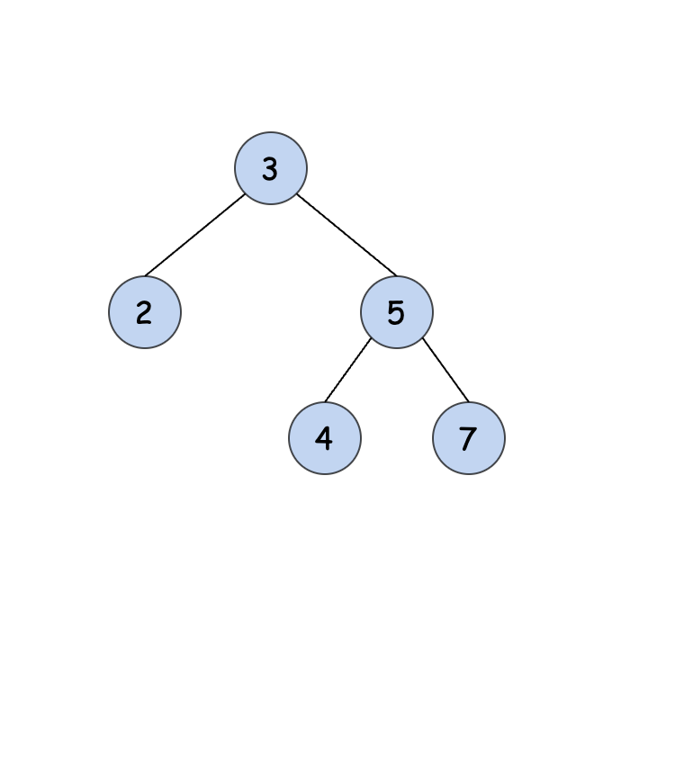

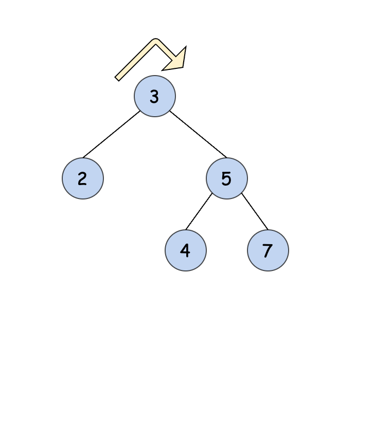

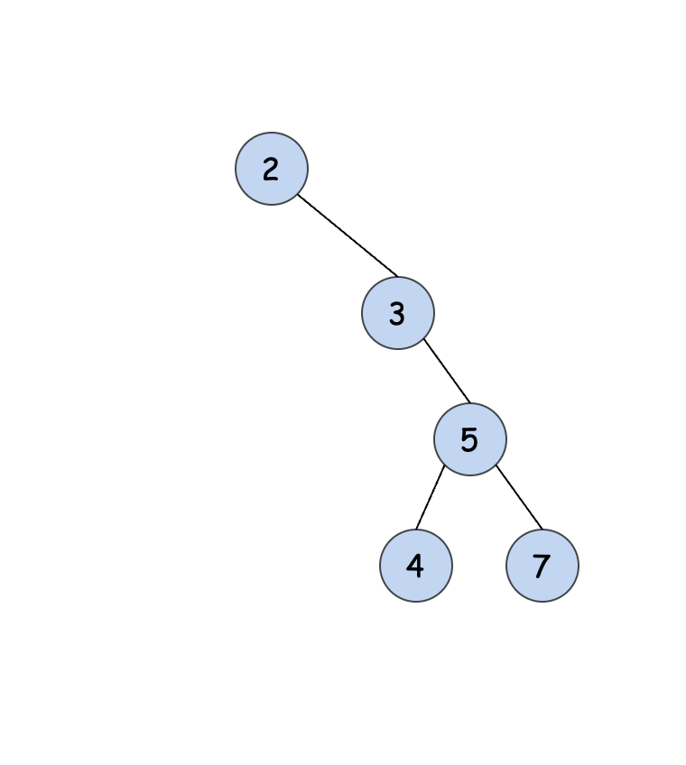

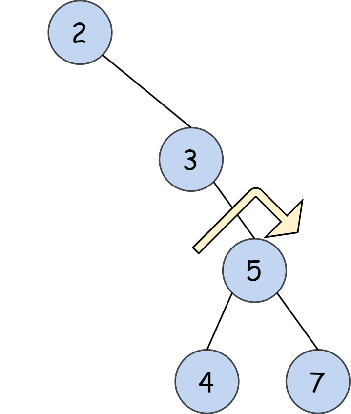

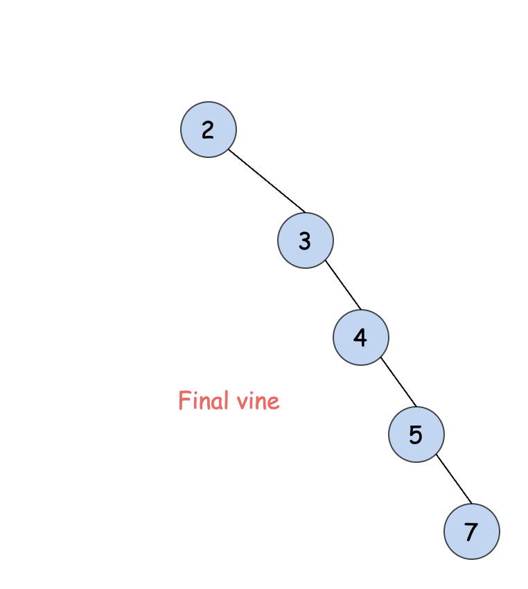

2. Count the nodes

Once the backbone is created, the next step is to determine the total number of nodes in the vine. This is done by traversing the right-skewed structure and counting each node. Let's denote this count as `n`. This count becomes crucial for the final balancing phase.

3. Balance the vine

The final phase aims to convert the right-skewed vine into a balanced BST. This is accomplished through a series of left rotations. The process begins by calculating `m`, which is the largest power of 2 less than $n + 1$, minus 1. This calculation is significant as it identifies the largest complete subtree that can be fully balanced.

The balancing then proceeds in two steps:

a) Perform $n - m$ left rotations to partially balance the tree. This ensures that the remaining nodes will form a complete binary tree after the first set of rotations.

b) Enter a loop where `m` is halved repeatedly. For each iteration, perform left rotations to balance the next level of the tree. This process continues until the vine is fully transformed into a balanced BST.

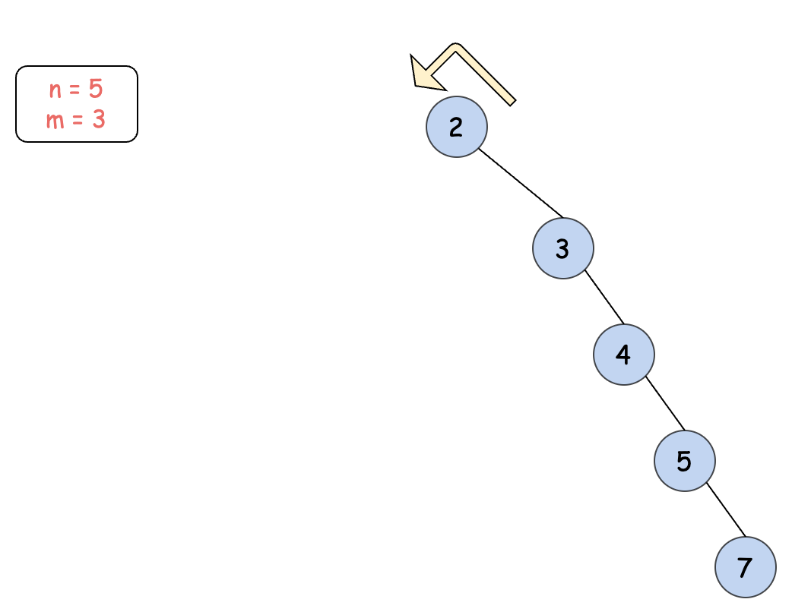

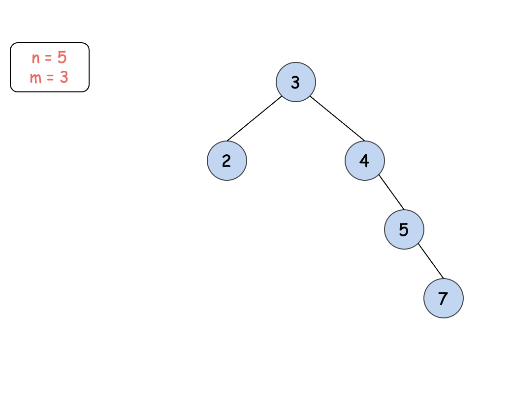

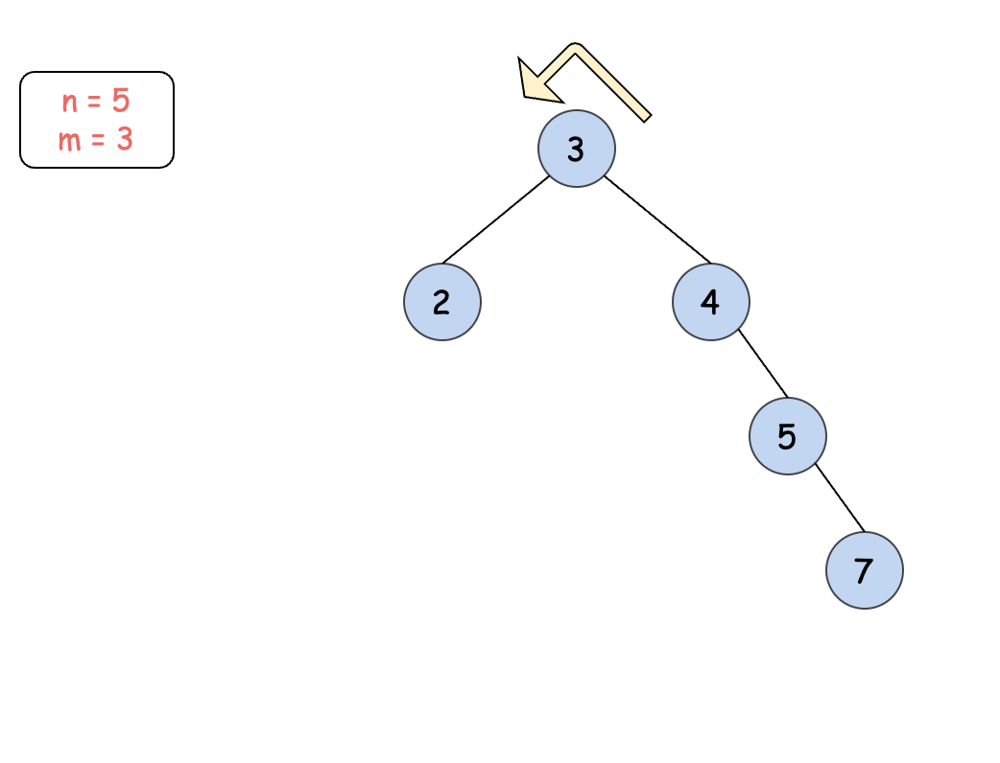

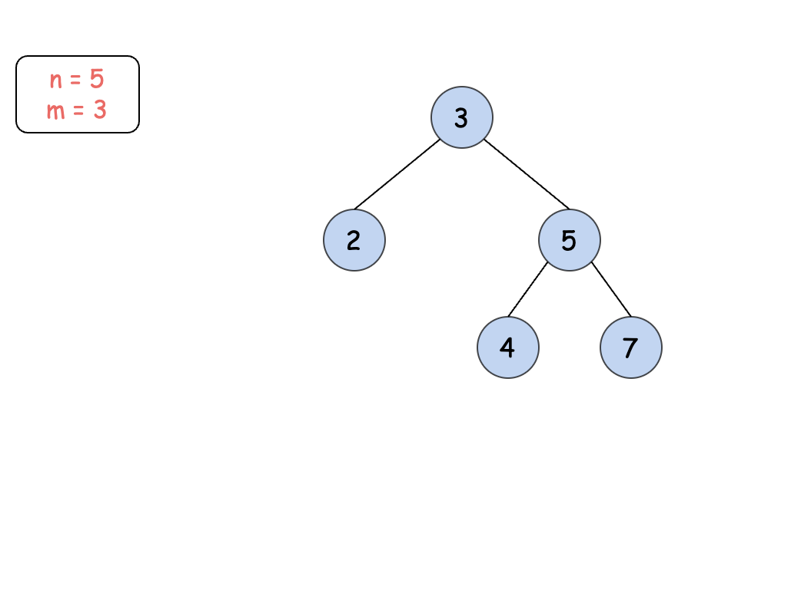


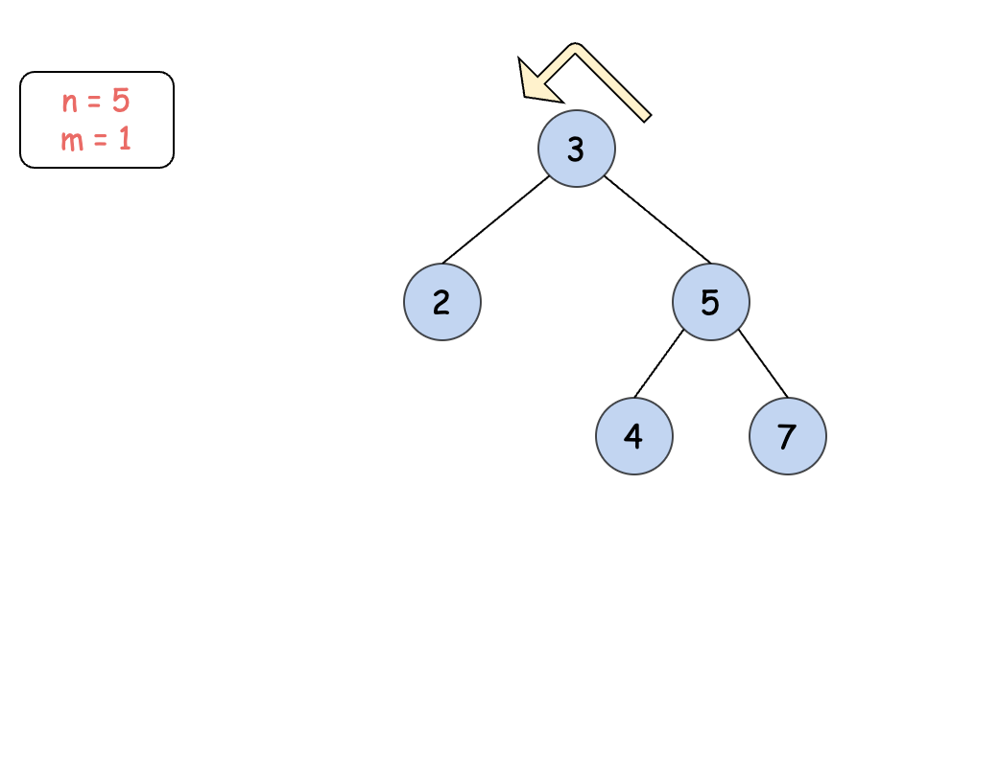

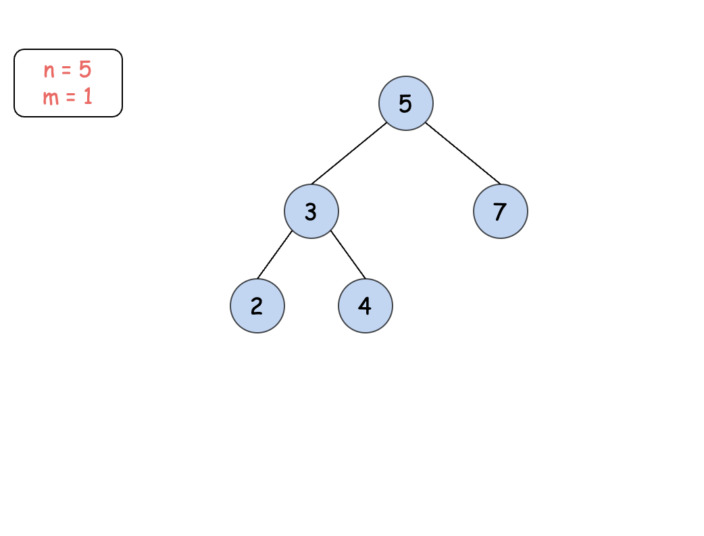

> **Note:** While this approach is space-efficient, it modifies the tree structure during traversal, which might not be suitable in all scenarios, especially if the tree is being accessed concurrently by other processes. The constant modification of tree links may have a slight impact on performance compared to straightforward recursive approaches, especially for smaller trees.

#### Algorithm

1. Initialization:
- If the root is `null`, return `null`.
- Create a temporary dummy node `vineHead`.
- Set the right child of `vineHead` as the root of the BST.
- Initialize a pointer `current` to `vineHead`.
2. Create the Backbone (Vine):
- While `current` has a right child:
- If `current`'s right child has a left child:
- Perform a right rotation on `current` and its right child.
- Otherwise:
- Move `current` to its right child.
3. Count the Nodes:
- Initialize `nodeCount` to 0.
- Set `current` as the right child of `vineHead`.
- While `current` is not `null`:
- Increment `nodeCount`.
- Move `current` to its right child.
4. Create a Balanced BST:
- Calculate `m` as the largest power of 2 less than $nodeCount + 1$ minus 1.
- Perform $nodeCount - m$ left rotations on the vine to partially balance it.
- While `m` is greater than 1:
- Halve `m`.
- Perform `m` left rotations on the vine to further balance it.
5. Return the Balanced BST:
- Set `balancedRoot` to the right child of `vineHead`.
- Delete the temporary dummy node `vineHead`.
- Return `balancedRoot`.
- Right Rotation:
- Given a parent node and its right child:
- Set `tmp` to the left child of the right child.
- Set the left child of the right child to the right child of `tmp`.
- Set the right child of `tmp` to the right child of the parent node.
- Set the right child of the parent node to `tmp`.
- Left Rotation:
- Given a parent node and its right child:
- Set `tmp` to the right child of the right child.
- Set the right child of the right child to the left child of `tmp`.
- Set the left child of `tmp` to the right child of the parent node.
- Set the right child of the parent node to `tmp`.
- Make Rotations:
- Given `vineHead` and `count`:
- Set `current` to `vineHead`.
- For `i` from 0 to $count - 1$:
- Set `tmp` to the right child of `current`.
- Perform a left rotation on `current` and `tmp`.
- Move `current` to its right child.

#### Implementation

```python
class Solution:
    def balanceBST(self, root: TreeNode) -> TreeNode:
        if not root:
            return None

        # Step 1: Create the backbone (vine)
        # Temporary dummy node
        vine_head = TreeNode(0)
        vine_head.right = root
        current = vine_head
        while current.right:
            if current.right.left:
                self.right_rotate(current, current.right)
            else:
                current = current.right

        # Step 2: Count the nodes
        node_count = 0
        current = vine_head.right
        while current:
            node_count += 1
            current = current.right

        # Step 3: Create a balanced BST
        m = 2 ** math.floor(math.log2(node_count + 1)) - 1
        self.make_rotations(vine_head, node_count - m)
        while m > 1:
            m //= 2
            self.make_rotations(vine_head, m)

        balanced_root = vine_head.right
        # Delete the temporary dummy node
        vine_head = None
        return balanced_root

    # Function to perform a right rotation
    def right_rotate(self, parent: TreeNode, node: TreeNode):
        tmp = node.left
        node.left = tmp.right
        tmp.right = node
        parent.right = tmp

    # Function to perform a left rotation
    def left_rotate(self, parent: TreeNode, node: TreeNode):
        tmp = node.right
        node.right = tmp.left
        tmp.left = node
        parent.right = tmp

    # Function to perform a series of left rotations to balance the vine
    def make_rotations(self, vine_head: TreeNode, count: int):
        current = vine_head
        for _ in range(count):
            tmp = current.right
            self.left_rotate(current, tmp)
            current = current.right
```

#### Complexity Analysis

Let $n$ be the number of nodes in the BST at `root`.

- Time Complexity: $O(n)$

    The loop that creates the vine visits each node exactly once, and each right rotation is $O(1)$, resulting in $O(n)$ time.

    Counting nodes in the vine involves a single traversal of the vine, which is $O(n)$.

    The `makeRotations` function performs a series of left rotations. Each rotation is $O(1)$, and the total number of rotations across all iterations is $O(n)$. Although the number of rotations is bounded by a logarithmic factor due to iteratively halving $m$, the overall complexity remains $O(n)$ due to the linear traversal and rotation steps.

    Therefore, the overall time complexity is $O(n)$.

- Space Complexity: $O(n)$

    The algorithm primarily uses a temporary pointer structure and the original nodes, contributing to $O(1)$ additional space. The vine structure uses the existing nodes in-place, without requiring extra memory.

    However, the depth of the recursion stack in the worst case can reach $O(n)$ if the tree is skewed.

    Therefore, the overall space complexity is $O(n)$.

---