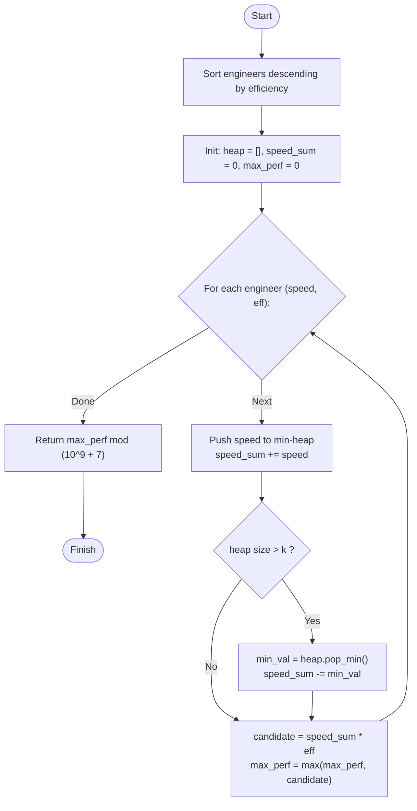

# Guided Example: Maximum Performance of a Team

We trace the step-by-step execution of the greedy sort and bounded min-heap strategy on a representative problem instance:

- **Input:** `n = 6`, `speed = [2, 10, 3, 1, 5, 8]`, `efficiency = [5, 4, 3, 9, 7, 2]`, `k = 2`
- **Required output:** `60`

This instance is chosen because selecting the two fastest engineers yields a lower efficiency multiplier ($10 + 8 = 18$ with efficiency $2 \implies 36$), whereas pairing a moderately fast engineer with a high-efficiency engineer produces the optimal performance ($10 + 5 = 15$ with efficiency $4 \implies 60$).

---

## 1. Instance & Teaching Goal

We are given $n$ engineers, where engineer $i$ possesses a speed $s_i$ and an efficiency $e_i$. We must select a team of at most $k$ engineers to maximize the team performance metric:

$$
\text{Performance} = \left( \sum_{i \in \text{Team}} s_i \right) \times \min_{i \in \text{Team}} (e_i)
$$

Since the result may be large, the final answer is returned modulo $10^9 + 7$.

For the given input with $k = 2$:
- Pair $(E_1, E_4)$: Speeds are $10$ and $5$, sum $= 15$. Efficiencies are $4$ and $7$, minimum $= 4$. Performance $= 15 \times 4 = 60$.
- Pair $(E_1, E_5)$: Speeds are $10$ and $8$, sum $= 18$. Efficiencies are $4$ and $2$, minimum $= 2$. Performance $= 18 \times 2 = 36$.
- The maximum achievable performance is $60$.

The primary teaching goal is to eliminate the non-linear coupling between the sum of speeds and the minimum efficiency: by ordering engineers in descending order of efficiency, each engineer can be viewed as fixing the team's minimum efficiency, reducing the remaining subproblem to maintaining the top $k$ speeds with a bounded min-heap.

---

## 2. Conceptual Foundation & Invariants

Suppose the engineers are sorted such that their efficiencies decrease monotonically:
$$
e_{\pi(1)} \ge e_{\pi(2)} \ge \dots \ge e_{\pi(n)}
$$

When we consider engineer $\pi(i)$ as the engineer setting the minimum efficiency of the team ($e_{\min} = e_{\pi(i)}$), any other engineer selected for the team must come from the prefix $\{\pi(1), \dots, \pi(i)\}$. Because all candidate teammates in this prefix have efficiency at least $e_{\pi(i)}$, the efficiency constraint is automatically satisfied.

To maximize performance with $e_{\min} = e_{\pi(i)}$, we must greedily choose up to $k - 1$ additional engineers from the prefix that provide the largest speeds. A min-heap of size at most $k$ maintains these maximal speeds dynamically:
- When a new engineer's speed is pushed, if the heap size exceeds $k$, the smallest speed in the heap is evicted.

```
Efficiency-Descending Scan with Bounded Min-Heap (k = 2):
Engineer       (s, e)   Heap State (Speeds)   Speed Sum   e_min   Candidate Performance
----------------------------------------------------------------------------------------
E3             (1, 9)   [ 1 ]                 1           9       1  * 9 = 9
E4             (5, 7)   [ 1, 5 ]              6           7       6  * 7 = 42
E0             (2, 5)   [ 2, 5 ] (evict 1)    7           5       7  * 5 = 35
E1             (10, 4)  [ 5, 10 ] (evict 2)   15          4       15 * 4 = 60  <- Optimal!
E2             (3, 3)   [ 5, 10 ] (evict 3)   15          3       15 * 3 = 45
E5             (8, 2)   [ 8, 10 ] (evict 5)   18          2       18 * 2 = 36
```

We define state tracking parameters:

| State Parameter | Mathematical Meaning | Initial Value |
|---|---|---|
| Candidate Engineer | Tuple $(s, e)$ sorted by $e$ descending | First sorted element |
| Min-Heap ($\mathcal{H}$) | Retains up to $k$ largest speeds in current prefix | $\emptyset$ |
| Active Speed Sum ($S_{\text{sum}}$) | Sum of elements in $\mathcal{H}$ | $0$ |
| Global Best Performance | $\max_{(s, e)} (S_{\text{sum}} \times e)$ | $0$ |

> **Invariant.** After processing the prefix of engineers with efficiency $\ge e_i$, the min-heap $\mathcal{H}$ contains the $\min(i, k)$ largest speeds among all engineers having efficiency at least $e_i$, and $S_{\text{sum}} \times e_i$ is the maximum possible performance for any team whose minimum efficiency is $e_i$.

---

## 3. Step-by-Step Worked Execution

### Step 1: Sort Engineers by Efficiency Descending

We pair each engineer's speed and efficiency and sort by efficiency in non-increasing order:

| Engineer | Speed ($s$) | Efficiency ($e$) | Sorted Order |
|---|---|---|---|
| $E_3$ | $1$ | $9$ | 1st |
| $E_4$ | $5$ | $7$ | 2nd |
| $E_0$ | $2$ | $5$ | 3rd |
| $E_1$ | $10$ | $4$ | 4th |
| $E_2$ | $3$ | $3$ | 5th |
| $E_5$ | $8$ | $2$ | 6th |

---

### Step 2: Processing Engineers $E_3$ and $E_4$ ($|\mathcal{H}| < k$)

1. **Process $E_3$ ($s = 1, e = 9$):**
   - Push speed $1$ into min-heap: $\mathcal{H} = [1]$.
   - $S_{\text{sum}} = 1$.
   - Candidate performance: $S_{\text{sum}} \times e = 1 \times 9 = 9$.
   - Global best: $\max(0, 9) = 9$.

2. **Process $E_4$ ($s = 5, e = 7$):**
   - Push speed $5$ into min-heap: $\mathcal{H} = [1, 5]$.
   - $S_{\text{sum}} = 1 + 5 = 6$.
   - Candidate performance: $S_{\text{sum}} \times e = 6 \times 7 = 42$.
   - Global best: $\max(9, 42) = 42$.

---

### Step 3: Processing $E_0$ and $E_1$ (Heap Pruning & Peak Discovery)

3. **Process $E_0$ ($s = 2, e = 5$):**
   - Push speed $2$: $\mathcal{H} = [1, 5, 2]$, $S_{\text{sum}} = 6 + 2 = 8$.
   - Heap size is $3 > k = 2$. Evict smallest speed: $\min(\mathcal{H}) = 1$.
   - Updated heap: $\mathcal{H} = [2, 5]$, $S_{\text{sum}} = 8 - 1 = 7$.
   - Candidate performance: $7 \times 5 = 35$.
   - Global best: $\max(42, 35) = 42$.

4. **Process $E_1$ ($s = 10, e = 4$):**
   - Push speed $10$: $\mathcal{H} = [2, 5, 10]$, $S_{\text{sum}} = 7 + 10 = 17$.
   - Heap size is $3 > k$. Evict smallest speed: $\min(\mathcal{H}) = 2$.
   - Updated heap: $\mathcal{H} = [5, 10]$, $S_{\text{sum}} = 17 - 2 = 15$.
   - Candidate performance: $15 \times 4 = 60$.
   - Global best: $\max(42, 60) = 60$. **(New Global Maximum)**

---

### Step 4: Processing $E_2$ and $E_5$ (Final Iterations)

5. **Process $E_2$ ($s = 3, e = 3$):**
   - Push speed $3$: $\mathcal{H} = [3, 5, 10]$, $S_{\text{sum}} = 15 + 3 = 18$.
   - Heap size is $3 > k$. Evict smallest speed: $3$.
   - Updated heap: $\mathcal{H} = [5, 10]$, $S_{\text{sum}} = 18 - 3 = 15$.
   - Candidate performance: $15 \times 3 = 45$.
   - Global best remains $60$.

6. **Process $E_5$ ($s = 8, e = 2$):**
   - Push speed $8$: $\mathcal{H} = [5, 8, 10]$, $S_{\text{sum}} = 15 + 8 = 23$.
   - Heap size is $3 > k$. Evict smallest speed: $5$.
   - Updated heap: $\mathcal{H} = [8, 10]$, $S_{\text{sum}} = 23 - 5 = 18$.
   - Candidate performance: $18 \times 2 = 36$.
   - Global best remains $60$.

Modulo reduction: $60 \pmod{10^9 + 7} = 60$.

---

## 4. Complete Execution Trace

| Step | Engineer $(s, e)$ | Heap Before Eviction | Evicted Speed | Active Heap | Speed Sum | $e_{\min}$ | Candidate Perf | Best So Far |
|---|---|---|---|---|---|---|---|---|
| 1 | $E_3: (1, 9)$ | $[1]$ | None | $[1]$ | $1$ | $9$ | $9$ | $9$ |
| 2 | $E_4: (5, 7)$ | $[1, 5]$ | None | $[1, 5]$ | $6$ | $7$ | $42$ | $42$ |
| 3 | $E_0: (2, 5)$ | $[1, 2, 5]$ | $1$ | $[2, 5]$ | $7$ | $5$ | $35$ | $42$ |
| 4 | $E_1: (10, 4)$ | $[2, 5, 10]$ | $2$ | $[5, 10]$ | $15$ | $4$ | $60$ | **$60$** |
| 5 | $E_2: (3, 3)$ | $[3, 5, 10]$ | $3$ | $[5, 10]$ | $15$ | $3$ | $45$ | $60$ |
| 6 | $E_5: (8, 2)$ | $[5, 8, 10]$ | $5$ | $[8, 10]$ | $18$ | $2$ | $36$ | $60$ |

---

## 5. Algorithmic Correctness & Complexity Derivation

### Optimality Proof

Every valid team of size $m \le k$ has some engineer $E^*$ whose efficiency achieves the team's minimum: $e^* = \min_{j \in \text{Team}} e_j$.
- In our efficiency-descending enumeration, when the loop reaches $E^*$, all other members of this team have already been encountered because their efficiencies are $\ge e^*$.
- At that point, the algorithm forms the candidate team by taking $E^*$ and the $k - 1$ fastest available engineers from all previously encountered engineers.
- Since the sum of speeds from the min-heap is guaranteed to be maximal among all subsets of size $\le k - 1$ from the prefix, the performance evaluated when considering $E^*$ as the minimum efficiency is greater than or equal to the performance of any actual team whose minimum efficiency is $E^*$.
- By iterating over all possible choices of the minimum efficiency engineer, the global maximum is guaranteed to be discovered.

### Asymptotic Complexity

- **Time Complexity:** $\mathcal{O}(n \log n + n \log k)$.
  - Sorting the $n$ engineers takes $\mathcal{O}(n \log n)$ time.
  - For each of the $n$ engineers, inserting into the min-heap of size at most $k + 1$ and optionally evicting the root takes $\mathcal{O}(\log k)$ time.
  - Total running time is bounded by $\mathcal{O}(n \log n)$.
- **Auxiliary Space Complexity:** $\mathcal{O}(n + k)$.
  - Storing the sorted engineer pairs requires $\mathcal{O}(n)$ space.
  - The min-heap stores at most $k + 1$ elements, consuming $\mathcal{O}(k)$ space.

---

## 6. Traps & Edge Cases

- **Premature Modulo Arithmetic:** Applying modulo $10^9 + 7$ to candidate performance values during the max-comparison will break numeric ordering (e.g., $10^9 + 8 \pmod{10^9 + 7} = 1 < 100$). The maximum must be tracked using unbounded arithmetic, applying modulo only upon final return.
- **Team Size Strictly Less Than $k$:** The problem permits any team size from $1$ up to $k$. The greedy procedure naturally evaluates valid candidates of sizes $1, 2, \dots, k$ during the first $k$ steps.
- **Tied Efficiencies:** If multiple engineers share the same efficiency, sorting stability does not affect correctness because the prefix set will eventually include all of them, evaluating the optimal combination when the last tied engineer is reached.

---

## 7. Accessible Mermaid Diagram


