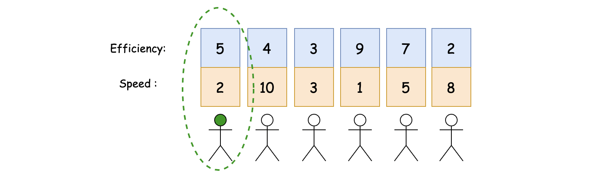
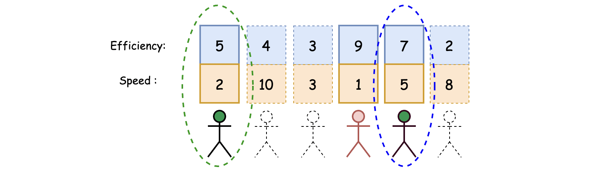
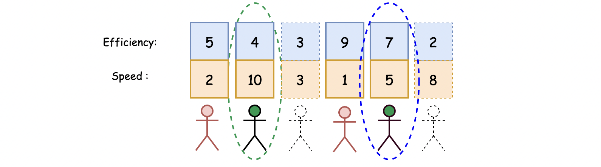
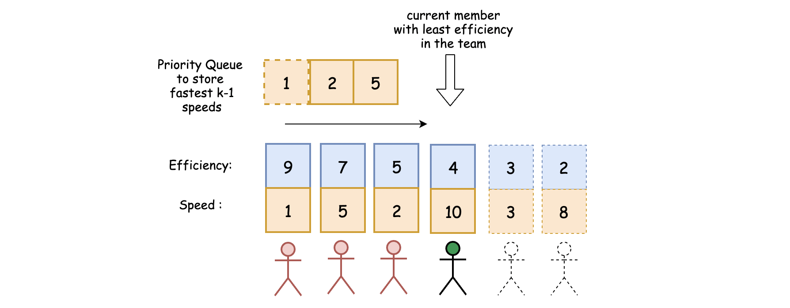

## Solution

---
### Overview

At first glance, the problem might seem to be a combination problem (_e.g._ [Combination Sum III](https://leetcode.com/problems/combination-sum-iii/)), meaning one could enumerate all possible compositions and return the team with the maximum performance based on the given benchmark.

However, while this **brute force** idea is intuitive, it is also inefficient, because the number of combinations grows exponentially with the number of engineers.
In fact, there are some insights that can be derived from the problem, which we can leverage to greatly speed up the algorithm.

In this article, we will introduce a greedy algorithm together with the application of priority queue to solve the problem.

<br/>

---

### Approach: Greedy with Priority Queue

**Intuition**

>As a reminder, the **_performance_** of a team is defined as the **sum** of all members' **speeds** multiplied by the **_minimum efficiency_** among the members.

As one can see, the performance of a team depends on _**two variables**_.

To facilitate the enumeration process, let us first **fix** the value of one of the variables, namely the _minimum efficiency_ of the team.

The key idea behind the enumeration process is as follows:

>For each candidate, we treat him/her as the one who has the _minimum efficiency_ in a team. Then, we select the rest of the team members based on this condition.

- The above enumeration is **sound**, which means it is guaranteed to find the optimal solution to the problem.
For example, before arriving at a final solution where candidate *X* has the minimum efficiency on the team, we must have enumerated all potential team compositions that include candidate X.

- Most importantly, the above enumeration helps **prune** some of the unnecessary team compositions. Hence it runs significantly faster.
Starting from a fixed candidate and only accepting new team members that have a higher efficiency than the fixed candidate, allows us to only consider teams of size `k`, rather than enumerating all teams of size one to `k`.
This is because once the minimum efficiency of a team is fixed, each new team member is guaranteed to improve the team's performance.
Therefore, we should add as many new members as possible.

Actually, the above enumeration can be categorized as a [Greedy algorithm](https://en.wikipedia.org/wiki/Greedy_algorithm), where we decompose a problem into a series of stages, and at each stage we make the **_locally optimal_** choice.

In our case, we derive the solution through an enumeration process, where at each step we build a _locally optimal_ team by starting from a fixed engineer with the minimum efficiency on the team.
At the end of the enumeration process, we select the maximum among the locally optimal solutions to obtain the **globally optimal** solution.

**Algorithm**

To see how the above enumeration works, let us walk through some concrete examples.

Suppose that we have a list of 6 engineers with $speed = [2,10,3,1,5,8]$, $efficiency = [5,4,3,9,7,2]$, and we are asked to compose a team with at most `k=2` members.

Here are three steps that demonstrate how we can compose a team with the maximum performance and with **_at most_** `k` members.

1). Let's select the first engineer from the list of candidates as a potential member of the team.
The first engineer has speed of `2` and an efficiency of `5`.

_More importantly, we will impose a condition that all future team members must have an efficiency **greater than or equal to** the first team member._



2). Next, we will select the rest of the team members.
We will use the following criteria in order to maximize the performance of the team:

- Each of the selected members should have an efficiency that is at least as high as the engineer that was picked in the first step.

- With the minimum effiency fixed, it will be beneficial to pick as many additional members as possible, up to the maximum quota of `k-1` members.

With the first candidate fixed as a member of the team, we need to select at most one more member for the team. We are limited to at most one more member because $k-1 = 2-1 = 1$.



According to the criteria listed above, in order to **_maximize_** the performance of the team, we should invite the fifth candidate to join the team. Here is the rationale.
Both the _fourth_ and _fifth_ candidates have a higher efficiency than the first candidate.
Therefore, both of them are eligible to join the team.
However, since the fifth candidate is faster than the fourth candidate, it is **_optimal_** to choose the fifth candidate in order to maximize the total speed of the team, and therefore maximize the performance of the team.

3). We repeat the above two steps for each of the remaining candidates.
At the end of the enumeration process, we will discover that the team composition with the second candidate as the one with the minimum efficiency will emerge as the one with the *maximum* performance.



**Implementation**

The most complex step in the algorithm is the second step.  In the second step, we have selected a member who will have the lowest efficiency in the team, and we must determine **_how_** to construct the rest of the team.
We can answer this question, by breaking it down into two tasks:

- First of all, given a fixed member, we must **find** all eligible candidates (at most `k-1` members) whose efficiencies are higher than the fixed member's efficiency.

- To achieve this task, we could **_sort_** the candidates, in descending order, based on _efficiency_.

- We then iterate through the sorted candidates. For each candidate, we only need to consider the earlier candidates. Since the list is sorted, only the earlier candidates will have a higher efficiency than the current candidate.

- Given all the eligible candidates, in order to maximize the total speed, we need to **find** the **fastest** `k-1` eligible candidates.

- To achieve this task, we can **_sort_** the candidates again. But this time, we sort only the earlier candidates, and most importantly we sort by _speed_ rather than efficiency.

- The sorting idea is a valid one. However, a more efficient option would be to apply the [Priority Queue](https://en.wikipedia.org/wiki/Priority_queue) data structure here.
    The priority queue, also known as **_heap_**, is a data structure which *dynamically* maintains the order of elements based on some predefined _priority_.
    The priority queue is well-known for its optimized time complexity when maintaining a list of sorted elements.
    As such, we will we opt to use a priority queue in the following implementation.



To recap, we will build a **greedy** algorithm that utilizes the **priority queue** data structure. Here are the steps in detail.

- First of all, let's sort the candidates by efficiency in descending order.

- Then, we will iterate through the sorted candidates.
  - At each iteration, our goal is to construct a team with at most `k` members, while treating the current candidate as the one with the lowest efficiency on the team.
  - We use a priority queue to store the speeds for the rest `k-1` team members.
  The priority queue is maintained as a **sliding window** along with our iteration.  For example, we pop out the member with the lowest speed when we exceed the predefined capacity of the queue, which is `k-1`.

```python
class Solution:
    def maxPerformance(self, n: int, speed: List[int], efficiency: List[int], k: int) -> int:
        modulo = 10 ** 9 + 7

        # build tuples of (efficiency, speed)
        candidates = zip(efficiency, speed)
        # sort the candidates by their efficiencies
        candidates = sorted(candidates, key=lambda t:t[0], reverse=True)

        speed_heap = []
        speed_sum, perf = 0, 0
        for curr_efficiency, curr_speed in candidates:
            # maintain a heap for the fastest (k-1) speeds
            if len(speed_heap) > k-1:
                speed_sum -= heapq.heappop(speed_heap)
            heapq.heappush(speed_heap, curr_speed)

            # calculate the maximum performance with the current member as the least efficient one in the team
            speed_sum += curr_speed
            perf = max(perf, speed_sum * curr_efficiency)

        return perf % modulo
```

**Complexity Analysis**

Let $N$ be the total number of candidates, and $K$ be the size of the team.

- Time Complexity: $O\big(N \cdot (\log N + \log K)\big)$

- First of all, we build a list of candidates from the inputs, which takes $O(N)$ time.

- We then sort the candidates, which takes $O(N \log N)$ time.

- We iterate through the sorted candidates. At each iteration, we will perform at most two operations on the priority queue: one push and one pop.
    Each operation takes $O\big(\log (K-1) \big)$ time, where $K-1$ is the capacity of the queue.
    To sum up, the time complexity of this iteration will be $O\big(N \cdot \log (K-1)\big) = O(N \cdot \log K)$.

- Thus, the overall time complexity of the algorithm will be $O\big(N \cdot (\log N + \log K)\big)$.

- Space Complexity: $O(N + K)$

- We build a list of candidates from the inputs, which takes $O(N)$ space.

- We also use the priority queue data structure whose space capacity is $O(K-1)$.

- Note that we use sorting in the algorithm, and the space complexity of the sorting algorithm depends on the implementation of each programming language.
    For instance, the `sorted()` function in Python is implemented with the [Timsort](https://en.wikipedia.org/wiki/Timsort) algorithm whose space complexity is $\mathcal{O}(N)$.
    While in Java, the [Collections.sort()](https://docs.oracle.com/javase/8/docs/api/java/util/Arrays.html#sort-byte:A-) is implemented as a variant of the quicksort algorithm whose space complexity is $\mathcal{O}(\log{N})$.

- To sum up, the overall space complexity of the entire algorithm is $O(N + K)$.

<br/>
---