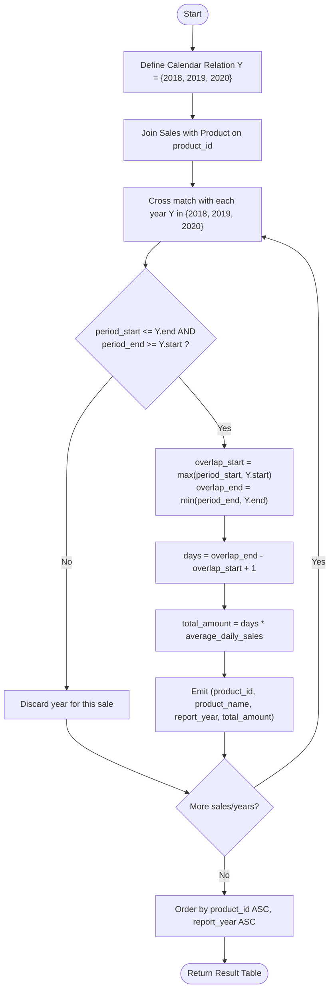

# Guided Example: Total Sales Amount by Year

We trace the step-by-step execution of the temporal interval intersection and relational aggregation strategy on a representative database instance:

- **Input Tables:**
  - `Product`:
    - `(1, "LC Phone")`
    - `(2, "LC T-Shirt")`
    - `(3, "LC Keychain")`
  - `Sales`:
    - `(1, "2019-01-25", "2019-02-28", 100)`
    - `(2, "2018-12-01", "2020-01-01", 10)`
    - `(3, "2019-12-01", "2020-01-31", 1)`
- **Required Output:**
  - `(1, "LC Phone", "2019", 3500)`
  - `(2, "LC T-Shirt", "2018", 310)`
  - `(2, "LC T-Shirt", "2019", 3650)`
  - `(2, "LC T-Shirt", "2020", 10)`
  - `(3, "LC Keychain", "2019", 31)`
  - `(3, "LC Keychain", "2020", 31)`

This instance is chosen because sales intervals cross multiple annual boundaries: Product 1 is contained within a single year, Product 3 spans two adjacent years, and Product 2 extends across all three report years (2018, 2019, and 2020).

---

## 1. Instance & Teaching Goal

We are given two relational entities:
1. `Product` with columns `product_id` (primary key) and `product_name`.
2. `Sales` with columns `product_id` (primary key), `period_start`, `period_end`, and `average_daily_sales`. Both dates are inclusive, and all sales dates fall between 2018 and 2020.

Our objective is to compute the total sales revenue generated by each product for each calendar year in which it recorded active sales. The result must be ordered by `product_id` ascending and `report_year` ascending.

For each product and calendar year $Y \in \{2018, 2019, 2020\}$:
- The annual date boundary is $[Y\text{-01-01}, Y\text{-12-31}]$.
- The effective overlap interval is $[\max(\text{period\_start}, Y\text{-01-01}), \min(\text{period\_end}, Y\text{-12-31})]$.
- If the overlap is non-empty ($\text{start} \le \text{end}$), the number of active sales days is $\text{end} - \text{start} + 1$, yielding revenue:
  $$
  \text{total\_amount} = \text{days} \times \text{average\_daily\_sales}
  $$

The primary teaching goal is to model continuous date range disaggregation using a calendar dimension relation and interval intersection arithmetic, avoiding recursive row generation while preserving exact leap-year and day counts.

---

## 2. Conceptual Foundation & Invariants

Let $\mathcal{Y}$ be the fixed calendar dimension relation for the domain years $[2018, 2020]$:

$$
\mathcal{Y} = \{ (2018, \text{"2018-01-01"}, \text{"2018-12-31"}), (2019, \text{"2019-01-01"}, \text{"2019-12-31"}), (2020, \text{"2020-01-01"}, \text{"2020-12-31"}) \}
$$

A sales interval $[\text{period\_start}, \text{period\_end}]$ overlaps calendar year $Y$ if and only if:
$$
\text{period\_start} \le Y_{\text{end}} \quad \text{and} \quad \text{period\_end} \ge Y_{\text{start}}
$$

```
Date Interval Overlap Decomposition:
Product 2: [2018-12-01 -----------------------------------------> 2020-01-01]
               |                    |                            |
Year 2018:    [2018-12-01 .. 2018-12-31] (31 days)   -> 31  * 10 = 310
Year 2019:    [2019-01-01 .. 2019-12-31] (365 days)  -> 365 * 10 = 3650
Year 2020:    [2020-01-01 .. 2020-01-01] (1 day)     -> 1   * 10 = 10
```

For each matching tuple in $\text{Sales} \bowtie \text{Product} \bowtie_\theta \mathcal{Y}$:
$$
D_{\text{overlap}} = \min(\text{period\_end}, Y_{\text{end}}) - \max(\text{period\_start}, Y_{\text{start}}) + 1
$$
$$
\text{Revenue} = D_{\text{overlap}} \times \text{average\_daily\_sales}
$$

We define the tracking parameters:

| Parameter | Relational Representation | Purpose |
|---|---|---|
| Calendar Relation ($\mathcal{Y}$) | Static table of bounds $(Y, Y_{\text{start}}, Y_{\text{end}})$ | Annual interval frames |
| Interval Intersection | $[\max(\text{start}, Y_{\text{start}}), \min(\text{end}, Y_{\text{end}})]$ | Isolates days falling within year $Y$ |
| Day Count Function ($D$) | Date difference plus one | Quantifies billable days |
| Revenue Multiplier | $D \times \text{average\_daily\_sales}$ | Produces annual sales volume |

> **Invariant.** For each sales record, the sum of overlap days across all matching years in $\mathcal{Y}$ equals the total duration of the original interval: $\sum_{Y} D_{\text{overlap}}(Y) = \text{period\_end} - \text{period\_start} + 1$.

---

## 3. Step-by-Step Worked Execution

### Step 1: Evaluating Product 1 ("LC Phone")

- Sales record: `period_start = 2019-01-25`, `period_end = 2019-02-28`, `average_daily_sales = 100`.
- Overlap with $2018$: Fails condition ($2019\text{-}01\text{-}25 \le 2018\text{-}12\text{-}31$ is False).
- Overlap with $2019$:
  - Start overlap: $\max(2019\text{-}01\text{-}25, 2019\text{-}01\text{-}01) = 2019\text{-}01\text{-}25$.
  - End overlap: $\min(2019\text{-}02\text{-}28, 2019\text{-}12\text{-}31) = 2019\text{-}02\text{-}28$.
  - Days count: From Jan 25 to Feb 28 inclusive $\implies 7 \text{ (Jan)} + 28 \text{ (Feb)} = 35 \text{ days}$.
  - Total revenue: $35 \times 100 = 3500$.
- Overlap with $2020$: Fails condition ($2019\text{-}02\text{-}28 \ge 2020\text{-}01\text{-}01$ is False).

| Year | Overlap Start | Overlap End | Days | Daily Rate | Total Amount |
|---|---|---|---|---|---|
| $2019$ | 2019-01-25 | 2019-02-28 | $35$ | $100$ | $3500$ |

---

### Step 2: Evaluating Product 2 ("LC T-Shirt")

- Sales record: `period_start = 2018-12-01`, `period_end = 2020-01-01`, `average_daily_sales = 10`.
- Overlap with $2018$:
  - Start: $\max(2018\text{-}12\text{-}01, 2018\text{-}01\text{-}01) = 2018\text{-}12\text{-}01$.
  - End: $\min(2020\text{-}01\text{-}01, 2018\text{-}12\text{-}31) = 2018\text{-}12\text{-}31$.
  - Days: Dec 1 through Dec 31 $\implies 31 \text{ days}$.
  - Revenue: $31 \times 10 = 310$.
- Overlap with $2019$:
  - Start: $\max(2018\text{-}12\text{-}01, 2019\text{-}01\text{-}01) = 2019\text{-}01\text{-}01$.
  - End: $\min(2020\text{-}01\text{-}01, 2019\text{-}12\text{-}31) = 2019\text{-}12\text{-}31$.
  - Days: Entire standard year $\implies 365 \text{ days}$.
  - Revenue: $365 \times 10 = 3650$.
- Overlap with $2020$:
  - Start: $\max(2018\text{-}12\text{-}01, 2020\text{-}01\text{-}01) = 2020\text{-}01\text{-}01$.
  - End: $\min(2020\text{-}01\text{-}01, 2020\text{-}12\text{-}31) = 2020\text{-}01\text{-}01$.
  - Days: Jan 1 only $\implies 1 \text{ day}$.
  - Revenue: $1 \times 10 = 10$.

| Year | Overlap Start | Overlap End | Days | Daily Rate | Total Amount |
|---|---|---|---|---|---|
| $2018$ | 2018-12-01 | 2018-12-31 | $31$ | $10$ | $310$ |
| $2019$ | 2019-01-01 | 2019-12-31 | $365$ | $10$ | $3650$ |
| $2020$ | 2020-01-01 | 2020-01-01 | $1$ | $10$ | $10$ |

---

### Step 3: Evaluating Product 3 ("LC Keychain")

- Sales record: `period_start = 2019-12-01`, `period_end = 2020-01-31`, `average_daily_sales = 1`.
- Overlap with $2018$: No overlap ($2019\text{-}12\text{-}01 > 2018\text{-}12\text{-}31$).
- Overlap with $2019$:
  - Start: $2019\text{-}12\text{-}01$, End: $2019\text{-}12\text{-}31$.
  - Days: $31 \text{ days}$. Revenue: $31 \times 1 = 31$.
- Overlap with $2020$:
  - Start: $2020\text{-}01\text{-}01$, End: $2020\text{-}01\text{-}31$.
  - Days: $31 \text{ days}$. Revenue: $31 \times 1 = 31$.

| Year | Overlap Start | Overlap End | Days | Daily Rate | Total Amount |
|---|---|---|---|---|---|
| $2019$ | 2019-12-01 | 2019-12-31 | $31$ | $1$ | $31$ |
| $2020$ | 2020-01-01 | 2020-01-31 | $31$ | $1$ | $31$ |

---

## 4. Complete Execution Trace

| Product ID | Product Name | Report Year | Days in Year | Daily Sales | Calculated Revenue | Output Emitted |
|---|---|---|---|---|---|---|
| $1$ | LC Phone | `"2019"` | $35$ | $100$ | $3500$ | `(1, "LC Phone", "2019", 3500)` |
| $2$ | LC T-Shirt | `"2018"` | $31$ | $10$ | $310$ | `(2, "LC T-Shirt", "2018", 310)` |
| $2$ | LC T-Shirt | `"2019"` | $365$ | $10$ | $3650$ | `(2, "LC T-Shirt", "2019", 3650)` |
| $2$ | LC T-Shirt | `"2020"` | $1$ | $10$ | $10$ | `(2, "LC T-Shirt", "2020", 10)` |
| $3$ | LC Keychain | `"2019"` | $31$ | $1$ | $31$ | `(3, "LC Keychain", "2019", 31)` |
| $3$ | LC Keychain | `"2020"` | $31$ | $1$ | $31$ | `(3, "LC Keychain", "2020", 31)` |

---

## 5. Algorithmic Correctness & Complexity Derivation

### Boundary Preservation and Partitioning

For any valid date interval $[A, B]$ and mutually disjoint, contiguous yearly partitions $[Y_{1, \text{start}}, Y_{1, \text{end}}], \dots, [Y_{k, \text{start}}, Y_{k, \text{end}}]$:
- The sub-intervals $[A_i, B_i] = [A, B] \cap [Y_{i, \text{start}}, Y_{i, \text{end}}]$ are pairwise disjoint.
- Their union equals $[A, B]$.
- Therefore, the sum of lengths $\sum (B_i - A_i + 1) = B - A + 1$.
- Because multiplication distributes over addition:
  $$
  \sum_{i} (\text{days}_i \times \text{rate}) = \left( \sum_{i} \text{days}_i \right) \times \text{rate} = \text{total days} \times \text{rate}
  $$
- The partitioning preserves revenue without double counting or omission.

### Asymptotic Complexity

- **Time Complexity:** $\mathcal{O}(|S| \cdot |\mathcal{Y}| + |S| \log |S|)$. Since $|\mathcal{Y}| = 3$ is a small constant, evaluating interval overlaps requires $\mathcal{O}(|S|)$ operations where $|S|$ is the cardinality of `Sales`. Sorting the final result table of size at most $3|S|$ takes $\mathcal{O}(|S| \log |S|)$ time.
- **Auxiliary Space Complexity:** $\mathcal{O}(|S|)$. Storing the joined and projected output tuples requires memory proportional to the number of annual sales partitions.

---

## 6. Traps & Edge Cases

- **Off-By-One Day Arithmetic:** Both start and end dates are inclusive. The number of days between two dates $D_1$ and $D_2$ ($D_1 \le D_2$) is $D_2 - D_1 + 1$. Omitting the $+1$ undercounts every active sales period.
- **Leap Year Length (2020):** While 2018 and 2019 have 365 days, 2020 is a leap year with 366 days (February 29 exists). Exact date difference functions automatically account for leap days.
- **Zero-Sales Years:** Years during which a product had zero active sales must not appear in the output relation. Inner joins on interval overlap naturally eliminate non-overlapping years.
- **Multi-Year Spans:** An interval can span multiple consecutive years; joining against all candidate years correctly decomposes a single sales record into multiple annual report records.

---

## 7. Accessible Mermaid Diagram


