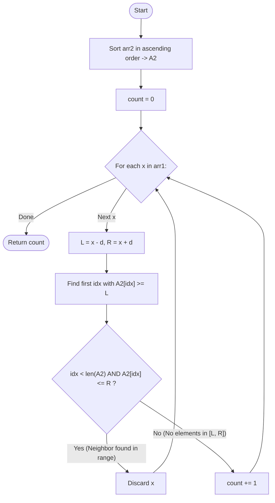

# Guided Example: Find the Distance Value Between Two Arrays

We trace the step-by-step execution of the sorted binary search interval exclusion strategy on a representative problem instance:

- **Input:** `arr1 = [4, 5, 8]`, `arr2 = [10, 9, 1, 8]`, `d = 2`
- **Required output:** `2`

This instance is chosen because it demonstrates elements that successfully avoid the forbidden proximity radius ($4$ and $5$) alongside an element ($8$) whose candidate interval directly intersects elements of `arr2`.

---

## 1. Instance & Teaching Goal

Given two integer arrays `arr1` and `arr2`, and an integer distance threshold $d \ge 0$, the **distance value** is defined as the number of elements $x \in arr1$ such that no element $y \in arr2$ satisfies:

$$
|x - y| \le d
$$

In algebraic terms, each $x \in arr1$ creates a forbidden closed interval:
$$
\mathcal{I}(x) = [x - d, x + d]
$$
An element $x$ contributes $+1$ to the distance value if and only if:
$$
arr2 \cap [x - d, x + d] = \emptyset
$$

For `arr1 = [4, 5, 8]`, `arr2 = [10, 9, 1, 8]`, and $d = 2$:
- Element $4$: Forbidden interval $[4 - 2, 4 + 2] = [2, 6]$. No element in $arr2$ lies in $[2, 6]$. Valid!
- Element $5$: Forbidden interval $[5 - 2, 5 + 2] = [3, 7]$. No element in $arr2$ lies in $[3, 7]$. Valid!
- Element $8$: Forbidden interval $[8 - 2, 8 + 2] = [6, 10]$. Elements $8, 9, 10 \in arr2$ lie in this range. Invalid!
- Total distance value: $2$.

The primary teaching goal is to avoid quadratic $\mathcal{O}(|arr1| \cdot |arr2|)$ pairwise comparisons by sorting $arr2$ and applying binary search to query interval occupancy in $\mathcal{O}(\log |arr2|)$ time per element.

---

## 2. Conceptual Foundation & Invariants

Let $A_2$ denote `arr2` sorted in ascending order:
$$
A_2 = [1, 8, 9, 10]
$$

For a given $x \in arr1$, we need to check if any $y \in A_2$ falls in $[x - d, x + d]$.
Because $A_2$ is sorted, we can locate the first index $idx$ such that:
$$
A_2[idx] \ge x - d
$$
If no such element exists ($idx = |A_2|$), then all elements in $A_2$ are strictly less than $x - d$, so none can fall in $[x - d, x + d]$.
If such an element exists, we simply test whether:
$$
A_2[idx] \le x + d
$$
- If $A_2[idx] \le x + d$, then $A_2[idx]$ lies within $[x - d, x + d]$, proving a violation.
- If $A_2[idx] > x + d$, then because all subsequent elements are even larger, no element in $A_2$ can lie in $[x - d, x + d]$.

```
Forbidden Range Intersection on Sorted arr2 = [1, 8, 9, 10]:
x = 4: Range [2, 6]  -->  1 < 2, next element is 8 > 6  --> No overlap! (+1)
x = 5: Range [3, 7]  -->  1 < 3, next element is 8 > 7  --> No overlap! (+1)
x = 8: Range [6, 10] -->  first >= 6 is 8 <= 10        --> OVERLAP! (+0)
```

We define state tracking parameters:

| Parameter | Mathematical Meaning | Initial Value |
|---|---|---|
| Sorted Second Array ($A_2$) | Ascending permutation of $arr2$ | $[1, 8, 9, 10]$ |
| Target Interval ($\mathcal{I}(x)$) | Closed bounds $[x - d, x + d]$ | Recomputed per $x \in arr1$ |
| Lower Bound Probe ($idx$) | Smallest index with $A_2[idx] \ge x - d$ | Binary search result |
| Distance Value Counter | Count of elements satisfying non-intersection | $0$ |

> **Invariant.** For any candidate $x$, checking the single element $A_2[idx]$ at the first index where $A_2[idx] \ge x - d$ is necessary and sufficient to determine whether $A_2$ intersects $[x - d, x + d]$.

---

## 3. Step-by-Step Worked Execution

### Step 1: Sorting the Reference Array $arr2$

The input array $arr2 = [10, 9, 1, 8]$ is sorted in ascending order:
$$
A_2 = [1, 8, 9, 10]
$$

| Index ($k$) | Value $A_2[k]$ |
|---|---|
| $0$ | $1$ |
| $1$ | $8$ |
| $2$ | $9$ |
| $3$ | $10$ |

---

### Step 2: Binary Search Probe for $x = 4$

- Query element: $x = 4$.
- Threshold: $d = 2$.
- Forbidden interval: $[4 - 2, 4 + 2] = [2, 6]$.
- Find first element in $A_2 \ge 2$:
  - $A_2[0] = 1 < 2$.
  - $A_2[1] = 8 \ge 2 \implies idx = 1$.
- Evaluate upper boundary check: Is $A_2[idx] \le 6$?
  - $A_2[1] = 8 \le 6$ is **False**.
- Conclusion: No elements of $A_2$ fall in $[2, 6]$.
- Accumulator increment: $0 + 1 = 1$.

---

### Step 3: Binary Search Probe for $x = 5$

- Query element: $x = 5$.
- Forbidden interval: $[5 - 2, 5 + 2] = [3, 7]$.
- Find first element in $A_2 \ge 3$:
  - $A_2[0] = 1 < 3$.
  - $A_2[1] = 8 \ge 3 \implies idx = 1$.
- Evaluate upper boundary check: Is $A_2[idx] \le 7$?
  - $A_2[1] = 8 \le 7$ is **False**.
- Conclusion: No elements of $A_2$ fall in $[3, 7]$.
- Accumulator increment: $1 + 1 = 2$.

---

### Step 4: Binary Search Probe for $x = 8$

- Query element: $x = 8$.
- Forbidden interval: $[8 - 2, 8 + 2] = [6, 10]$.
- Find first element in $A_2 \ge 6$:
  - $A_2[0] = 1 < 6$.
  - $A_2[1] = 8 \ge 6 \implies idx = 1$.
- Evaluate upper boundary check: Is $A_2[idx] \le 10$?
  - $A_2[1] = 8 \le 10$ is **True**!
- Conclusion: $8 \in A_2$ lies in the forbidden window $[6, 10]$, violating the distance condition.
- Accumulator remains $2$.

Final answer: $2$.

---

## 4. Complete Execution Trace

| Scanned $x$ | Target Interval $[x - d, x + d]$ | First $A_2[idx] \ge x - d$ | Condition $A_2[idx] \le x + d$ | Valid Element? | Distance Count |
|---|---|---|---|---|---|
| $4$ | $[2, 6]$ | $8$ (at index $1$) | $8 \le 6$ (False) | Yes | $1$ |
| $5$ | $[3, 7]$ | $8$ (at index $1$) | $8 \le 7$ (False) | Yes | $2$ |
| $8$ | $[6, 10]$ | $8$ (at index $1$) | $8 \le 10$ (True) | No (Violated by $8$) | $2$ |

---

## 5. Algorithmic Correctness & Complexity Derivation

### Correctness of Single-Point Testing

To determine whether an arbitrary interval $[L, R]$ intersects a sorted array $A_2$:
- Let $idx = \min \{ k \mid A_2[k] \ge L \}$.
- If no such $k$ exists, then for all $y \in A_2$, $y < L \le R$, so $A_2 \cap [L, R] = \emptyset$.
- If $idx$ exists, then by definition $A_2[idx] \ge L$.
  - If $A_2[idx] \le R$, then $A_2[idx] \in [L, R]$, so an intersection exists.
  - If $A_2[idx] > R$, then because the array is sorted, every subsequent element $A_2[k]$ for $k > idx$ satisfies $A_2[k] \ge A_2[idx] > R$. Thus, no element in $A_2$ can be $\le R$ while also being $\ge L$.
- Testing the single index $idx$ returned by binary search is therefore both necessary and sufficient.

### Asymptotic Complexity

- **Time Complexity:** $\mathcal{O}(m \log m + n \log m)$, where $n = |arr1|$ and $m = |arr2|$. Sorting $arr2$ takes $\mathcal{O}(m \log m)$ time. For each of the $n$ elements in $arr1$, binary search takes $\mathcal{O}(\log m)$ time. This is substantially faster than the naive $\mathcal{O}(n \cdot m)$ pairwise search.
- **Auxiliary Space Complexity:** $\mathcal{O}(1)$ beyond sorting space (or $\mathcal{O}(m)$ if a copied sorted buffer is used).

---

## 6. Traps & Edge Cases

- **Distance $d = 0$:** When $d = 0$, the interval degenerates to $[x, x]$. The problem reduces to checking whether $x \in arr2$.
- **Index Out of Bounds:** When all elements in $A_2$ are strictly smaller than $x - d$, the binary search returns index $m$. The algorithm must guard against out-of-bounds indexing before performing the upper bound check.
- **Duplicate Elements:** Duplicates in $arr2$ do not affect correctness because any matching duplicate will trigger the violation condition identically.
- **Boundary Inclusivity:** The difference is $\le d$, meaning exact equality $|x - y| = d$ is a violation. The search interval must strictly be closed: $[x - d, x + d]$.

---

## 7. Accessible Mermaid Diagram


