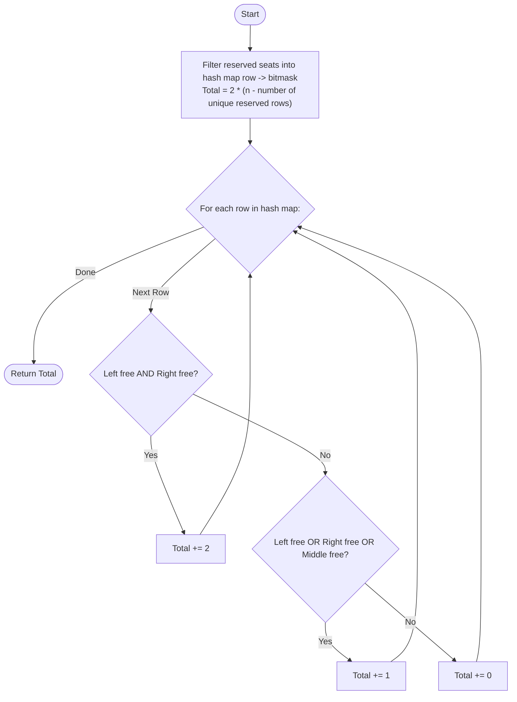

# Guided Example: Cinema Seat Allocation

We trace the step-by-step execution of the sparse bitmask and greedy block allocation strategy on a representative cinema instance:

- **Input:** `n = 3`, `reservedSeats = [[1, 2], [1, 3], [1, 8], [2, 6], [3, 1], [3, 10]]`
- **Required output:** `4`

This instance is chosen because it demonstrates three distinct row reservation configurations: Row 1 blocks both outer blocks forcing a middle block, Row 2 blocks the middle and right forcing a left block, and Row 3 contains reservations only on boundary seats (1 and 10) leaving both four-seat blocks available.

---

## 1. Instance & Teaching Goal

A cinema contains $n$ rows, with each row having $10$ seats numbered $1$ to $10$. We must seat as many four-person groups as possible, where each group requires four adjacent seats in the same row. Valid four-person seat blocks are restricted to:
1. **Left Block:** Seats $\{2, 3, 4, 5\}$
2. **Middle Block:** Seats $\{4, 5, 6, 7\}$
3. **Right Block:** Seats $\{6, 7, 8, 9\}$

Each seat can belong to at most one group. Notice:
- Seats $1$ and $10$ cannot belong to any valid four-person group.
- The Left and Right blocks are completely disjoint ($\{2, 3, 4, 5\} \cap \{6, 7, 8, 9\} = \emptyset$), allowing up to $2$ groups in an unreserved row.
- The Middle block overlaps with both the Left block (at seats $4, 5$) and the Right block (at seats $6, 7$). Therefore, if the Middle block is used, neither the Left nor Right block can be used simultaneously in that row (yielding at most $1$ group).

For $n = 3$:
- Row 1: Reservations at seats $2, 3, 8$. Blocks Left (seats $2, 3$) and Right (seat $8$). Middle block $\{4, 5, 6, 7\}$ is completely free $\implies 1$ group.
- Row 2: Reservation at seat $6$. Blocks Middle and Right blocks. Left block $\{2, 3, 4, 5\}$ is completely free $\implies 1$ group.
- Row 3: Reservations at seats $1, 10$. Neither seat interferes with $\{2, \dots, 9\}$. Both Left and Right blocks are free $\implies 2$ groups.
- Total groups: $1 + 1 + 2 = 4$.

The primary teaching goal is to handle the massive coordinate space ($n \le 10^9$) by recognizing that unreserved rows trivially yield $2$ groups, restricting individual row simulation to only those rows with active reservations.

---

## 2. Conceptual Foundation & Invariants

Because $n$ can be as large as $10^9$, an array of size $n$ is impossible. However, the number of reservations is at most $10^4$.
We group reservations by row using a hash table mapping `row_id` to an 8-bit integer mask tracking the occupancy of seats $2$ through $9$.

For a specific row, let the occupied mask $M$ have bit $k - 2$ set if seat $k \in \{2, \dots, 9\}$ is reserved:
- **Left Block Mask ($M_{\text{left}}$):** Seats $\{2, 3, 4, 5\}$
- **Middle Block Mask ($M_{\text{mid}}$):** Seats $\{4, 5, 6, 7\}$
- **Right Block Mask ($M_{\text{right}}$):** Seats $\{6, 7, 8, 9\}$

```
Row Layout and Candidate 4-Person Blocks:
Seat:   [ 1 ]   [ 2   3   4   5 ]   [ 6   7   8   9 ]   [ 10 ]
                 <-- Left Block -->   <-- Right Block ->
                        <-- Middle Block -->
Overlap: Middle block conflicts with both Left (4,5) and Right (6,7).
```

Allocation Decision Rules for an active row:
1. Test Left and Right availability:
   - If neither Left nor Right is blocked by $M$, allocate $2$ groups (both Left and Right).
2. Otherwise, test if at least one option is available:
   - If Left is free, or Right is free, or Middle is free, allocate $1$ group.
3. Otherwise, allocate $0$ groups.

We define state tracking parameters:

| Parameter | Mathematical Meaning | Initial Value |
|---|---|---|
| Reservation Map ($\mathcal{R}$) | Hash map: $\text{row} \mapsto \text{occupied seat set}$ | Populated from input |
| Default Row Contribution | $2 \times (n - \lvert \mathcal{R} \rvert)$ | Evaluated globally |
| Left Block Free ($B_{\text{left}}$) | $\{2, 3, 4, 5\} \cap \mathcal{R}[\text{row}] = \emptyset$ | Evaluated per row |
| Right Block Free ($B_{\text{right}}$) | $\{6, 7, 8, 9\} \cap \mathcal{R}[\text{row}] = \emptyset$ | Evaluated per row |
| Middle Block Free ($B_{\text{mid}}$) | $\{4, 5, 6, 7\} \cap \mathcal{R}[\text{row}] = \emptyset$ | Evaluated per row |

> **Invariant.** Allocating both Left and Right blocks whenever available always yields $2$ groups, strictly dominating any placement of the Middle block (which yields at most $1$).

---

## 3. Step-by-Step Worked Execution

### Step 1: Filter and Aggregate Reservations by Row

We group reservations by row and discard seats $1$ and $10$ as non-interfering:
- Row $1$: Reserved seats in $\{2..9\}$ are $\{2, 3, 8\}$.
- Row $2$: Reserved seats in $\{2..9\}$ are $\{6\}$.
- Row $3$: Reservations are $\{1, 10\}$, so reserved set in $\{2..9\}$ is $\emptyset$.

Number of distinct rows with reservations: $3$.
Completely unreserved rows: $n - 3 = 3 - 3 = 0$.
Baseline count from untouched rows: $0 \times 2 = 0$.

| Row | Raw Reservations | Filtered Reservations ($\{2..9\}$) |
|---|---|---|
| $1$ | $[2], [3], [8]$ | $\{2, 3, 8\}$ |
| $2$ | $[6]$ | $\{6\}$ |
| $3$ | $[1], [10]$ | $\emptyset$ |

---

### Step 2: Evaluate Row 1

- Reserved seats: $\{2, 3, 8\}$.
- Test Left block $\{2, 3, 4, 5\}$: Seats $2, 3$ are reserved $\implies$ **Blocked**.
- Test Right block $\{6, 7, 8, 9\}$: Seat $8$ is reserved $\implies$ **Blocked**.
- Test Middle block $\{4, 5, 6, 7\}$: None of $\{4, 5, 6, 7\}$ are in $\{2, 3, 8\} \implies$ **Available**!
- Allocation: Allocate $1$ group in the Middle block.
- Cumulative total: $0 + 1 = 1$.

---

### Step 3: Evaluate Row 2

- Reserved seats: $\{6\}$.
- Test Left block $\{2, 3, 4, 5\}$: None are in $\{6\} \implies$ **Available**!
- Test Right block $\{6, 7, 8, 9\}$: Seat $6$ is reserved $\implies$ **Blocked**.
- Since Left is free and Right is blocked, allocate Left block ($1$ group).
- (Middle block is also blocked by seat $6$).
- Cumulative total: $1 + 1 = 2$.

---

### Step 4: Evaluate Row 3

- Reserved seats in range $\{2..9\}$: $\emptyset$ (seats $1$ and $10$ do not affect candidate blocks).
- Test Left block $\{2, 3, 4, 5\}$: Completely free $\implies$ **Available**.
- Test Right block $\{6, 7, 8, 9\}$: Completely free $\implies$ **Available**.
- Both Left and Right are free: Allocate $2$ groups.
- Cumulative total: $2 + 2 = 4$.

Final maximum groups: $4$.

---

## 4. Complete Execution Trace

| Row ID | Active Reserved Seats | Left Block $\{2..5\}$ | Right Block $\{6..9\}$ | Middle Block $\{4..7\}$ | Groups Assigned | Running Total |
|---|---|---|---|---|---|---|
| Untouched | None ($n - 3 = 0$ rows) | Free | Free | Free | $0 \times 2 = 0$ | $0$ |
| Row 1 | $\{2, 3, 8\}$ | Blocked ($2, 3$) | Blocked ($8$) | Free | $1$ (Middle) | $1$ |
| Row 2 | $\{6\}$ | Free | Blocked ($6$) | Blocked ($6$) | $1$ (Left) | $2$ |
| Row 3 | $\emptyset$ | Free | Free | Free | $2$ (Left + Right) | **$4$** |

---

## 5. Algorithmic Correctness & Complexity Derivation

### Greedy Choice Optimality

In any row, the maximum number of disjoint 4-seat blocks from $\{2, \dots, 9\}$ is at most $2$, because the span contains only $8$ seats ($8 / 4 = 2$).
- If both Left $\{2, 3, 4, 5\}$ and Right $\{6, 7, 8, 9\}$ are unreserved, choosing both yields $2$ groups, which is the theoretical upper bound for a single row.
- If at least one of Left or Right is blocked:
  - We can seat at most $1$ group, because accommodating $2$ groups requires both Left and Right to be simultaneously available.
  - Seating $1$ group is feasible if and only if at least one candidate block (Left, Right, or Middle) is free.
  - Hence, the priority order (check Left + Right first, then fallback to any of Left, Right, Middle) is provably optimal.

### Asymptotic Complexity

- **Time Complexity:** $\mathcal{O}(K)$, where $K = |\text{reservedSeats}|$. Aggregating reservations into a hash table takes $\mathcal{O}(K)$ time. Iterating over the distinct rows (at most $K$) and performing bitwise checks takes $\mathcal{O}(1)$ time per row. The total runtime is completely independent of $n$.
- **Auxiliary Space Complexity:** $\mathcal{O}(K)$. The hash table stores at most $K$ row entries.

---

## 6. Traps & Edge Cases

- **Large Row Dimension ($n = 10^9$):** Initializing an array or iterating up to $n$ will result in Time Limit Exceeded (TLE) or Memory Limit Exceeded (MLE). The algorithm must only store rows that appear in the reservation list.
- **Aisle Seats (1 and 10):** Reservations at seats $1$ and $10$ never invalidate any four-person block. Filtering them out early prevents them from erroneously blocking groups.
- **Middle Block Greedy Trap:** If both Left and Right are free, picking Middle would consume seats $4, 5, 6, 7$ and yield only $1$ group instead of $2$. Left and Right must always be prioritized together over Middle.
- **Empty Reservation List:** If `reservedSeats` is empty, every row can seat $2$ groups, immediately returning $2n$.

---

## 7. Accessible Mermaid Diagram


