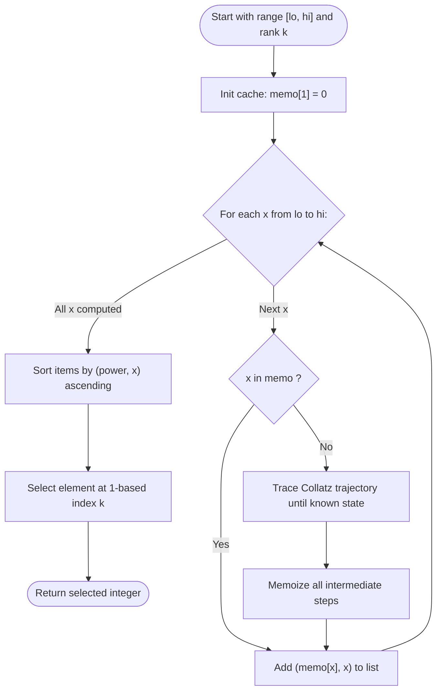

# Guided Example: Sort Integers by The Power Value

We trace the step-by-step execution of Collatz memoization and composite sorting on a representative problem instance:

- **Input:** `lo = 12`, `hi = 15`, `k = 2`
- **Required output:** `13`

This instance is chosen because it demonstrates memoized path sharing (e.g., $14$ reaching $13$, which in turn shares the tail of $12$), identical power ties between adjacent numbers ($12$ vs $13$ and $14$ vs $15$), and tie-breaking by numeric value.

---

## 1. Instance & Teaching Goal

The **power** of an integer $x \ge 1$ is the number of steps required to reduce $x$ to $1$ under the standard Collatz reduction rules:
$$
\text{next}(x) = 
\begin{cases}
x / 2 & \text{if } x \equiv 0 \pmod 2 \\
3x + 1 & \text{if } x \equiv 1 \pmod 2
\end{cases}
$$
With base condition $\text{power}(1) = 0$.

Given an interval $[lo, hi]$ and a target rank $k$, we must:
1. Compute the power value for every integer in $[lo, hi]$.
2. Sort the integers primarily in ascending order of their power value.
3. Break ties by sorting in ascending order of numerical value.
4. Return the $k$-th integer (1-indexed) in the sorted sequence.

For $[12, 15]$:
- $\text{power}(12) = 9$
- $\text{power}(13) = 9$
- $\text{power}(14) = 17$
- $\text{power}(15) = 17$

Sorted list: $[12, 13, 14, 15]$.
For $k = 2$, the $2$-nd element is $13$.

The primary teaching goal is to recognize the directed acyclic graph structure of Collatz trajectories: memoizing intermediate values prevents redundant path traversals across numbers that converge onto shared tails.

---

## 2. Conceptual Foundation & Invariants

Let $P(x)$ be the memoized power function:
$$
P(x) =
\begin{cases}
0 & \text{if } x = 1 \\
1 + P(x / 2) & \text{if } x \text{ is even} \\
1 + P(3x + 1) & \text{if } x \text{ is odd}
\end{cases}
$$

When tracing $14$, its trajectory passes through $13$:
$$
14 \to 7 \to 22 \to 11 \to 34 \to 17 \to 52 \to 26 \to 13 \to \dots \to 1
$$
Because $P(13) = 9$ has already been computed, the evaluation for $14$ terminates immediately upon reaching $13$, requiring only $8 + P(13) = 8 + 9 = 17$ steps.

```
Trajectory Convergence and Memoization Sharing:
12 -> 6 -> 3 -> 10 -> 5 -> 16 -> 8 -> 4 -> 2 -> 1  (9 steps)
                ^
13 -> 40 -> 20 -+  (shares tail [10, 5, 16, 8, 4, 2, 1], total 9 steps)
                
14 -> 7 -> 22 -> 11 -> 34 -> 17 -> 52 -> 26 -> 13 (hits memoized 13! total 8 + 9 = 17)
```

We define state tracking parameters:

| Parameter | Mathematical Meaning | Initial State |
|---|---|---|
| Cache ($\mathcal{M}$) | Hash map of known power values | $\{1 \mapsto 0\}$ |
| Current Candidate ($x$) | Value from $[lo, hi]$ being evaluated | $lo = 12$ |
| Trajectory Stack | Sequence of intermediate values along Collatz path | Dynamic list |
| Ranking Table | Tuples of $(P(x), x)$ | Populated across range |

> **Invariant.** The memoization cache stores the exact Collatz step distance to $1$ for all visited states. Any intermediate node encountered during recursion immediately terminates deep exploration.

---

## 3. Step-by-Step Worked Execution

### Step 1: Evaluating Power of $12$

Compute Collatz sequence starting at $12$:
- $12$ (even) $\to 6$
- $6$ (even) $\to 3$
- $3$ (odd) $\to 3(3) + 1 = 10$
- $10$ (even) $\to 5$
- $5$ (odd) $\to 3(5) + 1 = 16$
- $16 \to 8 \to 4 \to 2 \to 1$

Step count: $9$ transitions.
Store in cache: $\mathcal{M}[12] = 9$, along with intermediate states ($6 \mapsto 8, 3 \mapsto 7, 10 \mapsto 6, 5 \mapsto 5, \dots$).

| State Transition | Parity Rule | Next Value | Cumulative Steps from 12 |
|---|---|---|---|
| $12 \to 6$ | Even ($12 / 2$) | $6$ | $1$ |
| $6 \to 3$ | Even ($6 / 2$) | $3$ | $2$ |
| $3 \to 10$ | Odd ($3 \times 3 + 1$) | $10$ | $3$ |
| $10 \to 5$ | Even ($10 / 2$) | $5$ | $4$ |
| $5 \to 16$ | Odd ($3 \times 5 + 1$) | $16$ | $5$ |
| $16 \to 8 \to 4 \to 2 \to 1$ | Repeated division | $1$ | $9$ |

---

### Step 2: Evaluating Power of $13$ (Memoization Benefit)

Compute Collatz sequence starting at $13$:
- $13$ (odd) $\to 3(13) + 1 = 40$
- $40$ (even) $\to 20$
- $20$ (even) $\to 10$
- At $10$, cache lookup succeeds: $\mathcal{M}[10] = 6$.
- Total steps: $3 + \mathcal{M}[10] = 3 + 6 = 9$.
- Store in cache: $\mathcal{M}[13] = 9$.

---

### Step 3: Evaluating Power of $14$ (Direct Hit on $13$)

Compute Collatz sequence starting at $14$:
- $14 \to 7 \to 22 \to 11 \to 34 \to 17 \to 52 \to 26 \to 13$.
- Path length to reach $13$: $8$ steps.
- At $13$, cache lookup succeeds: $\mathcal{M}[13] = 9$.
- Total steps: $8 + 9 = 17$.
- Store in cache: $\mathcal{M}[14] = 17$.

---

### Step 4: Evaluating Power of $15$

Compute Collatz sequence starting at $15$:
- $15 \to 46 \to 23 \to 70 \to 35 \to 106 \to 53 \to 160 \to 80 \to 40$.
- Path length to $40$: $9$ steps.
- From $40$, cache hit: $\mathcal{M}[40] = 8$.
- Total steps: $9 + 8 = 17$.
- Store in cache: $\mathcal{M}[15] = 17$.

---

### Step 5: Sorting and Rank Selection

We assemble the list of composite keys $(P(x), x)$:
- $x = 12 \implies (9, 12)$
- $x = 13 \implies (9, 13)$
- $x = 14 \implies (17, 14)$
- $x = 15 \implies (17, 15)$

Sorted order:
1. $(9, 12)$
2. $(9, 13)$
3. $(17, 14)$
4. $(17, 15)$

With $k = 2$, select the $2$-nd element: $13$.

---

## 4. Complete Execution Trace

| Candidate ($x$) | Intermediate Steps Recorded | Cache Hit Node | Derived $P(x)$ | Rank in Sorted List |
|---|---|---|---|---|
| $12$ | Full chain to $1$ | None ($1 \mapsto 0$) | $9$ | 1st |
| $13$ | $13 \to 40 \to 20 \to 10$ | $10 \mapsto 6$ | $9$ | **2nd (Result for $k=2$)** |
| $14$ | $14 \to \dots \to 26 \to 13$ | $13 \mapsto 9$ | $17$ | 3rd |
| $15$ | $15 \to \dots \to 80 \to 40$ | $40 \mapsto 8$ | $17$ | 4th |

---

## 5. Algorithmic Correctness & Complexity Derivation

### Subproblem Overlap and Invariant

Because Collatz sequences merge into common paths (for instance, powers of two and multiples of small factors), numerous intermediate values recur frequently across the search interval $[lo, hi]$.
- Top-down memoization stores $P(u)$ for every visited number $u$.
- When evaluating $x$, once any previously visited state $u$ is reached, the recurrence halts in $\mathcal{O}(1)$ time.
- The composite sorting comparator $(P(x), x)$ guarantees strict ordering: primary criterion $P(x)$ orders numbers by difficulty of reduction, while secondary criterion $x$ breaks ties deterministically.

### Asymptotic Complexity

- **Time Complexity:** $\mathcal{O}((hi - lo + 1) \log(hi - lo + 1) + \text{steps})$. For $hi \le 1000$, the maximum Collatz sequence length is bounded by a small constant (the maximum power below $1000$ is $178$). Memoization ensures that distinct states are evaluated at most once. Sorting $N = hi - lo + 1$ elements takes $\mathcal{O}(N \log N)$ time (or $\mathcal{O}(N)$ using quickselect for the $k$-th element).
- **Auxiliary Space Complexity:** $\mathcal{O}(\text{unique states} + N)$. The memoization hash map stores intermediate Collatz values, requiring space proportional to the number of distinct integers visited.

---

## 6. Traps & Edge Cases

- **Integer Overflow:** During odd transitions $3x + 1$, values can temporarily exceed $hi$ (e.g., $15 \to 46 \dots \to 160$). Standard 64-bit integer arithmetic avoids overflow.
- **One-Based Rank Indexing:** Parameter $k$ is 1-indexed. The $k$-th smallest element corresponds to array index $k - 1$.
- **Base Case Zero Power:** The number $1$ requires $0$ steps. Failing to set $P(1) = 0$ will cause an infinite loop in Collatz reduction.
- **Tie-Breaking Rule:** When two values share the same power (e.g., $12$ and $13$ both having power $9$), their original numerical values must dictate relative ordering ($12$ before $13$).

---

## 7. Accessible Mermaid Diagram

