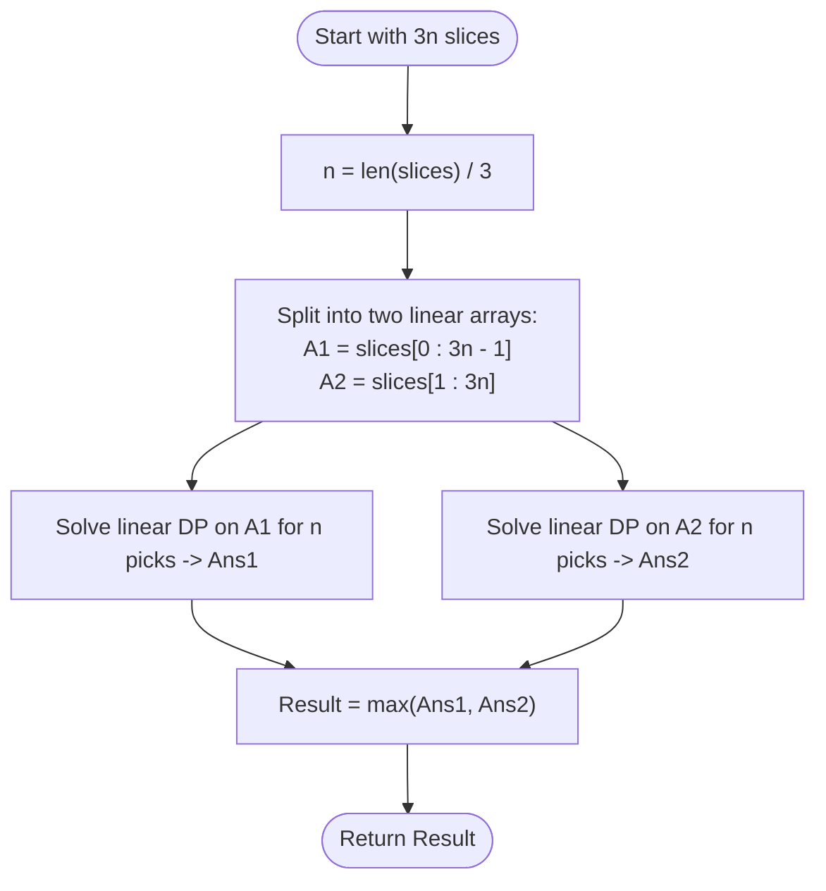

# Guided Example: Pizza With 3n Slices

We trace the step-by-step execution of the non-adjacent circular dynamic programming strategy on a representative problem instance:

- **Input:** `slices = [1, 2, 3, 4, 5, 6]`
- **Required output:** `10`

This instance is chosen because greedy local choices (e.g., greedily picking the largest slice $6$, leaving remaining neighbors) must be evaluated globally across the circular topology, demonstrating the decomposition into two linear non-adjacent subset selection subproblems.

---

## 1. Instance & Teaching Goal

There is a circular pizza cut into $3n$ slices of varying sizes. In each round:
1. You select any available slice $S$.
2. Alice takes the adjacent slice in the counter-clockwise direction.
3. Bob takes the adjacent slice in the clockwise direction.
4. This removes $3$ adjacent slices. The process repeats for $n$ rounds until all $3n$ slices are consumed.

Our objective is to determine the maximum sum of slice sizes you can collect.

For `slices = [1, 2, 3, 4, 5, 6]`:
- Total slices $= 6 = 3n \implies n = 2$ slices for you to collect.
- If you choose slice $6$ in round 1:
  - Neighbor 1 (counter-clockwise) goes to Alice.
  - Neighbor 5 (clockwise) goes to Bob.
  - Remaining slices are $[2, 3, 4]$.
- In round 2, you select slice $4$:
  - Neighbor 3 goes to Alice.
  - Neighbor 2 goes to Bob.
- Total collected: $6 + 4 = 10$.

The primary teaching goal is to recognize the mathematical equivalence of this game: picking $n$ slices in this manner is equivalent to selecting **$n$ non-adjacent slices from a circular array of size $3n$**. Because adjacent slices cannot be simultaneously chosen, the circular dependency decomposes into two linear dynamic programming subproblems (just like House Robber II).

---

## 2. Conceptual Foundation & Invariants

### Equivalence to Non-Adjacent Circular Selection

Any set of $n$ mutually non-adjacent slices in a circular array of $3n$ slices can be realized through a valid sequence of game moves. Conversely, no two adjacent slices can ever be taken by you because Alice and Bob always consume the immediate neighbors of your chosen slice.

Because the array is circular, slice $0$ and slice $3n - 1$ are adjacent. Therefore, you cannot choose both slice $0$ and slice $3n - 1$.
We partition all feasible solutions into two mutually exclusive, exhaustive cases:
1. **Case 1 (Exclude slice $3n - 1$):** Select $n$ non-adjacent elements from the linear prefix $A_1 = \text{slices}[0 \dots 3n - 2]$ of length $3n - 1$.
2. **Case 2 (Exclude slice $0$):** Select $n$ non-adjacent elements from the linear suffix $A_2 = \text{slices}[1 \dots 3n - 1]$ of length $3n - 1$.

$$
\text{Max Slices} = \max \left( \text{SolveLinear}(A_1, n), \text{SolveLinear}(A_2, n) \right)
$$

```
Circular Splitting:
Slices: [ 1,   2,   3,   4,   5,   6 ]  (n = 2 picks)
          ^                         ^
          |--- Adjacent on Circle --|

Case 1 (Drop 6): Linear array [1, 2, 3, 4, 5] -> Pick 2 non-adjacent -> Max sum = 8  (pairs: 3+5=8)
Case 2 (Drop 1): Linear array [2, 3, 4, 5, 6] -> Pick 2 non-adjacent -> Max sum = 10 (pairs: 4+6=10)

Global Maximum: max(8, 10) = 10
```

### Linear DP Formulation

For an array $A$ of length $M$, let $dp[i][j]$ denote the maximum sum obtained by choosing $j$ non-adjacent elements from the prefix $A[0 \dots i - 1]$:
- If we do **not** take element $A[i - 1]$: the best sum is $dp[i - 1][j]$.
- If we **take** element $A[i - 1]$: we cannot take $A[i - 2]$, so the best sum is $dp[i - 2][j - 1] + A[i - 1]$.

$$
dp[i][j] = \max \left( dp[i - 1][j], \; dp[i - 2][j - 1] + A[i - 1] \right)
$$
with base condition $dp[i][0] = 0$ for all $i$.

We define state tracking parameters:

| Parameter | Mathematical Meaning | Initial Value |
|---|---|---|
| Total Picks ($n$) | Number of slices to select ($\lvert slices \rvert / 3$) | $2$ |
| Case 1 Array ($A_1$) | $slices[0 \dots 4] = [1, 2, 3, 4, 5]$ | Linear subarray |
| Case 2 Array ($A_2$) | $slices[1 \dots 5] = [2, 3, 4, 5, 6]$ | Linear subarray |
| DP Table ($dp[i][j]$) | Max sum of $j$ non-adjacent items from first $i$ elements | $0$ |

> **Invariant.** For any prefix $i$ and count $j$, $dp[i][j]$ strictly represents the maximum possible sum of $j$ mutually non-adjacent elements chosen from $A[0 \dots i - 1]$.

---

## 3. Step-by-Step Worked Execution

### Step 1: Solving Case 1 on $A_1 = [1, 2, 3, 4, 5]$ with $n = 2$

We construct the table $dp[i][j]$ for $i \in \{0, \dots, 5\}$ and $j \in \{0, 1, 2\}$:

- **$i = 1$ (Element $1$):**
  - $j = 1$: $dp[1][1] = 1$.
- **$i = 2$ (Element $2$):**
  - $j = 1$: $\max(dp[1][1], 2) = \max(1, 2) = 2$.
  - $j = 2$: Not possible with $\le 2$ elements.
- **$i = 3$ (Element $3$):**
  - $j = 1$: $\max(dp[2][1], 3) = 3$.
  - $j = 2$: $\max(dp[2][2], dp[1][1] + 3) = 0 + 1 + 3 = 4$ (Pair: $\{1, 3\}$).
- **$i = 4$ (Element $4$):**
  - $j = 1$: $\max(dp[3][1], 4) = 4$.
  - $j = 2$: $\max(dp[3][2], dp[2][1] + 4) = \max(4, 2 + 4) = 6$ (Pair: $\{2, 4\}$).
- **$i = 5$ (Element $5$):**
  - $j = 1$: $\max(dp[4][1], 5) = 5$.
  - $j = 2$: $\max(dp[4][2], dp[3][1] + 5) = \max(6, 3 + 5) = 8$ (Pair: $\{3, 5\}$).

Maximum for Case 1: $dp[5][2] = 8$.

| Prefix Length ($i$) | Processed Element $A_1[i-1]$ | $j = 1$ Pick | $j = 2$ Picks | Best Pair Formed |
|---|---|---|---|---|
| $1$ | $1$ | $1$ | $0$ | $\{1\}$ |
| $2$ | $2$ | $2$ | $0$ | $\{2\}$ |
| $3$ | $3$ | $3$ | $4$ | $\{1, 3\}$ |
| $4$ | $4$ | $4$ | $6$ | $\{2, 4\}$ |
| $5$ | $5$ | $5$ | **$8$** | $\{3, 5\}$ |

---

### Step 2: Solving Case 2 on $A_2 = [2, 3, 4, 5, 6]$ with $n = 2$

We construct the table for $A_2 = [2, 3, 4, 5, 6]$:

- **$i = 1$ (Element $2$):**
  - $j = 1$: $dp[1][1] = 2$.
- **$i = 2$ (Element $3$):**
  - $j = 1$: $\max(2, 3) = 3$.
  - $j = 2$: $0$.
- **$i = 3$ (Element $4$):**
  - $j = 1$: $\max(3, 4) = 4$.
  - $j = 2$: $dp[1][1] + 4 = 2 + 4 = 6$ (Pair: $\{2, 4\}$).
- **$i = 4$ (Element $5$):**
  - $j = 1$: $\max(4, 5) = 5$.
  - $j = 2$: $\max(6, dp[2][1] + 5) = \max(6, 3 + 5) = 8$ (Pair: $\{3, 5\}$).
- **$i = 5$ (Element $6$):**
  - $j = 1$: $\max(5, 6) = 6$.
  - $j = 2$: $\max(8, dp[3][1] + 6) = \max(8, 4 + 6) = 10$ (Pair: $\{4, 6\}$).

Maximum for Case 2: $dp[5][2] = 10$.

| Prefix Length ($i$) | Processed Element $A_2[i-1]$ | $j = 1$ Pick | $j = 2$ Picks | Best Pair Formed |
|---|---|---|---|---|
| $1$ | $2$ | $2$ | $0$ | $\{2\}$ |
| $2$ | $3$ | $3$ | $0$ | $\{3\}$ |
| $3$ | $4$ | $4$ | $6$ | $\{2, 4\}$ |
| $4$ | $5$ | $5$ | $8$ | $\{3, 5\}$ |
| $5$ | $6$ | $6$ | **$10$** | $\{4, 6\}$ |

---

### Step 3: Global Combination

We take the maximum of both linear cases:
$$
\text{Answer} = \max(\text{Case 1}, \text{Case 2}) = \max(8, 10) = 10
$$

---

## 4. Complete Execution Trace

| Branch | Subarray Evaluated | Target Count ($n$) | Optimal Sub-selection | Value |
|---|---|---|---|---|
| Case 1 (Omit Last) | $[1, 2, 3, 4, 5]$ | $2$ | Elements $\{3, 5\}$ | $8$ |
| Case 2 (Omit First) | $[2, 3, 4, 5, 6]$ | $2$ | Elements $\{4, 6\}$ | **$10$** |
| Global Selection | $\max(\text{Case 1}, \text{Case 2})$ | $2$ | $\{4, 6\}$ on full circle | **$10$** |

---

## 5. Algorithmic Correctness & Complexity Derivation

### Correctness of Circular Splitting

Let $S^*$ be the optimal set of $n$ non-adjacent slices on the circle $\{0, \dots, 3n - 1\}$.
- Can both $0 \in S^*$ and $3n - 1 \in S^*$? No, because $0$ and $3n - 1$ are adjacent on the circle.
- Therefore, at least one of $\{0, 3n - 1\}$ does not belong to $S^*$.
  - If $3n - 1 \notin S^*$, all elements of $S^*$ lie in $\{0, \dots, 3n - 2\}$, which is precisely Case 1.
  - If $0 \notin S^*$, all elements of $S^*$ lie in $\{1, \dots, 3n - 1\}$, which is precisely Case 2.
- Since one of these two cases must hold, taking $\max(\text{Case 1}, \text{Case 2})$ is guaranteed to contain $S^*$.

### Asymptotic Complexity

- **Time Complexity:** $\mathcal{O}(N \cdot n)$, where $N = 3n$. Each linear DP problem builds a table of size $(3n) \times n$, performing $\mathcal{O}(1)$ transitions per state. Total time is $\mathcal{O}(n^2)$ (since $N = 3n$). For $3n \le 500$, $n \le 167$, requiring $\approx 500 \times 167 \approx 8.3 \times 10^4$ operations, running in a few milliseconds.
- **Auxiliary Space Complexity:** $\mathcal{O}(N \cdot n)$ or $\mathcal{O}(n)$ using row-rolling optimization.

---

## 6. Traps & Edge Cases

- **Circular Adjacency Overlook:** Treating the array as purely linear would allow picking both the first and last elements simultaneously (e.g., $1$ and $6$), which violates circular adjacency.
- **Greedy Trap:** Greedily selecting the largest element $6$ on the linear array might prevent picking both $5$ and others; global DP ensures the optimal tradeoff across all slices is found.
- **DP Index Offsets:** Transitioning from $dp[i - 2][j - 1]$ requires $i \ge 2$. Base cases for $i = 1$ and $j = 0$ must be initialized properly.
- **Smallest Instance ($n = 1$):** With $3n = 3$ slices, you pick $n = 1$ slice, so the answer is simply $\max(slices)$.

---

## 7. Accessible Mermaid Diagram

