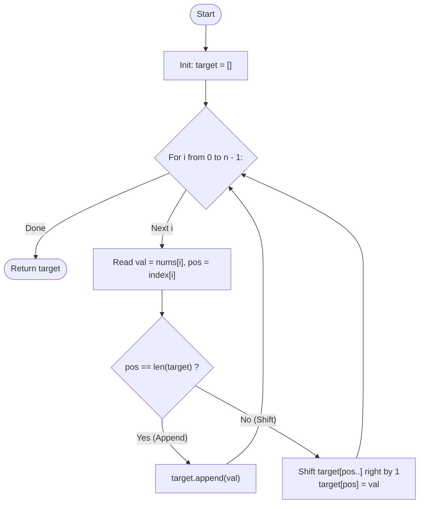

# Guided Example: Create Target Array in the Given Order

We trace the step-by-step execution of sequential position-indexed array insertion on a representative problem instance:

- **Input:** `nums = [0, 1, 2, 3, 4]`, `index = [0, 1, 2, 2, 1]`
- **Required output:** `[0, 4, 1, 3, 2]`

This instance is chosen because the first three operations append elements monotonically, while the final two operations insert into internal indices, displacing previously positioned elements to the right.

---

## 1. Instance & Teaching Goal

Given two integer arrays `nums` and `index` of equal length $n$, we start with an empty target array $\mathcal{T} = []$. At each step $i \in \{0, \dots, n-1\}$, we read the pair $(nums[i], index[i])$ and insert $nums[i]$ at position $index[i]$ within $\mathcal{T}$. Existing elements at indices $\ge index[i]$ shift to the right by one position.

For `nums = [0, 1, 2, 3, 4]` and `index = [0, 1, 2, 2, 1]`:
- Step 0: Insert $0$ at index $0 \implies \mathcal{T} = [0]$
- Step 1: Insert $1$ at index $1 \implies \mathcal{T} = [0, 1]$
- Step 2: Insert $2$ at index $2 \implies \mathcal{T} = [0, 1, 2]$
- Step 3: Insert $3$ at index $2 \implies \mathcal{T} = [0, 1, 3, 2]$ (element $2$ shifts right)
- Step 4: Insert $4$ at index $1 \implies \mathcal{T} = [0, 4, 1, 3, 2]$ (elements $1, 3, 2$ shift right)

The primary teaching goal is to model sequential list displacement: understanding that inserting at index $k$ splits the current array into prefix $\mathcal{T}[0 \dots k-1]$ and suffix $\mathcal{T}[k \dots |\mathcal{T}|-1]$, sandwiching the incoming value between them.

---

## 2. Conceptual Foundation & Invariants

Let $\mathcal{T}_i$ be the target array after $i$ operations ($|\mathcal{T}_i| = i$).
At step $i$, we insert value $v = nums[i]$ at index $p = index[i]$, where $0 \le p \le i$:
$$
\mathcal{T}_{i+1} = \mathcal{T}_i[0 \dots p-1] \mathbin{\Vert} [v] \mathbin{\Vert} \mathcal{T}_i[p \dots i-1]
$$
where $\mathbin{\Vert}$ denotes array concatenation.

```
Array Insertion and Right-Shift Mechanics:
Step 2 state:    [ 0,   1,   2 ]
Insert (3 at 2):   |    |    \---> shifts right to index 3
                 [ 0,   1,   3,   2 ]
                             ^
Step 3 state:    [ 0,   1,   3,   2 ]
Insert (4 at 1):   |    \----+----+----> shift right to indices 2, 3, 4
                 [ 0,   4,   1,   3,   2 ]
                        ^
```

We define state tracking parameters:

| Parameter | Mathematical Meaning | Initial Value |
|---|---|---|
| Step Counter ($i$) | Number of processed insertion operations | $0$ |
| Value to Insert ($v$) | Element $nums[i]$ | $nums[0] = 0$ |
| Target Index ($p$) | Index $index[i]$ within range $[0, i]$ | $index[0] = 0$ |
| Target Array ($\mathcal{T}$) | Accumulator list of inserted elements | $[]$ |

> **Invariant.** After processing step $i$, $|\mathcal{T}| = i + 1$, and for every $k < index[i]$, $\mathcal{T}[k]$ retains its relative position, while all elements originally at indices $\ge index[i]$ have their indices increased by exactly $1$.

---

## 3. Step-by-Step Worked Execution

### Step 0: Insert $nums[0] = 0$ at $index[0] = 0$

- Target array before step: $\mathcal{T} = []$.
- Insert value $0$ at index $0$.
- Resulting array: $\mathcal{T} = [0]$.
- Displaced elements: None.

| Operation Index | Incoming Value | Target Position | Displaced Suffix | Array After Operation |
|---|---|---|---|---|
| $0$ | $0$ | $0$ | None | $[0]$ |

---

### Step 1: Insert $nums[1] = 1$ at $index[1] = 1$

- Target array before step: $\mathcal{T} = [0]$.
- Target index $1 = |\mathcal{T}|$ (append operation).
- Resulting array: $\mathcal{T} = [0, 1]$.
- Displaced elements: None.

| Operation Index | Incoming Value | Target Position | Displaced Suffix | Array After Operation |
|---|---|---|---|---|
| $1$ | $1$ | $1$ | None | $[0, 1]$ |

---

### Step 2: Insert $nums[2] = 2$ at $index[2] = 2$

- Target array before step: $\mathcal{T} = [0, 1]$.
- Target index $2 = |\mathcal{T}|$ (append operation).
- Resulting array: $\mathcal{T} = [0, 1, 2]$.
- Displaced elements: None.

| Operation Index | Incoming Value | Target Position | Displaced Suffix | Array After Operation |
|---|---|---|---|---|
| $2$ | $2$ | $2$ | None | $[0, 1, 2]$ |

---

### Step 3: Insert $nums[3] = 3$ at $index[3] = 2$ (Internal Shift)

- Target array before step: $\mathcal{T} = [0, 1, 2]$.
- Target position is $2 < |\mathcal{T}| = 3$.
- Suffix starting at index $2$ is $[2]$.
- Shift $[2]$ right to occupy index $3$.
- Place incoming value $3$ at index $2$.
- Resulting array: $\mathcal{T} = [0, 1, 3, 2]$.

| Operation Index | Incoming Value | Target Position | Displaced Suffix | Array After Operation |
|---|---|---|---|---|
| $3$ | $3$ | $2$ | $[2] \to$ shifted to index $3$ | $[0, 1, 3, 2]$ |

---

### Step 4: Insert $nums[4] = 4$ at $index[4] = 1$ (Multi-Element Shift)

- Target array before step: $\mathcal{T} = [0, 1, 3, 2]$.
- Target position is $1 < |\mathcal{T}| = 4$.
- Prefix before index $1$: $[0]$.
- Suffix starting at index $1$: $[1, 3, 2]$.
- Shift elements at indices $1, 2, 3$ rightward to indices $2, 3, 4$:
  - Old $\mathcal{T}[1] = 1 \to \text{New } \mathcal{T}[2] = 1$
  - Old $\mathcal{T}[2] = 3 \to \text{New } \mathcal{T}[3] = 3$
  - Old $\mathcal{T}[3] = 2 \to \text{New } \mathcal{T}[4] = 2$
- Place incoming value $4$ at index $1$.
- Resulting array: $\mathcal{T} = [0, 4, 1, 3, 2]$.

Final target array: `[0, 4, 1, 3, 2]`.

---

## 4. Complete Execution Trace

| Step ($i$) | $nums[i]$ | $index[i]$ | Array Pre-State | Elements Shifted Right | Array Post-State |
|---|---|---|---|---|---|
| $0$ | $0$ | $0$ | $[]$ | None | $[0]$ |
| $1$ | $1$ | $1$ | $[0]$ | None | $[0, 1]$ |
| $2$ | $2$ | $2$ | $[0, 1]$ | None | $[0, 1, 2]$ |
| $3$ | $3$ | $2$ | $[0, 1, 2]$ | Value $2$ (index $2 \to 3$) | $[0, 1, 3, 2]$ |
| $4$ | $4$ | $1$ | $[0, 1, 3, 2]$ | Values $1, 3, 2$ (indices $1..3 \to 2..4$) | **$[0, 4, 1, 3, 2]$** |

---

## 5. Algorithmic Correctness & Complexity Derivation

### Correctness of Displacement Mechanics

The specification requires:
1. Each element $nums[i]$ must reside at position $index[i]$ immediately after operation $i$.
2. Any element inserted earlier at or to the right of $index[i]$ remains in the list, preserving its relative order with respect to all other displaced elements.
- By shifting the suffix $\mathcal{T}[index[i] \dots i-1]$ one position to the right into slots $index[i]+1 \dots i$, the relative order within the suffix is strictly invariant: for all $a < b$, their new indices satisfy $a+1 < b+1$.
- The new slot at $index[i]$ is vacated and immediately occupied by $nums[i]$.
- Prefix $\mathcal{T}[0 \dots index[i]-1]$ is untouched.
- Hence, the post-state fulfills both requirements by construction.

### Asymptotic Complexity

- **Time Complexity:** $\mathcal{O}(n^2)$. At step $i$, shifting up to $i$ elements requires $\mathcal{O}(i)$ time. Summing over $n$ steps: $\sum_{i=0}^{n-1} i = \frac{n(n-1)}{2} = \mathcal{O}(n^2)$. For $n \le 100$, this performs at most $\approx 5000$ operations, completing in less than a millisecond. (Advanced balanced search trees or Fenwick trees can achieve $\mathcal{O}(n \log n)$ by backward positioning).
- **Auxiliary Space Complexity:** $\mathcal{O}(n)$ to store the target array of $n$ elements.

---

## 6. Traps & Edge Cases

- **Index Guarantee:** The problem guarantees $0 \le index[i] \le i$. Attempting to insert at an index strictly greater than the current length would produce undefined behavior or an index error.
- **In-Place Shift Order:** When shifting elements in a fixed array buffer, shifting must proceed from right to left (highest index to lowest). Shifting left to right would overwrite values before they are displaced.
- **Append vs Insert:** When $index[i] = |\mathcal{T}|$, no elements are shifted, representing a pure constant-time append.
- **Head Insertions:** When $index[i] = 0$, every existing element is displaced.

---

## 7. Accessible Mermaid Diagram


