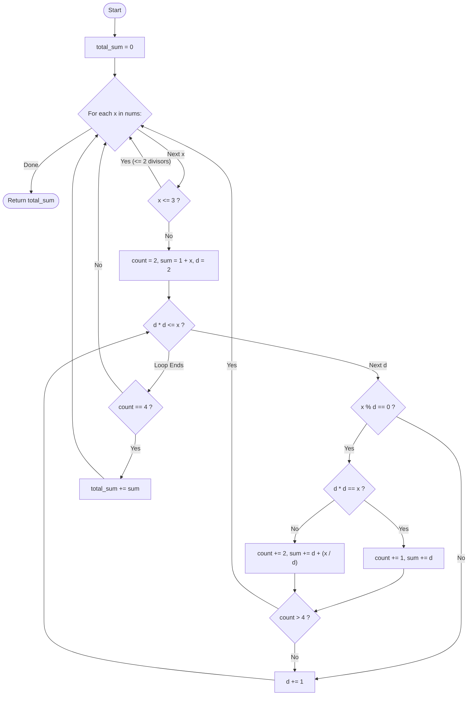

# Guided Example: Four Divisors

We trace the step-by-step execution of the square-root trial division and divisor pairing strategy on a representative problem instance:

- **Input:** `nums = [21, 4, 7]`
- **Required output:** `32`

This instance is chosen because it includes an integer with exactly four divisors ($21$), a prime with two divisors ($7$), and a perfect square with an odd divisor count ($4$), illustrating the divisor-pair counting invariants.

---

## 1. Instance & Teaching Goal

Given an integer array `nums`, we must find every integer $x$ that possesses **exactly four positive divisors**. For every such integer, we sum its four divisors. The final result is the sum of these divisor sums across all qualifying numbers in the array (or $0$ if none qualify).

For `nums = [21, 4, 7]`:
- $x = 21$: Divisors are $\{1, 3, 7, 21\}$ (count $= 4$). Sum $= 1 + 3 + 7 + 21 = 32$.
- $x = 4$: Divisors are $\{1, 2, 4\}$ (count $= 3$). Does not qualify.
- $x = 7$: Divisors are $\{1, 7\}$ (count $= 2$). Does not qualify.
- Global total: $32$.

The primary teaching goal is to observe divisor symmetry: divisors always occur in reciprocal pairs $(d, x/d)$. Testing candidates up to $\lfloor \sqrt{x} \rfloor$ bounds the search to $\mathcal{O}(\sqrt{x})$ operations while permitting immediate pruning once the divisor count exceeds four.

---

## 2. Conceptual Foundation & Invariants

An integer $x \ge 1$ has prime factorization $x = p_1^{a_1} p_2^{a_2} \dots p_k^{a_k}$.
The total number of positive divisors is:
$$
d(x) = (a_1 + 1)(a_2 + 1) \dots (a_k + 1)
$$
For $d(x) = 4$, the product of factors can only be factored as $4$ or $2 \times 2$:
1. $a_1 = 3$: The number is a cube of a prime, $x = p^3$. Its divisors are $\{1, p, p^2, p^3\}$.
2. $a_1 = 1, a_2 = 1$: The number is a semiprime, $x = p \cdot q$ where $p < q$ are distinct primes. Its divisors are $\{1, p, q, pq\}$.

```
Divisor Symmetry and Early Termination:
x = 21:
  d = 1: pair (1, 21) -> count = 2, sum = 22
  d = 2: 21 not divisible by 2
  d = 3: pair (3, 7)  -> count = 4, sum = 32
  d = 4: 4^2 = 16 <= 21, but 21 % 4 != 0
  Loop terminates (d = 5 > sqrt(21)).
  Count == 4 -> Accredit 32!

x = 4:
  d = 1: pair (1, 4) -> count = 2, sum = 5
  d = 2: 2^2 == 4 (identical factor) -> count = 3, sum = 7
  Count == 3 != 4 -> Discard!
```

To find divisors of $x$:
- Initialize with the universal pair $\{1, x\}$ (for $x > 1$), yielding count $2$ and sum $1 + x$.
- Iterate $d$ from $2$ up to $\lfloor \sqrt{x} \rfloor$.
- If $d$ divides $x$:
  - If $d = x / d$ (perfect square factor), increment count by $1$ and sum by $d$.
  - Otherwise, increment count by $2$ and sum by $d + x / d$.
  - If count $> 4$, terminate exploration early.
- If final count equals $4$, add the accumulated sum to the grand total.

We define state tracking parameters:

| Parameter | Mathematical Meaning | Initial State |
|---|---|---|
| Current Integer ($x$) | Element of $nums$ under evaluation | Scanned sequentially |
| Divisor Count ($c$) | Number of identified divisors | $2$ (for $1$ and $x$) |
| Divisor Sum ($s$) | Sum of identified divisors | $1 + x$ |
| Grand Total | Sum of divisor sums for qualifying integers | $0$ |

> **Invariant.** Testing divisors $d$ strictly in the range $2 \le d \le \lfloor \sqrt{x} \rfloor$ uncovers all remaining non-trivial divisor pairs $(d, x/d)$. If the divisor count exceeds $4$ at any point, $x$ cannot qualify and is safely abandoned.

---

## 3. Step-by-Step Worked Execution

### Step 1: Evaluating $x = 21$

- Base pair: Divisors $\{1, 21\}$. Initial count $c = 2$, sum $s = 1 + 21 = 22$.
- Search limit: $\lfloor \sqrt{21} \rfloor = 4$.
- Candidate $d = 2$: $21 \pmod 2 = 1 \ne 0$.
- Candidate $d = 3$: $21 \pmod 3 = 0$.
  - Paired divisor: $21 / 3 = 7$.
  - Since $3 \ne 7$, this adds $2$ distinct divisors.
  - Updated count: $c = 2 + 2 = 4$.
  - Updated sum: $s = 22 + (3 + 7) = 32$.
- Candidate $d = 4$: $21 \pmod 4 = 1 \ne 0$.
- Loop concludes at $d > 4$.
- Verification: Is count $c == 4$? **Yes** ($32 == 32$).
- Add to grand total: $0 + 32 = 32$.

| Candidate Divisor ($d$) | $x \pmod d == 0$? | Paired Divisor ($x / d$) | Distinct Divisors Added | Running Count | Running Sum |
|---|---|---|---|---|---|
| Base ($d = 1$) | Yes | $21$ | $\{1, 21\}$ | $2$ | $22$ |
| $d = 2$ | No | - | None | $2$ | $22$ |
| $d = 3$ | Yes | $7$ | $\{3, 7\}$ | $4$ | $32$ |
| $d = 4$ | No | - | None | $4$ | $32$ |

---

### Step 2: Evaluating $x = 4$

- Base pair: Divisors $\{1, 4\}$. Initial count $c = 2$, sum $s = 1 + 4 = 5$.
- Search limit: $\lfloor \sqrt{4} \rfloor = 2$.
- Candidate $d = 2$: $4 \pmod 2 = 0$.
  - Paired divisor: $4 / 2 = 2$.
  - Since $d = x / d$ (perfect square root), this adds only $1$ distinct divisor.
  - Updated count: $c = 2 + 1 = 3$.
  - Updated sum: $s = 5 + 2 = 7$.
- Loop concludes.
- Verification: Is count $c == 4$? **False** ($c = 3$).
- Grand total remains $32$.

| Candidate Divisor ($d$) | $x \pmod d == 0$? | Paired Divisor | Distinct Divisors Added | Running Count | Running Sum |
|---|---|---|---|---|---|
| Base ($d = 1$) | Yes | $4$ | $\{1, 4\}$ | $2$ | $5$ |
| $d = 2$ | Yes | $2$ (Square root) | $\{2\}$ | $3$ | $7$ |

---

### Step 3: Evaluating $x = 7$

- Base pair: Divisors $\{1, 7\}$. Initial count $c = 2$, sum $s = 1 + 7 = 8$.
- Search limit: $\lfloor \sqrt{7} \rfloor = 2$.
- Candidate $d = 2$: $7 \pmod 2 = 1 \ne 0$.
- Loop concludes.
- Verification: Is count $c == 4$? **False** ($c = 2$).
- Grand total remains $32$.

Final result: $32$.

---

## 4. Complete Execution Trace

| Array Element ($x$) | Divisors Found | Total Divisor Count ($c$) | Exactly 4 Divisors? | Contributed Sum | Cumulative Total |
|---|---|---|---|---|---|
| $21$ | $\{1, 3, 7, 21\}$ | $4$ | **Yes** | $32$ | $32$ |
| $4$ | $\{1, 2, 4\}$ | $3$ | No | $0$ | $32$ |
| $7$ | $\{1, 7\}$ | $2$ | No | $0$ | **$32$** |

---

## 5. Algorithmic Correctness & Complexity Derivation

### Completeness of Square Root Search

For any divisor $d$ of $x$, $d \cdot (x / d) = x$.
- If both $d > \sqrt{x}$ and $x / d > \sqrt{x}$, then $d \cdot (x / d) > \sqrt{x} \cdot \sqrt{x} = x$, a contradiction.
- Therefore, at least one factor in every divisor pair must satisfy $d \le \sqrt{x}$.
- Testing all integers up to $\lfloor \sqrt{x} \rfloor$ is guaranteed to discover every divisor pair.
- When $d = \sqrt{x}$, the pair collapses into a single divisor, correctly incrementing the count by $1$.
- Thus, the exact count and sum of all divisors are guaranteed without testing beyond $\sqrt{x}$.

### Asymptotic Complexity

- **Time Complexity:** $\mathcal{O}(n \sqrt{M})$, where $n = |nums|$ and $M = \max(nums)$. For each number, trial division tests at most $\sqrt{M}$ candidate divisors. Given $M \le 10^5$, $\sqrt{M} \le 316$. With $n \le 10^4$, total operations are at most $10^4 \times 316 \approx 3.16 \times 10^6$, executing in well under $0.1$ seconds.
- **Auxiliary Space Complexity:** $\mathcal{O}(1)$. Divisors and their sums are computed using scalar registers without auxiliary arrays.

---

## 6. Traps & Edge Cases

- **Perfect Squares ($x = k^2$):** A square root divisor $k = \sqrt{x}$ must only be counted once. Counting it twice would falsely report $4$ divisors for numbers like $x = 8$ ($2^3$) or confuse odd and even divisor parity.
- **Number $x = 1$:** The number $1$ has only one divisor $\{1\}$. Initializing with $c = 2$ and $s = 1 + 1$ would erroneously count $1$ twice. Numbers $\le 3$ can have at most $2$ divisors and can be skipped or handled cleanly.
- **Early Break on Abundant Numbers:** For highly composite numbers (e.g., $x = 12$ with divisors $\{1, 2, 3, 4, 6, 12\}$), breaking as soon as count $> 4$ avoids unnecessary iterations.
- **Large Prime Components:** For semiprimes $x = p \cdot q$ with a large prime $q$, testing only up to $\sqrt{x}$ identifies $p$ and immediately discovers $q = x / p$ without searching up to $q$.

---

## 7. Accessible Mermaid Diagram


