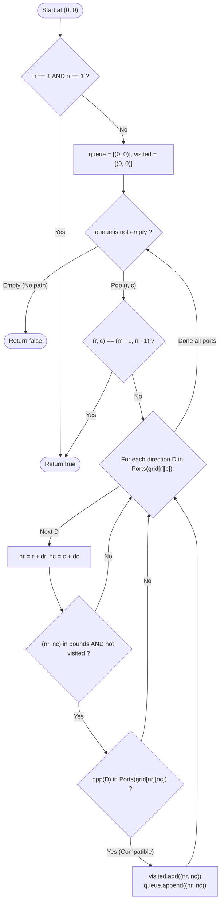

# Guided Example: Check if There is a Valid Path in a Grid

We trace the step-by-step execution of the bidirectional street port matching and graph connectivity traversal on a representative grid instance:

- **Input:** `grid = [[2, 4, 3], [6, 5, 2]]`
- **Required output:** `true`

This instance is chosen because the path traverses a non-trivial winding serpentine trajectory through all six cells ($(0, 0) \to (1, 0) \to (1, 1) \to (0, 1) \to (0, 2) \to (1, 2)$), rigorously testing every street type and bidirectional connection constraint.

---

## 1. Instance & Teaching Goal

Given an $m \times n$ matrix where each cell represents a specific pipe or street configuration, we begin at cell $(0, 0)$ and want to determine whether a continuous valid path reaches destination $(m - 1, n - 1)$.

The six street types and their connecting directions (North, South, East, West) are defined as:
1. **Type 1:** Connects West and East (`[Left, Right]`)
2. **Type 2:** Connects North and South (`[Upper, Lower]`)
3. **Type 3:** Connects West and South (`[Left, Lower]`)
4. **Type 4:** Connects East and South (`[Right, Lower]`)
5. **Type 5:** Connects West and North (`[Left, Upper]`)
6. **Type 6:** Connects East and North (`[Right, Upper]`)

A transition from cell $u$ to adjacent cell $v$ is valid if and only if:
1. Cell $u$ has an open port pointing toward $v$.
2. Cell $v$ has an open port pointing back toward $u$.

For `grid = [[2, 4, 3], [6, 5, 2]]` ($m = 2, n = 3$):
- Start at $(0, 0)$ with Type 2 (North-South). South port leads to $(1, 0)$.
- $(1, 0)$ has Type 6 (East-North). Its North port connects to $(0, 0)$'s South port. Valid!
- From $(1, 0)$, East port leads to $(1, 1)$.
- $(1, 1)$ has Type 5 (West-North). West port matches East port of $(1, 0)$. Valid!
- From $(1, 1)$, North port leads to $(0, 1)$.
- $(0, 1)$ has Type 4 (East-South). South port matches North port of $(1, 1)$. Valid!
- From $(0, 1)$, East port leads to $(0, 2)$.
- $(0, 2)$ has Type 3 (West-South). West port matches East port of $(0, 1)$. Valid!
- From $(0, 2)$, South port leads to $(1, 2)$.
- $(1, 2)$ has Type 2 (North-South). North port matches South port of $(0, 2)$. Destination reached!

The primary teaching goal is to model grid pipe navigation as an undirected graph traversal where edges exist strictly upon mutual port compatibility, preventing invalid one-sided movements.

---

## 2. Conceptual Foundation & Invariants

Let $\Delta = \{ \text{North}: (-1, 0), \text{South}: (1, 0), \text{East}: (0, 1), \text{West}: (0, -1) \}$.
Each direction $D$ has an opposite complementary direction $\text{opp}(D)$:
- $\text{opp}(\text{North}) = \text{South}$
- $\text{opp}(\text{South}) = \text{North}$
- $\text{opp}(\text{East}) = \text{West}$
- $\text{opp}(\text{West}) = \text{East}$

Let $\text{Ports}(\text{type})$ denote the set of open directions for a street type:
- $\text{Ports}(1) = \{\text{West}, \text{East}\}$
- $\text{Ports}(2) = \{\text{North}, \text{South}\}$
- $\text{Ports}(3) = \{\text{West}, \text{South}\}$
- $\text{Ports}(4) = \{\text{East}, \text{South}\}$
- $\text{Ports}(5) = \{\text{West}, \text{North}\}$
- $\text{Ports}(6) = \{\text{East}, \text{North}\}$

```
Grid Layout and Serpentine Path:
(0,0) [Type 2: |]             (0,1) [Type 4: ┌]  ----->  (0,2) [Type 3: ┐]
       |                             ^                          |
       v                             |                          v
(1,0) [Type 6: └]  -------->  (1,1) [Type 5: ┘]          (1,2) [Type 2: |]  (Goal!)
```

An edge exists between cell $A$ and adjacent neighbor $B = A + D$ if and only if:
$$
D \in \text{Ports}(grid[A]) \quad \text{and} \quad \text{opp}(D) \in \text{Ports}(grid[B])
$$

We define state tracking parameters:

| Parameter | Mathematical Meaning | Initial Value |
|---|---|---|
| Active Queue ($\mathcal{Q}$) | BFS frontier of reachable coordinates | $[(0, 0)]$ |
| Visited Matrix ($\mathcal{V}$) | Boolean grid of explored coordinates | $\mathcal{V}[0][0] = \text{True}$ |
| Current Node ($r, c$) | Coordinate currently dequeued | $(0, 0)$ |
| Target Coordinate | Destination cell $(m - 1, n - 1)$ | $(1, 2)$ |

> **Invariant.** Every cell added to the queue is guaranteed to be connected to the origin $(0, 0)$ through a contiguous chain of mutually compatible street ports.

---

## 3. Step-by-Step Worked Execution

### Step 1: Initialization at $(0, 0)$

- Current cell: $(0, 0)$, street Type $2$ (`[North, South]`).
- Check North $(-1, 0)$: Out of bounds.
- Check South $(1, 0)$:
  - Direction is South. Opposite is North.
  - Neighbor cell $(1, 0)$ has Type $6$.
  - $\text{Ports}(6) = \{\text{East}, \text{North}\}$. North $\in \text{Ports}(6)$ holds!
  - Mutual connection verified. Mark $(1, 0)$ visited and enqueue.

| Step | Active Cell | Street Type | Tested Direction | Neighbor Cell | Neighbor Ports | Valid Connection? |
|---|---|---|---|---|---|---|
| $1$ | $(0, 0)$ | $2$ (N, S) | South | $(1, 0)$ | Type $6$ (E, N) | Yes (S $\leftrightarrow$ N) |

---

### Step 2: Transition from $(1, 0)$ to $(1, 1)$

- Current cell: $(1, 0)$, street Type $6$ (`[East, North]`).
- Direction North leads back to $(0, 0)$ (already visited).
- Check East $(1, 1)$:
  - Direction is East. Opposite is West.
  - Neighbor cell $(1, 1)$ has Type $5$.
  - $\text{Ports}(5) = \{\text{West}, \text{Upper}\}$. West $\in \text{Ports}(5)$ holds!
  - Mutual connection verified. Enqueue $(1, 1)$.

---

### Step 3: Transition from $(1, 1)$ to $(0, 1)$

- Current cell: $(1, 1)$, street Type $5$ (`[West, North]`).
- Direction West leads back to $(1, 0)$ (already visited).
- Check North $(0, 1)$:
  - Direction is North. Opposite is South.
  - Neighbor cell $(0, 1)$ has Type $4$.
  - $\text{Ports}(4) = \{\text{East}, \text{South}\}$. South $\in \text{Ports}(4)$ holds!
  - Mutual connection verified. Enqueue $(0, 1)$.

---

### Step 4: Transition from $(0, 1)$ to $(0, 2)$

- Current cell: $(0, 1)$, street Type $4$ (`[East, South]`).
- Direction South leads back to $(1, 1)$ (already visited).
- Check East $(0, 2)$:
  - Direction is East. Opposite is West.
  - Neighbor cell $(0, 2)$ has Type $3$.
  - $\text{Ports}(3) = \{\text{West}, \text{South}\}$. West $\in \text{Ports}(3)$ holds!
  - Mutual connection verified. Enqueue $(0, 2)$.

---

### Step 5: Transition from $(0, 2)$ to $(1, 2)$ (Target Reached)

- Current cell: $(0, 2)$, street Type $3$ (`[West, South]`).
- Direction West leads back to $(0, 1)$ (already visited).
- Check South $(1, 2)$:
  - Direction is South. Opposite is North.
  - Neighbor cell $(1, 2)$ has Type $2$.
  - $\text{Ports}(2) = \{\text{North}, \text{South}\}$. North $\in \text{Ports}(2)$ holds!
  - Target cell $(1, 2) = (m - 1, n - 1)$ reached.
- Return `true`.

---

## 4. Complete Execution Trace

| Step | Dequeued Cell | Type | Outgoing Port | Target Cell | Target Type | Compatible? | Enqueued? |
|---|---|---|---|---|---|---|---|
| $0$ | $(0, 0)$ | $2$ | South | $(1, 0)$ | $6$ | Yes (South $\leftrightarrow$ North) | Enqueued |
| $1$ | $(1, 0)$ | $6$ | East | $(1, 1)$ | $5$ | Yes (East $\leftrightarrow$ West) | Enqueued |
| $2$ | $(1, 1)$ | $5$ | North | $(0, 1)$ | $4$ | Yes (North $\leftrightarrow$ South) | Enqueued |
| $3$ | $(0, 1)$ | $4$ | East | $(0, 2)$ | $3$ | Yes (East $\leftrightarrow$ West) | Enqueued |
| $4$ | $(0, 2)$ | $3$ | South | $(1, 2)$ | $2$ | Yes (South $\leftrightarrow$ North) | **Target Reached!** |

---

## 5. Algorithmic Correctness & Complexity Derivation

### Bidirectional Graph Equivalence

A path through the grid is physically traversable if and only if each step moves through open street openings without hitting walls or dead ends.
- The condition $D \in \text{Ports}(grid[u]) \land \text{opp}(D) \in \text{Ports}(grid[v])$ enforces that an undirected edge $\{u, v\}$ exists in the physical connectivity graph.
- Standard BFS or DFS explores the reachable component containing $(0, 0)$.
- Because the graph is unweighted and degrees are bounded by $2$ (each street type has exactly $2$ ports), the connected components are simple paths or cycles.
- Visited set tracking prevents infinite loops and guarantees termination.

### Asymptotic Complexity

- **Time Complexity:** $\mathcal{O}(m \cdot n)$. Each of the $m \cdot n$ cells has at most $2$ outgoing port directions. Each cell is enqueued and processed at most once. Hence, the total number of evaluated edges is at most $2 \cdot m \cdot n = \mathcal{O}(m \cdot n)$.
- **Auxiliary Space Complexity:** $\mathcal{O}(m \cdot n)$ to maintain the queue and the visited set.

---

## 6. Traps & Edge Cases

- **One-Sided Port Fallacy:** If cell $A$ has a South port pointing to cell $B$, but cell $B$ does not have a North port, no movement is allowed. Both sides must align.
- **Single Cell Grid ($1 \times 1$):** When $m = 1$ and $n = 1$, the start cell $(0, 0)$ is identical to the target $(m - 1, n - 1)$. The function must immediately return `true` regardless of street type.
- **Disconnected Start Cell:** If cell $(0, 0)$ has ports pointing out of the grid or into incompatible neighbors, the traversal halts with empty queue and returns `false`.
- **Closed Loops:** Street configurations can form closed cycles (e.g., $4 \leftrightarrow 3 \leftrightarrow 5 \leftrightarrow 6$). The visited set prevents revisiting nodes in cycles.

---

## 7. Accessible Mermaid Diagram


