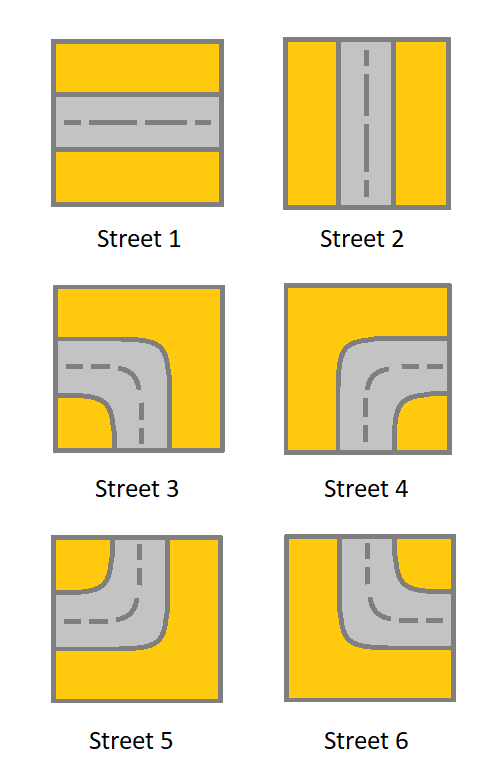

### 1. Description

You are given an `m x n` `grid`. Each cell of `grid` represents a street. The street of $\text{grid}[i][j]$ can be:

- `1` which means a street connecting the left cell and the right cell.

- `2` which means a street connecting the upper cell and the lower cell.

- `3` which means a street connecting the left cell and the lower cell.

- `4` which means a street connecting the right cell and the lower cell.

- `5` which means a street connecting the left cell and the upper cell.

- `6` which means a street connecting the right cell and the upper cell.

You will initially start at the street of the upper-left cell `(0, 0)`. A valid path in the grid is a path that starts from the upper left cell `(0, 0)` and ends at the bottom-right cell $(m - 1, n - 1)$. **The path should only follow the streets**.

### 2. Function Contract

- `n`: Input parameter.
- Returns expected result.

### 3. Notice

that you are **not allowed** to change any street.

Return `true`* if there is a valid path in the grid or *`false`* otherwise*.

### 4. Examples

#### Example 1

- **Input:** `grid = [[2,4,3],[6,5,2]]`
- **Output:** `true`
- **Explanation:** As shown you can start at cell (0, 0) and visit all the cells of the grid to reach (m - 1, n - 1).
#### Example 2

- **Input:** `grid = [[1,2,1],[1,2,1]]`
- **Output:** `false`
- **Explanation:** As shown you the street at cell (0, 0) is not connected with any street of any other cell and you will get stuck at cell (0, 0)
#### Example 3

- **Input:** `grid = [[1,1,2]]`
- **Output:** `false`
- **Explanation:** You will get stuck at cell (0, 1) and you cannot reach cell (0, 2).

### 5. Constraints

- $m = \text{grid.length}$

- $n = \text{grid}[i].length$

- $1 \le m, n \le 300$

- $1 \le \text{grid}[i][j] \le 6$