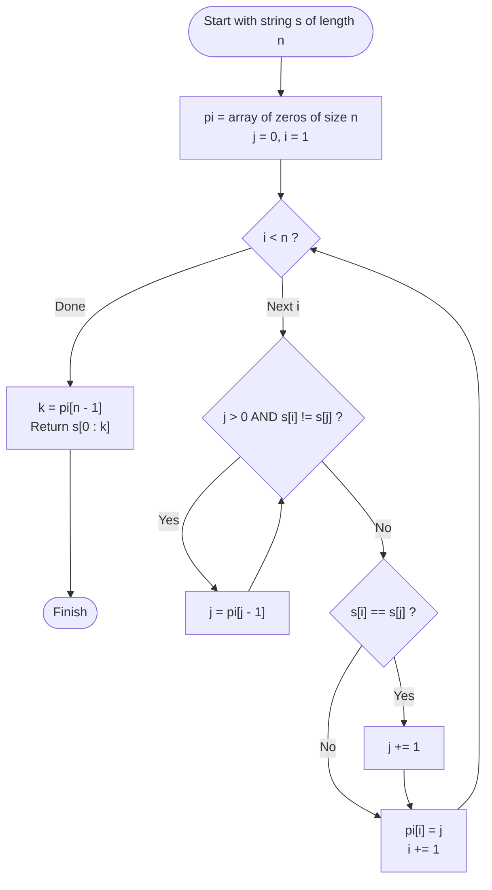

# Guided Example: Longest Happy Prefix

We trace the step-by-step execution of the Knuth-Morris-Pratt (KMP) prefix function on a representative problem instance:

- **Input:** `s = "level"`
- **Required output:** `"l"`

This instance is chosen because internal symmetry and repeated letters (`'e'`) test prefix matching without premature termination, concluding when the final character matches the opening character to confirm `"l"` as the longest proper prefix that is also a suffix.

---

## 1. Instance & Teaching Goal

A **happy prefix** of a string $s$ is defined as a non-empty prefix of $s$ that is also a suffix of $s$, strictly excluding the full string $s$ itself. We must find the longest such prefix, or return `""` if none exists.

For `s = "level"` of length $n = 5$:
- Proper prefixes: `["l", "le", "lev", "leve"]`
- Proper suffixes: `["l", "el", "vel", "evel"]`
- Common substrings: The only common string between proper prefixes and proper suffixes is `"l"`.
- Longest happy prefix: `"l"`.

A naive approach checks candidate prefix/suffix pairs of decreasing lengths $n-1, n-2, \dots, 1$, which can take $\mathcal{O}(n^2)$ time in the worst case (e.g., strings of identical characters).

The primary teaching goal is to recognize that computing the longest happy prefix is identical to computing the final value of the **Knuth-Morris-Pratt (KMP) prefix function** $\pi[n - 1]$, executing in deterministic $\mathcal{O}(n)$ time without hashing or string slicing overhead.

---

## 2. Conceptual Foundation & Invariants

The KMP prefix function $\pi$ is an array of length $n$, where $\pi[i]$ denotes the length of the longest proper prefix of the substring $s[0 \dots i]$ that is also a suffix of $s[0 \dots i]$:

$$
\pi[i] = \max \{ k \mid 0 \le k < i + 1 \text{ and } s[0 \dots k-1] = s[i-k+1 \dots i] \}
$$

By definition, the longest happy prefix of the entire string $s$ has length exactly equal to $\pi[n - 1]$, and corresponds to substring $s[0 \dots \pi[n - 1] - 1]$.

```
Prefix Function Alignment for "level":
Index:          0    1    2    3    4
Character:      l    e    v    e    l
pi[i]:          0    0    0    0    1
                                    ^
pi[4] = 1 means prefix s[0..0] ("l") == suffix s[4..4] ("l")
```

The linear-time computation maintains a pointer $j = \pi[i - 1]$ representing the length of the matched prefix before considering character $s[i]$:
1. While $j > 0$ and $s[i] \ne s[j]$, backtrack using the previously computed prefix lengths: $j \leftarrow \pi[j - 1]$.
2. If $s[i] = s[j]$, increment $j$ by $1$.
3. Assign $\pi[i] = j$.

We define state tracking parameters:

| State Parameter | Mathematical Meaning | Initial Value |
|---|---|---|
| Scan Index ($i$) | Current position in $s$ ($1 \dots n-1$) | $1$ |
| Prefix Length ($j$) | Length of matched prefix candidate | $0$ |
| Array $\pi$ | Precomputed prefix function table | $\pi[0] = 0$ |
| Final Output | Substring $s[0 \dots \pi[n-1]-1]$ | Determined at $i = n-1$ |

> **Invariant.** For every processed index $i$, $\pi[i]$ is the exact maximal length $k < i + 1$ such that prefix $s[0 \dots k - 1]$ equals suffix $s[i - k + 1 \dots i]$.

---

## 3. Step-by-Step Worked Execution

We trace the KMP prefix function construction for $s = \text{"level"}$ ($n = 5$):

### Base Step: Index $i = 0$

- Base definition: Substring of length $1$ (`"l"`) has no non-empty proper prefix.
- Assign $\pi[0] = 0$.

---

### Step 1: Index $i = 1$ ($s[1] = \text{'e'}$)

- Current prefix candidate length: $j = \pi[0] = 0$.
- Character comparison: Compare $s[i] = \text{'e'}$ with $s[j] = s[0] = \text{'l'}$.
- Mismatch ($\text{'e'} \ne \text{'l'}$).
- Since $j = 0$, no backtracking is possible.
- Assign $\pi[1] = 0$.

| Index ($i$) | Character $s[i]$ | Active $j$ | Comparison ($s[i] == s[j]$) | Action Taken | $\pi[i]$ Assigned |
|---|---|---|---|---|---|
| $0$ | `'l'` | - | Base condition | Set to 0 | $0$ |
| $1$ | `'e'` | $0$ | `'e' == 'l'` (False) | No match, $j = 0$ | $0$ |

---

### Step 2: Index $i = 2$ ($s[2] = \text{'v'}$)

- Current prefix candidate length: $j = \pi[1] = 0$.
- Compare $s[i] = \text{'v'}$ with $s[0] = \text{'l'}$.
- Mismatch ($\text{'v'} \ne \text{'l'}$).
- Assign $\pi[2] = 0$.

---

### Step 3: Index $i = 3$ ($s[3] = \text{'e'}$)

- Current prefix candidate length: $j = \pi[2] = 0$.
- Compare $s[i] = \text{'e'}$ with $s[0] = \text{'l'}$.
- Mismatch ($\text{'e'} \ne \text{'l'}$).
- Assign $\pi[3] = 0$.

---

### Step 4: Index $i = 4$ ($s[4] = \text{'l'}$)

- Current prefix candidate length: $j = \pi[3] = 0$.
- Compare $s[i] = \text{'l'}$ with $s[j] = s[0] = \text{'l'}$.
- Match found! ($\text{'l'} = \text{'l'}$).
- Increment prefix length: $j \leftarrow 0 + 1 = 1$.
- Assign $\pi[4] = 1$.

Terminal state reached. Length of longest happy prefix is $\pi[4] = 1$.
Slice substring: $s[0 \dots 0] = \text{"l"}$.

---

## 4. Complete Execution Trace

| Step ($i$) | $s[i]$ | Candidate $j$ | $s[j]$ | Match? | Resulting $\pi[i]$ | Longest Match for Prefix $s[0 \dots i]$ |
|---|---|---|---|---|---|---|
| $0$ | `'l'` | - | - | - | $0$ | `""` |
| $1$ | `'e'` | $0$ | `'l'` | No | $0$ | `""` |
| $2$ | `'v'` | $0$ | `'l'` | No | $0$ | `""` |
| $3$ | `'e'` | $0$ | `'l'` | No | $0$ | `""` |
| $4$ | `'l'` | $0$ | `'l'` | **Yes** | **$1$** | **`"l"`** |

---

## 5. Algorithmic Correctness & Complexity Derivation

### Amortized Linear Complexity Proof

At each iteration $i$, pointer $j$ increases by at most $1$ (in the single step $j \leftarrow j + 1$).
- Across all $n$ iterations, $j$ can increase at most $n - 1$ times.
- Each execution of the backtracking step $j \leftarrow \pi[j - 1]$ strictly decreases $j$ by at least $1$.
- Since $j \ge 0$ at all times, the total number of decrements across the entire algorithm cannot exceed the total number of increments.
- Thus, the inner backtracking loop executes at most $n - 1$ times in total over all iterations.
- Total runtime is strictly bounded by $\mathcal{O}(n)$.

### Asymptotic Complexity

- **Time Complexity:** $\mathcal{O}(n)$. Building the $\pi$ table inspects each character in amortized $\mathcal{O}(1)$ time. Slicing the prefix of length $\pi[n - 1]$ takes $\mathcal{O}(\pi[n - 1]) \le \mathcal{O}(n)$ time.
- **Auxiliary Space Complexity:** $\mathcal{O}(n)$ to store the prefix function array $\pi$. (Can be reduced to $\mathcal{O}(1)$ space using Rabin-Karp rolling hash, though rolling hash carries collision risks).

---

## 6. Traps & Edge Cases

- **Self-Identity Exclusion:** The happy prefix cannot be the entire string $s$ itself. A trivial equality check of $s$ against $s$ would violate the "proper prefix" constraint.
- **Empty Return Value:** If $\pi[n - 1] = 0$, no proper prefix matches any proper suffix. The algorithm must return the empty string `""`.
- **Single-Character String ($n = 1$):** When $s$ has length $1$, there is no proper non-empty prefix, so $\pi[0] = 0$, correctly yielding `""`.
- **Overlapping Prefixes and Suffixes:** Suffixes and prefixes are allowed to overlap (e.g., in $s = \text{"aaaa"}$, $\pi[3] = 3$, returning `"aaa"`). KMP naturally handles overlaps without special logic.

---

## 7. Accessible Mermaid Diagram


