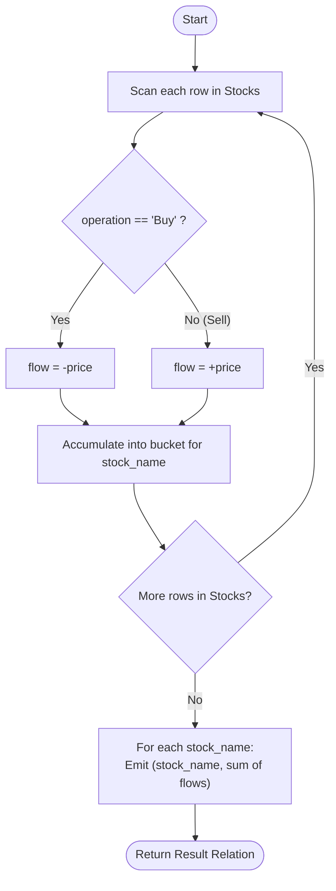

# Guided Example: Capital Gain/Loss

We trace the step-by-step execution of the signed cash-flow transformation and relational aggregation strategy on a representative database instance:

- **Input Table:** `Stocks`
  - `("Leetcode", "Buy", 1, 1000)`
  - `("Corona Masks", "Buy", 2, 10)`
  - `("Leetcode", "Sell", 5, 9000)`
  - `("Handbags", "Buy", 17, 30000)`
  - `("Corona Masks", "Sell", 3, 1010)`
  - `("Corona Masks", "Buy", 4, 1000)`
  - `("Corona Masks", "Sell", 5, 500)`
  - `("Corona Masks", "Buy", 6, 1000)`
  - `("Handbags", "Sell", 29, 7000)`
  - `("Corona Masks", "Sell", 10, 10000)`
- **Required Output:**
  - `("Corona Masks", 9500)`
  - `("Leetcode", 8000)`
  - `("Handbags", -23000)`

This instance is chosen because it demonstrates multiple buy-sell rounds for a single asset ("Corona Masks"), single transaction pairs yielding positive profit ("Leetcode"), and transactions resulting in a net negative capital loss ("Handbags").

---

## 1. Instance & Teaching Goal

We are given a relational entity `Stocks` with columns:
- `stock_name`: Identifier of the stock ticker.
- `operation`: Categorical enum with values `'Buy'` or `'Sell'`.
- `operation_day`: Integer transaction day.
- `price`: Transaction price per share.
Composite primary key: `(stock_name, operation_day)`.

It is guaranteed that every `'Sell'` operation for a stock has a corresponding `'Buy'` operation on an earlier day, and every `'Buy'` operation is eventually liquidated by a corresponding `'Sell'` on a subsequent day.

Our objective is to compute the net **Capital Gain or Loss** for each stock:
$$
\text{Capital Gain/Loss} = \sum \text{Sell Prices} - \sum \text{Buy Prices}
$$

For each asset:
- **Leetcode:** Bought on day $1$ for $1000$, sold on day $5$ for $9000 \implies 9000 - 1000 = 8000$.
- **Handbags:** Bought on day $17$ for $30000$, sold on day $29$ for $7000 \implies 7000 - 30000 = -23000$.
- **Corona Masks:** Bought for $10, 1000, 1000$ (total buy $= 2010$); sold for $1010, 500, 10000$ (total sell $= 11510$) $\implies 11510 - 2010 = 9500$.

The primary teaching goal is to model trading returns as signed cash flows: because addition is commutative and associative, transactions do not require stateful matching or chronological simulation. Each buy contributes $-\text{price}$ and each sell contributes $+\text{price}$.

---

## 2. Conceptual Foundation & Invariants

In financial accounting, net cash flow is computed by treating outflows as negative quantities and inflows as positive quantities.
Define a projection mapping each transaction tuple $t$ to a signed cash contribution:
$$
\text{flow}(t) = 
\begin{cases}
-t[\text{price}] & \text{if } t[\text{operation}] = \text{'Buy'} \\
+t[\text{price}] & \text{if } t[\text{operation}] = \text{'Sell'}
\end{cases}
$$

Because subtraction distributes over summation:
$$
\sum (\text{Sell Prices}) - \sum (\text{Buy Prices}) = \sum \text{flow}(t)
$$

```
Signed Cash Flow Mapping:
Transaction                  Operation   Sign   Price   Signed Flow
-------------------------------------------------------------------
("Leetcode", Day 1)          Buy         (-)    1000    -1000
("Leetcode", Day 5)          Sell        (+)    9000    +9000  --> Net: +8000
("Handbags", Day 17)         Buy         (-)    30000   -30000
("Handbags", Day 29)         Sell        (+)    7000    +7000  --> Net: -23000
```

In relational algebra, this transformation and grouping is formalized as:
$$
\mathcal{R} = \gamma_{\text{stock\_name}, \sum \text{flow} \to \text{capital\_gain\_loss}} (\text{Stocks})
$$

We define relational state tracking parameters:

| Parameter | Relational Representation | Purpose |
|---|---|---|
| Input Relation ($\text{Stocks}$) | Raw transaction tuples | Evaluated per row |
| Transformed Relation ($\text{Stocks}'$) | Tuples augmented with signed cash flow | Projects $\langle \text{stock\_name}, \text{flow} \rangle$ |
| Partition Groups | Subsets partitioned by `stock_name` | One bucket per distinct ticker |
| Group Aggregator ($\gamma$) | Sum of signed flows per partition | Emits $\langle \text{stock\_name}, \text{capital\_gain\_loss} \rangle$ |

> **Invariant.** The net capital gain/loss for any stock is strictly equal to the sum of all signed flows belonging to its partition, independent of the order in which transactions are evaluated.

---

## 3. Step-by-Step Worked Execution

### Step 1: Mapping Operations to Signed Flows

We evaluate each tuple in `Stocks` and assign its signed cash flow:

| Day | Stock Name | Operation | Price | Signed Cash Flow ($\text{flow}$) |
|---|---|---|---|---|
| $1$ | Leetcode | Buy | $1000$ | $-1000$ |
| $2$ | Corona Masks | Buy | $10$ | $-10$ |
| $3$ | Corona Masks | Sell | $1010$ | $+1010$ |
| $4$ | Corona Masks | Buy | $1000$ | $-1000$ |
| $5$ | Leetcode | Sell | $9000$ | $+9000$ |
| $5$ | Corona Masks | Sell | $500$ | $+500$ |
| $6$ | Corona Masks | Buy | $1000$ | $-1000$ |
| $10$ | Corona Masks | Sell | $10000$ | $+10000$ |
| $17$ | Handbags | Buy | $30000$ | $-30000$ |
| $29$ | Handbags | Sell | $7000$ | $+7000$ |

---

### Step 2: Partitioning and Aggregation by Stock

We accumulate signed flows for each distinct `stock_name`:

1. **Partition: `"Leetcode"`**
   - Transactions: Day $1$ ($-1000$), Day $5$ ($+9000$).
   - Sum: $(-1000) + 9000 = 8000$.
   - Emitted tuple: $\langle \text{"Leetcode"}, 8000 \rangle$.

2. **Partition: `"Handbags"`**
   - Transactions: Day $17$ ($-30000$), Day $29$ ($+7000$).
   - Sum: $(-30000) + 7000 = -23000$.
   - Emitted tuple: $\langle \text{"Handbags"}, -23000 \rangle$.

3. **Partition: `"Corona Masks"`**
   - Transactions:
     - Day $2$: $-10$
     - Day $3$: $+1010$
     - Day $4$: $-1000$
     - Day $5$: $+500$
     - Day $6$: $-1000$
     - Day $10$: $+10000$
   - Sum: $(-10) + 1010 + (-1000) + 500 + (-1000) + 10000 = 9500$.
   - Emitted tuple: $\langle \text{"Corona Masks"}, 9500 \rangle$.

---

## 4. Complete Execution Trace

| Stock Name | Buy Transactions (Negative Flow) | Sell Transactions (Positive Flow) | Net Signed Sum | Output Tuple |
|---|---|---|---|---|
| Leetcode | $-1000$ | $+9000$ | $+8000$ | `("Leetcode", 8000)` |
| Corona Masks | $-10 - 1000 - 1000 = -2010$ | $+1010 + 500 + 10000 = +11510$ | $+9500$ | `("Corona Masks", 9500)` |
| Handbags | $-30000$ | $+7000$ | $-23000$ | `("Handbags", -23000)` |

---

## 5. Algorithmic Correctness & Complexity Derivation

### Linearity of Summation Proof

Let $B_s$ be the set of buy transaction prices for stock $s$, and $S_s$ be the set of sell transaction prices for stock $s$.
By definition:
$$
\text{Gain}(s) = \sum_{p \in S_s} p - \sum_{q \in B_s} q
$$
By defining $f(op, price) = price$ when $op = \text{'Sell'}$ and $-price$ when $op = \text{'Buy'}$:
$$
\sum_{t \in \text{Transactions}(s)} f(t.op, t.price) = \sum_{t.op = \text{'Sell'}} t.price + \sum_{t.op = \text{'Buy'}} (-t.price) = \sum_{p \in S_s} p - \sum_{q \in B_s} q
$$
Because this algebraic identity holds identically for any arbitrary permutation of transactions, sequential FIFO matching is completely unnecessary. The result is globally exact.

### Asymptotic Complexity

- **Time Complexity:** $\mathcal{O}(N \log K)$ or $\mathcal{O}(N)$ where $N$ is the number of rows in `Stocks` and $K$ is the number of distinct stock names. Hashing or sorting by `stock_name` groups rows into partitions in linear or near-linear time.
- **Auxiliary Space Complexity:** $\mathcal{O}(K)$ to maintain aggregate accumulation registers for the $K$ distinct stocks.

---

## 6. Traps & Edge Cases

- **Negative Gain Representation:** Losses must be represented as negative integers (e.g., $-23000$), not absolute values or zero-clamped values.
- **Interleaved Transactions:** Multiple rounds of buying and selling for the same stock can occur on different days. Signed summation naturally handles arbitrary interleaved rounds without tracking inventory.
- **Day Ordering Irrelevance:** While transactions have `operation_day`, the final capital gain is commutative; sorting by date is not required to compute the net balance.
- **Zero Gain:** If buy prices exactly equal sell prices, the net gain evaluates to $0$.

---

## 7. Accessible Mermaid Diagram


