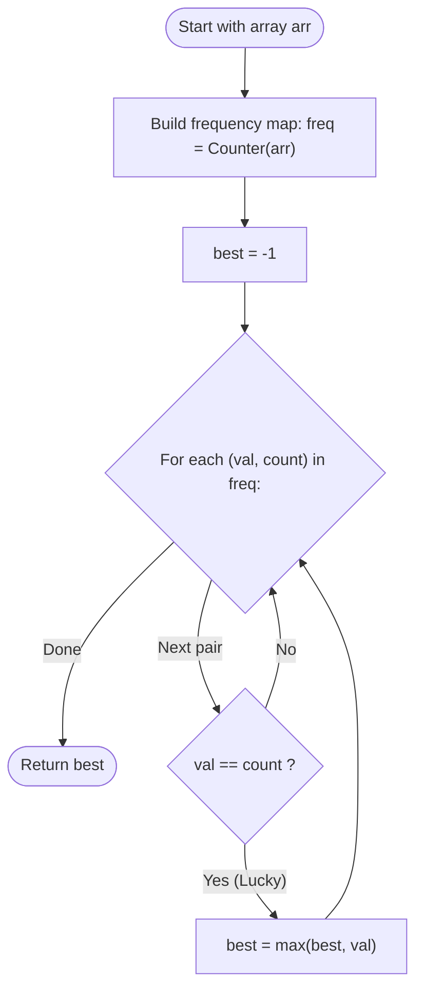

# Guided Example: Find Lucky Integer in an Array

We trace the step-by-step execution of frequency distribution counting and maximal key-value matching on a representative array instance:

- **Input:** `arr = [2, 2, 3, 4]`
- **Required output:** `2`

This instance is chosen because it contains a value matching its exact frequency ($2$ appearing $2$ times) alongside values that appear fewer times than their numeric magnitude ($3$ and $4$ appearing $1$ time each).

---

## 1. Instance & Teaching Goal

Given an integer array `arr`, a **lucky integer** is defined as an integer whose frequency in the array exactly equals its numerical value:

$$
\text{freq}(x) = x
$$

We must find the **largest** lucky integer present in the array. If no lucky integer exists, the function returns $-1$.

For `arr = [2, 2, 3, 4]`:
- Value $2$: Appears $2$ times. Since $\text{freq}(2) = 2$, $2$ is lucky!
- Value $3$: Appears $1$ time. $\text{freq}(3) = 1 \ne 3$, not lucky.
- Value $4$: Appears $1$ time. $\text{freq}(4) = 1 \ne 4$, not lucky.
- Lucky values: $\{2\}$. The maximum is $2$.

The primary teaching goal is to decouple frequency counting from candidate evaluation: tabulating frequencies in a single pass of size $n$, followed by evaluating distinct keys to find $\max \{ x \mid \text{freq}(x) = x \}$, avoiding repeated linear array scans.

---

## 2. Conceptual Foundation & Invariants

Let $f: \mathbb{Z} \to \mathbb{Z}_{\ge 0}$ represent the frequency map of elements in $arr$:
$$
f(x) = \sum_{i=0}^{n-1} [arr[i] = x]
$$
The set of all lucky integers $\mathcal{L}$ is:
$$
\mathcal{L} = \{ x \in \text{dom}(f) \mid f(x) = x \}
$$
The target answer is:
$$
\text{Answer} = 
\begin{cases}
\max(\mathcal{L}) & \text{if } \mathcal{L} \ne \emptyset \\
-1 & \text{if } \mathcal{L} = \emptyset
\end{cases}
$$

```
Frequency Table and Lucky Condition:
Value (x)      Occurrences (freq)   Condition (x == freq)   Status
-------------------------------------------------------------------
2              2                    2 == 2 (True)           LUCKY CANDIDATE: 2
3              1                    3 == 1 (False)          Rejected
4              1                    4 == 1 (False)          Rejected

Result: max({2}) = 2
```

We define state tracking parameters:

| Parameter | Mathematical Meaning | Initial Value |
|---|---|---|
| Frequency Map ($f$) | Mapping each distinct element to its count | $\emptyset$ |
| Candidate Value ($x$) | Key inspected from $\text{dom}(f)$ | Distinct array element |
| Lucky Integer Set ($\mathcal{L}$) | $\{ x \mid f(x) = x \}$ | $\emptyset$ |
| Maximum Lucky Value | $\max(\mathcal{L} \cup \{-1\})$ | $-1$ |

> **Invariant.** An integer $x$ qualifies as lucky if and only if its occurrence count in $f$ matches $x$ with exact mathematical equality; partial counts ($f(x) < x$ or $f(x) > x$) are disqualified.

---

## 3. Step-by-Step Worked Execution

### Step 1: Frequency Histogram Construction

Scan the input array $arr = [2, 2, 3, 4]$ sequentially from left to right:
- Index $0$: Encounter $2 \implies f(2) = 1$.
- Index $1$: Encounter $2 \implies f(2) = 2$.
- Index $2$: Encounter $3 \implies f(3) = 1$.
- Index $3$: Encounter $4 \implies f(4) = 1$.

Resulting frequency table:
$$
f = \{ 2 \mapsto 2, 3 \mapsto 1, 4 \mapsto 1 \}
$$

| Array Index ($i$) | Element $arr[i]$ | Updated Frequency Map |
|---|---|---|
| $0$ | $2$ | $\{2 \mapsto 1\}$ |
| $1$ | $2$ | $\{2 \mapsto 2\}$ |
| $2$ | $3$ | $\{2 \mapsto 2, 3 \mapsto 1\}$ |
| $3$ | $4$ | $\{2 \mapsto 2, 3 \mapsto 1, 4 \mapsto 1\}$ |

---

### Step 2: Evaluation of Distinct Candidates

We iterate through the distinct keys in $f$ and compare each key against its mapped frequency:

1. **Evaluate Key $x = 2$:**
   - Recorded frequency: $f(2) = 2$.
   - Test equality: Is $2 == 2$? **True**.
   - $2$ is lucky! Update best: $\max(-1, 2) = 2$.

2. **Evaluate Key $x = 3$:**
   - Recorded frequency: $f(3) = 1$.
   - Test equality: Is $3 == 1$? **False**.
   - Best remains $2$.

3. **Evaluate Key $x = 4$:**
   - Recorded frequency: $f(4) = 1$.
   - Test equality: Is $4 == 1$? **False**.
   - Best remains $2$.

Final result: $2$.

---

## 4. Complete Execution Trace

| Inspected Key ($x$) | Total Occurrences ($f(x)$) | Lucky Test: $x == f(x)$ | Lucky Member? | Running Best Lucky Integer |
|---|---|---|---|---|
| Initialization | - | - | - | $-1$ |
| $2$ | $2$ | $2 == 2$ (True) | Yes ($x = 2$) | **$2$** |
| $3$ | $1$ | $3 == 1$ (False) | No | $2$ |
| $4$ | $1$ | $4 == 1$ (False) | No | **$2$** |

---

## 5. Algorithmic Correctness & Complexity Derivation

### Correctness of Single-Pass Counting

Frequency counting partitions the multiset of $n$ elements into disjoint equivalence classes defined by equality of value.
- The frequency map $f$ computes the exact cardinality of each class.
- By checking $f(x) = x$ across all distinct classes $x \in \text{dom}(f)$, every candidate is evaluated against its true global frequency.
- Initializing the answer to $-1$ guarantees that if no key satisfies $f(x) = x$, $-1$ is correctly returned.
- Updating with $\max$ over all qualifying keys ensures the largest lucky integer is identified.

### Asymptotic Complexity

- **Time Complexity:** $\mathcal{O}(n)$, where $n = |arr|$. Building the frequency table takes $\mathcal{O}(n)$ time. Iterating through the distinct keys takes $\mathcal{O}(U)$ time, where $U \le \min(n, 500)$ is the number of distinct integers. Total time is $\mathcal{O}(n)$.
- **Auxiliary Space Complexity:** $\mathcal{O}(U) \le \mathcal{O}(n)$ to store the frequency dictionary.

---

## 6. Traps & Edge Cases

- **Strict Equality Requirement:** A value $x$ appearing more than $x$ times (e.g., $2$ appearing $3$ times) is **not** lucky; the equality must be exact.
- **No Lucky Integers:** If no element satisfies $f(x) = x$ (e.g., $arr = [2, 2, 2, 3, 3]$), the function must return $-1$.
- **Values Exceeding Array Length:** Any integer $x > n$ cannot possibly appear $x$ times in an array of size $n$, so such values can never be lucky.
- **Multiple Lucky Candidates:** If multiple integers qualify (e.g., in $[1, 2, 2, 3, 3, 3]$, where $1, 2, 3$ are all lucky), the algorithm must return the maximum among them ($3$).

---

## 7. Accessible Mermaid Diagram


