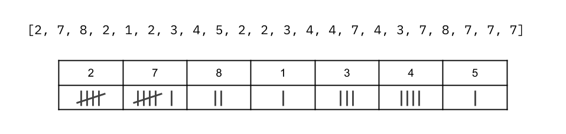

## Solution

---

### Approach 1: Brute Force

**Intuition**

The simplest approach is to iterate through each number in the input array. Then for each number, iterate over the array again to count how many times that number occurs to determine whether or not it's a *lucky number*. We'll also need to keep track of the largest *lucky number* we've seen so far.

```text
define function find_lucky(arr):
    largest_lucky_number = -1
    for each num in arr:
        occurances_of_num = count_occurances(arr, num)
        if occurances_of_num equal to num AND num is larger than largest_lucky_number:
            largest_lucky_number = num
    return largest_lucky_number

define function count_occurances(arr, candidate_num):
    count = 0
    for each num in arr:
        if num equal to candidate_num:
            count = count + 1
    return count
```

Many programming languages have a built-in function that we can use instead of the $\text{count}_{occurances}(...)$ function we've defined here. However, keep in mind that this operation will always be $O(n)$, regardless of whether you implemented it yourself or used a built-in function.

**Algorithm**

```python
def findLucky(self, arr: List[int]) -> int:
    max_lucky_number = -1
    for num in arr:
        # Note that arr.count(num) has a cost of $$O(n)$$.
        # It works the same as the algorithm we defined in pseudocode.
        occurences_of_num = arr.count(num)
        # If num is a lucky number, and is the biggest lucky number so far.
        if num == occurences_of_num and num > max_lucky_number:
            max_lucky_number = num
    return max_lucky_number
```

**Complexity Analysis**

Let $n$ be the the length of the input array.

- Time complexity : $O(n^2)$.

    For each of the $n$ numbers in the input array, we're counting how many times that number appears in the array. The count operation is $O(n)$, and so we get $n \cdot$\mathcal{O}(n)$= O(n^2)$.

- Space complexity : $O(1)$.

    This approach only uses a constant number of variables to keep track of where we're up to. Therefore, it has a $O(1)$ space complexity.

<br/>

---

### Approach 2: Sorting

**Intuition**

The crux of this problem is counting how many times each number occurs, so that we can then determine whether or not a particular number is lucky. It would be easier to do this if the array was sorted. So, how about we just sort the array and then go from there?

For example, if the input array was as follows:

```py
[2, 7, 8, 2, 1, 2, 3, 4, 5, 2, 2, 3, 4, 4, 7, 4, 3, 7, 8, 7, 7, 7]
```

After sorting, we would have the following:

```py
[1, 2, 2, 2, 2, 2, 3, 3, 3, 4, 4, 4, 4, 5, 7, 7, 7, 7, 7, 7, 8, 8]
```

From here, we can now search for the largest lucky number in a single pass of the array. We need to step through the array, keeping track of the length of the current streak. Once we're on the last number of the current streak, we should check whether or not that number is lucky.

To avoid needing to keep track of the largest lucky number seen, we should work from right-to-left (largest to smallest), as then when we encounter a lucky number, we know it's the largest that could possibly be in the array. Even better, we could reverse-sort instead of forward-sort. The best option will depend on which programming language you're using.

```text
define function findLucky(arr):
    sort arr from largest to smallest
    current_streak = 0
    for each num in arr:
        current_streak = current_streak + 1
        if the next number in arr is different from num:
            if num equal to current_streak:
                return num
            current_streak = 0
    return -1
```

In practice, this approach will perform well, especially for a short input array length.

**Algorithm**

```python
def findLucky(self, arr: List[int]) -> int:
    arr.sort(reverse=True)
    current_streak = 0
    for i in range(len(arr)):
        current_streak += 1
        # If this is the last element in the current streak (as the next is
        # different, or we're at the end of the array).
        if i == len(arr) - 1 or arr[i] != arr[i + 1]:
            # If this is a lucky number
            if arr[i] == current_streak:
                return arr[i]
            current_streak = 0
    return -1
```

For those who are familiar with the `Heap` data-structure, there is a neat variant of this approach that will have the same time complexity, but a $O(1)$ space complexity. Here is that approach in Python. This could be done in other languages, but you'd need to confirm the "heapify" functionality really is $O(1)$ space, or implement heapify yourself.

```python
import heapq

def findLucky(self, arr: List[int]) -> int:

    # Convert all numbers to negative, as we want a max-heap.
    for i in range(len(arr)): arr[i] *= -1
    heapq.heapify(arr)

    current_streak = 0
    current_number = -1

    while arr:
        # Convert num back to positive.
        num = -heapq.heappop(arr)
        if num == current_number:
            current_streak += 1
        else:
            # Before setting current_number and current_streak to the new num,
            # we should check if the old streak represented a lucky number.
            if current_number == current_streak:
                return current_streak
            current_number = num
            current_streak = 1

    # Check if the last number was a lucky number.
    if current_number == current_streak:
        return current_streak

    # Otherwise, no lucky numbers were found.
    return -1
```

**Complexity Analysis**

- Time complexity : $O(n \, \log \, n)$.

    This approach was split into 2 parts; sorting the array, and then searching for the largest lucky number in the sorted array.

    Sorting an array using a built-in sorting algorithm requires $O(n \, \log \, n)$ time.

    Searching for the largest lucky number in the sorted array requires stepping through each of the $n$ elements in the array. Therefore, the cost of this part is $O(n)$.

    In big-oh notation, we drop insignificant added parts from the time complexity. Seeing as we know $O(n \, \log \, n)$ will always be larger than $O(n)$, we get a final time complexity of $O(n + n \, \log \, n) = O(n \, \log \, n)$.

- Space complexity : Varies from $O(n)$ to $O(1)$, depending on sorting implementation.

    Most programming languages use a built-in sorting algorithm that requires $O(n)$ auxillary space. A few are $O(\log \, n)$ or even $O(1)$, but these seem to be the minority from what I've read.

    Searching for the largest lucky number in the sorted array requires only $O(1)$ additional space, and so can be ignored.

    The `Heap` variant of this approach has an $O(1)$ space complexity. Heapify requires only $O(1)$ extra space, as does removing and processing items from the heap.

<br/>

---

### Approach 3: Counter

**Intuition**

If you were finding the largest lucky number of an array by hand, you would probably just make a tally chart.



We can do this in code, using a `HashMap` where the keys are the unique integers in the array, and the values are how many times each appeared. This is a very common usage for a `HashMap` in the programming interview world. Some programming languages have a special `HashMap` data structure specifically for this purpose, although Java does not. In the languages that have it, it might be called a `Counter`, `Bag`, or `MultiSet`.

Here is some pseudocode for making the `HashMap` of `counts.`

```text
counts = a new HashMap (number -> count)
for each num in arr:
    if num is not in counts:
        counts.put(num, 1)
    else:
        counts.put(num, counts.get(num) + 1)
```

This code can be written more concisely in Java, using the `getOrDefault(...)` method of `Map`. See the Algorithm section for details on how this works (and see how awesome it is!).

The rest of the code is straightforward; we simply need to check each key/ value entry in `counts`, and if they are equal, then we know that we've found a lucky number. We don't know whether or not it's the largest one though, because `HashMap` keys are *not sorted*. Therefore, we'll need to use the pattern we used in Approach 1 of keeping track of the largest we've seen so far, until we get to the end.

```text
largest_lucky_number = -1
for each number, count in counts.entries():
    if number equal to count AND number is larger than largest_lucky_number:
        largest_lucky_number = number
return largest_lucky_number
```

**Algorithm**

```python
def findLucky(self, arr: List[int]) -> int:
    # We can simply pass the input array into the Counter constructor,
    # and it will convert it into a dictionary of num -> count.
    counts = collections.Counter(arr)
    largest_lucky_number = -1
    # Check each num -> count pair in the dictionary.
    for num, count in counts.items():
        # If this is a lucky number
        if num == count:
            # Keep the largest out of this lucky number and our current largest.
            largest_lucky_number = max(largest_lucky_number, num)
    return largest_lucky_number
```

**Complexity Analysis**

- Time complexity : $O(n)$.

    There are two steps to this approach; building a `HashMap` of counts, and looking through the `HashMap` for the largest lucky number.

    Inserting an item into a `HashMap` has a cost of $O(1)$. Therefore, inserting the $n$ items into the `HashMap` has a cost of $n \cdot$\mathcal{O}(1)$= O(n)$.

    Iterating over all the entries in a `HashMap` has a cost of $O(m)$, where $m$ is the number of entries in the `HashMap`. In the worst case, $m = n$ (all numbers were unique), and therefore the cost of this is $O(n)$.

    We get a final time complexity of $O(n) +$\mathcal{O}(n)$= O(n)$.

- Space complexity : $O(n)$.

    In the worst case, all numbers in the `HashMap` are unique, and therefore it will take $O(n)$ space to store it.

Approach 2 and Approach 3 are both good approaches in practice, each with its own pros and cons.

<br/>