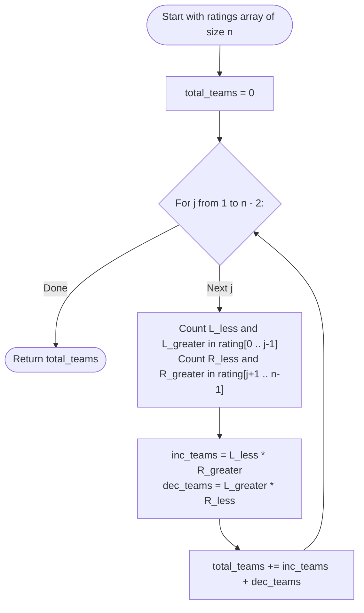

# Guided Example: Count Number of Teams

We trace the step-by-step execution of the middle-element pivot enumeration strategy on a representative array instance:

- **Input:** `rating = [2, 5, 3, 4, 1]`
- **Required output:** `3`

This instance is chosen because it produces both strictly increasing teams ($(2, 3, 4)$) and strictly decreasing teams ($(5, 3, 1)$ and $(5, 4, 1)$), demonstrating the combinatorial multiplication of left and right comparative counts around each middle pivot.

---

## 1. Instance & Teaching Goal

We are given an array `rating` of $n$ distinct integers representing soldier ratings. A valid team consists of three soldiers at indices $(i, j, k)$ with $0 \le i < j < k < n$ such that their ratings are either:
1. **Strictly Increasing:** $rating[i] < rating[j] < rating[k]$
2. **Strictly Decreasing:** $rating[i] > rating[j] > rating[k]$

We must return the total number of valid teams that can be formed.

For `rating = [2, 5, 3, 4, 1]`:
- Team 1: $(rating[0], rating[2], rating[3]) = (2, 3, 4)$, increasing ($2 < 3 < 4$).
- Team 2: $(rating[1], rating[2], rating[4]) = (5, 3, 1)$, decreasing ($5 > 3 > 1$).
- Team 3: $(rating[1], rating[3], rating[4]) = (5, 4, 1)$, decreasing ($5 > 4 > 1$).
- Total valid teams: $3$.

A naive brute-force approach enumerates all $\binom{n}{3} = \mathcal{O}(n^3)$ triplets.
The primary teaching goal is to recognize that fixing the **middle element** $j$ decouples the choices of the first element $i$ ($i < j$) and the third element $k$ ($k > j$): by the fundamental counting principle (Rule of Product), the number of valid triplets centered at $j$ is $(L_{\text{less}} \times R_{\text{greater}}) + (L_{\text{greater}} \times R_{\text{less}})$.

---

## 2. Conceptual Foundation & Invariants

Fix a middle soldier at index $j$ ($0 < j < n - 1$) with rating $v = rating[j]$:
- To the left ($i < j$):
  - Let $L_{\text{less}}$ be the count of elements with $rating[i] < v$.
  - Let $L_{\text{greater}}$ be the count of elements with $rating[i] > v$.
- To the right ($k > j$):
  - Let $R_{\text{less}}$ be the count of elements with $rating[k] < v$.
  - Let $R_{\text{greater}}$ be the count of elements with $rating[k] > v$.

By independence:
- Any pair of $(i, k)$ where $rating[i] < v < rating[k]$ forms an increasing team. There are $L_{\text{less}} \times R_{\text{greater}}$ such pairs.
- Any pair of $(i, k)$ where $rating[i] > v > rating[k]$ forms a decreasing team. There are $L_{\text{greater}} \times R_{\text{less}}$ such pairs.

$$
\text{Teams}(j) = (L_{\text{less}} \times R_{\text{greater}}) + (L_{\text{greater}} \times R_{\text{less}})
$$
$$
\text{Total Teams} = \sum_{j=1}^{n-2} \text{Teams}(j)
$$

```
Middle Pivot Decoupling at j = 2 (rating[2] = 3):
Left side [2, 5]:       L_less = 1 (2),  L_greater = 1 (5)
Middle element:         3
Right side [4, 1]:      R_less = 1 (1),  R_greater = 1 (4)

Increasing teams: L_less * R_greater = 1 * 1 = 1  --> (2, 3, 4)
Decreasing teams: L_greater * R_less = 1 * 1 = 1  --> (5, 3, 1)
Subtotal for pivot 3: 1 + 1 = 2 teams
```

We define state tracking parameters:

| Parameter | Mathematical Meaning | Initial Value |
|---|---|---|
| Middle Pivot ($j$) | Index of candidate central soldier | $1$ |
| Left Counts | $(L_{\text{less}}, L_{\text{greater}})$ among indices $0 \dots j-1$ | Evaluated per pivot |
| Right Counts | $(R_{\text{less}}, R_{\text{greater}})$ among indices $j+1 \dots n-1$ | Evaluated per pivot |
| Cumulative Teams | Sum of valid triplets across all pivots | $0$ |

> **Invariant.** For each index $j$, every triplet counted by $\text{Teams}(j)$ has index $j$ as its middle element. Because every triplet has a unique middle element, summing over all $j$ counts each valid triplet exactly once with zero double-counting.

---

## 3. Step-by-Step Worked Execution

We scan middle indices $j \in \{1, 2, 3\}$ for `rating = [2, 5, 3, 4, 1]`:

### Step 1: Pivot $j = 1$ ($rating[1] = 5$)

- Left partition: $i \in \{0\} \implies [2]$.
  - $2 < 5 \implies L_{\text{less}} = 1$.
  - $L_{\text{greater}} = 0$.
- Right partition: $k \in \{2, 3, 4\} \implies [3, 4, 1]$.
  - Elements $< 5$: $\{3, 4, 1\} \implies R_{\text{less}} = 3$.
  - Elements $> 5$: None $\implies R_{\text{greater}} = 0$.
- Formed teams:
  - Increasing: $L_{\text{less}} \times R_{\text{greater}} = 1 \times 0 = 0$.
  - Decreasing: $L_{\text{greater}} \times R_{\text{less}} = 0 \times 3 = 0$.
  - Subtotal for $j = 1$: $0$.

| Pivot ($j$) | Rating | Left Partition | Left Counts | Right Partition | Right Counts | Formed Teams |
|---|---|---|---|---|---|---|
| $1$ | $5$ | $[2]$ | $L_{<} = 1, L_{>} = 0$ | $[3, 4, 1]$ | $R_{<} = 3, R_{>} = 0$ | $1(0) + 0(3) = 0$ |

---

### Step 2: Pivot $j = 2$ ($rating[2] = 3$)

- Left partition: $i \in \{0, 1\} \implies [2, 5]$.
  - Elements $< 3$: $\{2\} \implies L_{\text{less}} = 1$.
  - Elements $> 3$: $\{5\} \implies L_{\text{greater}} = 1$.
- Right partition: $k \in \{3, 4\} \implies [4, 1]$.
  - Elements $< 3$: $\{1\} \implies R_{\text{less}} = 1$.
  - Elements $> 3$: $\{4\} \implies R_{\text{greater}} = 1$.
- Formed teams:
  - Increasing: $L_{\text{less}} \times R_{\text{greater}} = 1 \times 1 = 1$ (Triplet: $(2, 3, 4)$).
  - Decreasing: $L_{\text{greater}} \times R_{\text{less}} = 1 \times 1 = 1$ (Triplet: $(5, 3, 1)$).
  - Subtotal for $j = 2$: $1 + 1 = 2$.
  - Cumulative total: $0 + 2 = 2$.

| Pivot ($j$) | Rating | Left Partition | Left Counts | Right Partition | Right Counts | Formed Teams |
|---|---|---|---|---|---|---|
| $2$ | $3$ | $[2, 5]$ | $L_{<} = 1, L_{>} = 1$ | $[4, 1]$ | $R_{<} = 1, R_{>} = 1$ | $1(1) + 1(1) = 2$ |

---

### Step 3: Pivot $j = 3$ ($rating[3] = 4$)

- Left partition: $i \in \{0, 1, 2\} \implies [2, 5, 3]$.
  - Elements $< 4$: $\{2, 3\} \implies L_{\text{less}} = 2$.
  - Elements $> 4$: $\{5\} \implies L_{\text{greater}} = 1$.
- Right partition: $k \in \{4\} \implies [1]$.
  - Elements $< 4$: $\{1\} \implies R_{\text{less}} = 1$.
  - Elements $> 4$: None $\implies R_{\text{greater}} = 0$.
- Formed teams:
  - Increasing: $L_{\text{less}} \times R_{\text{greater}} = 2 \times 0 = 0$.
  - Decreasing: $L_{\text{greater}} \times R_{\text{less}} = 1 \times 1 = 1$ (Triplet: $(5, 4, 1)$).
  - Subtotal for $j = 3$: $0 + 1 = 1$.
  - Cumulative total: $2 + 1 = 3$.

| Pivot ($j$) | Rating | Left Partition | Left Counts | Right Partition | Right Counts | Formed Teams |
|---|---|---|---|---|---|---|
| $3$ | $4$ | $[2, 5, 3]$ | $L_{<} = 2, L_{>} = 1$ | $[1]$ | $R_{<} = 1, R_{>} = 0$ | $2(0) + 1(1) = 1$ |

---

## 4. Complete Execution Trace

| Pivot Index ($j$) | Pivot Value | $(L_{\text{less}}, L_{\text{greater}})$ | $(R_{\text{less}}, R_{\text{greater}})$ | Increasing Teams | Decreasing Teams | Pivot Contribution | Running Sum |
|---|---|---|---|---|---|---|---|
| $1$ | $5$ | $(1, 0)$ | $(3, 0)$ | $0$ | $0$ | $0$ | $0$ |
| $2$ | $3$ | $(1, 1)$ | $(1, 1)$ | $1$ | $1$ | $2$ | $2$ |
| $3$ | $4$ | $(2, 1)$ | $(1, 0)$ | $0$ | $1$ | $1$ | **$3$** |

---

## 5. Algorithmic Correctness & Complexity Derivation

### Disjoint Union and Counting Principle

Every valid triplet $(i, j, k)$ has three distinct indices satisfying $i < j < k$.
- The middle index $j$ is uniquely determined for each triplet.
- Thus, the set of all valid triplets is the disjoint union of valid triplets partitioned by their middle index:
  $$
  \mathcal{T} = \bigcup_{j=1}^{n-2} \mathcal{T}_j \quad \text{where} \quad \mathcal{T}_a \cap \mathcal{T}_b = \emptyset \text{ for } a \ne b
  $$
- For any fixed $j$, choosing an element $i < j$ and choosing an element $k > j$ are completely independent choices. By the Rule of Product, the number of valid monotonic pairs $(i, k)$ equals the product of the branch counts.
- Summing over all $j \in \{1, \dots, n-2\}$ computes $|\mathcal{T}|$ with mathematical precision.

### Asymptotic Complexity

- **Time Complexity:** $\mathcal{O}(n^2)$. There are $n - 2$ candidate pivots. For each pivot $j$, scanning the left prefix takes $\mathcal{O}(j)$ operations and scanning the right suffix takes $\mathcal{O}(n - j)$ operations, requiring $\mathcal{O}(n)$ time per pivot. Total time is $\sum_{j=1}^{n-2} n = \mathcal{O}(n^2)$. (With a Binary Indexed Tree / Fenwick tree, this can be optimized to $\mathcal{O}(n \log M)$). For $n \le 1000$, $\mathcal{O}(n^2)$ performs $\approx 10^6$ basic operations, executing in under $0.05$ seconds.
- **Auxiliary Space Complexity:** $\mathcal{O}(1)$. The algorithm requires only scalar counters for $L$ and $R$.

---

## 6. Traps & Edge Cases

- **Strict Inequalities:** Triplet ratings must be strictly monotonic ($rating[i] < rating[j] < rating[k]$ or $rating[i] > rating[j] > rating[k]$). Equal values would violate the condition, though the problem guarantees all ratings are distinct.
- **Boundary Index Pivots:** The middle soldier cannot be at index $0$ (no soldiers to the left) or index $n - 1$ (no soldiers to the right). The pivot loop must restrict $j \in [1, n - 2]$.
- **Short Arrays ($n < 3$):** If the line contains fewer than $3$ soldiers, zero teams can be formed, correctly returning $0$.
- **Complementary Relations:** Because all ratings are distinct, $L_{\text{greater}} = j - L_{\text{less}}$ and $R_{\text{greater}} = (n - 1 - j) - R_{\text{less}}$, simplifying the computation.

---

## 7. Accessible Mermaid Diagram

