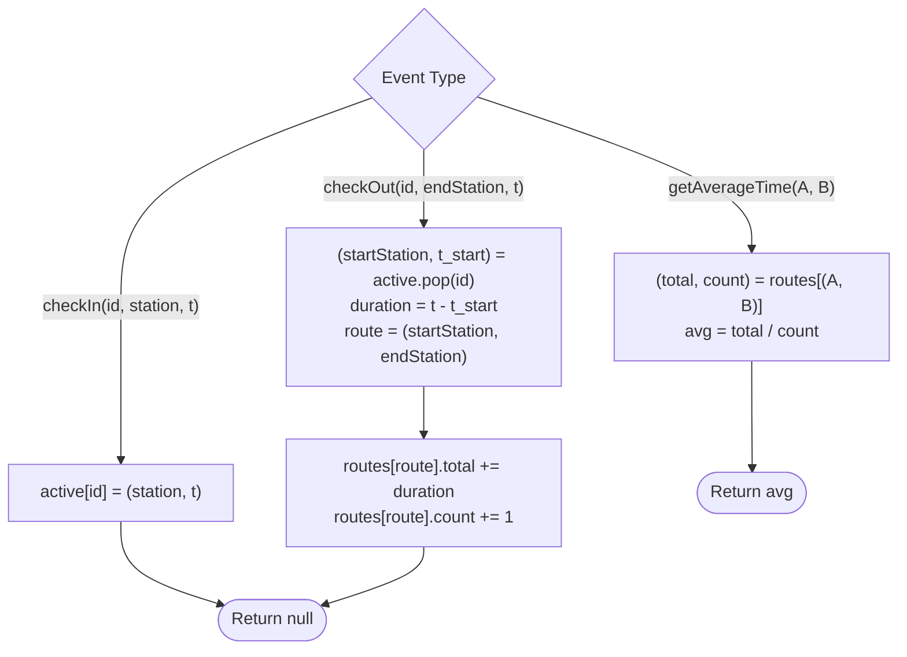

# Guided Example: Design Underground System

We trace the step-by-step execution of the dual hash map event-stream tracking strategy on a representative problem instance:

- **Input Operations:**
  1. `checkIn(45, "Leyton", 3)`
  2. `checkIn(32, "Paradise", 8)`
  3. `checkIn(27, "Leyton", 10)`
  4. `checkOut(45, "Waterloo", 15)`
  5. `checkOut(27, "Waterloo", 20)`
  6. `checkOut(32, "Cambridge", 22)`
  7. `getAverageTime("Paradise", "Cambridge")`
  8. `getAverageTime("Leyton", "Waterloo")`
- **Required outputs:** `[null, null, null, null, null, null, 14.0, 11.0]`

This instance is chosen because it demonstrates concurrent customer trips with interleaved check-ins and check-outs, distinct destination stations, and running average aggregation over multiple trips along the same route.

---

## 1. Instance & Teaching Goal

We must design an underground transit tracking system that records passenger journeys between stations and computes the average travel time between any directed station pair:
1. `checkIn(id, stationName, t)`: Customer with ID `id` enters `stationName` at time `t`.
2. `checkOut(id, stationName, t)`: Customer with ID `id` exits `stationName` at time `t`.
3. `getAverageTime(startStation, endStation)`: Returns the average travel duration across all completed direct journeys from `startStation` to `endStation`.

For the sequence of operations:
- Customer 45: "Leyton" at $t=3 \to$ "Waterloo" at $t=15$ (Duration $= 15 - 3 = 12$).
- Customer 27: "Leyton" at $t=10 \to$ "Waterloo" at $t=20$ (Duration $= 20 - 10 = 10$).
- Customer 32: "Paradise" at $t=8 \to$ "Cambridge" at $t=22$ (Duration $= 22 - 8 = 14$).
- Route ("Paradise", "Cambridge"): $1$ trip of duration $14 \implies \text{Average} = 14.0$.
- Route ("Leyton", "Waterloo"): $2$ trips of durations $12$ and $10 \implies \text{Average} = (12 + 10) / 2 = 11.0$.

A naive approach might record full transaction logs, traversing all completed trips on every `getAverageTime` call, which would scale linearly with the number of trips.
The primary teaching goal is to use **two decoupled hash maps**: one tracking active in-flight passengers ($id \mapsto (station, t)$) and another maintaining running cumulative statistics for each directed route ($route \mapsto (sum, count)$), achieving strict $\mathcal{O}(1)$ time per operation.

---

## 2. Conceptual Foundation & Invariants

We separate transit state into two distinct lifecycle domains:

1. **Active Journeys Map ($\mathcal{M}_{\text{active}}$):**
   $$
   id \mapsto \langle \text{startStation}, t_{\text{start}} \rangle
   $$
   Stores the entry point for customers currently inside the transit network.

2. **Completed Route Aggregates ($\mathcal{M}_{\text{routes}}$):**
   $$
   \langle \text{startStation}, \text{endStation} \rangle \mapsto \langle \text{totalDuration}, \text{tripCount} \rangle
   $$
   Maintains the cumulative sum of travel times and the total count of completed journeys for each directed station pair.

```
State Architecture and Lifecycle:
checkIn(id, A, t1)       -->  M_active[id] = (A, t1)
                                      |
checkOut(id, B, t2)      -->  duration = t2 - t1
                               Remove M_active[id]
                               Update M_routes[(A, B)]:
                                 totalDuration += duration
                                 tripCount += 1
                                      |
getAverageTime(A, B)     -->  Return totalDuration / tripCount
```

When a customer checks out at $(B, t_2)$:
- Retrieve and remove $\langle A, t_1 \rangle = \mathcal{M}_{\text{active}}[id]$.
- Duration $\Delta t = t_2 - t_1$.
- Route key is the directed pair $\langle A, B \rangle$.
- Increment: $\text{totalDuration} \leftarrow \text{totalDuration} + \Delta t$, $\text{tripCount} \leftarrow \text{tripCount} + 1$.

When querying average time:
$$
\text{Avg}(A, B) = \frac{\mathcal{M}_{\text{routes}}[\langle A, B \rangle].\text{totalDuration}}{\mathcal{M}_{\text{routes}}[\langle A, B \rangle].\text{tripCount}}
$$

We define state tracking parameters:

| Parameter | Mathematical Meaning | Initial State |
|---|---|---|
| In-Flight Table ($\mathcal{M}_{\text{active}}$) | Customer ID $\mapsto$ Entry station and timestamp | $\emptyset$ |
| Route Summary Table ($\mathcal{M}_{\text{routes}}$) | $(A, B) \mapsto (\Sigma \Delta t, N)$ | $\emptyset$ |
| Active Customer ID | Integer identifier of passenger | Provided in call |
| Directed Route Pair | Ordered tuple $\langle \text{start}, \text{end} \rangle$ | Extracted at checkout |

> **Invariant.** For every directed station pair $\langle A, B \rangle$, $\mathcal{M}_{\text{routes}}[\langle A, B \rangle]$ stores the exact sum and count of all journeys originating at $A$ and terminating at $B$ that have completed so far.

---

## 3. Step-by-Step Worked Execution

### Steps 1–3: Concurrent Check-Ins

- **Step 1 (`checkIn(45, "Leyton", 3)`):**
  - Record: $\mathcal{M}_{\text{active}}[45] = \langle \text{"Leyton"}, 3 \rangle$.
- **Step 2 (`checkIn(32, "Paradise", 8)`):**
  - Record: $\mathcal{M}_{\text{active}}[32] = \langle \text{"Paradise"}, 8 \rangle$.
- **Step 3 (`checkIn(27, "Leyton", 10)`):**
  - Record: $\mathcal{M}_{\text{active}}[27] = \langle \text{"Leyton"}, 10 \rangle$.

| Step | Call | Customer ID | Assigned Entry | Active Table State ($\mathcal{M}_{\text{active}}$) |
|---|---|---|---|---|
| $1$ | `checkIn` | $45$ | ("Leyton", 3) | $\{45 \mapsto (\text{"Leyton"}, 3)\}$ |
| $2$ | `checkIn` | $32$ | ("Paradise", 8) | $\{45 \mapsto (\text{"Leyton"}, 3), 32 \mapsto (\text{"Paradise"}, 8)\}$ |
| $3$ | `checkIn` | $27$ | ("Leyton", 10) | $\{45 \mapsto (\text{L}, 3), 32 \mapsto (\text{P}, 8), 27 \mapsto (\text{L}, 10)\}$ |

---

### Steps 4–6: Check-Outs and Summary Updates

- **Step 4 (`checkOut(45, "Waterloo", 15)`):**
  - Retrieve and remove ID $45$: Entry was ("Leyton", $3$).
  - Elapsed duration: $15 - 3 = 12$.
  - Route: ("Leyton", "Waterloo").
  - Update route summary: $\text{total} = 12, \text{count} = 1$.
- **Step 5 (`checkOut(27, "Waterloo", 20)`):**
  - Retrieve and remove ID $27$: Entry was ("Leyton", $10$).
  - Elapsed duration: $20 - 10 = 10$.
  - Route: ("Leyton", "Waterloo").
  - Update route summary: $\text{total} = 12 + 10 = 22, \text{count} = 1 + 1 = 2$.
- **Step 6 (`checkOut(32, "Cambridge", 22)`):**
  - Retrieve and remove ID $32$: Entry was ("Paradise", $8$).
  - Elapsed duration: $22 - 8 = 14$.
  - Route: ("Paradise", "Cambridge").
  - Update route summary: $\text{total} = 14, \text{count} = 1$.

| Step | Call | Customer ID | Exit Station & Time | Trip Duration | Route Aggregate Updated |
|---|---|---|---|---|---|
| $4$ | `checkOut` | $45$ | ("Waterloo", 15) | $15 - 3 = 12$ | ("Leyton", "Waterloo") $\mapsto (12, 1)$ |
| $5$ | `checkOut` | $27$ | ("Waterloo", 20) | $20 - 10 = 10$ | ("Leyton", "Waterloo") $\mapsto (22, 2)$ |
| $6$ | `checkOut` | $32$ | ("Cambridge", 22) | $22 - 8 = 14$ | ("Paradise", "Cambridge") $\mapsto (14, 1)$ |

---

### Steps 7–8: Average Time Queries

- **Step 7 (`getAverageTime("Paradise", "Cambridge")`):**
  - Query route ("Paradise", "Cambridge").
  - Aggregate statistics: $\text{total} = 14, \text{count} = 1$.
  - Compute: $14 / 1 = 14.0$.
- **Step 8 (`getAverageTime("Leyton", "Waterloo")`):**
  - Query route ("Leyton", "Waterloo").
  - Aggregate statistics: $\text{total} = 22, \text{count} = 2$.
  - Compute: $22 / 2 = 11.0$.

---

## 4. Complete Execution Trace

| Call Index | Invocation | Route / Customer | Duration Added | Route State $(\Sigma \Delta t, N)$ | Emitted Value |
|---|---|---|---|---|---|
| $1$ | `checkIn(45, "Leyton", 3)` | Customer $45$ | In-flight | - | `null` |
| $2$ | `checkIn(32, "Paradise", 8)` | Customer $32$ | In-flight | - | `null` |
| $3$ | `checkIn(27, "Leyton", 10)` | Customer $27$ | In-flight | - | `null` |
| $4$ | `checkOut(45, "Waterloo", 15)` | Leyton $\to$ Waterloo | $12$ | $(12, 1)$ | `null` |
| $5$ | `checkOut(27, "Waterloo", 20)` | Leyton $\to$ Waterloo | $10$ | $(22, 2)$ | `null` |
| $6$ | `checkOut(32, "Cambridge", 22)` | Paradise $\to$ Cambridge | $14$ | $(14, 1)$ | `null` |
| $7$ | `getAverageTime("Paradise", "Cambridge")` | Paradise $\to$ Cambridge | - | $(14, 1)$ | **$14.0$** |
| $8$ | `getAverageTime("Leyton", "Waterloo")` | Leyton $\to$ Waterloo | - | $(22, 2)$ | **$11.0$** |

---

## 5. Algorithmic Correctness & Complexity Derivation

### Statistical Aggregation Optimality

The arithmetic mean of $N$ durations $t_1, \dots, t_N$ is:
$$
\mu = \frac{1}{N} \sum_{i=1}^N t_i
$$
Storing the running sum $S_N = \sum_{i=1}^N t_i$ and count $N$:
- When a new observation $t_{N+1}$ arrives: $S_{N+1} = S_N + t_{N+1}$ and count becomes $N + 1$.
- Both updates require $\mathcal{O}(1)$ arithmetic operations.
- The average $\mu = S_N / N$ is calculated on demand in $\mathcal{O}(1)$ division time without iterating over past journeys.
- Thus, query time remains strictly constant regardless of how many millions of trips have occurred.

### Asymptotic Complexity

- **Time Complexity:**
  - `checkIn`: $\mathcal{O}(1)$ hash map insertion.
  - `checkOut`: $\mathcal{O}(1)$ hash map lookup, deletion, and running sum addition.
  - `getAverageTime`: $\mathcal{O}(1)$ hash map lookup and scalar division.
- **Auxiliary Space Complexity:** $\mathcal{O}(P + R)$, where $P$ is the maximum number of concurrent in-flight passengers and $R$ is the number of distinct directed station pairs recorded.

---

## 6. Traps & Edge Cases

- **Directed Route Asymmetry:** Travel from $A$ to $B$ is distinct from travel from $B$ to $A$. The route key must be an ordered pair $(A, B)$, not an unordered set $\{A, B\}$.
- **Customer ID Reuse:** A customer can take multiple trips over time. Deleting the passenger's entry from $\mathcal{M}_{\text{active}}$ upon checkout allows that same `id` to check in again later without state collisions.
- **Floating-Point Precision:** Average time returns a double/float. Calculations should use standard floating-point division.
- **Valid Call Sequences:** The problem guarantees consistent calls: a customer checks in before checking out, and `getAverageTime` is only queried for routes with at least one completed trip.

---

## 7. Accessible Mermaid Diagram


