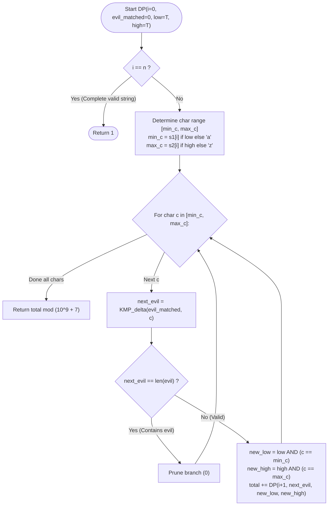

# Guided Example: Find All Good Strings

We trace the step-by-step execution of the digit-style dynamic programming and KMP string matching automaton on a representative problem instance:

- **Input:** `n = 2`, `s1 = "aa"`, `s2 = "da"`, `evil = "b"`
- **Required output:** `51`

This instance is chosen because it demonstrates tight lower and upper lexicographical bounds spanning multiple leading characters ($'a'$ through $'d'$), combined with state elimination when an evil pattern of length $1$ is encountered.

---

## 1. Instance & Teaching Goal

Given two strings `s1` and `s2` of length $n$ with $s1 \le s2$, and a forbidden string `evil`, a string $S$ is called **good** if:
1. $|S| = n$
2. $S$ is lexicographically between `s1` and `s2` inclusive: $s1 \le S \le s2$.
3. `evil` does **not** appear as a substring in $S$.

We must return the total number of good strings modulo $10^9 + 7$.

For $n = 2$, $s1 = \text{"aa"}$, $s2 = \text{"da"}$, and $evil = \text{"b"}$:
- The lexicographic interval spans from `"aa"` to `"da"`:
  - Strings starting with `'a'`: `"aa"` through `"az"` ($26$ strings). Excluding `"ab"` leaves $25$ valid strings.
  - Strings starting with `'b'`: Every string `"ba" \dots "bz"` contains evil substring `"b"` ($0$ valid).
  - Strings starting with `'c'`: `"ca"` through `"cz"` ($26$ strings). Excluding `"cb"` leaves $25$ valid strings.
  - Strings starting with `'d'`: Restricted by upper bound $s2$ to `"da"` ($1$ string). Does not contain `"b"` ($1$ valid).
- Total good strings: $25 + 0 + 25 + 1 = 51$.

The primary teaching goal is to combine **digit DP** (tracking tight lexicographic upper and lower boundary flags) with a **KMP string matching automaton** (tracking the longest prefix of `evil` matched by the suffix of the current prefix), pruning any branch where the evil pattern fully matches.

---

## 2. Conceptual Foundation & Invariants

Let $m = |evil|$. We construct the KMP failure table $\pi$ over `evil`.
For any prefix match length $k \in \{0, \dots, m - 1\}$ and candidate character $c \in \{'a', \dots, 'z'\}$, the KMP automaton transition $\delta(k, c)$ returns the new length of the longest prefix of `evil` matching the current suffix:
$$
\delta(k, c) = 
\begin{cases}
k + 1 & \text{if } evil[k] = c \\
\delta(\pi[k - 1], c) & \text{if } evil[k] \ne c \text{ and } k > 0 \\
0 & \text{otherwise}
\end{cases}
$$

If $\delta(k, c) = m$, the forbidden string `evil` has been fully formed, and the branch is immediately pruned.

```
Digit DP State Tuples:
State: (idx, matched_evil, tight_low, tight_high)
- idx: Current character position (0 to n - 1)
- matched_evil: Longest prefix of evil matched so far (< m)
- tight_low: True if prefix equals s1 prefix (limits min char to s1[idx])
- tight_high: True if prefix equals s2 prefix (limits max char to s2[idx])

Allowed character choice range at position idx:
low_char  = s1[idx] if tight_low else 'a'
high_char = s2[idx] if tight_high else 'z'
```

DP state formulation:
$$
DP(i, k, \text{low}, \text{high}) = \sum_{c = \text{low\_char}}^{\text{high\_char}} DP(i + 1, \delta(k, c), \text{low} \land (c = \text{low\_char}), \text{high} \land (c = \text{high\_char}))
$$
with base condition $DP(n, k, \cdot, \cdot) = 1$ (for all $k < m$).

We define state tracking parameters:

| Parameter | Mathematical Meaning | Initial State |
|---|---|---|
| Position ($i$) | Current character index in $0 \dots n$ | $0$ |
| Evil Match Length ($k$) | Active state in KMP automaton ($0 \le k < m$) | $0$ |
| Tight Low Flag ($\text{low}$) | Boolean: bounded below by $s1$ | $\text{True}$ |
| Tight High Flag ($\text{high}$) | Boolean: bounded above by $s2$ | $\text{True}$ |

> **Invariant.** State $DP(i, k, \text{low}, \text{high})$ computes the exact count of completions of length $n - i$ that avoid forming `evil` while staying strictly within the lexicographical envelope $[s1, s2]$.

---

## 3. Step-by-Step Worked Execution

For $n = 2, s1 = \text{"aa"}, s2 = \text{"da"}, evil = \text{"b"}$ ($m = 1$):
- Since $evil = \text{"b"}$, any character $c = \text{'b'}$ transitions to $\delta(k, \text{'b'}) = 1 = m$, which is forbidden.
- Any character $c \ne \text{'b'}$ transitions to $\delta(k, c) = 0$.

### Step 1: Position $i = 0$ (Root State)

- Root call: $DP(i = 0, k = 0, \text{low} = \text{True}, \text{high} = \text{True})$.
- Lower character limit: $s1[0] = \text{'a'}$.
- Upper character limit: $s2[0] = \text{'d'}$.
- Candidate first characters: $c \in \{\text{'a'}, \text{'b'}, \text{'c'}, \text{'d'}\}$.

We evaluate each first character:
1. **Branch $c = \text{'a'}$:**
   - Next evil match: $\delta(0, \text{'a'}) = 0 < 1$.
   - Next low flag: $\text{True} \land (\text{'a'} == \text{'a'}) = \text{True}$.
   - Next high flag: $\text{True} \land (\text{'a'} == \text{'d'}) = \text{False}$.
   - Recursive subproblem: $DP(1, 0, \text{True}, \text{False})$.

2. **Branch $c = \text{'b'}$:**
   - Next evil match: $\delta(0, \text{'b'}) = 1 = m$.
   - **Pruned!** Contributes $0$.

3. **Branch $c = \text{'c'}$:**
   - Next evil match: $\delta(0, \text{'c'}) = 0 < 1$.
   - Next low flag: $\text{True} \land (\text{'c'} == \text{'a'}) = \text{False}$.
   - Next high flag: $\text{True} \land (\text{'c'} == \text{'d'}) = \text{False}$.
   - Recursive subproblem: $DP(1, 0, \text{False}, \text{False})$.

4. **Branch $c = \text{'d'}$:**
   - Next evil match: $\delta(0, \text{'d'}) = 0 < 1$.
   - Next low flag: $\text{True} \land (\text{'d'} == \text{'a'}) = \text{False}$.
   - Next high flag: $\text{True} \land (\text{'d'} == \text{'d'}) = \text{True}$.
   - Recursive subproblem: $DP(1, 0, \text{False}, \text{True})$.

| Choice at $i=0$ | Allowed Range | Evil Match | Next Low | Next High | Subproblem Evaluated |
|---|---|---|---|---|---|
| `'a'` | $s1[0]=\text{'a'}$ | $0$ | True | False | $DP(1, 0, \text{T}, \text{F})$ |
| `'b'` | - | $1 = m$ | - | - | **Pruned (0)** |
| `'c'` | - | $0$ | False | False | $DP(1, 0, \text{F}, \text{F})$ |
| `'d'` | $s2[0]=\text{'d'}$ | $0$ | False | True | $DP(1, 0, \text{F}, \text{T})$ |

---

### Step 2: Position $i = 1$ (Leaf Evaluations)

At position $i = 1$, each valid character transitions to base state $i = 2$, contributing $1$:

1. **Evaluate $DP(1, 0, \text{True}, \text{False})$ (Prefix `"a"`):**
   - Lower bound: $s1[1] = \text{'a'}$. Upper bound: $\text{'z'}$.
   - Allowed alphabet: all 26 letters except $\text{'b'}$.
   - Number of valid choices: $26 - 1 = 25$.
   - Total: $25 \times 1 = 25$.

2. **Evaluate $DP(1, 0, \text{False}, \text{False})$ (Prefix `"c"`):**
   - Lower bound: $\text{'a'}$. Upper bound: $\text{'z'}$.
   - Allowed alphabet: all 26 letters except $\text{'b'}$.
   - Number of valid choices: $26 - 1 = 25$.
   - Total: $25 \times 1 = 25$.

3. **Evaluate $DP(1, 0, \text{False}, \text{True})$ (Prefix `"d"`):**
   - Lower bound: $\text{'a'}$. Upper bound: $s2[1] = \text{'a'}$.
   - Allowed alphabet: only character $\text{'a'}$.
   - Character $\text{'a'} \ne \text{'b'}$, so it is valid.
   - Number of valid choices: $1$.
   - Total: $1 \times 1 = 1$.

---

### Step 3: Global Aggregation

Summing contributions across all valid first-character branches:
$$
\text{Total} = 25 \; (\text{branch 'a'}) + 0 \; (\text{branch 'b'}) + 25 \; (\text{branch 'c'}) + 1 \; (\text{branch 'd'}) = 51
$$

---

## 4. Complete Execution Trace

| Branch Prefix | First Char ($i=0$) | Second Char Range ($i=1$) | Disqualified by Evil | Valid Suffixes | Total Good Strings |
|---|---|---|---|---|---|
| `"a*"` | `'a'` | `'a'` to `'z'` ($26$) | `"ab"` ($1$) | $25$ | $25$ |
| `"b*"` | `'b'` | Immediate prune | All ($26$) | $0$ | $0$ |
| `"c*"` | `'c'` | `'a'` to `'z'` ($26$) | `"cb"` ($1$) | $25$ | $25$ |
| `"d*"` | `'d'` | `'a'` only ($1$) | None | $1$ (`"da"`) | $1$ |
| **Sum** | - | - | - | - | **$51$** |

---

## 5. Algorithmic Correctness & Complexity Derivation

### Subproblem Equivalence and Completeness

The search space of candidate strings of length $n$ between $s1$ and $s2$ forms a trie of depth $n$.
- Tracking `(is_tight_low, is_tight_high)` constrains character choices to the exact interval $[s1, s2]$.
- The KMP state $k$ captures all necessary memory about the prefix of `evil`: if a sequence of characters forms suffix $evil[0 \dots k - 1]$, the KMP transition table $\delta(k, c)$ deterministically provides the updated state without retaining earlier characters.
- Pruning whenever $\delta(k, c) = |evil|$ guarantees that no generated string contains `evil`.
- Because identical tuples $(i, k, \text{low}, \text{high})$ represent identical future subproblems, memoization guarantees exactness while avoiding redundant exploration.

### Asymptotic Complexity

- **Time Complexity:** $\mathcal{O}(n \cdot m \cdot |\Sigma|)$, where $n = |s1|$, $m = |evil|$, and $|\Sigma| = 26$. There are $n \times m \times 2 \times 2 = 4 n m$ distinct DP states. Each state iterates over at most $26$ alphabet characters, each performing an $\mathcal{O}(1)$ transition via the precomputed KMP table. For $n \le 500$ and $m \le 50$, total operations are at most $4 \times 500 \times 50 \times 26 \approx 2.6 \times 10^6$, running in under $0.1$ seconds.
- **Auxiliary Space Complexity:** $\mathcal{O}(n \cdot m)$ to store the memoization table and KMP transition table.

---

## 6. Traps & Edge Cases

- **Tied Lower and Upper Boundaries:** When both `tight_low` and `tight_high` are True and $s1[i] = s2[i]$, only that single character can be chosen.
- **Modulo at Every Addition:** The answer can be as large as $26^n$. Every addition in the DP recurrence must be reduced modulo $10^9 + 7$.
- **KMP State Reset:** When a mismatch occurs in the KMP automaton, the state does not necessarily reset to $0$; it falls back to $\pi[k - 1]$. The precomputed transition table $\delta(k, c)$ correctly accounts for all multi-step fallbacks.
- **Evil Appears in $s1$ or $s2$:** If $s1$ or $s2$ themselves contain `evil`, they will be naturally disqualified when their characters are chosen.

---

## 7. Accessible Mermaid Diagram

