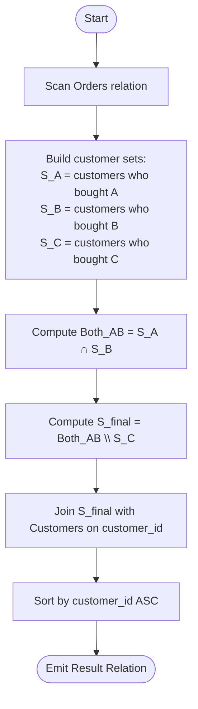

# Guided Example: Customers Who Bought Products A and B but Not C

We trace the step-by-step execution of relational set intersection and complement exclusion on a representative database instance:

- **Input Tables:**
  - `Customers`:
    - `(1, "Daniel")`
    - `(2, "Diana")`
    - `(3, "Elizabeth")`
    - `(4, "Jhon")`
  - `Orders`:
    - `(10, 1, "A")`, `(20, 1, "B")`, `(30, 1, "D")`, `(40, 1, "C")`
    - `(50, 2, "A")`
    - `(60, 3, "A")`, `(70, 3, "B")`, `(80, 3, "D")`
    - `(90, 4, "C")`
- **Required Output:**
  - `(3, "Elizabeth")`

This instance is chosen because each customer demonstrates a distinct set relationship with the required product triad $\{A, B, C\}$: Customer 1 bought all three (disqualified by $C$), Customer 2 bought only $A$ (disqualified by missing $B$), Customer 4 bought only $C$ (disqualified by both criteria), and Customer 3 bought $A$ and $B$ without ever purchasing $C$.

---

## 1. Instance & Teaching Goal

We are given two relational entities:
1. `Customers` with columns `customer_id` (primary key) and `customer_name`.
2. `Orders` with columns `order_id` (primary key), `customer_id`, and `product_name`.

Our objective is to report the `customer_id` and `customer_name` of customers who bought products `"A"` and `"B"`, but did **not** buy product `"C"`. The result table must be ordered by `customer_id` ascending.

Across the four customers:
- Customer 1 (Daniel): Purchased $\{A, B, C, D\}$. Bought $A$ and $B$, but violation occurred due to purchasing $C$.
- Customer 2 (Diana): Purchased $\{A\}$. Lacks required purchase of $B$.
- Customer 3 (Elizabeth): Purchased $\{A, B, D\}$. Bought $A$, bought $B$, and never bought $C$. **Qualified!**
- Customer 4 (Jhon): Purchased $\{C\}$. Bought $C$ and missing both $A$ and $B$.
- Output: `(3, "Elizabeth")`.

The primary teaching goal is to model complex customer segmentation through relational set algebra: expressing the required profile as the intersection of buyers of $A$ and $B$ minus buyers of $C$, $(S_A \cap S_B) \setminus S_C$.

---

## 2. Conceptual Foundation & Invariants

Let $S_P$ denote the set of customer IDs who have placed at least one order for product $P$:
$$
S_P = \Pi_{\text{customer\_id}} \left( \sigma_{\text{product\_name} = P}(\text{Orders}) \right)
$$

The target customer cohort $S^*$ satisfies three simultaneous conditions:
1. Belonging to $S_A$ (bought product $A$).
2. Belonging to $S_B$ (bought product $B$).
3. Not belonging to $S_C$ (never bought product $C$).

$$
S^* = (S_A \cap S_B) \setminus S_C
$$
The final result relation projects the customer details:
$$
\mathcal{R} = \Pi_{\text{customer\_id}, \text{customer\_name}} \left( \text{Customers} \bowtie S^* \right)
$$

```
Relational Set Logic:
Customers buying A (S_A): { 1, 2, 3 }
Customers buying B (S_B): { 1, 3 }
Intersection S_A ∩ S_B:   { 1, 3 }

Customers buying C (S_C): { 1, 4 }
Difference (S_A ∩ S_B) \ S_C: { 3 }  --> Maps to (3, "Elizabeth")
```

Equivalently, using group aggregation over $\text{Orders}$ grouped by `customer_id`:
- Condition 1: $\sum [\text{product\_name} = \text{'A'}] > 0$
- Condition 2: $\sum [\text{product\_name} = \text{'B'}] > 0$
- Condition 3: $\sum [\text{product\_name} = \text{'C'}] = 0$

We define state tracking parameters:

| Parameter | Relational Representation | Value on Instance |
|---|---|---|
| Buyers of A ($S_A$) | $\Pi_{\text{id}}(\sigma_{P=\text{'A'}}(\text{Orders}))$ | $\{1, 2, 3\}$ |
| Buyers of B ($S_B$) | $\Pi_{\text{id}}(\sigma_{P=\text{'B'}}(\text{Orders}))$ | $\{1, 3\}$ |
| Buyers of C ($S_C$) | $\Pi_{\text{id}}(\sigma_{P=\text{'C'}}(\text{Orders}))$ | $\{1, 4\}$ |
| Qualified IDs ($S^*$) | $(S_A \cap S_B) \setminus S_C$ | $\{3\}$ |

> **Invariant.** A customer ID is retained in $S^*$ if and only if their complete transaction history includes at least one entry for $A$, at least one entry for $B$, and zero entries for $C$.

---

## 3. Step-by-Step Worked Execution

### Step 1: Product Set Construction

Scan the `Orders` relation and partition customer orders into product sets:
- **Product A:** Orders $10$ (cust 1), $50$ (cust 2), $60$ (cust 3) $\implies S_A = \{1, 2, 3\}$.
- **Product B:** Orders $20$ (cust 1), $70$ (cust 3) $\implies S_B = \{1, 3\}$.
- **Product C:** Orders $40$ (cust 1), $90$ (cust 4) $\implies S_C = \{1, 4\}$.

| Order ID | Customer ID | Product Name | Product Set Membership |
|---|---|---|---|
| $10$ | $1$ | A | $1 \in S_A$ |
| $20$ | $1$ | B | $1 \in S_B$ |
| $30$ | $1$ | D | Ignored |
| $40$ | $1$ | C | $1 \in S_C$ |
| $50$ | $2$ | A | $2 \in S_A$ |
| $60$ | $3$ | A | $3 \in S_A$ |
| $70$ | $3$ | B | $3 \in S_B$ |
| $80$ | $3$ | D | Ignored |
| $90$ | $4$ | C | $4 \in S_C$ |

---

### Step 2: Evaluating Intersection and Exclusion

We compute the intersection $S_A \cap S_B$:
$$
S_A \cap S_B = \{1, 2, 3\} \cap \{1, 3\} = \{1, 3\}
$$
Next, exclude customers present in $S_C$:
$$
S^* = \{1, 3\} \setminus \{1, 4\} = \{3\}
$$

- Customer 1: In $\{1, 3\}$, but $1 \in S_C \implies$ Excluded.
- Customer 2: Not in $S_B \implies$ Excluded.
- Customer 3: In $\{1, 3\}$, and $3 \notin S_C \implies$ Retained!
- Customer 4: Not in $S_A$ or $S_B$, and in $S_C \implies$ Excluded.

---

### Step 3: Join with Customer Directory

Join the qualified identifier set $S^* = \{3\}$ with `Customers`:
- Match `customer_id = 3` in `Customers`: `(3, "Elizabeth")`.
- Project `(customer_id, customer_name)`.
- Order by `customer_id` ascending: `[(3, "Elizabeth")]`.

---

## 4. Complete Execution Trace

| Customer ID | Customer Name | Bought A? | Bought B? | Bought C? | Decision | Result Tuple |
|---|---|---|---|---|---|---|
| $1$ | Daniel | Yes | Yes | **Yes** | Disqualified by C | - |
| $2$ | Diana | Yes | **No** | No | Disqualified by missing B | - |
| $3$ | Elizabeth | **Yes** | **Yes** | **No** | **Qualified** | `(3, "Elizabeth")` |
| $4$ | Jhon | **No** | **No** | **Yes** | Disqualified | - |

---

## 5. Algorithmic Correctness & Complexity Derivation

### Set Theoretic Soundness

The criteria require the logical conjunction:
$$
\text{Condition}(c) = (\text{has Bought}(c, A)) \land (\text{has Bought}(c, B)) \land \neg(\text{has Bought}(c, C))
$$
- The set difference $S^* = (S_A \cap S_B) \setminus S_C$ directly implements this Boolean predicate.
- Every customer whose order history satisfies all three conditions is guaranteed to belong to $S^*$.
- Any customer violating any of the three conditions is absent from $S^*$.
- Projecting over `Customers` ensures valid naming and filtering.

### Asymptotic Complexity

- **Time Complexity:** $\mathcal{O}(|\text{Orders}| + |\text{Customers}| \log |\text{Customers}|)$. Building the product sets $S_A, S_B, S_C$ through hash sets or hash aggregation takes linear time $\mathcal{O}(|\text{Orders}|)$. Performing set intersections and differences takes time bounded by $\mathcal{O}(|\text{Customers}|)$. Sorting the qualifying rows takes $\mathcal{O}(K \log K)$ where $K \le |\text{Customers}|$.
- **Auxiliary Space Complexity:** $\mathcal{O}(|\text{Orders}| + |\text{Customers}|)$ to store the order index and customer set tables.

---

## 6. Traps & Edge Cases

- **Multiple Purchases of Same Product:** Customers may order product $A$ multiple times. Set projection naturally deduplicates multiple purchases.
- **Irrelevant Products ($D, E, \dots$):** Purchases of products other than $A, B, C$ (such as product $D$) have zero impact on qualification.
- **Customers with Zero Orders:** Customers with no order records in `Orders` do not appear in $S_A$ or $S_B$, correctly preventing false positives.
- **Empty Result:** If all customers buying $A$ and $B$ also purchased $C$, the set difference evaluates to $\emptyset$, safely returning an empty result relation.

---

## 7. Accessible Mermaid Diagram


