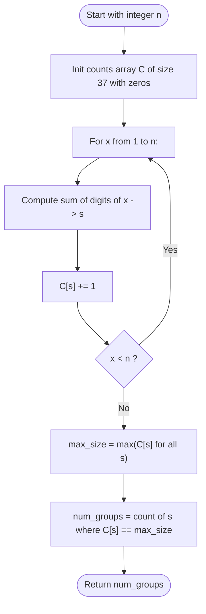

# Guided Example: Count Largest Group

We trace the step-by-step execution of digit-sum partitioning and frequency mode counting on a representative integer instance:

- **Input:** `n = 13`
- **Required output:** `4`

This instance is chosen because single-digit integers ($1$ through $9$) initialize nine distinct groups of size $1$, while subsequent two-digit integers ($10$ through $13$) tie four of those groups at the maximum group size of $2$.

---

## 1. Instance & Teaching Goal

Given an integer $n$, each integer $x \in \{1, 2, \dots, n\}$ is assigned to a group according to the sum of its decimal digits $\sigma(x)$:

$$
\sigma(x) = \sum_{k} d_k \quad \text{where } x = \sum_k d_k 10^k
$$

After partitioning all numbers from $1$ to $n$, let $M$ be the size of the largest group:
$$
M = \max_s |G_s|
$$
We must return the **number of groups** that achieve this maximal size $M$.

For $n = 13$:
- Group $1$ (digit sum $1$): $\{1, 10\}$ (size $= 2$)
- Group $2$ (digit sum $2$): $\{2, 11\}$ (size $= 2$)
- Group $3$ (digit sum $3$): $\{3, 12\}$ (size $= 2$)
- Group $4$ (digit sum $4$): $\{4, 13\}$ (size $= 2$)
- Groups $5, 6, 7, 8, 9$: $\{5\}, \{6\}, \{7\}, \{8\}, \{9\}$ (size $= 1$ each)

The largest group size is $M = 2$.
There are $4$ groups with size $2$ (Groups $1, 2, 3, 4$). Hence, the result is $4$.

The primary teaching goal is to structure the algorithm into two distinct stages: (1) accumulating frequency counts per digit sum using integer arithmetic, and (2) computing the maximum frequency $M$ and counting how many groups tie for that maximum.

---

## 2. Conceptual Foundation & Invariants

Let $C[s]$ be an array or hash map tracking the cardinality of each digit-sum group $s$:
$$
C[s] = |\{ x \in \{1, \dots, n\} \mid \sigma(x) = s \}|
$$

For $n \le 10^4$, the maximum possible digit sum occurs at $9999$, where $\sigma(9999) = 36$.
Thus, the domain of digit sums is strictly bounded by $[1, 36]$. A small fixed array of size $37$ suffices.

```
Digit Sum Group Distribution for n = 13:
Sum Key (s):      1      2      3      4      5    6    7    8    9
Elements:       [1,10] [2,11] [3,12] [4,13]  [5]  [6]  [7]  [8]  [9]
Group Size C[s]:  2*     2*     2*     2*     1    1    1    1    1
                  ^      ^      ^      ^
Max size M = 2; exactly 4 groups achieve size 2!
```

After populating $C[s]$ for all $x \in \{1, \dots, n\}$:
1. Determine the maximum frequency:
   $$
   M = \max_{s} C[s]
   $$
2. Count the number of groups achieving size $M$:
   $$
   \text{Answer} = \sum_{s} [C[s] = M]
   $$

We define state tracking parameters:

| Parameter | Mathematical Meaning | Initial State |
|---|---|---|
| Count Table ($C$) | Frequency array mapping digit sum $s \mapsto \text{count}$ | All zeros |
| Current Number ($x$) | Integer currently evaluated from $1$ to $n$ | $1$ |
| Digit Sum ($\sigma(x)$) | Sum of decimal digits of $x$ | Computed per $x$ |
| Maximal Group Size ($M$) | $\max_s C[s]$ | Recomputed across non-zero bins |

> **Invariant.** For any number of processed integers $k \le n$, $C[s]$ accurately reflects the number of integers in $\{1, \dots, k\}$ whose decimal digit sum equals $s$.

---

## 3. Step-by-Step Worked Execution

### Step 1: Processing Single-Digit Numbers ($1 \dots 9$)

For $x \in \{1, \dots, 9\}$, each number's digit sum is trivially $\sigma(x) = x$.
Each group $1$ through $9$ receives one element:
$$
C[1] = 1, C[2] = 1, \dots, C[9] = 1
$$

| Value ($x$) | Digit Extraction | Digit Sum ($\sigma(x)$) | Target Bin $C[s]$ Updated |
|---|---|---|---|
| $1 \dots 9$ | Single digit | $x$ | $C[x] \leftarrow 1$ for each $x \in \{1..9\}$ |

---

### Step 2: Processing Two-Digit Numbers ($10 \dots 13$)

- **$x = 10$:** Digits are $1, 0 \implies \sigma(10) = 1 + 0 = 1$.
  - Increment $C[1]$: $C[1] \leftarrow 1 + 1 = 2$.
- **$x = 11$:** Digits are $1, 1 \implies \sigma(11) = 1 + 1 = 2$.
  - Increment $C[2]$: $C[2] \leftarrow 1 + 1 = 2$.
- **$x = 12$:** Digits are $1, 2 \implies \sigma(12) = 1 + 2 = 3$.
  - Increment $C[3]$: $C[3] \leftarrow 1 + 1 = 2$.
- **$x = 13$:** Digits are $1, 3 \implies \sigma(13) = 1 + 3 = 4$.
  - Increment $C[4]$: $C[4] \leftarrow 1 + 1 = 2$.

| Value ($x$) | Decomposition | Digit Sum ($\sigma(x)$) | Group Incremented | New Bin Size $C[\sigma(x)]$ |
|---|---|---|---|---|
| $10$ | $1 + 0$ | $1$ | Group $1$ | $2$ |
| $11$ | $1 + 1$ | $2$ | Group $2$ | $2$ |
| $12$ | $1 + 2$ | $3$ | Group $3$ | $2$ |
| $13$ | $1 + 3$ | $4$ | Group $4$ | $2$ |

---

### Step 3: Finding the Maximum Group Size and Tallying Modes

We inspect the non-empty bins in $C$:
- $C[1] = 2$
- $C[2] = 2$
- $C[3] = 2$
- $C[4] = 2$
- $C[5] = 1, C[6] = 1, C[7] = 1, C[8] = 1, C[9] = 1$

1. **Find Maximum Size:**
   $$
   M = \max(2, 2, 2, 2, 1, 1, 1, 1, 1) = 2
   $$
2. **Count Groups with Size $M = 2$:**
   - Groups $1, 2, 3, 4$ have size $2$.
   - Total groups matching $M$: $4$.

Final answer: $4$.

---

## 4. Complete Execution Trace

| Digit Sum ($s$) | Contributing Numbers in $\{1 \dots 13\}$ | Group Size $C[s]$ | Matches Max Size ($M = 2$)? |
|---|---|---|---|
| $1$ | $\{1, 10\}$ | $2$ | **Yes** |
| $2$ | $\{2, 11\}$ | $2$ | **Yes** |
| $3$ | $\{3, 12\}$ | $2$ | **Yes** |
| $4$ | $\{4, 13\}$ | $2$ | **Yes** |
| $5$ | $\{5\}$ | $1$ | No |
| $6$ | $\{6\}$ | $1$ | No |
| $7$ | $\{7\}$ | $1$ | No |
| $8$ | $\{8\}$ | $1$ | No |
| $9$ | $\{9\}$ | $1$ | No |
| **Total Groups** | - | - | **$4$** |

---

## 5. Algorithmic Correctness & Complexity Derivation

### Correctness of Partitioning

Every integer $x$ in $\{1, \dots, n\}$ has a uniquely defined base-10 digit sum $\sigma(x)$.
- Because $\sigma(x)$ is a deterministic function, the preimage sets $G_s = \sigma^{-1}(s)$ form a partition of $\{1, \dots, n\}$.
- The array $C$ tracks the exact cardinality $|G_s|$ for each $s$.
- Finding $\max_s C[s]$ identifies the maximum partition size $M$.
- Summing $[C[s] = M]$ counts how many partitions achieve this maximal cardinality.

### Asymptotic Complexity

- **Time Complexity:** $\mathcal{O}(n \log_{10} n)$. There are $n$ numbers. Computing the digit sum of number $x$ takes $\mathcal{O}(\log_{10} x) \le 4$ operations for $n \le 10^4$. Iterating through the counts array to find the max and count matches takes $\mathcal{O}(D)$ operations where $D \le 36$. Total runtime is $\mathcal{O}(n)$, executing in under $5$ milliseconds.
- **Auxiliary Space Complexity:** $\mathcal{O}(D) = \mathcal{O}(1)$. The counts array requires only $37$ integer slots, independent of $n$.

---

## 6. Traps & Edge Cases

- **Size vs Count Confusion:** The problem asks for the *number of groups* that have the largest size, not the largest size itself. In our instance, the largest size is $2$, but the returned answer is $4$.
- **Small Inputs ($n < 10$):** For $n \le 9$, all numbers have distinct digit sums $1 \dots n$, so all groups have size $1$. The maximum size is $1$, and the answer is $n$.
- **Digit Sum Bounds:** The maximum possible digit sum for $n \le 10^4$ is $36$ (from $9999$). Sizing the table to at least $37$ prevents out-of-bounds indexing.

---

## 7. Accessible Mermaid Diagram


