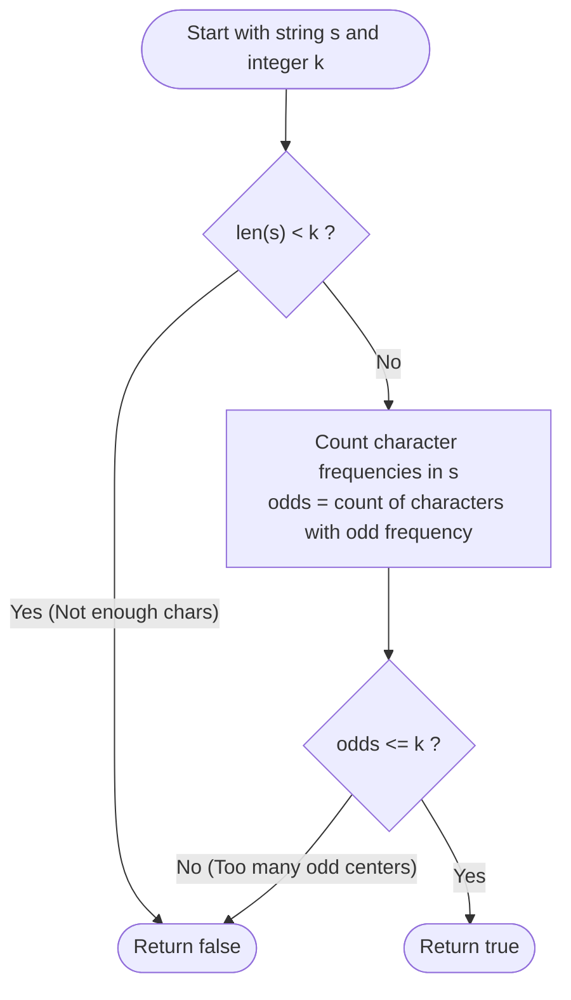

# Guided Example: Construct K Palindrome Strings

We trace the step-by-step execution of character parity distribution and palindrome capacity analysis on a representative problem instance:

- **Input:** `s = "annabelle"`, `k = 2`
- **Required output:** `true`

This instance is chosen because only one character has an odd frequency ($'b'$), while four characters have even frequencies ($'a', 'e', 'l', 'n'$), demonstrating how odd-count bounds dictate the minimal number of independent palindromic centers.

---

## 1. Instance & Teaching Goal

Given a string $s$ and an integer $k$, we must determine whether all characters of $s$ can be partitioned into exactly $k$ non-empty palindromic strings.

For `s = "annabelle"` ($|s| = 9$) and $k = 2$:
- Character frequencies:
  - `'a'`: $2$ (even)
  - `'b'`: $1$ (**odd**)
  - `'e'`: $2$ (even)
  - `'l'`: $2$ (even)
  - `'n'`: $2$ (even)
- Number of odd-frequency characters: $1$ (`'b'`).
- A valid partition into $2$ palindromes exists, for instance:
  1. `"anna"` (using `'a'`, `'n'`)
  2. `"elble"` (using `'e'`, `'l'`, `'b'`)
- Output: `true`.

The primary teaching goal is to recognize the fundamental parity invariant of palindromes: **each palindrome can hold at most one odd-frequency character at its center**. Therefore, constructing $k$ non-empty palindromes is possible if and only if:

$$
\text{odds} \le k \le |s|
$$

---

## 2. Conceptual Foundation & Invariants

Let $C[c]$ denote the occurrence count of character $c$ in string $s$.
Define the odd parity count:
$$
\text{odds} = \sum_{c \in \Sigma} (C[c] \bmod 2)
$$

### Necessity of Bounds

1. **Lower Bound ($k \ge \text{odds}$):**
   In any palindrome, characters on the left mirror characters on the right. At most one character can occupy the unpaired center. Thus, a palindrome contains at most one character with an odd occurrence. Since $k$ palindromes can accommodate at most $k$ odd-frequency characters in total, we must have $k \ge \text{odds}$.
2. **Upper Bound ($k \le |s|$):**
   Each palindrome must be non-empty (length $\ge 1$). Thus, the number of palindromes cannot exceed the total number of characters: $k \le |s|$.

```
Palindrome Symmetry Constraint:
Palindrome Structure:   [ left wing ]  [ center ]  [ right wing ]
Parity Contribution:        even          <= 1          even

Each palindrome can host AT MOST ONE odd character!
Total odd characters in string: odds
Therefore:  k >= odds   AND   k <= len(s)
```

### Sufficiency of Bounds

If $\text{odds} \le k \le |s|$ holds, a construction is always guaranteed:
- Place each of the $\text{odds}$ odd characters as the seed center of the first $\text{odds}$ palindromes.
- The remaining characters can all be paired up as $\lfloor C[c] / 2 \rfloor$ identical pairs.
- Pairs can either be split across existing palindromes (extending their wings) or split into two individual 1-character palindromes, increasing the count of palindromes one by one until reaching any target $k \le |s|$.

We define state tracking parameters:

| Parameter | Mathematical Meaning | Initial Value |
|---|---|---|
| String Length ($n$) | Total available characters ($\lvert s \rvert$) | $9$ |
| Frequency Map ($C$) | Character counts across lowercase alphabet | Populated from $s$ |
| Odd Parity Count ($\text{odds}$) | $\lvert \{ c \in \Sigma \mid C[c] \equiv 1 \pmod 2 \} \rvert$ | $1$ |
| Feasibility Condition | $\text{odds} \le k \le n$ | Boolean check |

> **Invariant.** The number of odd-frequency characters establishes the strict minimum number of palindromic components required to consume all characters without parity violations.

---

## 3. Step-by-Step Worked Execution

### Step 1: Upper Bound Capacity Verification

- String length: $n = |s| = 9$.
- Target palindrome count: $k = 2$.
- Condition test: Is $k \le n$?
  - $2 \le 9$ is **True**.
  - A string of $9$ characters has enough characters to form at least $2$ non-empty strings.

---

### Step 2: Frequency and Parity Tabulation

Scan string `"annabelle"` and compute character frequencies:
- `'a'`: $2 \implies 2 \bmod 2 = 0$ (Even)
- `'b'`: $1 \implies 1 \bmod 2 = 1$ (**Odd**)
- `'e'`: $2 \implies 2 \bmod 2 = 0$ (Even)
- `'l'`: $2 \implies 2 \bmod 2 = 0$ (Even)
- `'n'`: $2 \implies 2 \bmod 2 = 0$ (Even)

Total characters with odd frequencies:
$$
\text{odds} = 1 \quad (\text{character 'b'})
$$

| Character ($c$) | Count ($C[c]$) | Parity ($C[c] \bmod 2$) | Odd Contributor? |
|---|---|---|---|
| `'a'` | $2$ | $0$ | No |
| `'b'` | $1$ | $1$ | **Yes** |
| `'e'` | $2$ | $0$ | No |
| `'l'` | $2$ | $0$ | No |
| `'n'` | $2$ | $0$ | No |

---

### Step 3: Lower Bound Feasibility Verification

- Required minimum palindromes: $\text{odds} = 1$.
- Available palindrome slots: $k = 2$.
- Condition test: Is $\text{odds} \le k$?
  - $1 \le 2$ is **True**.
- Because both $k \le |s|$ and $\text{odds} \le k$ hold:
  $$
  1 \le 2 \le 9 \implies \text{True}
  $$

Return `true`.

---

## 4. Complete Execution Trace

| Test Instance | Length ($\lvert s \rvert$) | Target ($k$) | Odd Parity Count ($\text{odds}$) | Check: $k \le \lvert s \rvert$ | Check: $\text{odds} \le k$ | Feasible? |
|---|---|---|---|---|---|---|
| `"annabelle"` | $9$ | $2$ | $1$ ('b') | $2 \le 9$ (True) | $1 \le 2$ (True) | **True** |
| `"leetcode"` | $8$ | $3$ | $6$ ('l','e','t','c','o','d') | $3 \le 8$ (True) | $6 \le 3$ (False) | **False** |
| `"true"` | $4$ | $4$ | $4$ ('t','r','u','e') | $4 \le 4$ (True) | $4 \le 4$ (True) | **True** |

---

## 5. Algorithmic Correctness & Complexity Derivation

### Formal Character Conservation Proof

Let $\mathcal{P}_1, \dots, \mathcal{P}_k$ be $k$ non-empty palindromes formed by partitioning the multiset of characters in $s$.
- For each palindrome $\mathcal{P}_i$, the number of characters with odd counts within $\mathcal{P}_i$ is at most $1$: $\text{odd\_chars}(\mathcal{P}_i) \le 1$.
- The total number of odd characters in the disjoint union satisfies:
  $$
  \text{odds}(s) \le \sum_{i=1}^k \text{odd\_chars}(\mathcal{P}_i) \le \sum_{i=1}^k 1 = k
  $$
- Therefore, $k \ge \text{odds}(s)$ is a mathematically necessary condition.
- Conversely, starting with $\text{odds}$ centers and distributing pairs guarantees that every integer $k$ between $\text{odds}$ and $|s|$ can be achieved.
- Hence, the predicate $\text{odds} \le k \le |s|$ is both necessary and sufficient.

### Asymptotic Complexity

- **Time Complexity:** $\mathcal{O}(n)$, where $n = |s|$. A single pass over string $s$ tabulates character counts. Inspecting the 26 lowercase English letters takes $\mathcal{O}(|\Sigma|) = \mathcal{O}(1)$ time. (Alternatively, a 26-bit integer mask can track parity with bitwise XOR, where $\text{odds} = \operatorname{popcount}(mask)$, taking $\mathcal{O}(n)$ time and a single bitwise operation).
- **Auxiliary Space Complexity:** $\mathcal{O}(1)$. Requires only 26 frequency counters or a single 32-bit integer register.

---

## 6. Traps & Edge Cases

- **Pigeonhole Deficit ($k > |s|$):** If $k > |s|$, it is impossible to create $k$ non-empty strings, even if $\text{odds} \le k$. The check $k \le |s|$ must be evaluated first.
- **Trivial Equality ($k = |s|$):** When $k = |s|$, each character forms a 1-character palindrome, which is always valid since $odds \le |s|$ always holds.
- **Zero Odd Characters ($\text{odds} = 0$):** If every character appears an even number of times, $\text{odds} = 0 \le k$ holds for any $k \ge 1$.
- **Odd Characters Greater Than $k$:** If $\text{odds} > k$, at least one palindrome would be forced to contain at least two odd characters, which is topologically impossible for a palindrome.

---

## 7. Accessible Mermaid Diagram


