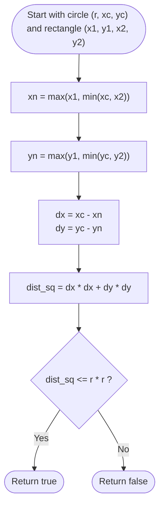

# Guided Example: Circle and Rectangle Overlapping

We trace the step-by-step execution of the coordinate clamping and squared Euclidean distance minimization strategy on a representative geometric instance:

- **Input:** `radius = 1`, `xCenter = 0`, `yCenter = 0`, `x1 = 1`, `y1 = -1`, `x2 = 3`, `y2 = 1`
- **Required output:** `true`

This instance is chosen because the circle center lies outside the rectangle along the X-axis while aligning within the Y-axis span, yielding a closest point that lies on the vertical edge $(1, 0)$ with distance exactly equal to the radius ($1$), demonstrating exact boundary tangency.

---

## 1. Instance & Teaching Goal

We are given a circle of radius $r$ centered at $(x_c, y_c)$ and an axis-aligned rectangle bounded by bottom-left corner $(x_1, y_1)$ and top-right corner $(x_2, y_2)$. We must determine whether the circle and the rectangle share at least one common point (i.e., whether they overlap or touch).

For `radius = 1, xCenter = 0, yCenter = 0, x1 = 1, y1 = -1, x2 = 3, y2 = 1`:
- Circle: Center $(0, 0)$, radius $r = 1$, squared radius $r^2 = 1$.
- Rectangle: Horizontal span $[1, 3]$, vertical span $[-1, 1]$.
- The point inside or on the boundary of the rectangle closest to $(0, 0)$ is $(1, 0)$.
- The Euclidean distance from center $(0, 0)$ to $(1, 0)$ is:
  $$
  \text{dist} = \sqrt{(0 - 1)^2 + (0 - 0)^2} = \sqrt{1} = 1
  $$
- Since $\text{dist} = 1 \le r = 1$, the circle touches the rectangle at point $(1, 0)$.
- Output: `true`.

The primary teaching goal is to reduce 2D geometric shape intersection to **coordinate-wise interval clamping**: finding the unique point on the rectangle closest to the circle center in $\mathcal{O}(1)$ time, and comparing the squared distance against $r^2$ to avoid floating-point imprecision.

---

## 2. Conceptual Foundation & Invariants

An axis-aligned rectangle $\mathcal{R}$ is the Cartesian product of two closed intervals:
$$
\mathcal{R} = [x_1, x_2] \times [y_1, y_2]
$$

Because the coordinate axes are orthogonal, the point $(x_n, y_n) \in \mathcal{R}$ that minimizes the Euclidean distance to $(x_c, y_c)$ can be found by clamping $x_c$ and $y_c$ independently onto their respective intervals:
$$
x_n = \operatorname{clamp}(x_c, x_1, x_2) = \max(x_1, \min(x_c, x_2))
$$
$$
y_n = \operatorname{clamp}(y_c, y_1, y_2) = \max(y_1, \min(y_c, y_2))
$$

```
Coordinate Clamping Mechanics:
Circle Center (0, 0)
Horizontal interval [1, 3]:   0 is to the left of 1  --> Clamped x_n = 1
Vertical interval   [-1, 1]:  0 is inside [-1, 1]    --> Clamped y_n = 0

Nearest point P_n = (1, 0) on the left boundary of the rectangle!
Squared distance = (0 - 1)^2 + (0 - 0)^2 = 1 <= r^2 = 1  --> Overlap!
```

The minimum squared distance from the circle center to any point in the rectangle is:
$$
D^2 = (x_c - x_n)^2 + (y_c - y_n)^2
$$

The circle and rectangle overlap if and only if:
$$
D^2 \le r^2
$$

We define state tracking parameters:

| Parameter | Mathematical Meaning | Value on Instance |
|---|---|---|
| Circle Bounds | $(r, x_c, y_c)$ | $(1, 0, 0)$ |
| Rectangle Interval $X$ | $[x_1, x_2]$ | $[1, 3]$ |
| Rectangle Interval $Y$ | $[y_1, y_2]$ | $[-1, 1]$ |
| Nearest Point $(x_n, y_n)$ | Clamped projections of $(x_c, y_c)$ | $(1, 0)$ |
| Squared Distance ($D^2$) | $(x_c - x_n)^2 + (y_c - y_n)^2$ | $1$ |

> **Invariant.** Point $(x_n, y_n)$ is provably the unique point in the rectangle that minimizes distance to $(x_c, y_c)$. If $(x_n, y_n)$ lies strictly outside the circle, then no point in the rectangle can lie inside the circle.

---

## 3. Step-by-Step Worked Execution

### Step 1: Clamping on the X-Axis

- Circle center $x$-coordinate: $x_c = 0$.
- Rectangle horizontal span: $[x_1, x_2] = [1, 3]$.
- Evaluate clamp function:
  $$
  x_n = \max(1, \min(0, 3)) = \max(1, 0) = 1
  $$
- The nearest horizontal coordinate in the rectangle is $x_n = 1$.
- Horizontal displacement: $\Delta x = x_c - x_n = 0 - 1 = -1$.

---

### Step 2: Clamping on the Y-Axis

- Circle center $y$-coordinate: $y_c = 0$.
- Rectangle vertical span: $[y_1, y_2] = [-1, 1]$.
- Evaluate clamp function:
  $$
  y_n = \max(-1, \min(0, 1)) = \max(-1, 0) = 0
  $$
- The nearest vertical coordinate in the rectangle is $y_n = 0$.
- Vertical displacement: $\Delta y = y_c - y_n = 0 - 0 = 0$.

| Dimension | Center Coordinate | Allowed Interval | Clamped Coordinate | Delta ($\Delta$) | Squared Delta ($\Delta^2$) |
|---|---|---|---|---|---|
| X | $x_c = 0$ | $[1, 3]$ | $x_n = 1$ | $0 - 1 = -1$ | $(-1)^2 = 1$ |
| Y | $y_c = 0$ | $[-1, 1]$ | $y_n = 0$ | $0 - 0 = 0$ | $0^2 = 0$ |

---

### Step 3: Evaluating Distance Metric

- Sum of squared displacements:
  $$
  D^2 = (\Delta x)^2 + (\Delta y)^2 = 1 + 0 = 1
  $$
- Target radius squared:
  $$
  r^2 = 1^2 = 1
  $$
- Compare $D^2$ against $r^2$:
  $$
  D^2 \le r^2 \iff 1 \le 1 \quad (\textbf{True})
  $$

The shapes intersect at point $(1, 0)$.
Return `true`.

---

## 4. Complete Execution Trace

| Phase | Formula / Operation | Intermediate Value | Result |
|---|---|---|---|
| X Clamping | $\max(x_1, \min(x_c, x_2))$ | $\max(1, \min(0, 3)) = 1$ | $x_n = 1$ |
| Y Clamping | $\max(y_1, \min(y_c, y_2))$ | $\max(-1, \min(0, 1)) = 0$ | $y_n = 0$ |
| Nearest Point | Coordinate pair $(x_n, y_n)$ | $(1, 0)$ | Located on left edge |
| Squared Distance | $(x_c - x_n)^2 + (y_c - y_n)^2$ | $(0 - 1)^2 + (0 - 0)^2$ | $D^2 = 1$ |
| Overlap Check | $D^2 \le r^2$ | $1 \le 1$ | **`true`** |

---

## 5. Algorithmic Correctness & Complexity Derivation

### Coordinate-Wise Separation Proof

The Euclidean distance between $(x_c, y_c)$ and any $(x, y) \in \mathcal{R}$ is:
$$
\text{dist}^2( (x_c, y_c), (x, y) ) = (x_c - x)^2 + (y_c - y)^2
$$
Because $(x_c - x)^2$ depends strictly on $x$ and $(y_c - y)^2$ depends strictly on $y$, the sum is minimized when each term is minimized independently over its domain:
- Minimizing $(x_c - x)^2$ for $x \in [x_1, x_2]$ yields $x_n = \operatorname{clamp}(x_c, x_1, x_2)$.
- Minimizing $(y_c - y)^2$ for $y \in [y_1, y_2]$ yields $y_n = \operatorname{clamp}(y_c, y_1, y_2)$.
- The global minimum distance point in $\mathcal{R}$ is precisely $(x_n, y_n)$.
- Testing $D^2 \le r^2$ using integer arithmetic avoids all floating-point square root errors.

### Asymptotic Complexity

- **Time Complexity:** $\mathcal{O}(1)$. The algorithm evaluates two clamp operations, two subtractions, two multiplications, and one comparison.
- **Auxiliary Space Complexity:** $\mathcal{O}(1)$. Requires only scalar coordinate registers.

---

## 6. Traps & Edge Cases

- **Circle Center Inside Rectangle:** If $x_1 \le x_c \le x_2$ and $y_1 \le y_c \le y_2$, then $x_n = x_c$ and $y_n = y_c$, yielding $D^2 = 0 \le r^2$, which immediately returns `true`.
- **Floating-Point Imprecision:** Using $\sqrt{D^2} \le r$ with floating-point square roots introduces rounding issues near boundaries (e.g., $0.9999999999$). Comparing exact squared integers $D^2 \le r^2$ eliminates all precision issues.
- **Corner Nearness:** When the circle center is diagonal to the rectangle (e.g., above and to the right), both $x$ and $y$ clamp to the top-right corner $(x_2, y_2)$, measuring the distance to that corner vertex.
- **Tangency:** When $D^2 = r^2$, the boundary of the circle touches the rectangle at exactly one point, which constitutes a valid overlap ($D^2 \le r^2$).

---

## 7. Accessible Mermaid Diagram


