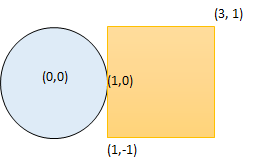
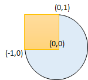

### 1. Description

You are given a circle represented as `(radius, xCenter, yCenter)` and an axis-aligned rectangle represented as `(x1, y1, x2, y2)`, where `(x1, y1)` are the coordinates of the bottom-left corner, and `(x2, y2)` are the coordinates of the top-right corner of the rectangle.

Return `true`* if the circle and rectangle are overlapped otherwise return *`false`. In other words, check if there is **any** point $(x_{i}, y_{i})$ that belongs to the circle and the rectangle at the same time.

### 2. Function Contract

**Inputs**

- `radius`: Input parameter (`int`).
- `xCenter`: Input parameter (`int`).
- `yCenter`: Input parameter (`int`).
- `x1`: Input parameter (`int`).
- `y1`: Input parameter (`int`).
- `x2`: Input parameter (`int`).
- `y2`: Input parameter (`int`).

**Return value**

- Returns `bool`.

### 3. Examples

#### Example 1

- **Input:** $radius = 1, xCenter = 0, yCenter = 0, x1 = 1, y1 = -1, x2 = 3, y2 = 1$
- **Output:** `true`
- **Explanation:** Circle and rectangle share the point (1,0).

#### Example 2

- **Input:** $radius = 1, xCenter = 1, yCenter = 1, x1 = 1, y1 = -3, x2 = 2, y2 = -1$
- **Output:** `false`

#### Example 3

- **Input:** $radius = 1, xCenter = 0, yCenter = 0, x1 = -1, y1 = 0, x2 = 0, y2 = 1$
- **Output:** `true`

### 4. Constraints

- $1 \le radius \le 2000$

- $-10^{4} \le xCenter, yCenter \le 10^{4}$

- $-10^{4} \le x1 < x2 \le 10^{4}$

- $-10^{4} \le y1 < y2 \le 10^{4}$
