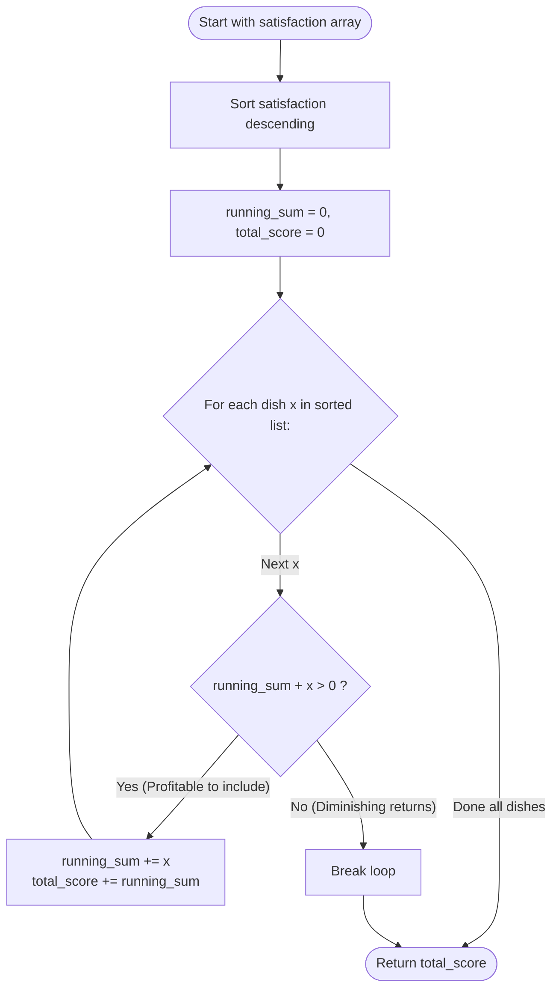

# Guided Example: Reducing Dishes

We trace the step-by-step execution of the descending greedy prefix accumulation strategy on a representative culinary instance:

- **Input:** `satisfaction = [-1, -8, 0, 5, -9]`
- **Required output:** `14`

This instance is chosen because it features negative satisfaction values alongside non-negative ones, demonstrating why taking a slightly negative dish ($-1$) is globally beneficial because it delays more positive dishes to later time slots with higher multipliers.

---

## 1. Instance & Teaching Goal

A chef prepares a subset of $n$ available dishes in 1 unit of time each. The **Like-time coefficient** is defined as the sum of each prepared dish's satisfaction value multiplied by its preparation time index ($1, 2, \dots, k$):

$$
\text{Total Score} = \sum_{t=1}^k t \times s_t
$$

The chef may discard any number of dishes and prepare the remaining dishes in any chosen order. We must find the maximum possible Like-time coefficient.

For `satisfaction = [-1, -8, 0, 5, -9]`:
- If we cook dishes $[-1, 0, 5]$ in order:
  - Time $1$: $1 \times (-1) = -1$
  - Time $2$: $2 \times 0 = 0$
  - Time $3$: $3 \times 5 = 15$
  - Total score: $-1 + 0 + 15 = 14$.
- If we discard $-1$ and cook only $[0, 5]$:
  - Time $1$: $1 \times 0 = 0$
  - Time $2$: $2 \times 5 = 10 \implies$ Score $= 10 < 14$.
- Maximum achievable score: $14$.

The primary teaching goal is to recognize that:
1. By the **Rearrangement Inequality**, any chosen subset must be cooked in ascending order of satisfaction.
2. In reverse (descending) order, prepending an additional dish $x$ to an already chosen menu shifts every existing dish one time slot later, increasing the total score by $x + \sum_{\text{menu}} s_i$. Thus, prepending $x$ is beneficial if and only if the updated running sum remains strictly positive.

---

## 2. Conceptual Foundation & Invariants

Suppose we sort all available dishes in descending order of satisfaction:
$$
s_{(1)} \ge s_{(2)} \ge \dots \ge s_{(n)}
$$

Consider building the optimal menu by greedily adding dishes from largest to smallest:
- Start with an empty menu: running sum $S = 0$, total coefficient $ans = 0$.
- When we consider prepending the next largest dish $x$:
  - The new dish is cooked at time $1$, contributing $1 \times x = x$.
  - Every dish already in the menu shifts from time $t$ to time $t + 1$, increasing each dish's contribution by $1 \times s_i$.
  - The net change in total score is:
    $$
    \Delta = x + \sum_{i \in \text{menu}} s_i = x + S_{\text{previous}}
    $$
- If $S_{\text{previous}} + x > 0$, the net change is strictly positive, so we include dish $x$!
- If $S_{\text{previous}} + x \le 0$, adding $x$ (and any subsequent, even smaller satisfaction values) would decrease or fail to improve the score, so the greedy expansion halts.

```
Incremental Prepending and Time-Shift Mechanics:
Round 1: Menu = [5]          -> Score = 1*5 = 5                     (Sum = 5)
Round 2: Prepend 0 -> [0, 5]  -> Score = 1*0 + 2*5 = 10 = 5 + 5      (Sum = 5 + 0 = 5)
Round 3: Prepend -1 -> [-1, 0, 5] -> Score = 1*(-1) + 2*0 + 3*5 = 14 = 10 + (5+0-1) = 10 + 4
                                                                     (Sum = 5 + 0 - 1 = 4)
Round 4: Consider -8: Sum + (-8) = 4 - 8 = -4 <= 0 -> STOP!
```

We define state tracking parameters:

| Parameter | Mathematical Meaning | Initial Value |
|---|---|---|
| Running Satisfaction Sum ($S$) | Sum of satisfaction values in chosen menu | $0$ |
| Total Like-Time Score ($ans$) | Cumulative score of current menu configuration | $0$ |
| Candidate Dish ($x$) | Next largest satisfaction value in descending order | $5$ |
| Stop Condition | $S + x \le 0$ | Evaluated per step |

> **Invariant.** Prepending dish $x$ increases the total score by exactly $S + x$. Because $x$ values decrease monotonically, once $S + x \le 0$, no further extensions can ever produce a positive marginal gain.

---

## 3. Step-by-Step Worked Execution

Given `satisfaction = [-1, -8, 0, 5, -9]`:
Sort in descending order:
$$
\text{Sorted} = [5, 0, -1, -8, -9]
$$

### Step 1: Consider Dish $x = 5$

- Candidate value: $x = 5$.
- Updated running sum: $S_{\text{new}} = S + x = 0 + 5 = 5$.
- Marginal gain: $5 > 0$ (**Beneficial**).
- Update state:
  - $S = 5$.
  - $ans = ans + S = 0 + 5 = 5$.
- Active menu: $[5]$.

---

### Step 2: Consider Dish $x = 0$

- Candidate value: $x = 0$.
- Updated running sum: $S_{\text{new}} = S + x = 5 + 0 = 5$.
- Marginal gain: $5 > 0$ (**Beneficial**).
- Update state:
  - $S = 5$.
  - $ans = ans + S = 5 + 5 = 10$.
- Active menu: $[0, 5]$.

---

### Step 3: Consider Dish $x = -1$

- Candidate value: $x = -1$.
- Updated running sum: $S_{\text{new}} = S + x = 5 + (-1) = 4$.
- Marginal gain: $4 > 0$ (**Beneficial**).
  - Even though $x = -1$ is negative, it shifts the existing dishes $[0, 5]$ forward by 1 time unit, boosting their score by $+5$, yielding net gain $+4$!
- Update state:
  - $S = 4$.
  - $ans = ans + S = 10 + 4 = 14$.
- Active menu: $[-1, 0, 5]$.

---

### Step 4: Consider Dish $x = -8$

- Candidate value: $x = -8$.
- Test marginal gain: $S + x = 4 + (-8) = -4$.
- Since $-4 \le 0$, prepending $-8$ causes a net penalty of $-4$.
- **Halt evaluation!**

Final maximum score: $14$.

| Step | Dish ($x$) | Marginal Gain ($S + x$) | Decision | New Running Sum ($S$) | Cumulative Score ($ans$) |
|---|---|---|---|---|---|
| $1$ | $5$ | $0 + 5 = 5 > 0$ | Accept | $5$ | $5$ |
| $2$ | $0$ | $5 + 0 = 5 > 0$ | Accept | $5$ | $10$ |
| $3$ | $-1$ | $5 + (-1) = 4 > 0$ | Accept | $4$ | **$14$** |
| $4$ | $-8$ | $4 + (-8) = -4 \le 0$ | **Reject & Stop** | $4$ | $14$ |

---

## 4. Complete Execution Trace

| Preparation Order | Cook Time ($t$) | Selected Dish | Satisfaction | Time $\times$ Satisfaction |
|---|---|---|---|---|
| 1st | $1$ | $-1$ | $-1$ | $1 \times (-1) = -1$ |
| 2nd | $2$ | $0$ | $0$ | $2 \times 0 = 0$ |
| 3rd | $3$ | $5$ | $5$ | $3 \times 5 = 15$ |
| **Final Score** | - | - | - | **$-1 + 0 + 15 = 14$** |

---

## 5. Algorithmic Correctness & Complexity Derivation

### Concavity of the Objective Function

Let $f(k)$ denote the optimal score achievable using a subset of size $k$.
By sorting descending:
$$
f(k) - f(k - 1) = \sum_{i=1}^k s_{(i)}
$$
- Because the sequence $s_{(i)}$ is non-increasing, the prefix sums $P(k) = \sum_{i=1}^k s_{(i)}$ are strictly concave.
- The differences $f(k) - f(k - 1) = P(k)$ start positive and strictly decrease.
- Once $P(k) \le 0$, all subsequent terms $P(k + m) < P(k) \le 0$.
- Therefore, the score function $f(k)$ is unimodal, and the greedy stopping point achieves the global maximum.

### Asymptotic Complexity

- **Time Complexity:** $\mathcal{O}(n \log n)$, where $n = |satisfaction|$. Sorting the $n$ elements in descending order takes $\mathcal{O}(n \log n)$ time. The subsequent single pass performs $\mathcal{O}(1)$ operations per dish, taking $\mathcal{O}(n)$ time. Total runtime is $\mathcal{O}(n \log n)$.
- **Auxiliary Space Complexity:** $\mathcal{O}(1)$ beyond the sorting buffer.

---

## 6. Traps & Edge Cases

- **All Negative Satisfactions:** If all dishes have negative satisfaction (e.g., `[-2, -5, -3]`), the initial test $0 + x < 0$ fails immediately on the very first step, correctly returning $0$ (cooking zero dishes).
- **Discarding Negative Dishes Fallacy:** It is a mistake to discard all negative dishes automatically. A negative dish whose penalty is smaller than the sum of subsequent positive dishes shifts all positive dishes forward, generating a net positive surplus.
- **Rearrangement Reversal:** When preparing the dishes, the smallest chosen satisfaction must be cooked first (at time $1$) and the largest at time $k$. The greedy iteration works backwards from largest to smallest.

---

## 7. Accessible Mermaid Diagram


