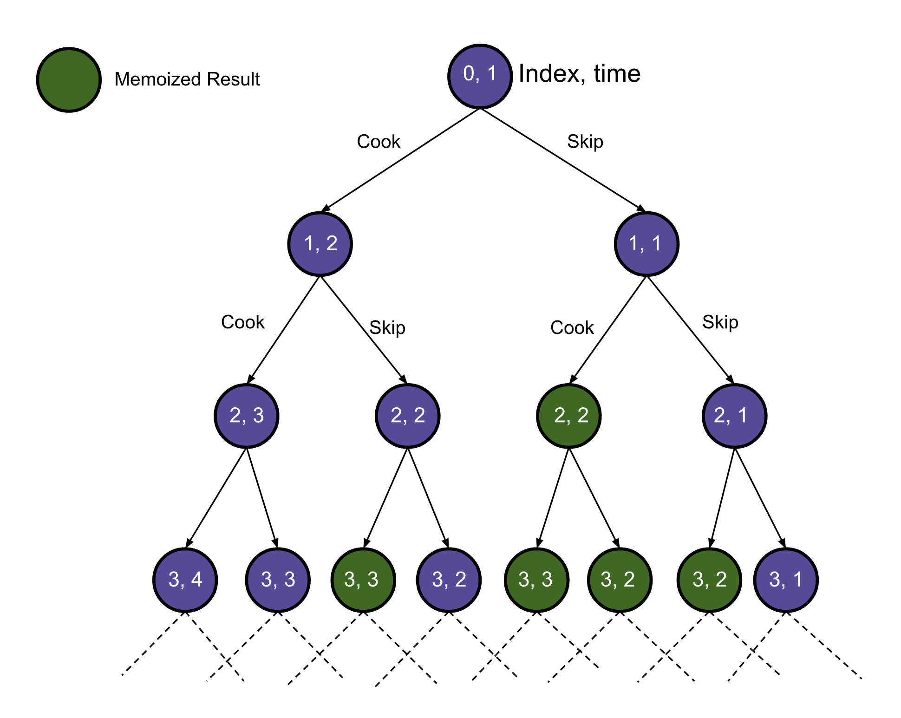
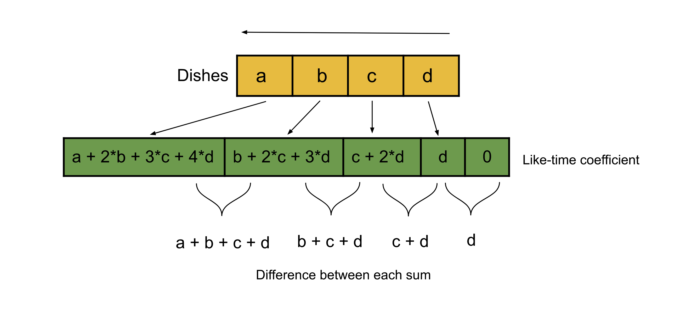
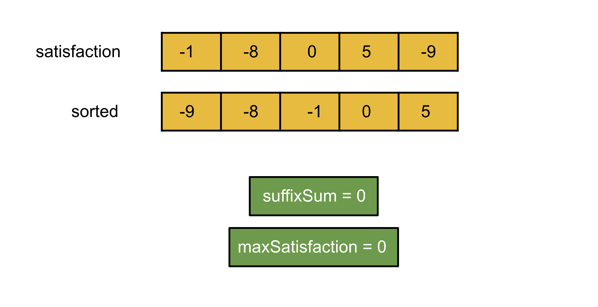
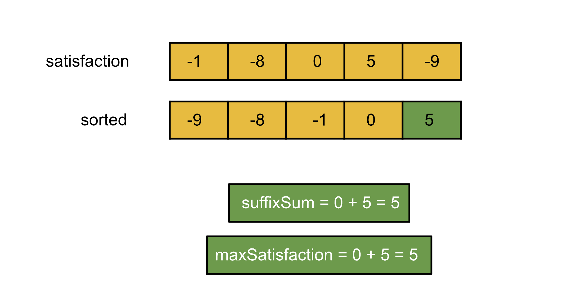
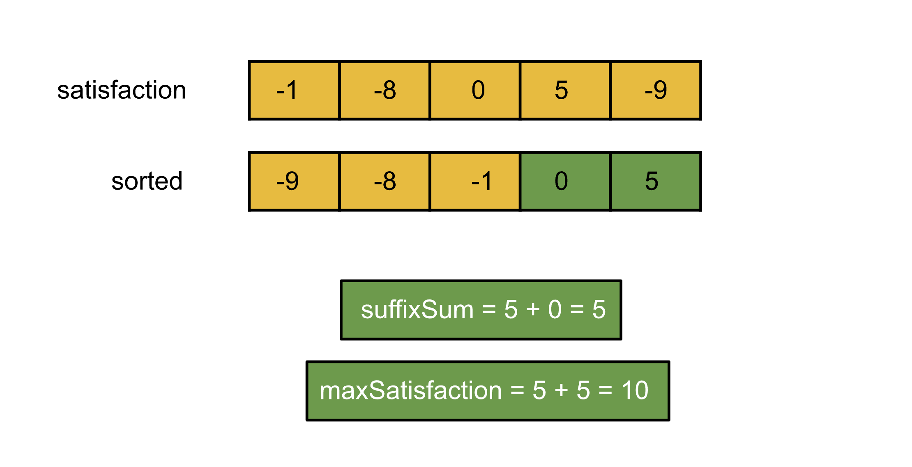
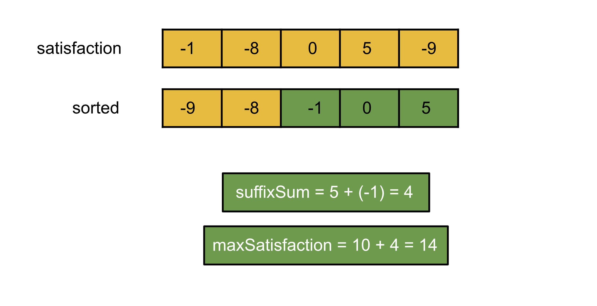
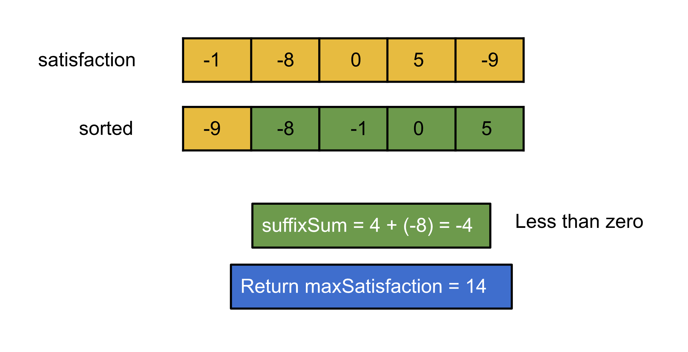

## Solution

---

### Overview

We have $N$ dishes, and each one of them can be cooked in 1 unit of time and can be cooked in any order. All dishes have an integer attribute called `satisfaction`. We define a value for each dish, the `Like-time coefficient`, as the multiplication of its `satisfaction` value and the time taken to cook the dish, including the time for previous dishes. We need to find the maximum sum of these values, the `Like-time coefficient`, considering that any number of dishes can be discarded and the remaining can be cooked in any order.

We should take note of two characteristics of this problem at this time. First, as we iterate over the dishes, we must decide which dish to cook. The optimal choice will depend on how many dishes we have cooked before the current dish (as we have to include the time for those as well). In other words, each decision we make is affected by the previous decisions we have made. Second, the problem is asking to maximize the sum of the coefficient for each dish. These two characteristics suggest that we could solve this problem using dynamic programming. We will discuss three approaches using dynamic programming, and then we will discuss one greedy approach.
</br>

---

### Approach 1: Top-Down Dynamic Programming

**Intuition**

Let's start with the first dish; we have two options here. First, we can cook this dish, add its `satisfaction` value multiplied by `1` (as this is the first dish) to our answer, and move on to the next dish whose time taken would be `2` (`1` unit for the second dish and `1` unit for the previous one). The second option is to skip this dish and move to the second dish with the time still at `1`.  We will follow the same options for the second dish and so on, and for each dish, we will choose the option with a greater sum.

This way, we will iterate over every possibility and find the best out of them. For this recursive approach, what are the parameters that we need to track? The first parameter is the index of the dish that we are currently considering as we traverse the dishes. Since the time taken for a dish depends on the number of dishes we have cooked so far, time is another parameter that we need, which would be the count of dishes we have cooked so far, including the current one.

Hence, we need to keep track of two things:

1. The index of the dish that we are currently considering.
2. The number of dishes we have cooked so far, i.e. time.

This recursive approach will have repeated subproblems; this can be observed in the figure below. Notice the green nodes are repeated subproblems signifying that we have already solved these subproblems before.



To avoid recalculating results for previously seen subproblems, we will memoize the result for each subproblem. So the next time we need to calculate the result for the same set of parameters `{index, time}`, we can simply look up the result in constant time instead of recalculating the result.

But wait, we have ignored an essential part of the problem. We are iterating the dishes in order, say left to right or vice versa, but the problem doesn't have any constraint on the order. The dishes can be cooked in any order, so iterating from left to right will not always work. Can we greedily arrange them in order so that iterating them from left to right always works? Remember the time taken for a dish is equal to the number of dishes that have been cooked + 1; hence if we want to maximize the sum, we need to ensure that the dishes with high `satisfaction` value get cooked later as they will be multiplied by a larger time coefficient. This implies that if we sort the dishes in ascending order of their `satisfaction` value, we should cook them from left to right. Hence, we will first sort the dishes and then apply the algorithm that we just discussed.

**Algorithm**

1. Sort the array `satisfaction` in ascending order.
2. Create a memoization table `memo` with size `N x N`, and initialize all the values with `-1`, representing that the answer for all the states has not been calculated yet.
3. Implement the following function, to be called with $index = 0$ and $time = 1$ to find the answer:

   a. If we have reached the end of the array, i.e. $index = \text{satisfaction.length}$, we should return `0` because there are no more dishes to cook, so we can't gain any more value.

   b. If the value in the array `memo` for the pair `{index, time}` is not `-1`, then return that value as it implies that we have already encountered this subproblem; thus a recursive call is not needed and we can return the value stored in the table `memo`.

   c. Check the below two options, calculate, memoize, and return the maximum of them:

       i. Add the coefficient value for this dish as $\text{satisfaction}[index] * time$ to the recursive result for with $index = index + 1$ and $time = time + 1$
       ii. Skip the dish and make the recursive call for $index = index + 1$ and $time = time$.

**Implementation**

```cpp
class Solution {
public:
    int findMaxSatisfaction(vector<int>& satisfaction, vector<vector<int>>& memo, int index, int time) {
        // Return 0 if we have iterated over all the dishes.
        if (index == satisfaction.size()) {
            return 0;
        }

        // We have already calculated the answer, so no need to go into recursion.
        if (memo[index][time] != -1) {
            return memo[index][time];
        }

        // Return the maximum of two choices:
        // 1. Cook the dish at `index` with the time taken as `time` and move on to the next dish with time as time + 1.
        // 2. Skip the current dish and move on to the next dish at the same time.
        return memo[index][time] = max(satisfaction[index] * time + findMaxSatisfaction(satisfaction, memo, index + 1, time + 1),
                                       findMaxSatisfaction(satisfaction, memo, index + 1, time));
    }

    int maxSatisfaction(vector<int>& satisfaction) {
        sort(satisfaction.begin(), satisfaction.end());

        // Mark, all the states as -1, denoting not yet calculated.
        vector<vector<int>> memo(satisfaction.size() + 1, vector<int>(satisfaction.size() + 1, -1));

        return findMaxSatisfaction(satisfaction, memo, 0, 1);
    }
};
```

**Complexity Analysis**

Here $N$ is the number of dishes.

* Time complexity: $O(N^2)$.

  Each state is defined by the values `index` and `time`. Hence, there will be $N^2$ possible states, because both `index` and `time` can take up to $N$ values and we must visit these states to solve the original problem. Each recursive call requires $O(1)$ time as we just have a comparison operation. We also perform sorting, taking $O(N\log N)$ time. Thus, the total time complexity equals $O(N^2)$.

* Space complexity: $O(N^2)$.

  The memoization results are stored in the table memo with size $N^2$. Also, stack space in the recursion equals the maximum number of active functions. The maximum number of active functions will be at most $N$, i.e. one function call for every dish. Hence, the space complexity is $O(N^2)$.
  <br/>

---

### Approach 2: Bottom-Up Dynamic Programming

**Intuition**

In the previous approach, the recursive calls incurred stack space. We can avoid this by applying the same approach iteratively, which is often faster than the top-down approach. We will follow a similar approach to the previous one. However, this time we will iterate over the states by starting from the base case and ending at the initial query.

Let's formulate the recursive relation between states using the logic we used in the previous approach. The function `findMaxSatisfaction` can be represented as the state table `dp`. Hence, we can write this relation:

> dp[index][time] = max(satisfaction[index] * time + dp[index + 1][time + 1], dp[index + 1][time]).

The value $\text{dp}[index][time]$ here represents the maximum sum by cooking the dish at `index` with the time taken as `time`. This value is written as the maximum of two choices:

1. Cook the current dish and add the value $\text{satisfaction}[index] * time$; the next dish will be cooked at time $time + 1$, so add the value of $dp[index + 1]time + 1]$.
2. Skip the current dish, and then the next dish will be cooked at time `time`, hence the value $dp[index + 1][time]$.

The base condition in the previous approach was to set the sum as `0` when the index is the length of the `satisfaction` array irrespective of time. We will do the same here; we will initialize all the values in the array `dp` as `0` and hence cover the base case implicitly.

**Algorithm**

1. Sort the array `satisfaction` in ascending order.
2. Create a table `dp` with size `N x N`, and initialize all the values with `0`, representing that the sum of all the states is `0` initially.
3. Iterate over the index from the last index in `satisfaction` to `0` as `index` and time from `1` to the length of the `satisfaction` array as `time`; for each pair, store the value at $\text{dp}[index][time]$ as: maximum of $(\text{satisfaction}[index] * time + dp[index + 1][time + 1], dp[index + 1][time])$.
4. Return $\text{dp}[0][1]$; this is the state we started with in our top-down approach and the answer to the original problem (start at the first dish with no dishes cooked yet).

**Implementation**

```cpp
class Solution {
public:
    int maxSatisfaction(vector<int>& satisfaction) {
        sort(satisfaction.begin(), satisfaction.end());

        // Mark all the states initially as 0.
        vector<vector<int>> dp(satisfaction.size() + 1, vector<int>(satisfaction.size() + 2, 0));
        for (int index = satisfaction.size() - 1; index >= 0; index--) {
            for (int time = 1; time <= satisfaction.size(); time++) {
                // Maximum of two choices:
                // 1. Cook the dish at `index` with the time taken as `time` and move on to the next dish with time as time + 1.
                // 2. Skip the current dish and move on to the next dish at the same time.
                dp[index][time] = max(satisfaction[index] * time + dp[index + 1][time + 1], dp[index + 1][time]);
            }
        }
        return dp[0][1];
    }
};
```

**Complexity Analysis**

Here $N$ is the number of dishes.

* Time complexity: $O(N^2)$.

  Each state is defined by the values `index` and `time`. Hence, there will be $N^2$ possible states, and we will iterate over each state to solve the original problem. We also perform sorting, taking $O(N\log N)$ time. Thus, the total time complexity equals $O(N^2)$.

* Space complexity: $O(N^2)$.

  We have the table `dp` with size $N^2$. Hence, the space complexity is $O(N^2)$.
  <br/>
  <br/>

---

### Approach 3: Bottom-Up Dynamic Programming (Space Optimized)

**Intuition**

In the previous approach, to find the maximum sum for the current index, we use the sum already calculated for the following index (the dish at index $index + 1$). Even though the recurrence relation only uses the sum corresponding to the next dish, we allocate enough space to store the sum for every dish, which is unnecessary. Observing the code for the previous approach, we can see that we either used $dp[next + 1][time + 1]$ or $dp[next + 1][time]$ to find the sum for the dish at `index`. This means we only referred to the sum for the next dish.

Therefore, in this approach, we will only store the costs corresponding to the next dish. With the help of the results for the next dish, we will find the sum for the current dish and then store it to be used as the previous result by the next iteration. This way, we don’t need to store the result for every index simultaneously; instead, we can just store the result for the current and previous iterations.

**Algorithm**

1. Sort the array `satisfaction` in ascending order.
2. Create a table `prev` with size `N`, and initialize all the values with `0`, representing that the sum of all the states is `0` initially. This table refers to the results for the previous iteration that will be used for calculating the next iteration.
3. Iterate over the index from the last index in satisfaction to `0` as `index` :

   a. Create a table `dp` with size `N`. This table refers to the results for the current iteration.

   b. Iterate over time from `1` to the length of the `satisfaction` array as `time`, for each $\text{dp}[time]$ store the value as maximum of $(\text{satisfaction}[index] * time + prev[time + 1], \text{prev}[time])$.

   c. set $prev = dp$.

4. Return $\text{prev}[1]$, this corresponds to $index = 0, time = 1$.

**Implementation**

```cpp
class Solution {
public:
    int maxSatisfaction(vector<int>& satisfaction) {
        sort(satisfaction.begin(), satisfaction.end());

        // Array to keep the result for the previous iteration.
        vector<int> prev(satisfaction.size() + 2, 0);
        for (int index = satisfaction.size() - 1; index >= 0; index--) {
            // Array to keep the result for the current iteration.
            vector<int> dp(satisfaction.size() + 2);

            for (int time = 1; time <= satisfaction.size(); time++) {
                // Maximum of two choices:
                // 1. Cook the dish at `index` with the time taken as `time` and move on to the next dish with time as time + 1.
                // 2. Skip the current dish and move on to the next dish at the same time.
                dp[time] = max(satisfaction[index] * time + prev[time + 1], prev[time]);
            }
            // Assign the current iteration result to prev to be used in the next iteration.
            prev = dp;
        }
        // dp and prev have the same value here, but dp is not defined at this scope.
        return prev[1];
    }
};
```

**Complexity Analysis**

Here $N$ is the number of dishes.

* Time complexity: $O(N^2)$.

  Each state is defined by the values `index` and `time`. Hence, there will be $N^2$ possible states, and we will iterate over each state to solve the original problem. We also perform sorting, taking $O(N\log N)$ time. Thus, the total time complexity equals $O(N^2)$.

* Space complexity: $O(N)$.

  We have two tables, `dp` and `prev`, with size $N$. Hence, the space complexity is $O(N)$.
  <br/>

---

### Approach 4: Greedy

**Intuition**

Remember that in all previous approaches, we sorted the array in ascending order to pick the dish with a high satisfaction value later to get a higher sum. The greedy approach here is that the optimal choice of dishes in a sorted array would always be a suffix of the array. This is because we will always try to cook the dishes with higher satisfaction value later, and hence the dishes on the right part of the array should always be included. Hence, the question is where to start. We can check all the suffixes of the array in $O(N^2)$ and then return the maximum of all. But we can do better; we cannot start from the left side, as that would mean we have fixed the starting point of our suffix. Instead, we should start from the end and find the sum considering every index as the starting point of the suffix.

The total sum for the last element would be just the `satisfaction` value since it's the only dish we're cooking. For the next index, the sum considering it to be the starting index of the suffix would be the `satisfaction` value + 2 * the `satisfaction` value of the last dish. Because `time` is increasing, all dishes to the right of the current index will have their `satisfaction` value added again. Hence, for every index we iterate, we need to add one instance of every dish on the right to the answer we calculated for the previous dish, along with the satisfaction value of the current dish.



Every time we move one more index to the left, we need to add the sum of all `satisfaction` values on the right. Hence, we would keep the sum of the suffix we have traversed so far and add it to the sum we calculated for the index we calculated in the previous iteration. We can follow the same process for every index and find the maximum value. As an optimization, we can stop iterating early because we have sorted the array in ascending order; hence the moment the suffix array sum becomes less than zero, we can break and return the current sum, as adding it would only decrease the sum and the suffix array sum will always be negative after that because the values would keep decreasing.











 <br>

**Algorithm**

1. Sort the array `satisfaction` in ascending order.
2. Initialize the variables `maxSatisfaction` and `suffixSum` to `0`.
3. Iterate over the dish's `satisfaction` from right to left, and add the satisfaction value for the current dish $\text{satisfaction}[i]$ to the sum `suffixSum`. If the value `suffixSum` becomes less than zero, break from the loop and return `maxSatisfaction`. Add the value `suffixSum` to the previously calculated value `maxSatisfaction`.
4. Return `maxSatisfaction`.

**Implementation**

```cpp
class Solution {
public:
    int maxSatisfaction(vector<int>& satisfaction) {
        sort(satisfaction.begin(), satisfaction.end());

        int maxSatisfaction = 0;
        int suffixSum = 0;
        for (int i = satisfaction.size() - 1; i >= 0 && suffixSum + satisfaction[i] > 0; i--) {
            // Total satisfaction with all dishes so far.
            suffixSum += satisfaction[i];
            // Adding one instance of previous dishes as we add one more dish on the left.
            maxSatisfaction += suffixSum;
        }

        return maxSatisfaction;
    }
};
```

**Complexity Analysis**

Here $N$ is the number of dishes.

* Time complexity: $O(N \log N)$.

  Sorting the array `satisfaction` takes $O(N \log N)$ time, and then we iterate over the array `satisfaction` with time $O(N)$. Thus, the total time complexity equals $O(N \log N)$.

* Space complexity: $O(\log⁡ N)$.

  No extra space is needed apart from two variables. However, some space is required for sorting. The space complexity of the sorting algorithm depends on the implementation of each programming language. For instance, in Java, the `Arrays.sort()` for primitives is implemented as a variant of the quicksort algorithm whose space complexity is $O(\log⁡ N)$. In C++ `sort()` function provided by STL is a hybrid of Quick Sort, Heap Sort, and Insertion Sort and has a worst-case space complexity of $O(\log⁡ N)$. Thus, the inbuilt sort() function might add up to $O(\log⁡ N)$ to space complexity. Hence, the space complexity equals $O(\log⁡ N)$.
  <br/>

---