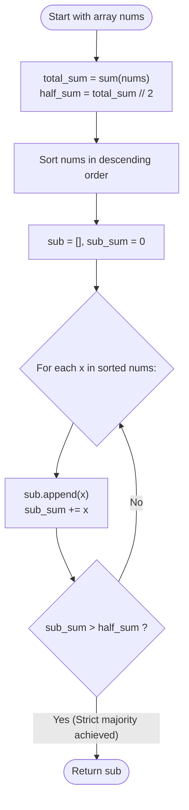

# Guided Example: Minimum Subsequence in Non-Increasing Order

We trace the step-by-step execution of the descending greedy prefix selection strategy on a representative array instance:

- **Input:** `nums = [4, 3, 10, 9, 8]`
- **Required output:** `[10, 9]`

This instance is chosen because taking only the single largest element ($10$) is insufficient ($10 < 24$), but adding the second largest element ($9$) raises the subsequence sum to $19$, strictly exceeding the remaining sum ($15$) with the minimal possible cardinality ($2$).

---

## 1. Instance & Teaching Goal

Given an integer array `nums`, we must find a subsequence whose sum of elements is strictly greater than the sum of the remaining non-included elements. Among all such subsequences, we must:
1. Minimize the size of the subsequence.
2. If multiple subsequences share the minimum size, maximize their total sum.
3. Return the elements of the subsequence sorted in non-increasing order.

For `nums = [4, 3, 10, 9, 8]`:
- Total array sum: $S = 4 + 3 + 10 + 9 + 8 = 34$.
- Half-sum threshold: $S / 2 = 17$.
- A subsequence with sum $T$ satisfies the condition if:
  $$
  T > S - T \iff 2T > S \iff T > 17
  $$
- Descending order of elements: $[10, 9, 8, 4, 3]$.
- Prefix of length $1$: $[10] \implies \text{sum} = 10 \le 17$ (insufficient).
- Prefix of length $2$: $[10, 9] \implies \text{sum} = 10 + 9 = 19 > 17$ (strictly greater than remaining sum $15$).
- Output: `[10, 9]`.

The primary teaching goal is to use a **greedy exchange argument**: to reach a target sum with the fewest possible elements, one must choose elements with the largest available magnitudes. Sorting descending and accumulating elements until $2T > S$ guarantees minimal length and maximal sum simultaneously.

---

## 2. Conceptual Foundation & Invariants

Let $S = \sum_{x \in nums} x$ be the total sum.
Let $\mathcal{A}$ be the chosen subsequence of size $k$ with sum $T = \sum_{a \in \mathcal{A}} a$.
The condition $T > S - T$ simplifies algebraically to:
$$
2T > S \quad \text{or} \quad T > \left\lfloor \frac{S}{2} \right\rfloor
$$

### Optimality by Exchange Argument

Suppose an optimal subset of size $k$ contains an element $u$, but omits an available element $v$ such that $v > u$.
- Swapping $u$ for $v$ produces a new subset of identical size $k$ whose sum increases by $v - u > 0$.
- Repeating this exchange shows that for any fixed size $k$, the maximum possible sum is achieved exclusively by taking the **$k$ largest elements** of the array.
- Therefore, the search space is restricted to prefixes of the array sorted in descending order:
  $$
  nums_{(1)} \ge nums_{(2)} \ge \dots \ge nums_{(n)}
  $$

```
Greedy Accumulation vs Total Sum:
Total Sum S = 34  -->  Strict Majority Threshold = 17
Sorted nums:   [ 10,     9,     8,     4,     3 ]
Prefix Sum:      10     19*
Condition:     10 <= 17  19 > 17 (Threshold passed!)
Selected Subsequence: [10, 9]
Remaining Elements:   [8, 4, 3] (Sum = 15 < 19)
```

We define state tracking parameters:

| Parameter | Mathematical Meaning | Initial Value |
|---|---|---|
| Total Sum ($S$) | $\sum_{i} nums[i]$ | $34$ |
| Target Threshold | $\lfloor S / 2 \rfloor$ | $17$ |
| Subsequence Sum ($T$) | Cumulative sum of selected elements | $0$ |
| Subsequence List | Accumulator of selected items | $[]$ |

> **Invariant.** Selecting elements in descending order guarantees that at each step $k$, the accumulated prefix has the strictly maximal sum achievable among all subsets of size $k$. The first $k$ that satisfies $2T > S$ is therefore the minimum feasible size.

---

## 3. Step-by-Step Worked Execution

Given `nums = [4, 3, 10, 9, 8]`:

### Step 1: Total Sum and Threshold Calculation

Sum all elements in the input array:
$$
S = 4 + 3 + 10 + 9 + 8 = 34
$$
Condition for strict majority:
$$
T > 34 - T \iff 2T > 34 \iff T \ge 18
$$

---

### Step 2: Sort in Descending Order

Sort `nums` in non-increasing order:
$$
A_{\text{desc}} = [10, 9, 8, 4, 3]
$$

| Position | Value |
|---|---|
| Index $0$ | $10$ |
| Index $1$ | $9$ |
| Index $2$ | $8$ |
| Index $3$ | $4$ |
| Index $4$ | $3$ |

---

### Step 3: Sequential Greedy Selection

- **Step 1 (Element $10$):**
  - Append $10$ to subsequence: `sub = [10]`.
  - Update sum: $T = 0 + 10 = 10$.
  - Check condition: Is $10 > 17$? **False** ($10 \le 17$).
  - Remaining sum: $34 - 10 = 24$. Continue.

- **Step 2 (Element $9$):**
  - Append $9$ to subsequence: `sub = [10, 9]`.
  - Update sum: $T = 10 + 9 = 19$.
  - Check condition: Is $19 > 17$? **True** ($19 > 15$).
  - Strict majority achieved! Halt selection.

Final result: `[10, 9]`.

---

## 4. Complete Execution Trace

| Step ($k$) | Candidate Element | Subsequence Array | Subsequence Sum ($T$) | Remaining Sum ($S - T$) | Strict Majority ($T > S - T$)? | Action |
|---|---|---|---|---|---|---|
| $0$ | - | $[]$ | $0$ | $34$ | False | Start |
| $1$ | $10$ | $[10]$ | $10$ | $24$ | False ($10 \le 24$) | Include next |
| $2$ | $9$ | $[10, 9]$ | $19$ | $15$ | **True ($19 > 15$)** | **Halt & Return** |

---

## 5. Algorithmic Correctness & Complexity Derivation

### Minimality and Maximality Proof

1. **Size Minimality:** Let $k^*$ be the smallest integer such that $\sum_{i=1}^{k^*} nums_{(i)} > S / 2$. Because the prefix $nums_{(1 \dots k)}$ has the maximum possible sum for any subset of size $k$, any other subset of size $k < k^*$ must have sum $T' \le \sum_{i=1}^k nums_{(i)} \le S / 2$, which fails the strict majority requirement. Thus, no subset of size smaller than $k^*$ can qualify.
2. **Sum Maximality:** Among all subsets of size $k^*$, the prefix $nums_{(1 \dots k^*)}$ achieves the maximal possible sum by definition of descending sorting.
3. **Ordering:** Returning the elements in descending order directly matches the required non-increasing order.

### Asymptotic Complexity

- **Time Complexity:** $\mathcal{O}(n \log n)$ using comparison sort, or $\mathcal{O}(n + M)$ using bucket sort / counting sort (where $M = \max(nums) \le 100$). The subsequent linear scan takes at most $\mathcal{O}(n)$ steps. Overall runtime is $\mathcal{O}(n \log n)$, running in less than $1$ millisecond for $n \le 500$.
- **Auxiliary Space Complexity:** $\mathcal{O}(n)$ to store the sorted array and return the result subsequence.

---

## 6. Traps & Edge Cases

- **Strict Inequality:** The condition requires $T > S - T$, not $T \ge S - T$. In an array like `[5, 5]`, sum $S = 10$. Taking one $5$ gives $T = 5 = 10 - 5$, which does not strictly exceed the remainder. Both elements must be taken, returning `[5, 5]`.
- **Single Element Array:** For $nums = [7]$, $S = 7$. $T = 7 > 0$. The loop takes $7$ and terminates at length $1$, returning `[7]`.
- **Duplicate Values:** Duplicates are handled correctly; if the largest elements are tied, picking either or both maintains the maximal prefix sum property.

---

## 7. Accessible Mermaid Diagram


