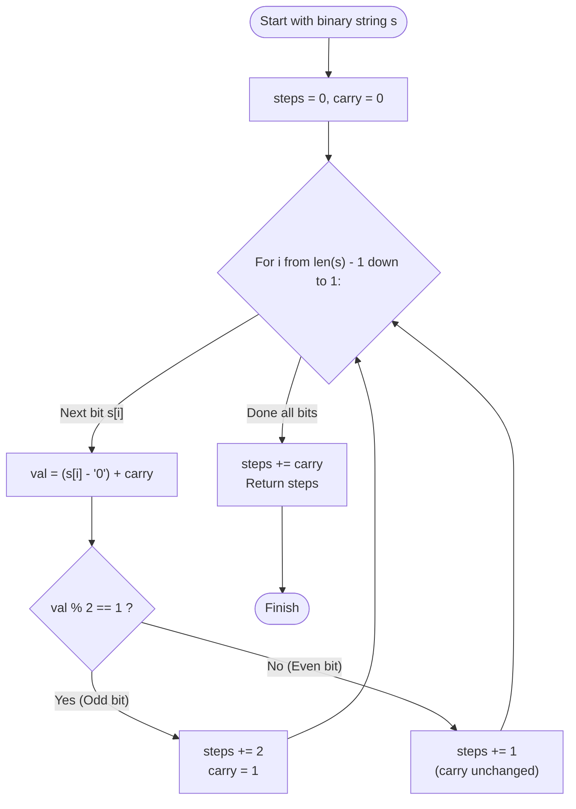

# Guided Example: Number of Steps to Reduce a Number in Binary Representation to One

We trace the step-by-step execution of the right-to-left carry bitwise reduction strategy on a representative binary instance:

- **Input:** `s = "1101"` (Decimal $13$)
- **Required output:** `6`

This instance is chosen because it demonstrates both operation branches—adding $1$ to odd values (generating ripple carries) and shifting right for even values—until the number collapses to $1$.

---

## 1. Instance & Teaching Goal

Given a binary string $s$ representing an integer, we must count the number of operations needed to reduce it to $1$ under the Collatz-like binary rules:
1. If the current number is **even**, divide it by $2$ (equivalent to right-shifting by $1$ bit and dropping the trailing zero).
2. If the current number is **odd**, add $1$ to it (generating a binary addition with potential carry propagation).

For `s = "1101"` (Decimal $13$):
- Step 1: $13$ is odd $\implies 13 + 1 = 14$ (`"1110"`)
- Step 2: $14$ is even $\implies 14 / 2 = 7$ (`"111"`)
- Step 3: $7$ is odd $\implies 7 + 1 = 8$ (`"1000"`)
- Step 4: $8$ is even $\implies 8 / 2 = 4$ (`"100"`)
- Step 5: $4$ is even $\implies 4 / 2 = 2$ (`"10"`)
- Step 6: $2$ is even $\implies 2 / 2 = 1$ (`"1"`)
- Total steps: $6$.

Because the input string length $n$ can be up to $500$, the integer value can reach $2^{500}$, far exceeding standard 64-bit hardware integer registers. Physical string manipulation takes $\mathcal{O}(n^2)$ time due to repeated memory reallocation.

The primary teaching goal is to recognize that bits can be processed in a **single pass from right to left (least significant to most significant)** using a single binary `carry` scalar in $\mathcal{O}(n)$ time and $\mathcal{O}(1)$ auxiliary space.

---

## 2. Conceptual Foundation & Invariants

Let $i$ range from $n - 1$ down to $1$ (processing bits up to, but excluding, the leading most-significant bit at index $0$).
Maintain a scalar flag $carry \in \{0, 1\}$.
At bit position $i$, the effective bit value is:
$$
v = (s[i] - \text{'0'}) + carry
$$

There are two possibilities for effective value $v$:
1. **Effective bit is odd ($v = 1$):**
   - The number ends in $1$ (odd).
   - We must add $1$ (Step 1, costs $1$ operation). This turns the bit to $0$ and generates a carry: $carry \leftarrow 1$.
   - The number now ends in $0$ (even), so we immediately divide by $2$ (Step 2, costs $1$ operation), discarding this position.
   - Total cost for this position: $2$ operations.
2. **Effective bit is even ($v = 0$ or $v = 2$):**
   - If $v = 0$: The bit is $0$ with no carry. Dividing by $2$ costs $1$ operation. $carry$ remains $0$.
   - If $v = 2$: The bit was $1$ with incoming carry $1$. Adding the carry produced $0$ with a carry out ($carry \leftarrow 1$). The trailing zero is divided away, costing $1$ operation.
   - Total cost for this position: $1$ operation.

```
Carry-Based Reduction Analysis:
Bit (s[i])   Incoming Carry   Effective Value (v)   Operations Required   Outgoing Carry
----------------------------------------------------------------------------------------
0            0                0 (Even)              1 (Divide by 2)       0
1            0                1 (Odd)               2 (Add 1 + Divide)    1
0            1                1 (Odd)               2 (Add 1 + Divide)    1
1            1                2 (Even)              1 (Divide by 2)       1

Terminal State at index 0:
Leading bit is always '1'. With carry: 1 + carry.
If carry == 1: 1 + 1 = 2 -> Needs 1 extra division step to reach 1!
If carry == 0: 1 + 0 = 1 -> Already 1!
```

After reaching the most significant bit at index $0$ ($s[0] = \text{'1'}$):
- The final value is $1 + carry$.
- If $carry = 1$, the value is $2$, which requires $1$ additional division step to reach $1$.
- Total operations: $steps + carry$.

We define state tracking parameters:

| Parameter | Mathematical Meaning | Initial Value |
|---|---|---|
| Scan Pointer ($i$) | Bit position from $n - 1$ down to $1$ | $n - 1$ |
| Carry Bit ($carry$) | Pending addition carry from lower bits | $0$ |
| Total Steps ($steps$) | Cumulative count of division and addition steps | $0$ |
| Terminal Adjustment | Addition of remaining carry | $+ carry$ at finish |

> **Invariant.** For each processed bit index $i$, all bits at positions $> i$ have been reduced to zero and eliminated. The state $(i, carry)$ accurately summarizes the remaining prefix of the number.

---

## 3. Step-by-Step Worked Execution

For `s = "1101"` ($n = 4$):
- Initialize $steps = 0$, $carry = 0$.

### Step 1: Bit at Index $i = 3$ ($s[3] = \text{'1'}$)

- Current bit: $s[3] = \text{'1'}$.
- Incoming carry: $carry = 0$.
- Effective value: $v = 1 + 0 = 1$ (**Odd**).
- Operations performed:
  - Add $1$: number becomes even, generates carry ($carry \leftarrow 1$). (Cost $+1$)
  - Divide by $2$: drop trailing zero. (Cost $+1$)
- Update: $steps \leftarrow 0 + 2 = 2$.

---

### Step 2: Bit at Index $i = 2$ ($s[2] = \text{'0'}$)

- Current bit: $s[2] = \text{'0'}$.
- Incoming carry: $carry = 1$.
- Effective value: $v = 0 + 1 = 1$ (**Odd**).
- Operations performed:
  - Add $1$: generates new carry ($carry \leftarrow 1$). (Cost $+1$)
  - Divide by $2$: drop trailing zero. (Cost $+1$)
- Update: $steps \leftarrow 2 + 2 = 4$.

---

### Step 3: Bit at Index $i = 1$ ($s[1] = \text{'1'}$)

- Current bit: $s[1] = \text{'1'}$.
- Incoming carry: $carry = 1$.
- Effective value: $v = 1 + 1 = 2$ (**Even**).
- Operations performed:
  - Bit is even ($2 \equiv 0 \pmod 2$), carry continues ($carry \leftarrow 1$).
  - Divide by $2$: drop trailing zero. (Cost $+1$)
- Update: $steps \leftarrow 4 + 1 = 5$.

---

### Step 4: Terminal Evaluation at Index $i = 0$

- The loop over indices $3, 2, 1$ has finished.
- Most significant bit $s[0] = \text{'1'}$.
- Incoming carry is $carry = 1$.
- Total at root: $1 + carry = 1 + 1 = 2$.
- Reducing $2$ to $1$ requires dividing by $2$, which takes $1$ additional step ($carry = 1$).
- Final answer: $steps + carry = 5 + 1 = 6$.

---

## 4. Complete Execution Trace

| Index ($i$) | Character $s[i]$ | Incoming $carry$ | Effective $v$ | Parity | Operations Added | Outgoing $carry$ | Cumulative Steps |
|---|---|---|---|---|---|---|---|
| $3$ | `'1'` | $0$ | $1$ | Odd | $+2$ (Add + Div) | $1$ | $2$ |
| $2$ | `'0'` | $1$ | $1$ | Odd | $+2$ (Add + Div) | $1$ | $4$ |
| $1$ | `'1'` | $1$ | $2$ | Even | $+1$ (Div) | $1$ | $5$ |
| $0$ | `'1'` | $1$ | - | Terminal | $+ carry = 1$ | - | **$6$** |

---

## 5. Algorithmic Correctness & Complexity Derivation

### Mathematical Equivalence to Bitwise Operations

Let $X$ be the integer represented by binary string $s$.
- If $X$ is odd, $X \leftarrow X + 1$ followed by $X \leftarrow X / 2$ is equivalent to $X \leftarrow (X + 1) / 2$. This shifts the least significant bit away while creating a carry into the next bit.
- If $X$ is even, $X \leftarrow X / 2$ simply discards the least significant bit.
- Because each bit from position $n - 1$ down to $1$ must eventually be shifted out:
  - Any bit that resolves to $1$ requires $1$ addition and $1$ shift ($2$ operations).
  - Any bit that resolves to $0$ requires $1$ shift ($1$ operation).
- The carry flag precisely tracks whether prior additions have rolled over into the current position.
- Finally, when only the leading bit remains, if an unabsorbed carry exists, the value is $2$, requiring exactly $1$ more division.

### Asymptotic Complexity

- **Time Complexity:** $\mathcal{O}(n)$, where $n = |s|$. The algorithm traverses the string of length $n$ once from right to left, executing $\mathcal{O}(1)$ arithmetic operations per bit.
- **Auxiliary Space Complexity:** $\mathcal{O}(1)$. Requires only scalar variables ($steps$ and $carry$).

---

## 6. Traps & Edge Cases

- **Single-Bit Input ($s = \text{"1"} $):** The loop from $n - 1$ down to $1$ does not execute. $carry = 0$, correctly returning $0$ steps.
- **Carry Persistence:** Once a carry is generated by the first odd bit, every subsequent `'0'` bit turns into an odd bit ($0 + 1 = 1$), requiring $2$ operations and re-propagating the carry.
- **Overflow Prevention:** Storing the number as an integer is impossible in 64-bit systems when $n = 500$. Processing character-by-character avoids all numeric overflow issues.

---

## 7. Accessible Mermaid Diagram


