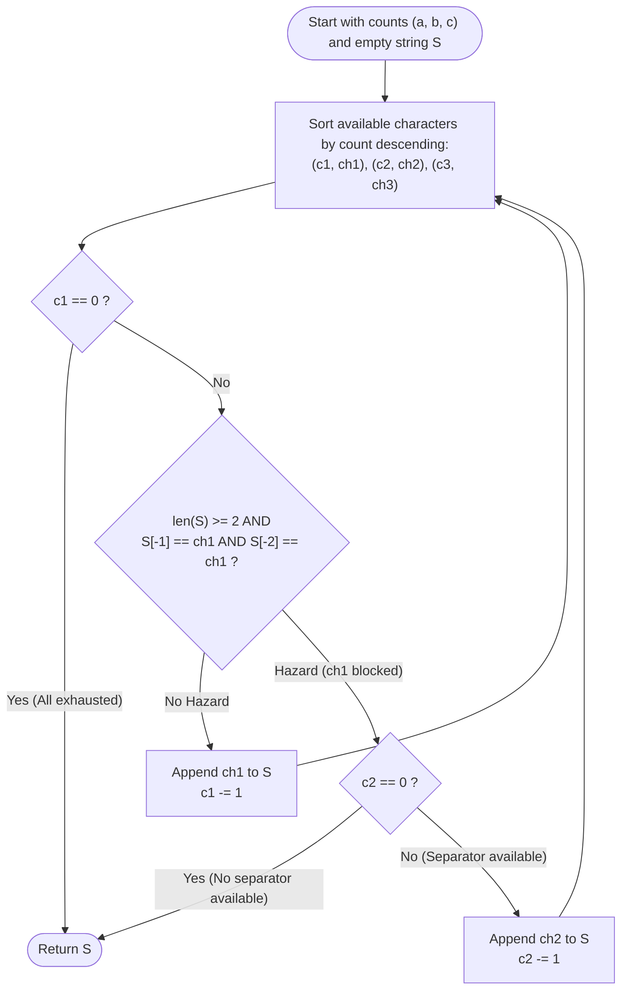

# Guided Example: Longest Happy String

We trace the step-by-step execution of the greedy frequency prioritization and separator-insertion strategy on a representative string instance:

- **Input:** `a = 1`, `b = 1`, `c = 7`
- **Required output:** `"ccaccbcc"`

This instance is chosen because character `'c'` is heavily overrepresented ($7$ copies vs $1$ copy each of `'a'` and `'b'`), demonstrating how the dominant character must be throttled to pairs of at most two, using `'a'` and `'b'` as single-character separators to maximize the length without violating the three-in-a-row constraint.

---

## 1. Instance & Teaching Goal

Given three non-negative integers $a, b, c$, we must construct the longest possible **happy string** containing at most $a$ `'a'`s, $b$ `'b'`s, and $c$ `'c'`s. A string is happy if it does **not** contain `"aaa"`, `"bbb"`, or `"ccc"` as a substring (i.e., no character appears three consecutive times).

For `a = 1, b = 1, c = 7`:
- Total characters available: $1 + 1 + 7 = 9$.
- If we append only `'c'`, we can write at most `"cc"` before being blocked.
- To use more `'c'`s, we must insert other characters (`'a'` and `'b'`) as separators:
  - Append `"cc"` (uses $2$ `'c'`s)
  - Append `'a'` (separator, resets `'c'` counter)
  - Append `"cc"` (uses $2$ more `'c'`s)
  - Append `'b'` (separator, resets `'c'` counter)
  - Append `"cc"` (uses $2$ more `'c'`s)
  - Total length: $2 + 1 + 2 + 1 + 2 = 8$. One remaining `'c'` cannot be placed.
- Output: `"ccaccbcc"`.

The primary teaching goal is to formulate the **greedy separator policy**: always greedily choose the character with the largest remaining supply unless doing so would produce three identical characters in a row, in which case we fall back to the second most abundant character as a single separator.

---

## 2. Conceptual Foundation & Invariants

Let $(c_1, \text{char}_1), (c_2, \text{char}_2), (c_3, \text{char}_3)$ represent the available characters sorted such that $c_1 \ge c_2 \ge c_3 > 0$.
Let $\mathcal{S}$ be the string constructed so far.

Decision logic at each step:
1. Inspect the most abundant character $\text{char}_1$:
   - Check if $\mathcal{S}$ already ends with two copies of $\text{char}_1$ (i.e., $|\mathcal{S}| \ge 2$ and $\mathcal{S}[-1] = \mathcal{S}[-2] = \text{char}_1$).
2. **Case A (No three-in-a-row hazard):**
   - Append $\text{char}_1$ to $\mathcal{S}$.
   - Decrement $c_1 \leftarrow c_1 - 1$.
3. **Case B (Hazard detected):**
   - $\text{char}_1$ is temporarily blocked.
   - Look at the second most abundant character $\text{char}_2$:
     - If $c_2 = 0$, no alternative character exists. **Halt execution!**
     - Otherwise, append $\text{char}_2$ to $\mathcal{S}$ as a separator.
     - Decrement $c_2 \leftarrow c_2 - 1$.

```
Greedy Prioritization with Separator Interleaving:
Remaining: c: 7, a: 1, b: 1
1. Append 'c' -> "c"      (c: 6, a: 1, b: 1)
2. Append 'c' -> "cc"     (c: 5, a: 1, b: 1)
3. 'c' blocked! Fallback to second-largest 'a':
   Append 'a' -> "cca"    (c: 5, b: 1, a: 0)
4. Append 'c' -> "ccac"   (c: 4, b: 1, a: 0)
5. Append 'c' -> "ccacc"  (c: 3, b: 1, a: 0)
6. 'c' blocked! Fallback to second-largest 'b':
   Append 'b' -> "ccaccb" (c: 3, a: 0, b: 0)
7. Append 'c' -> "ccaccbc"  (c: 2, a: 0, b: 0)
8. Append 'c' -> "ccaccbcc" (c: 1, a: 0, b: 0)
9. 'c' blocked! No alternative remaining (a=0, b=0) -> STOP.
```

We define state tracking parameters:

| Parameter | Mathematical Meaning | Initial State |
|---|---|---|
| Available Counts | $(count_a, count_b, count_c)$ | $(1, 1, 7)$ |
| Constructed String ($\mathcal{S}$) | Accumulated happy string | `""` |
| Suffix Hazard Flag | Boolean: $\mathcal{S}[-1] == \mathcal{S}[-2] == \text{char}$ | Evaluated per step |
| Active Selection | Character chosen by greedy rule | Dynamic |

> **Invariant.** At every point during construction, $\mathcal{S}$ never contains three consecutive identical characters, and the character with the maximum remaining quota is prioritized to prevent quota starvation.

---

## 3. Step-by-Step Worked Execution

We trace the step-by-step construction for $a = 1, b = 1, c = 7$:

### Phase 1: First Pair of `'c'`s and Separator `'a'`

- **Step 1:** Counts are $(c: 7, a: 1, b: 1)$.
  - Most abundant: `'c'`. Suffix has length $< 2$.
  - Append `'c'`. $\mathcal{S} = \text{"c"}$. Remaining: $(c: 6, a: 1, b: 1)$.
- **Step 2:** Counts are $(c: 6, a: 1, b: 1)$.
  - Most abundant: `'c'`. Suffix is `"c"` (only $1$ `'c'`).
  - Append `'c'`. $\mathcal{S} = \text{"cc"}$. Remaining: $(c: 5, a: 1, b: 1)$.
- **Step 3:** Counts are $(c: 5, a: 1, b: 1)$.
  - Most abundant is `'c'`, but suffix is `"cc"`. Adding `'c'` would make `"ccc"` (forbidden!).
  - Fallback to second most abundant: `'a'` ($count = 1 > 0$).
  - Append `'a'`. $\mathcal{S} = \text{"cca"}$. Suffix reset! Remaining: $(c: 5, b: 1, a: 0)$.

| Step | Remaining Quotas | Suffix | Choice | Rationale | Resulting String |
|---|---|---|---|---|---|
| $1$ | $c:7, a:1, b:1$ | `""` | `'c'` | Maximum available | `"c"` |
| $2$ | $c:6, a:1, b:1$ | `"c"` | `'c'` | Maximum available, no hazard | `"cc"` |
| $3$ | $c:5, a:1, b:1$ | `"cc"` | `'a'` | `'c'` blocked; use 2nd max separator | `"cca"` |

---

### Phase 2: Second Pair of `'c'`s and Separator `'b'`

- **Step 4:** Counts are $(c: 5, b: 1, a: 0)$.
  - Most abundant: `'c'`. Suffix ends with `"ca"` (not `"cc"`).
  - Append `'c'`. $\mathcal{S} = \text{"ccac"}$. Remaining: $(c: 4, b: 1, a: 0)$.
- **Step 5:** Counts are $(c: 4, b: 1, a: 0)$.
  - Most abundant: `'c'`. Suffix ends with `"ac"` (not `"cc"`).
  - Append `'c'`. $\mathcal{S} = \text{"ccacc"}$. Remaining: $(c: 3, b: 1, a: 0)$.
- **Step 6:** Counts are $(c: 3, b: 1, a: 0)$.
  - Most abundant is `'c'`, but suffix is `"cc"` (hazard!).
  - Fallback to second most abundant: `'b'` ($count = 1 > 0$).
  - Append `'b'`. $\mathcal{S} = \text{"ccaccb"}$. Suffix reset! Remaining: $(c: 3, a: 0, b: 0)$.

| Step | Remaining Quotas | Suffix | Choice | Rationale | Resulting String |
|---|---|---|---|---|---|
| $4$ | $c:5, b:1, a:0$ | `"ca"` | `'c'` | Maximum available | `"ccac"` |
| $5$ | $c:4, b:1, a:0$ | `"ac"` | `'c'` | Maximum available, no hazard | `"ccacc"` |
| $6$ | $c:3, b:1, a:0$ | `"cc"` | `'b'` | `'c'` blocked; use 2nd max separator | `"ccaccb"` |

---

### Phase 3: Final Pair of `'c'`s and Exhaustion

- **Step 7:** Counts are $(c: 3, a: 0, b: 0)$.
  - Most abundant: `'c'`. Suffix is `"cb"`.
  - Append `'c'`. $\mathcal{S} = \text{"ccaccbc"}$. Remaining: $(c: 2, a: 0, b: 0)$.
- **Step 8:** Counts are $(c: 2, a: 0, b: 0)$.
  - Most abundant: `'c'`. Suffix is `"bc"`.
  - Append `'c'`. $\mathcal{S} = \text{"ccaccbcc"}$. Remaining: $(c: 1, a: 0, b: 0)$.
- **Step 9:** Counts are $(c: 1, a: 0, b: 0)$.
  - Most abundant is `'c'`, but suffix is `"cc"`.
  - Check second most abundant: neither `'a'` nor `'b'` has positive count ($a=0, b=0$).
  - No valid character can be appended without producing `"ccc"`.
  - **Halt!**

Final string: `"ccaccbcc"`.

---

## 4. Complete Execution Trace

| Step | State Before Step $(a, b, c)$ | Candidate Selected | Suffix Before Step | Hazard Avoided | Emitted Char | Output String |
|---|---|---|---|---|---|---|
| $1$ | $(1, 1, 7)$ | `'c'` | `""` | None | `'c'` | `"c"` |
| $2$ | $(1, 1, 6)$ | `'c'` | `"c"` | None | `'c'` | `"cc"` |
| $3$ | $(1, 1, 5)$ | `'a'` (2nd) | `"cc"` | Prevented `"ccc"` | `'a'` | `"cca"` |
| $4$ | $(0, 1, 5)$ | `'c'` | `"ca"` | None | `'c'` | `"ccac"` |
| $5$ | $(0, 1, 4)$ | `'c'` | `"ac"` | None | `'c'` | `"ccacc"` |
| $6$ | $(0, 1, 3)$ | `'b'` (2nd) | `"cc"` | Prevented `"ccc"` | `'b'` | `"ccaccb"` |
| $7$ | $(0, 0, 3)$ | `'c'` | `"cb"` | None | `'c'` | `"ccaccbc"` |
| $8$ | $(0, 0, 2)$ | `'c'` | `"bc"` | None | `'c'` | **`"ccaccbcc"`** |
| $9$ | $(0, 0, 1)$ | None | `"cc"` | Blocked, no fallback | - | **Halt** |

---

## 5. Algorithmic Correctness & Complexity Derivation

### Greedy Choice Optimality

Let $c_{\max}$ be the maximum quota of any character, and $c_{\text{rest}}$ be the sum of quotas of the remaining characters.
- In any valid happy string, at most $2$ copies of the dominant character can appear consecutively.
- Therefore, each occurrence of a non-dominant character can separate at most $2$ dominant characters.
- The theoretical maximum number of dominant characters that can ever be used is $2(c_{\text{rest}} + 1)$.
- In our example, $c_{\text{rest}} = a + b = 2$, so at most $2(2 + 1) = 6$ copies of `'c'` can be placed.
- Our greedy construction placed exactly $6$ copies of `'c'`, achieving the mathematical upper bound.
- The policy of burning the dominant character whenever legal strictly minimizes waste.

### Asymptotic Complexity

- **Time Complexity:** $\mathcal{O}(a + b + c)$. Each iteration appends exactly one character to the string. Sorting the three element counts takes $\mathcal{O}(1)$ time since $|\Sigma| = 3$. Total loop iterations equal the length of the emitted string $\le a + b + c \le 300$.
- **Auxiliary Space Complexity:** $\mathcal{O}(1)$ auxiliary space beyond the string builder.

---

## 6. Traps & Edge Cases

- **Zero Starting Quotas ($a = b = c = 0$):** No characters can be picked, correctly returning the empty string `""`.
- **Single Dominant Character:** If $b = 0, c = 0$, and $a = 10$, only two `'a'`s can be placed, correctly yielding `"aa"`.
- **Three-Way Tie:** If $a = b = c$, all characters can be exhausted without ever being blocked.
- **Suffix Tracking:** Only the last two characters of the accumulator string need to be checked; full string scans are unnecessary.

---

## 7. Accessible Mermaid Diagram


