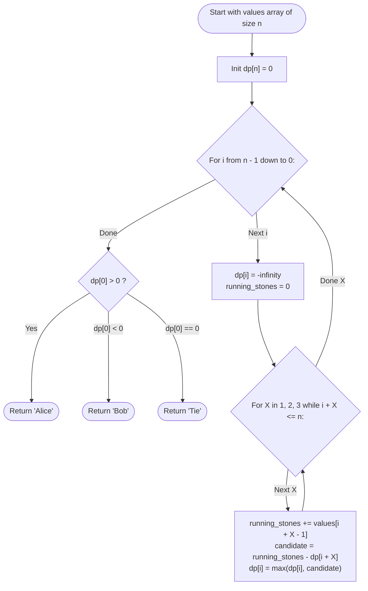

# Guided Example: Stone Game III

We trace the step-by-step execution of the backward suffix minimax dynamic programming strategy on a representative game instance:

- **Input:** `values = [1, 2, 3, 7]`
- **Required output:** `"Bob"`

This instance is chosen because taking all three available stones on the first turn ($1 + 2 + 3 = 6$) appears tempting, but leaves the high-value stone ($7$) for the opponent, proving why backward dynamic programming is required to discover the counter-intuitive game-theoretic outcome.

---

## 1. Instance & Teaching Goal

Alice and Bob play a game with a row of stones of values `values[0 ... n - 1]`. Alice plays first. On each turn, a player may take $1$, $2$, or $3$ stones from the front of the remaining row. The score of a player is the sum of the values of the stones taken. Both players play with optimal game-theoretic strategy to maximize their own total score.

The game ends when all stones are taken. We must determine the winner:
- Return `"Alice"` if Alice's final score strictly exceeds Bob's.
- Return `"Bob"` if Bob's final score strictly exceeds Alice's.
- Return `"Tie"` if their final scores are equal.

For `values = [1, 2, 3, 7]`:
- If Alice takes $1$ stone ($1$): Remaining are $[2, 3, 7]$. Bob can take all three ($2 + 3 + 7 = 12$). Bob score $= 12$, Alice score $= 1 \implies$ Bob wins by $11$.
- If Alice takes $2$ stones ($1 + 2 = 3$): Remaining are $[3, 7]$. Bob takes both ($3 + 7 = 10$). Bob score $= 10$, Alice score $= 3 \implies$ Bob wins by $7$.
- If Alice takes $3$ stones ($1 + 2 + 3 = 6$): Remaining is $[7]$. Bob takes it ($7$). Bob score $= 7$, Alice score $= 6 \implies$ Bob wins by $1$.
- In every branch, Bob wins. Therefore, optimal play results in `"Bob"`.

The primary teaching goal is to formulate a zero-sum **suffix relative score difference**: letting $dp[i]$ represent the maximum value of $(\text{current player's score} - \text{opponent's score})$ obtainable from the remaining suffix $values[i \dots n - 1]$, solved backwards from $n$ down to $0$.

---

## 2. Conceptual Foundation & Invariants

Let $dp[i]$ be the maximum lead (score difference) the player whose turn it is can achieve on the suffix $values[i \dots n - 1]$.
From index $i$, the active player can choose to take $X \in \{1, 2, 3\}$ stones (with $i + X \le n$):
- The player gains the immediate stone values: $\sum_{k=0}^{X-1} values[i + k]$.
- From the remaining suffix starting at $i + X$, the opponent will achieve a relative lead of $dp[i + X]$.
- Therefore, the current player's net lead for choice $X$ is:
  $$
  \text{gain}(X) = \left( \sum_{k=0}^{X-1} values[i + k] \right) - dp[i + X]
  $$

The optimal choice maximizes this net advantage:
$$
dp[i] = \max_{X \in \{1, 2, 3\}, i + X \le n} \left( \sum_{k=0}^{X-1} values[i + k] - dp[i + X] \right)
$$
Base case: $dp[n] = 0$ (no stones left $\implies$ zero score difference).

```
Backward Suffix Transition:
Index i:    [  values[i]   |   values[i+1]   |   values[i+2]   ]   ...   [ values[n-1] ]
              \--------- choice X in {1, 2, 3} ---------/                \---- n ----/
                                                                           dp[n] = 0
Choice X=1: values[i] - dp[i+1]
Choice X=2: (values[i] + values[i+1]) - dp[i+2]
Choice X=3: (values[i] + values[i+1] + values[i+2]) - dp[i+3]
dp[i] = max(Choice 1, Choice 2, Choice 3)
```

At the conclusion of the backward pass, $dp[0]$ represents Alice's relative score minus Bob's relative score from the starting position:
- If $dp[0] > 0 \implies \text{"Alice"}$
- If $dp[0] < 0 \implies \text{"Bob"}$
- If $dp[0] = 0 \implies \text{"Tie"}$

We define state tracking parameters:

| Parameter | Mathematical Meaning | Initial Value |
|---|---|---|
| Suffix Index ($i$) | Starting position of remaining stones | $n = 4$ down to $0$ |
| Suffix Table ($dp[i]$) | Max relative advantage on $values[i \dots n-1]$ | $dp[n] = 0$ |
| Choice Size ($X$) | Number of stones selected ($1, 2, 3$) | Evaluated per step |
| Game Outcome | Determined by sign of $dp[0]$ | Evaluated at $i = 0$ |

> **Invariant.** For every suffix $i$, $dp[i]$ represents the game-theoretic minimax value of the zero-sum differential game played on $values[i \dots n-1]$, assuming both players play with perfect foresight.

---

## 3. Step-by-Step Worked Execution

For `values = [1, 2, 3, 7]` ($n = 4$):
- Base case: $dp[4] = 0$.

### Step 1: Evaluating Index $i = 3$ ($values[3] = 7$)

Only $X = 1$ is within bounds ($3 + 1 \le 4$):
- $X = 1$: $values[3] - dp[4] = 7 - 0 = 7$.
- $dp[3] = 7$.

---

### Step 2: Evaluating Index $i = 2$ ($values[2] = 3$)

Feasible choices are $X \in \{1, 2\}$:
- $X = 1$: $values[2] - dp[3] = 3 - 7 = -4$.
- $X = 2$: $(values[2] + values[3]) - dp[4] = (3 + 7) - 0 = 10$.
- Maximize: $dp[2] = \max(-4, 10) = 10$ (taking $2$ stones is optimal).

---

### Step 3: Evaluating Index $i = 1$ ($values[1] = 2$)

Feasible choices are $X \in \{1, 2, 3\}$:
- $X = 1$: $values[1] - dp[2] = 2 - 10 = -8$.
- $X = 2$: $(values[1] + values[2]) - dp[3] = (2 + 3) - 7 = 5 - 7 = -2$.
- $X = 3$: $(values[1] + values[2] + values[3]) - dp[4] = (2 + 3 + 7) - 0 = 12 - 0 = 12$.
- Maximize: $dp[1] = \max(-8, -2, 12) = 12$ (taking $3$ stones is optimal).

---

### Step 4: Evaluating Index $i = 0$ ($values[0] = 1$)

Alice's opening choices from the initial state:
- $X = 1$: $values[0] - dp[1] = 1 - 12 = -11$.
- $X = 2$: $(values[0] + values[1]) - dp[2] = (1 + 2) - 10 = 3 - 10 = -7$.
- $X = 3$: $(values[0] + values[1] + values[2]) - dp[3] = (1 + 2 + 3) - 7 = 6 - 7 = -1$.
- Maximize:
  $$
  dp[0] = \max(-11, -7, -1) = -1
  $$
  (Alice minimizes her loss by taking $3$ stones, but Bob still achieves a $+1$ net advantage).

Since $dp[0] = -1 < 0$, Bob wins.
Return `"Bob"`.

| Index ($i$) | $values[i]$ | Option $X=1$ | Option $X=2$ | Option $X=3$ | Computed $dp[i]$ |
|---|---|---|---|---|---|
| $4$ | Boundary | - | - | - | $0$ |
| $3$ | $7$ | $7 - 0 = 7$ | - | - | $7$ |
| $2$ | $3$ | $3 - 7 = -4$ | $10 - 0 = 10$ | - | $10$ |
| $1$ | $2$ | $2 - 10 = -8$ | $5 - 7 = -2$ | $12 - 0 = 12$ | $12$ |
| $0$ | $1$ | $1 - 12 = -11$ | $3 - 10 = -7$ | $6 - 7 = -1$ | **$-1$** |

---

## 4. Complete Execution Trace

| Suffix Evaluated | Active Player | Best Move ($X$) | Stones Taken | Opponent Suffix | Net Differential ($dp[i]$) |
|---|---|---|---|---|---|
| $values[3 \dots 3] = [7]$ | Current | $X = 1$ | $[7]$ | Empty | $+7$ |
| $values[2 \dots 3] = [3, 7]$ | Current | $X = 2$ | $[3, 7]$ | Empty | $+10$ |
| $values[1 \dots 3] = [2, 3, 7]$ | Current | $X = 3$ | $[2, 3, 7]$ | Empty | $+12$ |
| $values[0 \dots 3] = [1, 2, 3, 7]$ | Alice | $X = 3$ | $[1, 2, 3]$ | $[7]$ | **$-1$ (Bob Wins)** |

---

## 5. Algorithmic Correctness & Complexity Derivation

### Minimax Theorem and Suffix Substructure

In a finite, deterministic two-player game with perfect information, the game tree is finite.
- Because turns alternate and players aim to maximize their own score, the difference formulation:
  $$
  \text{Player Differential} = \text{Stones Taken} - \text{Opponent Differential}
  $$
  encodes the minimax game tree with negamax symmetry.
- Any decision at index $i$ depends strictly on subproblems at indices $> i$, ensuring a topological ordering from right to left.
- Computing $dp[i]$ backwards for $i = n - 1 \dots 0$ guarantees that optimal future counter-strategies are already locked in when earlier decisions are made.

### Asymptotic Complexity

- **Time Complexity:** $\mathcal{O}(n)$. The algorithm computes $n$ states. Each state evaluates at most $3$ choices, each involving $\mathcal{O}(1)$ arithmetic operations. Total time is strictly $\mathcal{O}(n)$.
- **Auxiliary Space Complexity:** $\mathcal{O}(1)$ space, because computing $dp[i]$ requires only the three immediately succeeding states ($dp[i + 1], dp[i + 2], dp[i + 3]$), allowing rolling variable storage.

---

## 6. Traps & Edge Cases

- **Negative Stone Values:** Unlike some stone games where values are strictly positive, Stone Game III allows negative values (e.g., $values[i] = -5$). Players may strategically take fewer stones to force their opponent into negative territory.
- **Greedy Myopia:** Taking the move that yields the maximum immediate stones (e.g., taking $3$ stones) can be fatal if it exposes a high-value stone to the opponent. Backward DP naturally avoids greedy traps.
- **Index Out of Bounds:** When $i + X > n$, that branch cannot be executed and must be omitted from the $\max$ comparison.

---

## 7. Accessible Mermaid Diagram

