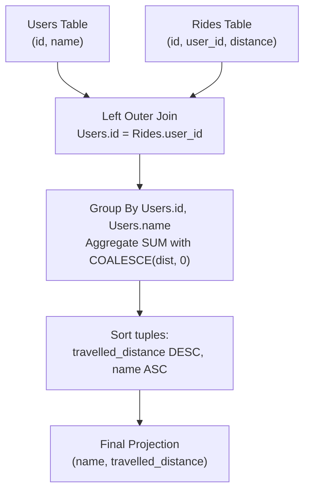

# Guided Example: Top Travellers

We trace the step-by-step execution of relational left outer join, grouped aggregation with null coalescing, and compound sorting on a representative database instance:

- **Input Tables:**
  - `Users`:
    - `(1, "Alice")`
    - `(2, "Bob")`
    - `(3, "Alex")`
    - `(4, "Donald")`
    - `(7, "Lee")`
    - `(13, "Jonathan")`
    - `(19, "Elvis")`
  - `Rides`:
    - `(1, 1, 120)`
    - `(2, 2, 317)`
    - `(3, 3, 222)`
    - `(4, 7, 100)`
    - `(5, 13, 312)`
    - `(6, 19, 50)`
    - `(7, 7, 120)`
    - `(8, 19, 400)`
    - `(9, 7, 230)`
- **Required Output:**
  - `("Elvis", 450)`
  - `("Lee", 450)`
  - `("Bob", 317)`
  - `("Jonathan", 312)`
  - `("Alex", 222)`
  - `("Alice", 120)`
  - `("Donald", 0)`

This instance features users with multiple rides (Lee, Elvis), users with exactly one ride (Bob, Jonathan, Alex, Alice), a tie in total distance (Elvis and Lee both at $450$), and a user with zero rides (Donald), fully exercising left join preservation and lexicographical tie-breaking.

---

## 1. Instance & Teaching Goal

We are given two relational entities:
1. `Users` with columns `id` (primary key) and `name`.
2. `Rides` with columns `id` (primary key), `user_id`, and `distance`.

Our objective is to compute the total distance traveled by every registered user, assigning a total distance of $0$ to any user who has taken zero rides. The final output relation must display `name` and `travelled_distance`, sorted primarily by `travelled_distance` descending, and secondarily by `name` ascending in alphabetical order.

Among the $7$ users:
- Donald has no corresponding records in `Rides`. Dropping him via an inner join would violate the requirement that all users appear; his distance must evaluate to $0$.
- Lee has three rides ($100 + 120 + 230 = 450$). Elvis has two rides ($50 + 400 = 450$). Because both accumulated $450$, alphabetical sorting on `name` must place Elvis before Lee (`"Elvis"` $<$ `"Lee"`).
- Bob ($317$), Jonathan ($312$), Alex ($222$), and Alice ($120$) follow in descending numerical sequence.

The primary teaching goal is to model full entity preservation through a relational left outer join ($\bowtie_{\text{left}}$), perform identity-safe aggregation grouping by primary key `id` rather than display name, handle null aggregates via coalescing, and apply multi-key tuple sorting.

---

## 2. Conceptual Foundation & Invariants

In relational algebra, the transformation pipeline consists of a left outer join, a grouped aggregation with default replacement for null values, and a composite order projection:

$$
\mathcal{T}_1 = \text{Users} \bowtie_{\text{left}, \text{Users.id} = \text{Rides.user\_id}} \text{Rides}
$$

$$
\mathcal{T}_2 = \gamma_{\text{Users.id}, \text{Users.name}, \sum(\text{coalesce}(\text{distance}, 0)) \to \text{travelled\_distance}}(\mathcal{T}_1)
$$

$$
\mathcal{R} = \Pi_{\text{name}, \text{travelled\_distance}} \left( \tau_{\text{travelled\_distance} \downarrow, \text{name} \uparrow}(\mathcal{T}_2) \right)
$$

```
Users (Preserved Left)       Rides (Right Match)          Aggregated (u.id, name)      Sorted Output
----------------------       -------------------          -----------------------      -------------
(1,  "Alice")   -----------> (1, 1, 120)               -> (1,  "Alice",    120)     -> ("Elvis",    450)
(2,  "Bob")     -----------> (2, 2, 317)               -> (2,  "Bob",      317)     -> ("Lee",      450)
(3,  "Alex")    -----------> (3, 3, 222)               -> (3,  "Alex",     222)     -> ("Bob",      317)
(4,  "Donald")  -----------> [No Match -> null]        -> (4,  "Donald",     0)     -> ("Jonathan", 312)
(7,  "Lee")     -----------> (4, 7, 100), (7, 7, 120), -> (7,  "Lee",      450)     -> ("Alex",     222)
                             (9, 7, 230)
(13, "Jonathan")-----------> (5, 13, 312)              -> (13, "Jonathan", 312)     -> ("Alice",    120)
(19, "Elvis")   -----------> (6, 19, 50), (8, 19, 400) -> (19, "Elvis",    450)     -> ("Donald",     0)
```

We establish relational tracking parameters across the query execution pipeline:

| Parameter | Relational Representation | Purpose |
|---|---|---|
| Preserved Base ($u$) | Tuple in $\text{Users}$ | Left-relation user identity with unique identifier |
| Matched Multiset ($M_u$) | $\{ r \in \text{Rides} \mid r[\text{user\_id}] = u[\text{id}] \}$ | Collection of ride distance scalars belonging to user $u$ |
| Effective Sum ($S_u$) | $\sum_{r \in M_u} r[\text{distance}]$ if $M_u \neq \emptyset$ else $0$ | Total mileage attributed to user $u$ |
| Ordered Relation ($\mathcal{R}$) | Tuples sorted by $(S_u \downarrow, u[\text{name}] \uparrow)$ | Final projected output relation |

> **Invariant.** For every user tuple $u \in \text{Users}$, there exists exactly one aggregated record in $\mathcal{T}_2$ grouped by the unique key $u[\text{id}]$. If $u$ has no corresponding tuples in $\text{Rides}$, $S_u = 0$; otherwise $S_u$ equals the exact sum of all matched ride distances.



---

## 3. Step-by-Step Worked Execution

### Step 1: Left Outer Join Preservation

We form the outer join $\mathcal{T}_1 = \text{Users} \bowtie_{\text{left}} \text{Rides}$ on predicate $u[\text{id}] = r[\text{user\_id}]$. Each user with $k \ge 1$ rides generates $k$ tuples. Donald has zero rides and generates $1$ tuple with null ride attributes:

| Joined Tuple Index | User (`id`, `name`) | Ride (`id`, `distance`) | Matched Status |
|---|---|---|---|
| $1$ | $(1, \text{"Alice"})$ | $(1, 120)$ | Single ride match |
| $2$ | $(2, \text{"Bob"})$ | $(2, 317)$ | Single ride match |
| $3$ | $(3, \text{"Alex"})$ | $(3, 222)$ | Single ride match |
| $4$ | $(4, \text{"Donald"})$ | $(\text{null}, \text{null})$ | Unmatched preserved left row |
| $5$ | $(7, \text{"Lee"})$ | $(4, 100)$ | Ride 1 of 3 |
| $6$ | $(7, \text{"Lee"})$ | $(7, 120)$ | Ride 2 of 3 |
| $7$ | $(7, \text{"Lee"})$ | $(9, 230)$ | Ride 3 of 3 |
| $8$ | $(13, \text{"Jonathan"})$ | $(5, 312)$ | Single ride match |
| $9$ | $(19, \text{"Elvis"})$ | $(6, 50)$ | Ride 1 of 2 |
| $10$ | $(19, \text{"Elvis"})$ | $(8, 400)$ | Ride 2 of 2 |

---

### Step 2: Grouped Aggregation by User Identifier

We group by primary key $u[\text{id}]$ and select $u[\text{name}]$, computing the sum of distance values. If the multiset of distances is empty or contains only null, the aggregate evaluates to $0$:

- **User 1 (Alice):** $\sum \{120\} = 120$.
- **User 2 (Bob):** $\sum \{317\} = 317$.
- **User 3 (Alex):** $\sum \{222\} = 222$.
- **User 4 (Donald):** Unmatched row has null distance; $\text{coalesce}(\text{null}, 0) = 0$.
- **User 7 (Lee):** $\sum \{100, 120, 230\} = 450$.
- **User 13 (Jonathan):** $\sum \{312\} = 312$.
- **User 19 (Elvis):** $\sum \{50, 400\} = 450$.

| User ID | Group Name | Distance Sum Terms | Resulting `travelled_distance` |
|---|---|---|---|
| $1$ | Alice | $120$ | $120$ |
| $2$ | Bob | $317$ | $317$ |
| $3$ | Alex | $222$ | $222$ |
| $4$ | Donald | $\emptyset \to 0$ | $0$ |
| $7$ | Lee | $100 + 120 + 230$ | $450$ |
| $13$ | Jonathan | $312$ | $312$ |
| $19$ | Elvis | $50 + 400$ | $450$ |

---

### Step 3: Multi-Key Compound Ordering

We order the resulting tuples by `travelled_distance` in descending order, resolving equal distance ties by `name` in ascending lexicographical order:

1. Max distance $450$: Elvis vs Lee. Comparing `"Elvis"` with `"Lee"` yields `"Elvis"` first.
2. Distance $317$: Bob.
3. Distance $312$: Jonathan.
4. Distance $222$: Alex.
5. Distance $120$: Alice.
6. Distance $0$: Donald.

| Rank | Projected `name` | Projected `travelled_distance` | Ordering Justification |
|---|---|---|---|
| $1$ | Elvis | $450$ | Distance $450$, `"Elvis"` precedes `"Lee"` alphabetically |
| $2$ | Lee | $450$ | Distance $450$ |
| $3$ | Bob | $317$ | Distance $317$ |
| $4$ | Jonathan | $312$ | Distance $312$ |
| $5$ | Alex | $222$ | Distance $222$ |
| $6$ | Alice | $120$ | Distance $120$ |
| $7$ | Donald | $0$ | Minimal distance $0$ |

---

## 4. Complete Execution Trace

| Step Phase | Entity Under Evaluation | Operation / Transformation | Intermediate Output Relation State |
|---|---|---|---|
| Setup | Relation $\text{Users}$ | Scan $7$ base users | $7$ candidate user partitions established |
| Join Probe | Relation $\text{Rides}$ | Hash-probe $r[\text{user\_id}]$ against $\text{Users.id}$ | $10$ joined tuples generated (Donald preserved with null) |
| Grouping | Group partition $u[\text{id}] = 7$ | Sum $\{100, 120, 230\}$ | Record $(7, \text{"Lee"}, 450)$ |
| Grouping | Group partition $u[\text{id}] = 19$ | Sum $\{50, 400\}$ | Record $(19, \text{"Elvis"}, 450)$ |
| Grouping | Group partition $u[\text{id}] = 4$ | Coalesce null distance sum | Record $(4, \text{"Donald"}, 0)$ |
| Aggregation Final | All $7$ user partitions | Materialize all $(u[\text{name}], S_u)$ pairs | $7$ aggregated rows produced |
| Sort Phase 1 | Distances $450, 317, 312, \dots$ | Descending sort on distance | Block partitions by distance values |
| Sort Phase 2 | Tie-breaking on $450$ | Ascending lexicographical comparison on name | Elvis placed at rank 1, Lee at rank 2 |
| Emission | All sorted partitions | Project columns `name`, `travelled_distance` | Final $7$-row relation emitted |

---

## 5. Algorithmic Correctness

**Soundness.** The relational left outer join guarantees that no tuple in $\text{Users}$ is discarded during intermediate filtering. Grouping on the primary key `u.id` guarantees that distinct individuals sharing identical names are not erroneously merged into a single bucket. Replacing null sums with $0$ satisfies the semantic specification that non-riders possess zero traveled distance.

**Completeness.** Every ride in $\text{Rides}$ is matched to exactly one user via the foreign key relationship $r[\text{user\_id}] = u[\text{id}]$. All distance terms are summed commutatively and transitively. The composite sort order $(S_u \downarrow, u[\text{name}] \uparrow)$ imposes a total ordering across all tuples, ensuring unique output row placement.

---

## 6. Traps This Instance Exposes

- **Inner Join Data Loss:** Using an inner join instead of a left outer join removes Donald entirely, yielding only $6$ output rows instead of $7$.
- **Grouping by Name:** Grouping by `u.name` instead of `u.id` merges two distinct users who happen to have the same name, combining their distances and omitting one row.
- **Uncoalesced Nulls:** Summing over an unmatched right record yields `null` in SQL. Without `coalesce` or `ifnull`, Donald's distance becomes `null` instead of the required $0$.
- **Inverted Tie-Breaking:** Forgetting the ascending order on `name` leaves tied distances non-deterministic or in reverse order, placing Lee before Elvis.
- **Counting Rows vs Summing Values:** Using count of rides rather than sum of distances measures ride frequency instead of accumulated mileage.

---

## 7. Complexity Derivation

- **Time Complexity:** $\mathcal{O}(|U| + |R| + |U| \log |U|)$. Scanning the `Users` table takes $\mathcal{O}(|U|)$. Building an in-memory hash index or sorting on `user_id` takes $\mathcal{O}(|U| + |R|)$ to group and sum distance values. Sorting the $|U|$ aggregated records by total distance and name takes $\mathcal{O}(|U| \log |U|)$.
- **Auxiliary Space Complexity:** $\mathcal{O}(|U|)$. An aggregation hash map stores one accumulator per distinct user identifier, using space proportional to $|U|$.
