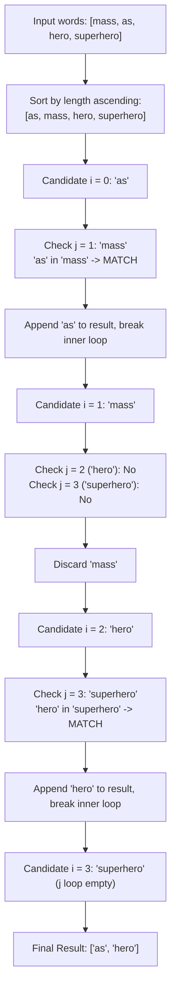

# Guided Example: String Matching in an Array

We trace the step-by-step execution of length-ordered substring searching on a representative problem instance:

- **Input:** $words = [\text{"mass"}, \text{"as"}, \text{"hero"}, \text{"superhero"}]$
- **Required Output:** $[\text{"as"}, \text{"hero"}]$

This instance features strings of varying lengths, multiple substring relationships ($\text{"as"} \sqsubset \text{"mass"}$, $\text{"hero"} \sqsubset \text{"superhero"}$), non-matching pairs ($\text{"mass"}$ vs $\text{"superhero"}$), and demonstrates the computational benefit of sorting by string length with early-termination matching.

---

## 1. Instance & Teaching Goal

Given an array of strings $words$, our goal is to identify and return all strings that appear as a contiguous substring within at least one other distinct string in the array. The returned strings may appear in any order.

In the provided instance:
- $\text{"as"}$ appears inside $\text{"mass"}$ at index $1$ ($\text{"m"} + \mathbf{\text{"as"}} + \text{"s"}$).
- $\text{"hero"}$ appears inside $\text{"superhero"}$ at index $5$ ($\text{"super"} + \mathbf{\text{"hero"}}$).
- $\text{"mass"}$ does not appear in $\text{"as"}$, $\text{"hero"}$, or $\text{"superhero"}$.
- $\text{"superhero"}$ is the longest word and cannot be contained within any other word in the array.

The primary teaching goal is to demonstrate how length-based sorting guarantees that any potential container string must appear after the candidate string, eliminating comparisons against strictly shorter candidates and enabling early loop termination as soon as a single valid container is confirmed.

---

## 2. Conceptual Foundation & Invariants

A string $u$ is a substring of $v$ (denoted $u \sqsubset v$) if there exist prefix and suffix strings $\alpha, \beta$ such that $v = \alpha \cdot u \cdot \beta$. A necessary condition for $u \sqsubset v$ is that $|u| \le |v|$. When all strings in $words$ are distinct, $u \neq v$ implies $|u| < |v|$ whenever $u$ is a proper substring.

By sorting $words$ in non-decreasing order of length:
$$
|words[0]| \le |words[1]| \le \dots \le |words[n-1]|
$$
for each candidate word $words[i]$, we only need to search for potential containers among indices $j \in [i+1, n-1]$. As soon as any $words[j]$ satisfies $words[i] \sqsubset words[j]$, $words[i]$ is certified as a valid answer and further comparisons for index $i$ terminate immediately.

```
Length-Sorted Array:
Index:       0         1         2             3
Word:      "as"     "mass"    "hero"     "superhero"
Length:      2         4         4             9

Candidate Checks:
"as"   (len 2) ---> Test "mass" (len 4)      ==> MATCH at pos 1! (Stop search for "as")
"mass" (len 4) ---> Test "hero" (len 4)      ==> No match
               ---> Test "superhero" (len 9) ==> No match (Exhausted -> Discard)
"hero" (len 4) ---> Test "superhero" (len 9) ==> MATCH at pos 5! (Stop search for "hero")
"superhero"    ---> No remaining longer words ==> Discard
```

We define tracking variables for the scan:

| State Variable | Type & Domain | Pedagogical Role |
|---|---|---|
| Candidate $w_i$ | String in $words$ | Current target tested for containment |
| Container $w_j$ | String with $j > i$ | Longer candidate tested as superset |
| Match Found Flag | Boolean | Early-exit trigger preventing duplicate emissions |
| Output Collection | Set / List of strings | Accumulated valid substring words |

> **Invariant.** For any candidate word $w_i$, all potential containers have length $\ge |w_i|$ and reside at indices $j > i$. Once a container is found, $w_i$ is recorded exactly once and inner scanning halts.



---

## 3. Step-by-Step Worked Execution

### Step 1: Sort by Length Ascending

We arrange the words by length:
1. $\text{"as"}$ ($|w| = 2$)
2. $\text{"mass"}$ ($|w| = 4$)
3. $\text{"hero"}$ ($|w| = 4$)
4. $\text{"superhero"}$ ($|w| = 9$)

Sorted array: $[\text{"as"}, \text{"mass"}, \text{"hero"}, \text{"superhero"}]$.

---

### Step 2: Evaluate Candidate $i = 0$ ($w_0 = \text{"as"}$)

We probe words with index $j \ge 1$:
- Probe $j = 1$ ($w_1 = \text{"mass"}$):
  - Check whether $\text{"as"} \sqsubset \text{"mass"}$.
  - $\text{"mass"}[0..1] = \text{"ma"}$ (mismatch).
  - $\text{"mass"}[1..2] = \text{"as"}$ (match found at offset $1$).
- Containment confirmed. Record $\text{"as"}$ in output.
- Break inner loop immediately without evaluating $j = 2$ or $j = 3$.

| Candidate Index | Container Index | Substring Search | Decision | Output Buffer |
|---|---|---|---|---|
| $i = 0$ ($\text{"as"}$) | $j = 1$ ($\text{"mass"}$) | $\text{"as"} \sqsubset \text{"mass"}$ at index $1$ | Match found; break inner loop | $[\text{"as"}]$ |

---

### Step 3: Evaluate Candidate $i = 1$ ($w_1 = \text{"mass"}$)

We probe words with index $j \ge 2$:
- Probe $j = 2$ ($w_2 = \text{"hero"}$):
  - $|w_2| = 4 = |w_1|$. Since $\text{"mass"} \neq \text{"hero"}$, no match.
- Probe $j = 3$ ($w_3 = \text{"superhero"}$):
  - Check offsets in $\text{"superhero"}$ (length $9$):
    - $\text{"supe"} \neq \text{"mass"}$
    - $\text{"uper"} \neq \text{"mass"}$
    - $\text{"perh"} \neq \text{"mass"}$
    - $\text{"erhe"} \neq \text{"mass"}$
    - $\text{"rher"} \neq \text{"mass"}$
    - $\text{"hero"} \neq \text{"mass"}$
  - No offset matches.
- All containers exhausted. $\text{"mass"}$ is rejected.

| Candidate Index | Container Index | Substring Search | Decision | Output Buffer |
|---|---|---|---|---|
| $i = 1$ ($\text{"mass"}$) | $j = 2$ ($\text{"hero"}$) | $\text{"mass"} \sqsubset \text{"hero"}$ | No match | $[\text{"as"}]$ |
| $i = 1$ ($\text{"mass"}$) | $j = 3$ ($\text{"superhero"}$) | $\text{"mass"} \sqsubset \text{"superhero"}$ | No match | $[\text{"as"}]$ |

---

### Step 4: Evaluate Candidate $i = 2$ ($w_2 = \text{"hero"}$)

We probe words with index $j \ge 3$:
- Probe $j = 3$ ($w_3 = \text{"superhero"}$):
  - Substring check $\text{"hero"} \sqsubset \text{"superhero"}$:
    - Offset $5$: $\text{"superhero"}[5..8] = \text{"hero"}$.
  - Match confirmed at offset $5$.
- Record $\text{"hero"}$ in output.
- Break inner loop.

| Candidate Index | Container Index | Substring Search | Decision | Output Buffer |
|---|---|---|---|---|
| $i = 2$ ($\text{"hero"}$) | $j = 3$ ($\text{"superhero"}$) | $\text{"hero"} \sqsubset \text{"superhero"}$ at index $5$ | Match found; break inner loop | $[\text{"as"}, \text{"hero"}]$ |

---

### Step 5: Evaluate Candidate $i = 3$ ($w_3 = \text{"superhero"}$)

No words exist with $j > 3$. The candidate cannot be a proper substring of any word in the array. Inner loop range is empty. Candidate discarded.

Final Output: $[\text{"as"}, \text{"hero"}]$.

---

## 4. Complete Execution Trace

| Pass ($i$) | Candidate $w_i$ | Probed $w_j$ | Comparison Status | Resulting Action | Output Set |
|---|---|---|---|---|---|
| $0$ | $\text{"as"}$ | $\text{"mass"}$ | Found at offset $1$ | Emit and break $j$-loop | $\{\text{"as"}\}$ |
| $1$ | $\text{"mass"}$ | $\text{"hero"}$ | Length equal, unequal string | Continue $j$-loop | $\{\text{"as"}\}$ |
| $1$ | $\text{"mass"}$ | $\text{"superhero"}$ | Not found in all $6$ offsets | $j$-loop terminates | $\{\text{"as"}\}$ |
| $2$ | $\text{"hero"}$ | $\text{"superhero"}$ | Found at offset $5$ | Emit and break $j$-loop | $\{\text{"as"}, \text{"hero"}\}$ |
| $3$ | $\text{"superhero"}$ | None | Boundary index reached | No actions | $\{\text{"as"}, \text{"hero"}\}$ |

---

## 5. Algorithmic Correctness

**Soundness.** Every string added to the output set is explicitly verified to occur as a contiguous substring of at least one distinct string $w_j$ where $j > i$. Because all words are distinct, $|w_i| \le |w_j|$ with $i < j$ guarantees $w_i \neq w_j$, preventing false self-matches.

**Completeness.** Suppose string $w$ is a substring of some word $v \in words$ with $w \neq v$. Then $|w| \le |v|$. When sorting by length, $w$ will appear at or before $v$. If $|w| = |v|$ and $w \sqsubset v$, then $w = v$, contradicting distinctness. Hence $|w| < |v|$, which guarantees $v$ appears at a strictly higher index $j > i$. Since the inner loop checks all $j \in [i+1, n-1]$, $v$ is guaranteed to be probed, ensuring $w$ is discovered.

---

## 6. Traps This Instance Exposes

- **Self-Matching False Positives:** Comparing $w_i$ against $w_i$ without checking $i \neq j$ causes every word in the array to report itself as a substring.
- **Redundant Duplicate Inclusions:** If a word (e.g. $\text{"a"}$) is a substring of multiple words (e.g. $\text{"cat"}$, $\text{"bat"}$, $\text{"car"}$), failing to break after the first match would emit $\text{"a"}$ three times.
- **Comparing Against Shorter Words:** Without length-based ordering, checking if a length-$10$ word is inside a length-$4$ word wastes comparison cycles.
- **Overlapping Substrings:** The search must locate contiguous substrings, not arbitrary scattered subsequences.

---

## 7. Complexity Derivation

- **Time Complexity:** $\mathcal{O}(N \log N \cdot L + N^2 \cdot L^2)$ where $N$ is the number of words ($N \le 100$) and $L$ is the maximum word length ($L \le 30$). Sorting takes $\mathcal{O}(N \log N \cdot L)$. In the worst case, testing all pairs $j > i$ takes $\mathcal{O}(N^2)$ checks, each performing substring matching in $\mathcal{O}(L^2)$ time via direct window comparisons. Given $N \le 100, L \le 30$, operations remain well within $10^6$ basic operations.
- **Auxiliary Space Complexity:** $\mathcal{O}(N \cdot L)$ to store the filtered output list and the length-sorted sequence of word references.
