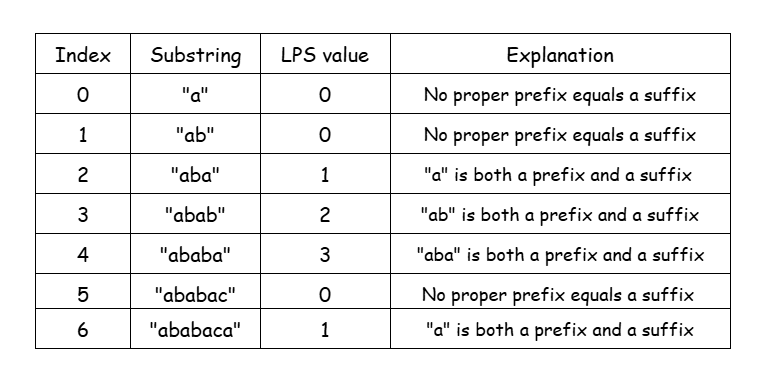

## Solution

---

### Overview

We are given an array of strings called `words`. The task is to find and return all the strings from `words` that appear as substrings within any other string in the same array. To put it simply, we are looking for any string in `words` that can be found within a different string in `words`.

Let's consider an example, where $words = ["this", "is", "the", "weather", "fish"]$.

-   `"this"` does not appear as a substring of any other string.
-   `"is"` is a substring of `"this"` and `"fish"`.
-   `"the"` is a substring of `"weather"`.
-   `"weather"` is not a substring of any other word.
-   `"fish"` is not a substring of any other string.

Therefore, the answer to this example is the array: `["is", "the"]`.

---

### Approach 1: Brute Force

#### Intuition

The intuition for this approach is pretty straightforward: We examine all strings one by one and find if each of them appears as a substring within any other string in the list.

A string `sub` is considered a substring of another string `main`, if there exists a starting index `startIndex` such that for every position `subIndex` from `0` to $\text{sub.size}() - 1$, the characters match: $main[startIndex + subIndex] = \text{sub}[subIndex]$. In simpler terms, `sub` must fit continuously within `main` without any gaps.  To check if `sub` is a substring of `main`, we iterate over all possible starting indices in `main` and verify if `sub` can fit starting from each of those indices.

In Python, things become more simple thanks to the built-in operation `sub in main`, which evaluates to `True` if `sub` is a substring of `main`.

#### Algorithm

-   Define a function `isSubstringOf(sub, main)` that returns `true` if the string `sub` is a substring of the string `main` and `false` otherwise. If the language you are using offers a built-in function for this operation, you can ignore this step.
-   Loop over all possible starting indices with `startIndex` from `0` to $\text{main.size}() - 1$:
-   Initialize a flag `subFits` to `true`.
-   Loop over all characters in `sub` with `subIndex` from `0` to $\text{sub.size}() - 1$:
-   If $startIndex + subIndex \ge \text{main.size}()$ or $main[startIndex + subIndex] \neq \text{sub}[subIndex]$, set `subFits` to `false` and break; we have reached the end of `main` or the characters don't match, so don't search further.
-   If `subFits`, a valid starting index is found; return `true`.
-   If the loop ends and `sub` does not fit for any `startIndex`, return `false`.
-   In the main `stringMatching` function:
-   Initialize an empty array of strings, named `matchingWords`.
-   Iterate over the `words` with `currentWordIndex` from `0` to $\text{words.size}() - 1$:
-   For every other word in `words`, i.e., for `otherWordIndex` from `0` to $\text{words.size}() - 1$:
-   If $currentWordIndex = otherWordIndex$, continue; skip the same word.
-   If $isSubstringOf(\text{words}[currentWordIndex], \text{words}[otherWordIndex])$, push $\text{words}[currentWordIndex]$ to the `matchingWords` and break.
-   Return `matchingWords`.

#### Implementation

```python
class Solution:
    def stringMatching(self, words):
        matching_words = []

        # Iterate through each word in the input list.
        for current_word_index in range(len(words)):
            # Compare the current word with all other words.
            for other_word_index in range(len(words)):
                # Skip comparing the word with itself.
                if current_word_index == other_word_index:
                    continue
                if words[current_word_index] in words[other_word_index]:
                    # Add it to the result list if true.
                    matching_words.append(words[current_word_index])
                    break  # No need to check further for this word.
        return matching_words
```

#### Complexity Analysis

Let $n$ be the size of the `words` array and $m$ be the length of the longest string in `words`.

-   Time complexity: $O(m^2 \times n^2)$

    The `isSubstringOf` function iterates through all possible starting indices of the `main` string to check whether each index is a valid starting point for the `sub` string. This is done using a nested loop that examines each character in the `sub` string. Therefore, the `isSubstringOf` function has a time complexity of $O(m^2)$.

    In the `stringMatching` function, we call `isSubstringOf` for every pair of strings within the `words` array. This results in $O(n^2)$ calls to `isSubstringOf`. Thus, the overall time complexity of the algorithm is $O(m^2 \times n^2)$.

    The Python implementation, which uses the optimized built-in operation for substring checks, has a time complexity of $O(m \times n^2)$, as the built-in operation performs more efficiently than the naive approach.

-   Space complexity: $O(1)$

    We create a string array, `matchingWords`, to store the strings that are identified as substrings of other words. In the worst case, this array may need to store all the strings from the `words` array, meaning it could grow to a size of $O(m \times n)$. Beyond this, the algorithm only uses a fixed number of variables (`subFits`, `currentWordIndex`), which contribute $O(1)$ auxiliary space. Therefore, the *auxiliary space complexity*—the extra space used during execution excluding input and output—is $O(1)$.
---

### Approach 2: KMP Algorithm

#### Intuition

The inefficiency of the naive algorithm lies in how it handles mismatches. When a mismatch occurs, the algorithm shifts the starting index in the `main` string by one position and restarts the comparison from the first character of `sub`, even though parts of `sub` may have already matched. Let's take a look at a worst-case example for the brute-force algorithm:

!?!../Documents/1408/1408_brute_force_fix.json:784,384!?!

The algorithm redundantly rechecks the prefix `"aaa"` for different starting positions in `main`. Instead of restarting the comparison every time, we can remember that the prefix `"aaa"` is already a match. For the next attempt, we shift `sub` and continue matching from where we left off.

To achieve this, we use the *LPS (Longest Prefix Suffix) table*.
The LPS table helps us skip unnecessary comparisons when a mismatch occurs. It stores, for each prefix of sub, the length of the longest proper prefix that is also a suffix.

> Proper prefix: A prefix of a string that is not the entire string itself.

For example, for $sub = "ababaca"$, the LPS table is:



When a mismatch occurs at position `subIndex` in `sub`, the LPS value at $subIndex - 1$ tells us how far to shift `sub`. This avoids rechecking characters already matched, improving efficiency.

!?!../Documents/1408/1408_kmp_fix.json:784,384!?!

#### Algorithm

##### `computeLPSArray(sub)` function

-   Initialize `lps` as an array of size `sub.size()` filled with `0`.
-   Initialize `currentIndex` as `1` and `len` as `0` to track the length of the current longest prefix.
-   Loop over the string `sub`:
-   If the current character continues the prefix-suffix match, i.e., $\text{sub}[currentIndex] = \text{sub}[len]$, extend the longest prefix.
-   Increment `len` by `1`.
-   Set $\text{lps}[currentIndex] = len$, to store the length of the matching prefix up to the current character.
-   Increment `currentIndex` by `1`, to move on to the next character.
-   Otherwise:
-   If there's some prefix-suffix match already, try reducing it using the previously computed LPS values, i.e., `len > 0`.
-   Set $len = lps[len - 1]$.
-   Otherwise, no prefix-suffix match exists, so start from the next character.
-   Increment `currentIndex` by `1`.
-   Return the `lps` array.

##### `isSubstringOf(sub, main, lps)` function

-   Initialize $mainIndex = 0$ and $subIndex = 0$ to iterate through `main` and `sub`.
-   Loop while `mainIndex < main.size()`:
-  If $\text{main}[mainIndex] = \text{sub}[subIndex]$, characters match, so increment both `mainIndex` and `subIndex`:
-   If $subIndex = \text{sub.size}()$, return `true` (match found).
-  If there is a mismatch, use the lps values to jump to the next best match of the `sub` string:
-   If `subIndex > 0`, set $subIndex = lps[subIndex - 1]$.
-   Otherwise, increment `mainIndex` by `1`.
-   If the loop completes and no match is found, return `false`.

##### Main `wordsMatching(words)` function

-   Initialize an empty array `matchingWords`.
-   Iterate over `words` with `currentWordIndex` from `0` to $\text{words.size}() - 1$:
-   Compute the LPS array for the current word, $lps = computeLPSArray(\text{words}[currentWordIndex])$.
-   For every other word in words, i.e., for `otherWordIndex` from `0` to $\text{words.size}() - 1$:
-   If $currentWordIndex = otherWordIndex$, continue; skip comparing the same word.
-   If $isSubstringOf(\text{words}[currentWordIndex], \text{words}[otherWordIndex])$, add $\text{words}[currentWordIndex]$ to `matchingWords` and break.
-   Return `matchingWords`.

#### Implementation

```python
class Solution:
    def stringMatching(self, words: List[str]) -> List[str]:
        matching_words = []

        for current_word_index in range(len(words)):
            lps = self._compute_lps_array(words[current_word_index])
            # Compare the current word with all other words.
            for other_word_index in range(len(words)):
                if current_word_index == other_word_index:
                    continue  # Skip comparing the word with itself.

                # Check if the current word is a substring of another word.
                if self._is_substring_of(
                    words[current_word_index], words[other_word_index], lps
                ):
                    matching_words.append(words[current_word_index])
                    break  # No need to check further for this word.

        return matching_words

    # Function to compute the LPS (Longest Prefix Suffix) array for the substring 'sub'.
    def _compute_lps_array(self, sub: str) -> List[int]:
        lps = [0] * len(sub)
        current_index = 1
        length = 0

        while current_index < len(sub):
            if sub[current_index] == sub[length]:
                length += 1
                lps[current_index] = length
                current_index += 1
            else:
                if length > 0:
                    length = lps[
                        length - 1
                    ]  # Backtrack using LPS array to find a shorter match.
                else:
                    current_index += 1
        return lps

    # Function to check if 'sub' is a substring of 'main' using the KMP algorithm.
    def _is_substring_of(self, sub: str, main: str, lps) -> bool:
        main_index = 0
        sub_index = 0

        while main_index < len(main):
            if main[main_index] == sub[sub_index]:
                main_index += 1
                sub_index += 1
                if sub_index == len(sub):
                    return True  # Found a match.
            else:
                if sub_index > 0:
                    # Use the LPS to skip unnecessary comparisons.
                    sub_index = lps[sub_index - 1]
                else:
                    main_index += 1
        return False  # No match found.
```

#### Complexity Analysis

Let $n$ be the size of the `words` array and $m$ be the length of the longest string in `words`.

-   Time complexity: $O(m \times n^2)$

    We compute the LPS array in a loop that iterates through the `sub` string. The loop runs from `1` to $\text{sub.size}() - 1$ and processes a constant amount of work on each iteration (comparing characters and updating the LPS array), so it has a time complexity of $O(m)$.

    Once the LPS array is computed, we use it in the main loop to compare each word in `words` with every other word. For each pair `(currentWordIndex, otherWordIndex)` where $currentWordIndex \neq otherWordIndex$, we check if $\text{words}[currentWordIndex]$ is a substring of $\text{words}[otherWordIndex]$ using the LPS-based KMP algorithm. Each comparison takes $O(m)$ time (due to LPS array lookup and comparison). There are $n^2$ such comparisons since we check all pairs of words.

    Therefore, the total time complexity of the algorithm is $O(m \times n^2)$.

-   Space complexity: $O(m)$

    Like in the previous approach, we create a string array, `matchingWords`, to store the strings that are identified as substrings of other words. In the worst case, this array may need to store all the strings from the `words` array, meaning it could grow to a size of $O(m \times n)$. The LPS array of `sub` has a length equal to `sub.size()`, so it adds a factor of $m$ to the total space complexity, which is however dominated by the `matchingWords` array and remains $O(m \times n)$. Once again, excluding the input and the output, we get the auxiliary space complexity of the algorithm, which is equal to $O(m)$.

---

### Approach 3: Suffix Trie

#### Intuition

In this approach, we will use a Trie to store all suffixes of any word in `words` and then determine for each word if it appears as part of any suffix in the Trie.

> A Trie is a tree-like data structure used to store substrings. If you are new to Tries, you might want to check out the [Trie Explore Card 🔗](https://leetcode.com/explore/learn/card/trie/). This resource provides an in-depth look at the trie data structure, explaining its key concepts and applications with a variety of problems to solidify understanding of the pattern.

Each node (`TrieNode`) represents a substring. A `TrieNode` has:

-   A `frequency` that keeps track of how many times the substring, represented by the path from the root to that node, has appeared as a suffix.
-   A map to store its child nodes, representing the next characters of the substring.

After defining our `TrieNode` class, we go over every `word` in `words` and insert each suffix of it into the Trie. To insert a string `word` into the Trie, we start from the root (which represents an empty string `""`) and check if a child node exists for the first character of the `word`. If yes, then we move to that child node, incrementing its frequency and we repeat the same for the second character of the `word`. Otherwise, we create a new `TrieNode` and add it to the children of the current node. We repeat this process, until we reach the end of the `word`, meaning that we have efficiently inserted it into the Trie.

After inserting all suffixes of each word, the Trie essentially stores all possible substrings as paths from the root to a leaf node. The frequency count at each node reflects how many words in the array share that particular substring.

Now, to determine whether a word appears as a substring within the `words` array, we iterate over all characters of the word, traversing the Trie. When we reach the end of the word, we check the frequency of the node we are currently at. If it is greater than 1, this means that the word is present as a substring of another word as well, not just itself, so we count it to the result.

#### Algorithm

##### `TrieNode` class.

Each `TrieNode` has:
-   A counter, `frequency`, to track the number of times the corresponding string occurs within `words`.
-   A map of characters to `TrieNodes`, named `childNodes`.

##### `insertWord(root, word)` function

-   Initialize `currentNode` to `root`.
-   For every character, `c` of `word`:
-   If `c` is a child node of `currentNode`:
-   Move `currentNode` to the child node corresponding to `c`.
-   Increment the frequency of `currentNode`.
-   Otherwise,
-   Create a new `TrieNode`, initialize its frequency to `1` and set it as the child of the `currentNode` for character `c`.
-   Move `currentNode` to new node.

##### `isSubstring(root, word)` function

-   Initialize `currentNode` to `root`.
-   For every character, `c` of `word`:
-   Move `currentNode` to the child node corresponding to `c`.
-   Check the frequency of the `currentNode`:
-   If it is greater than `1`, return `true`.
-   Otherwise, return `false`.

##### Main `stringMatching` function:

-   Initialize an empty array of strings, named `matchingWords`.
-   Initialize the `root` of the Trie.
-   For every `word` in `words`:
-   Loop with `startIndex` from `0` to $\text{word.size}() - 1$:
-   Insert the suffix `word[startIndex:]` to the Trie.
-   For every `word` in `words`:
-   If `isSubstring(root, word)`, insert `word` into `matchingWords`.
-   Return `matchingWords`.

#### Implementation

```python
class Solution:

    class TrieNode:
        def __init__(self):
            # Tracks how many times this substring appears in the Trie.
            self.frequency = 0
            # Maps characters to their respective child nodes.
            self.child_nodes = {}

    def stringMatching(self, words: List[str]) -> List[str]:
        matching_words = []
        root = self.TrieNode()  # Initialize the root of the Trie.

        # Insert all suffixes of each word into the Trie.
        for word in words:
            for start_index in range(len(word)):
                # Insert each suffix starting from index start_index.
                self._insert_word(root, word[start_index:])

        # Check each word to see if it exists as a substring in the Trie.
        for word in words:
            if self._is_substring(root, word):
                matching_words.append(word)

        return matching_words

    def _insert_word(self, root: "TrieNode", word: str) -> None:
        current_node = root
        for char in word:
            if char not in current_node.child_nodes:
                # Create a new node if the character does not exist.
                current_node.child_nodes[char] = self.TrieNode()
            current_node = current_node.child_nodes[char]
            current_node.frequency += 1  # Increment the frequency of the node.

    def _is_substring(self, root: "TrieNode", word: str) -> bool:
        current_node = root
        for char in word:
            # Traverse the Trie following the characters of the word.
            current_node = current_node.child_nodes[char]
        # A word is a substring if its frequency in the Trie is greater than 1.
        return current_node.frequency > 1
```

#### Complexity Analysis

Let $n$ be the size of the `words` array and $m$ be the length of the longest string in `words`.

-   Time complexity: $O(m^2 \times n)$

    The `insertWord(root, word)` and the `isSubstring(word)` functions involve a loop over the characters of `word`, so they have a time complexity of $O(m)$. We insert every suffix of every string of `words` into the Trie, resulting in $O(n \times m)$ insertions. Therefore, the overall time complexity is $O(m \times n \times m) = O(m^2 \times n)$.

-   Space complexity: $O(m^2 \times n)$

    In the worst case, all suffixes of all words are unique and must be stored separately in the Trie. Each word has $O(m)$ suffixes, each of which requires $O(m)$ `TrieNodes`. Therefore, the Trie can grow up to $O(m^2 \times n)$ in size. The `matchingWords` array has a size of $O(m \times n)$ and hence, it does not increase the total space complexity.

---