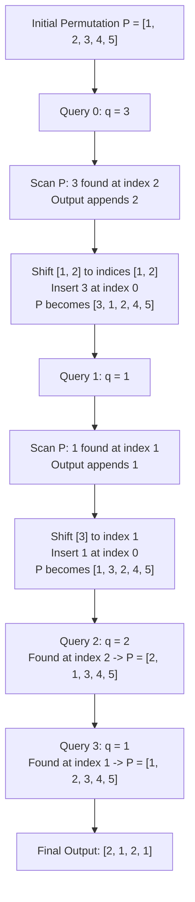

# Guided Example: Queries on a Permutation With Key

We trace the step-by-step execution of the Move-to-Front (MTF) dynamic permutation update on a representative problem instance:

- **Input:** $queries = [3, 1, 2, 1], m = 5$
- **Required Output:** $[2, 1, 2, 1]$

This instance features multiple queries accessing different positions, repeated queries accessing previously fronted elements, and elements shifting rightward across distinct indices, illustrating dynamic permutation tracking and index reporting.

---

## 1. Instance & Teaching Goal

We are given an integer $m$ defining an initial identity permutation $P = [1, 2, 3, \dots, m]$ of length $m$, along with a sequence of query values $queries$. For each query value $q$:
1. Locate the $0$-based index position $pos$ of value $q$ within the current permutation $P$.
2. Append $pos$ to the output list.
3. Relocate value $q$ from its current position $pos$ to index $0$ of $P$, shifting all elements previously residing at indices $0 \le k < pos$ one position to the right. Elements at indices $> pos$ remain unchanged.

In this instance with $m = 5$, $P$ begins as $[1, 2, 3, 4, 5]$:
- Query $q = 3$ is at index $2 \implies$ emit $2$, new $P = [3, 1, 2, 4, 5]$.
- Query $q = 1$ is at index $1 \implies$ emit $1$, new $P = [1, 3, 2, 4, 5]$.
- Query $q = 2$ is at index $2 \implies$ emit $2$, new $P = [2, 1, 3, 4, 5]$.
- Query $q = 1$ is at index $1 \implies$ emit $1$, new $P = [1, 2, 3, 4, 5]$.

The primary teaching goal is to model the Move-to-Front heuristic, understand index-tracking invariants under prefix shifts, and contrast array-shift simulation with logarithmic position queries using prefix-sum structures.

---

## 2. Conceptual Foundation & Invariants

Let $P^{(t)}$ denote the ordered permutation of length $m$ before query step $t$. At step $t$:
$$
pos_t = \text{index of } queries[t] \text{ in } P^{(t)}
$$
The state transition moves the element at $pos_t$ to index $0$:
$$
P^{(t+1)}[0] = queries[t]
$$
$$
P^{(t+1)}[k] = P^{(t)}[k - 1] \quad \text{for } 1 \le k \le pos_t
$$
$$
P^{(t+1)}[k] = P^{(t)}[k] \quad \text{for } pos_t < k < m
$$

```
Before Step (q = 3, pos = 2):
Index:   0    1    2    3    4
P:      [1,   2,   3,   4,   5]
                   ^
Shift Sub-slice P[0..1] Right (+1):
Index:        0    1
Elements:    [1,   2] ---> shifted to positions 1 and 2

Place q at Front:
Index:   0    1    2    3    4
P:      [3,   1,   2,   4,   5]
```

We establish tracking parameters across query evaluations:

| State Variable | Type & Domain | Pedagogical Purpose |
|---|---|---|
| Permutation $P$ | Sequence of length $m$ | Current ordered multiset containing all $\{1, \dots, m\}$ |
| Current Query $q$ | Integer $\in [1, m]$ | Key whose position must be located and moved to front |
| Position $pos$ | Integer $\in [0, m - 1]$ | $0$-based offset of $q$ in $P$, forming output term |
| Output List | Array of size $|queries|$ | Accumulated position results |

> **Invariant.** At the start of step $t$, $P$ is a valid permutation of $\{1, 2, \dots, m\}$. After removing $q$ from $pos$ and inserting it at index $0$, relative ordering among all other elements is strictly preserved while indices in $[0, pos - 1]$ increase by $1$.



---

## 3. Step-by-Step Worked Execution

### Step 1: Initialize Permutation and Execute Query $i = 0$ ($q = 3$)

- Start with $P = [1, 2, 3, 4, 5]$.
- Search for $q = 3$ in $P$:
  - $P[0] = 1 \neq 3$
  - $P[1] = 2 \neq 3$
  - $P[2] = 3 \implies pos = 2$.
- Append $2$ to output list.
- Relocate $3$ to front:
  - Slice before index $2$ is $[1, 2]$. Shifting right gives positions $1, 2$.
  - Place $3$ at index $0$.
  - Resulting $P = [3, 1, 2, 4, 5]$.

| Query Index | Query Value ($q$) | Found Index ($pos$) | Shifted Segment | Resulting Permutation ($P$) | Output Buffer |
|---|---|---|---|---|---|
| $0$ | $3$ | $2$ | $[1, 2] \to$ right-shifted by $1$ | $[3, 1, 2, 4, 5]$ | $[2]$ |

---

### Step 2: Execute Query $i = 1$ ($q = 1$)

- Current $P = [3, 1, 2, 4, 5]$.
- Search for $q = 1$ in $P$:
  - $P[0] = 3 \neq 1$
  - $P[1] = 1 \implies pos = 1$.
- Append $1$ to output list.
- Relocate $1$ to front:
  - Slice before index $1$ is $[3]$. Shifting right gives position $1$.
  - Place $1$ at index $0$.
  - Resulting $P = [1, 3, 2, 4, 5]$.

| Query Index | Query Value ($q$) | Found Index ($pos$) | Shifted Segment | Resulting Permutation ($P$) | Output Buffer |
|---|---|---|---|---|---|
| $1$ | $1$ | $1$ | $[3] \to$ right-shifted by $1$ | $[1, 3, 2, 4, 5]$ | $[2, 1]$ |

---

### Step 3: Execute Query $i = 2$ ($q = 2$)

- Current $P = [1, 3, 2, 4, 5]$.
- Search for $q = 2$ in $P$:
  - $P[0] = 1 \neq 2$
  - $P[1] = 3 \neq 2$
  - $P[2] = 2 \implies pos = 2$.
- Append $2$ to output list.
- Relocate $2$ to front:
  - Slice before index $2$ is $[1, 3]$. Shifting right moves them to indices $1, 2$.
  - Place $2$ at index $0$.
  - Resulting $P = [2, 1, 3, 4, 5]$.

| Query Index | Query Value ($q$) | Found Index ($pos$) | Shifted Segment | Resulting Permutation ($P$) | Output Buffer |
|---|---|---|---|---|---|
| $2$ | $2$ | $2$ | $[1, 3] \to$ right-shifted by $1$ | $[2, 1, 3, 4, 5]$ | $[2, 1, 2]$ |

---

### Step 4: Execute Query $i = 3$ ($q = 1$)

- Current $P = [2, 1, 3, 4, 5]$.
- Search for $q = 1$ in $P$:
  - $P[0] = 2 \neq 1$
  - $P[1] = 1 \implies pos = 1$.
- Append $1$ to output list.
- Relocate $1$ to front:
  - Slice before index $1$ is $[2]$. Shifting right moves it to index $1$.
  - Place $1$ at index $0$.
  - Resulting $P = [1, 2, 3, 4, 5]$.

| Query Index | Query Value ($q$) | Found Index ($pos$) | Shifted Segment | Resulting Permutation ($P$) | Output Buffer |
|---|---|---|---|---|---|
| $3$ | $1$ | $1$ | $[2] \to$ right-shifted by $1$ | $[1, 2, 3, 4, 5]$ | $[2, 1, 2, 1]$ |

All queries have completed. Final returned sequence is $[2, 1, 2, 1]$.

---

## 4. Complete Execution Trace

| Query Step ($i$) | Target Value ($q$) | Current $P$ Configuration | Located Offset | Elements Shifted Right | New $P$ Configuration | Accumulated Answers |
|---|---|---|---|---|---|---|
| Init | — | — | — | — | $[1, 2, 3, 4, 5]$ | $[]$ |
| $0$ | $3$ | $[1, 2, \mathbf{3}, 4, 5]$ | $2$ | $[1, 2]$ | $[3, 1, 2, 4, 5]$ | $[2]$ |
| $1$ | $1$ | $[3, \mathbf{1}, 2, 4, 5]$ | $1$ | $[3]$ | $[1, 3, 2, 4, 5]$ | $[2, 1]$ |
| $2$ | $2$ | $[1, 3, \mathbf{2}, 4, 5]$ | $2$ | $[1, 3]$ | $[2, 1, 3, 4, 5]$ | $[2, 1, 2]$ |
| $3$ | $1$ | $[2, \mathbf{1}, 3, 4, 5]$ | $1$ | $[2]$ | $[1, 2, 3, 4, 5]$ | $[2, 1, 2, 1]$ |

---

## 5. Algorithmic Correctness

**Soundness.** Every step linearly scans $P$ to determine the exact unique index where $P[pos] = q$. Because $P$ is a permutation containing no duplicate elements, $pos$ is uniquely determined. Relocating $P[pos]$ to index $0$ via a deletion and front insertion strictly replicates the problem specification.

**Completeness.** Since $q \in \{1, \dots, m\}$ and $P$ maintains a bijection with $\{1, \dots, m\}$ at all times, every query is guaranteed to find its corresponding element. The output array records the result of each query in the exact sequence requested.

---

## 6. Traps This Instance Exposes

- **Index Off-by-One Confusion:** The problem requests $0$-based indices. Returning $1$-based indices (e.g. $[3, 2, 3, 2]$ instead of $[2, 1, 2, 1]$) fails the contract.
- **Value vs Index Conflation:** Elements in $P$ are integers from $1$ to $m$. Conflating an element's value (such as $3$) with its position in the array (such as $2$) corrupts calculations.
- **Incorrect Shift Boundaries:** Shifting elements that appear after $pos$ corrupts the permutation. Only indices $< pos$ move right; indices $> pos$ preserve their absolute positions.
- **Static Index Caching:** Caching the initial indices of values is invalid because every move-to-front modifies the indices of all preceding elements.

---

## 7. Complexity Derivation

- **Time Complexity:** $\mathcal{O}(Q \cdot m)$ for direct list simulation, where $Q = |queries|$ and $m$ is the permutation size. For each query, finding the element takes $\mathcal{O}(m)$ time, and shifting up to $m$ elements takes $\mathcal{O}(m)$ time. With $Q, m \le 1000$, total operations are at most $10^6$, comfortably within execution limits. (With a Fenwick tree or balanced BST, this can be reduced to $\mathcal{O}(Q \log (m + Q))$).
- **Auxiliary Space Complexity:** $\mathcal{O}(m)$ auxiliary space to store the working permutation array $P$, plus $\mathcal{O}(Q)$ to hold the query results.
