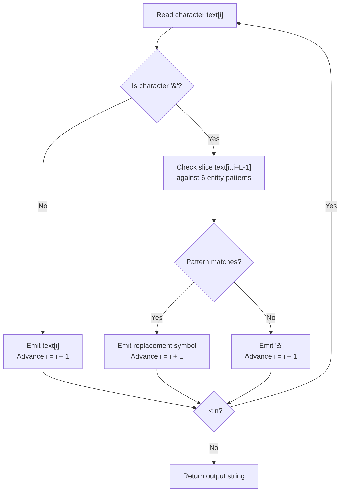

# Guided Example: HTML Entity Parser

We trace the step-by-step execution of linear single-pass entity substitution on a representative problem instance:

- **Input:** `text = "&amp; is an HTML entity but &ambassador; is not."`
- **Required Output:** `"& is an HTML entity but &ambassador; is not."`

This instance features a valid recognized HTML entity (`&amp;`) alongside an unrecognized construct beginning with an ampersand and ending with a semicolon (`&ambassador;`), illustrating prefix pattern matching, failure recovery, and non-recursive replacement.

---

## 1. Instance & Teaching Goal

An HTML entity parser receives a string and replaces all predefined entity substrings with their corresponding single-character symbols:
- `&quot;` $\implies$ `"` (Quotation mark)
- `&apos;` $\implies$ `'` (Single quote mark)
- `&amp;` $\implies$ `&` (Ampersand)
- `&gt;` $\implies$ `>` (Greater-than sign)
- `&lt;` $\implies$ `<` (Less-than sign)
- `&frasl;` $\implies$ `/` (Slash)

Any substring that does not match one of these six exact patterns—even if it begins with an ampersand or ends with a semicolon—must remain untouched. Furthermore, replacements must occur strictly in a single left-to-right pass: newly created characters must never be re-evaluated as potential entities (avoiding cascading or recursive substitution).

In the selected input:
- The prefix `&amp;` matches the predefined entity for an ampersand, replacing $5$ characters with the single character `&`.
- The subsequent sequence `&ambassador;` begins with `&` and ends with `;`, but does not match any of the six recognized entity names; all $12$ characters must be preserved verbatim.

The primary teaching goal is to formulate entity replacement as a deterministic prefix-matching cursor scan, guaranteeing linear execution time and immune to unintended recursive evaluations.

---

## 2. Conceptual Foundation & Invariants

Let the input string have length $n$. We maintain a reading pointer $i$ progressing monotonically from $0$ to $n - 1$, writing emitted characters into an output buffer.

At any position $i$:
1. If the character at $i$ is not `&`, it cannot initiate an entity. Append `text[i]` to the output buffer and advance $i \leftarrow i + 1$.
2. If `text[i] == '&'`, inspect the candidate prefixes against the six known entities:
   - For each entity of length $L \in \{4, 5, 6, 7\}$:
     - Check if $i + L \le n$ and `text[i .. i + L - 1]` matches the entity pattern.
   - If a match is found: append the corresponding replacement character to the output buffer, and advance the pointer across the entire entity: $i \leftarrow i + L$.
   - If none of the six entities match: append `text[i]` (the literal `&`) and advance $i \leftarrow i + 1$.

```
Index:    0    1    2    3    4    5    6 ... 30   31 ... 42   43 ...
Chars:    &    a    m    p    ;         i ...  &    a ...  ;         i ...
          |-------------------|                |-----------|
Match:    Recognized '&amp;'                   Not recognized entity!
Emit:     '&'                                  Emit '&', resume at 'a'
Advance:  i advances by 5                      i advances by 1
```

We define tracking variables for the parser state:

| State Variable | Domain | Pedagogical Role |
|---|---|---|
| Scan Pointer ($i$) | $[0, n]$ | Monotonically advancing read head |
| Prefix Window | Substring $text[i \dots \min(n, i + 7)]$ | Local slice checked against dictionary |
| Output Buffer | Dynamic string | Preserves parsed text in single pass |
| Match Outcome | Entity symbol or $\emptyset$ | Directs jump distance ($L$ vs $1$) |

> **Invariant.** At all times, the output buffer represents the fully parsed and finalized transformation of the input prefix $text[0 \dots i - 1]$. No character already placed in the output buffer will ever be inspected or transformed again.



---

## 3. Step-by-Step Worked Execution

### Step 1: Matching the Leading Entity `&amp;` at $i = 0$

- Read `text[0] == '&'`.
- Evaluate candidate lengths $L \in \{4, 5, 6, 7\}$:
  - $L = 4$: `text[0..3]` is `&amp` $\implies$ does not match `&gt;` or `&lt;`.
  - $L = 5$: `text[0..4]` is `&amp;` $\implies$ matches `&amp;`!
- Emit replacement character `&`.
- Increment cursor: $i \leftarrow 0 + 5 = 5$.

| Cursor $i$ | Substring Under Test | Entity Match | Emitted Token | New Cursor $i$ | Current Buffer |
|---|---|---|---|---|---|
| $0$ | `&amp;` (length 5) | `&amp;` $\to$ `&` | `&` | $5$ | `"&"` |

---

### Step 2: Processing Intervening Plain Text ($i = 5$ to $29$)

- From $i = 5$ to $i = 29$, `text[5..29]` contains: `" is an HTML entity but "`
- None of these characters are `&`.
- Each character is appended directly to the buffer, advancing $i$ by $1$ on each cycle.
- At $i = 30$, buffer contains: `"& is an HTML entity but "`

| Cursor Range | Segment Text | Has Entity Trigger `&` | Action | Buffer State |
|---|---|---|---|---|
| $5 \dots 29$ | `" is an HTML entity but "` | No | Copy characters verbatim | `"& is an HTML entity but "` |

---

### Step 3: Inspecting Unrecognized Construct `&ambassador;` at $i = 30$

- Read `text[30] == '&'`.
- Evaluate candidate lengths:
  - $L = 4$: `text[30..33]` is `&amb` (no match)
  - $L = 5$: `text[30..34]` is `&amba` (no match)
  - $L = 6$: `text[30..35]` is `&ambas` (no match)
  - $L = 7$: `text[30..36]` is `&ambass` (no match)
- No entity dictionary entry matches.
- Emit literal `&`.
- Advance cursor by $1$: $i \leftarrow 30 + 1 = 31$.

| Cursor $i$ | Substring Under Test | Entity Match | Action | New Cursor $i$ | Buffer State |
|---|---|---|---|---|---|
| $30$ | `&amba...` | None | Emit literal `&` | $31$ | `"& is an HTML entity but &"` |

---

### Step 4: Finishing Remainder of the String ($i = 31$ to $47$)

- `text[31..47]` is `"ambassador; is not."`
- None of these characters trigger an entity replacement.
- All characters are appended verbatim until string end at $i = 48$.
- Final output: `"& is an HTML entity but &ambassador; is not."`

| Cursor Range | Segment Text | Action | Final Buffer Content |
|---|---|---|---|
| $31 \dots 47$ | `"ambassador; is not."` | Copy characters verbatim | `"& is an HTML entity but &ambassador; is not."` |

---

## 4. Complete Execution Trace

| Phase | Read Pointer ($i$) | Observed Character / Token | Entity Test Result | Advance Step | Output Buffer Snapshot |
|---|---|---|---|---|---|
| Prefix Entity | $0$ | `&amp;` | Matches `&amp;` | $+5 \implies 5$ | `"&"` |
| Plain Text | $5 \dots 29$ | `" is an HTML entity but "` | No trigger character | $+25 \implies 30$ | `"& is an HTML entity but "` |
| Unknown Entity | $30$ | `&` in `&ambassador;` | No match across $L \in \{4,5,6,7\}$ | $+1 \implies 31$ | `"& is an HTML entity but &"` |
| Tail Plain Text | $31 \dots 47$ | `"ambassador; is not."` | No trigger character | $+17 \implies 48$ | `"& is an HTML entity but &ambassador; is not."` |

---

## 5. Algorithmic Correctness

**Soundness.** The substitution rules correspond strictly to the six standardized HTML entities. Any sequence that fails to match one of the six exact target words in both prefix and terminating semicolon is preserved without alteration. Because advancing $i$ jumps past the matched token, newly emitted characters cannot be rescanned.

**Completeness.** Every character in the input string is inspected at least once. The pointer $i$ advances by at least $1$ in every step, ensuring termination in at most $n$ iterations. No valid entity starting at index $i$ is overlooked because all possible entity lengths ($4$ through $7$) are bounded and checked.

---

## 6. Traps This Instance Exposes

- **Recursive Replacement Hazard:** If naive global replacements are applied sequentially, replacing `&amp;` before `&gt;` transforms `&amp;gt;` into `&gt;` and then into `>`, which is incorrect. Single-pass linear scanning guarantees each token is processed only once.
- **Order-Dependent String Replacement:** Replacing in an arbitrary order using built-in replacement functions can corrupt tokens if an entity contains the result of another substitution.
- **Prefix False Match:** A word like `&ambassador;` shares the prefix `&am` with `&amp;`. Matching must verify the exact full token including the trailing semicolon `;`.
- **Buffer Index Out of Bounds:** When checking candidate substrings of length $L \in \{4..7\}$ near the end of the string, bounds checking must ensure $i + L \le n$.

---

## 7. Complexity Derivation

- **Time Complexity:** $\mathcal{O}(n)$, where $n$ is the length of the string. At each index $i$, we compare at most $6$ constant-length patterns (lengths $4$ to $7$), taking $\mathcal{O}(1)$ time per index. The index $i$ advances by at least $1$ each step, bounding total work by $\mathcal{O}(n)$.
- **Auxiliary Space Complexity:** $\mathcal{O}(n)$ to store the parsed output string.
