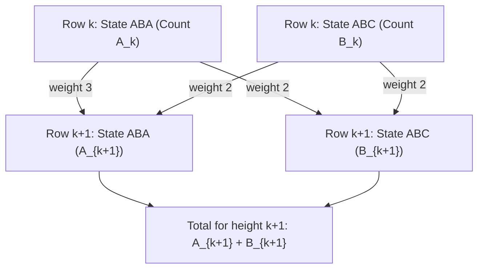

# Guided Example: Number of Ways to Paint N x 3 Grid

We trace the step-by-step execution of symmetry-reduced Dynamic Programming on a representative problem instance:

- **Input:** $n = 3$
- **Required Output:** $246$

This instance features row-by-row state propagation across multiple vertical transitions, showing how color isomorphism collapses $3^{3n}$ exponential configurations into two coupled linear recurrences modulo $10^9 + 7$.

---

## 1. Instance & Teaching Goal

We are tasked with coloring an $n \times 3$ grid using three colors: Red ($R$), Yellow ($Y$), and Green ($G$). No two adjacent cells sharing a horizontal or vertical edge may share the same color. Since the number of valid grids grows rapidly, the total count must be computed modulo $10^9 + 7$.

For a grid of height $n = 3$:
- At $n = 1$, each valid row must have distinct horizontally adjacent cells. There are $3 \times 2 \times 2 = 12$ valid single-row configurations.
- At $n = 2$, placing compatible rows yields $54$ valid configurations.
- At $n = 3$, extending to the third row yields $246$ valid configurations.

The primary teaching goal is to recognize color symmetry: rather than tracking all $12$ individual single-row color patterns independently, every valid row belongs to one of two structural isomorphism types:
1. **Type ABA (two distinct colors used):** The first and third cells have the same color, while the middle cell is different (e.g., $R-Y-R$).
2. **Type ABC (three distinct colors used):** All three cells have mutually distinct colors (e.g., $R-Y-G$).

---

## 2. Conceptual Foundation & Invariants

Each row consists of three cells $(c_0, c_1, c_2)$. Because horizontal neighbors must differ, $c_0 \neq c_1$ and $c_1 \neq c_2$:
- Choosing $c_0$: $3$ choices.
- Choosing $c_1 \neq c_0$: $2$ choices.
- Choosing $c_2 \neq c_1$: $2$ choices ($c_2 = c_0$ or $c_2 \notin \{c_0, c_1\}$).

This gives $3 \times 2 \times 2 = 12$ total valid rows for $n = 1$, partitioned into:
- **Type ABA count ($A_1$):** $3 \text{ choices for } A \times 2 \text{ choices for } B = 6$.
- **Type ABC count ($B_1$):** $3! = 3 \times 2 \times 1 = 6$.

```
Type ABA Pattern (e.g., R - Y - R):
Cell 0: Red    | Cell 1: Yellow | Cell 2: Red

Type ABC Pattern (e.g., R - Y - G):
Cell 0: Red    | Cell 1: Yellow | Cell 2: Green

Vertical Transition Compatibility from Row k to Row k+1:
From ABA (R-Y-R):
  -> Valid ABA rows: Y-R-Y, Y-G-Y, G-R-G (3 transitions)
  -> Valid ABC rows: Y-R-G, G-R-Y         (2 transitions)

From ABC (R-Y-G):
  -> Valid ABA rows: Y-R-Y, Y-G-Y         (2 transitions)
  -> Valid ABC rows: Y-G-R, G-R-Y         (2 transitions)
```

The transition system between row $k$ and row $k+1$ is therefore:
$$
A_{k+1} = (3 \cdot A_k + 2 \cdot B_k) \pmod{10^9 + 7}
$$
$$
B_{k+1} = (2 \cdot A_k + 2 \cdot B_k) \pmod{10^9 + 7}
$$

In matrix form:
$$
\begin{pmatrix} A_{k+1} \\ B_{k+1} \end{pmatrix} = \begin{pmatrix} 3 & 2 \\ 2 & 2 \end{pmatrix} \begin{pmatrix} A_k \\ B_k \end{pmatrix} \pmod{10^9 + 7}
$$

We define state tracking parameters:

| State Parameter | Mathematical Definition | Initial State ($k = 1$) |
|---|---|---|
| $A_k$ | Total valid configurations ending in a Type ABA row | $6$ |
| $B_k$ | Total valid configurations ending in a Type ABC row | $6$ |
| $T_k$ | Total valid grid colorings of height $k$ ($A_k + B_k$) | $12$ |

> **Invariant.** For any row $k \ge 1$, $A_k$ and $B_k$ represent the exact number of valid $k \times 3$ grid colorings whose $k$-th row has color pattern ABA or ABC, respectively, with all vertical and horizontal neighbor constraints satisfied.



---

## 3. Step-by-Step Worked Execution

### Step 1: Base Case Initialization ($k = 1$)

At height $k = 1$, we enumerate the valid patterns directly:
- **Type ABA:** $\{R-Y-R, R-G-R, Y-R-Y, Y-G-Y, G-R-G, G-Y-G\}$. Total = $6$.
- **Type ABC:** $\{R-Y-G, R-G-Y, Y-R-G, Y-G-R, G-R-Y, G-Y-R\}$. Total = $6$.
- Initial state values: $A_1 = 6$, $B_1 = 6$.
- Total valid colorings for $1 \times 3$ grid: $T_1 = 6 + 6 = 12$.

| Row Height ($k$) | Type ABA Count ($A_k$) | Type ABC Count ($B_k$) | Combined Count ($T_k$) | Status |
|---|---|---|---|---|
| $1$ | $6$ | $6$ | $12$ | Base row established |

---

### Step 2: Transition to Row Height $k = 2$

We apply the transition equations with $A_1 = 6, B_1 = 6$:
- $A_2 = (3 \cdot A_1 + 2 \cdot B_1) \pmod{10^9 + 7} = (3 \cdot 6 + 2 \cdot 6) = 18 + 12 = 30$.
- $B_2 = (2 \cdot A_1 + 2 \cdot B_1) \pmod{10^9 + 7} = (2 \cdot 6 + 2 \cdot 6) = 12 + 12 = 24$.
- Total valid colorings for $2 \times 3$ grid: $T_2 = 30 + 24 = 54$.

| Row Height ($k$) | Transition for $A_k$ | Transition for $B_k$ | Result $(A_k, B_k)$ | Total $T_k$ |
|---|---|---|---|---|
| $2$ | $3(6) + 2(6) = 30$ | $2(6) + 2(6) = 24$ | $(30, 24)$ | $54$ |

---

### Step 3: Transition to Row Height $k = 3$

We apply the transition equations with $A_2 = 30, B_2 = 24$:
- $A_3 = (3 \cdot A_2 + 2 \cdot B_2) \pmod{10^9 + 7} = (3 \cdot 30 + 2 \cdot 24) = 90 + 48 = 138$.
- $B_3 = (2 \cdot A_2 + 2 \cdot B_2) \pmod{10^9 + 7} = (2 \cdot 30 + 2 \cdot 24) = 60 + 48 = 108$.
- Total valid colorings for $3 \times 3$ grid:
  $$
  T_3 = (138 + 108) \pmod{10^9 + 7} = 246
  $$

| Row Height ($k$) | Transition for $A_k$ | Transition for $B_k$ | Result $(A_k, B_k)$ | Total $T_k$ |
|---|---|---|---|---|
| $3$ | $3(30) + 2(24) = 138$ | $2(30) + 2(24) = 108$ | $(138, 108)$ | $246$ |

The grid height target $n = 3$ is reached. The final answer is $246$.

---

## 4. Complete Execution Trace

| Step ($k$) | Active Subproblem | Computed $A_k$ | Computed $B_k$ | Total Modulo $10^9 + 7$ | Invariant Verification |
|---|---|---|---|---|---|
| Init | Base row $k = 1$ | $6$ | $6$ | $12$ | Matches exact 12 row permutations |
| $2$ | Grid height $k = 2$ | $30$ | $24$ | $54$ | All vertical adjacencies valid |
| $3$ | Grid height $k = 3$ | $138$ | $108$ | $246$ | Target height satisfied |

---

## 5. Algorithmic Correctness

**Soundness.** Every valid row is uniquely either Type ABA or Type ABC because any three-cell coloring with no adjacent identical colors uses either two distinct colors ($c_0 = c_2 \neq c_1$) or three distinct colors ($c_0, c_1, c_2$ mutually distinct). The transition counts ($3$ ABA and $2$ ABC from ABA; $2$ ABA and $2$ ABC from ABC) exhaustively and mutually exclusively account for all compatible next-row colorings without vertical color collisions.

**Completeness.** No valid grid coloring is missed because all color permutations within the two isomorphism classes are symmetric and uniform under color relabeling. Summing $A_n + B_n \pmod{10^9 + 7}$ yields the exact total count of valid grids of height $n$.

---

## 6. Traps This Instance Exposes

- **Tracking All $12$ States Individually:** Modeling all $12$ individual states in a $12 \times 12$ transition matrix works but adds unnecessary overhead compared to the 2-state isomorphism formulation.
- **Ignoring Vertical Constraints:** Counting valid horizontal rows independently and multiplying ($12^n$) neglects the vertical constraint that $grid[r][c] \neq grid[r-1][c]$.
- **Integer Overflow Before Modulo:** Multiplying large intermediate values without modular reduction at each addition step can exceed standard integer capacities.
- **Off-by-One Transitions:** Starting with $A_0, B_0$ instead of setting $k = 1$ base counts ($A_1 = 6, B_1 = 6$) shifts the iteration by one row, leading to an incorrect result.

---

## 7. Complexity Derivation

- **Time Complexity:** $\mathcal{O}(n)$ using dynamic programming iteration over rows $2$ through $n$, requiring only $4$ scalar multiplications and $2$ additions per step. (Alternatively, fast matrix exponentiation can compute the $n$-th state in $\mathcal{O}(\log n)$ time).
- **Auxiliary Space Complexity:** $\mathcal{O}(1)$, as only two numeric variables ($A$ and $B$) are maintained between consecutive row iterations.