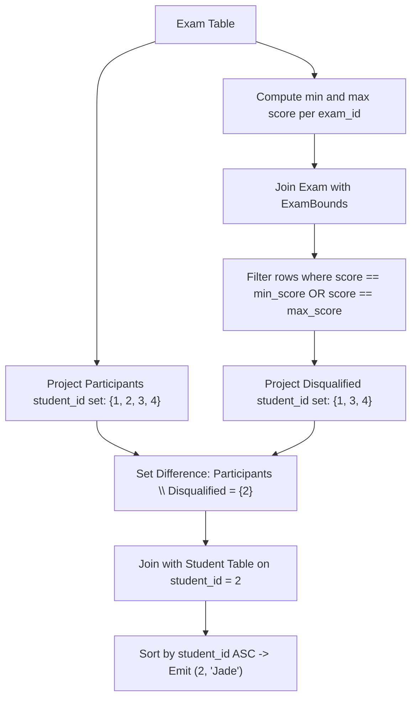

# Guided Example: Find the Quiet Students in All Exams

We trace the step-by-step execution of relational set difference and partitioned boundary evaluation on a representative database instance:

- **Input Tables:**
  - `Student`:
    - `(1, "Daniel")`
    - `(2, "Jade")`
    - `(3, "Stella")`
    - `(4, "Jonathan")`
    - `(5, "Will")`
  - `Exam`:
    - `(10, 1, 70)`
    - `(10, 2, 80)`
    - `(10, 3, 90)`
    - `(20, 1, 80)`
    - `(30, 1, 70)`
    - `(30, 3, 80)`
    - `(30, 4, 90)`
    - `(40, 1, 60)`
    - `(40, 2, 70)`
    - `(40, 4, 80)`
- **Required Output:**
  - `(2, "Jade")`

This instance features exams with multi-student cohorts, an exam with a single participant (exam $20$), students scoring highest or lowest across different exams (Daniel, Stella, Jonathan), an inactive student who took zero exams (Will), and a consistently interior-scoring quiet student (Jade).

---

## 1. Instance & Teaching Goal

We are given two relational entities:
1. `Student` with columns `student_id` (primary key) and `student_name`.
2. `Exam` with columns `exam_id`, `student_id`, and `score` (composite primary key `(exam_id, student_id)`).

A student is defined as **quiet** if and only if:
1. The student participated in at least one exam ($\text{student\_id} \in \Pi_{\text{student\_id}}(\text{Exam})$).
2. The student never achieved the lowest or highest score in any exam they took. That is, across all exams taken, their score was strictly between the exam minimum and maximum.

In this instance:
- Daniel ($1$) scored the minimum in exams $10$, $30$, and $40$, and was the sole participant in exam $20$ (holding both min and max). Daniel is disqualified.
- Stella ($3$) scored the maximum ($90$) in exam $10$. Stella is disqualified.
- Jonathan ($4$) scored the maximum ($90$ and $80$) in exams $30$ and $40$. Jonathan is disqualified.
- Will ($5$) never took an exam and is excluded by the participation rule.
- Jade ($2$) took exam $10$ (score $80 \in (70, 90)$) and exam $40$ (score $70 \in (60, 80)$). Jade never achieved an extreme score and qualifies as quiet.

The primary teaching goal is to model universal constraints using set anti-joins or set difference ($\text{Participants} \setminus \text{Disqualified}$), demonstrating how to identify boundary extremes via grouped aggregation before projecting the qualifying cohort.

---

## 2. Conceptual Foundation & Invariants

In relational algebra, the solution proceeds through three logical phases:
1. **Compute Exam Bounds:**
   $$
   \text{ExamBounds} = \gamma_{\text{exam\_id}, \min(\text{score}) \to \text{min\_score}, \max(\text{score}) \to \text{max\_score}}(\text{Exam})
   $$
2. **Identify Disqualified ("Loud") Students:**
   $$
   \text{ExamWithBounds} = \text{Exam} \bowtie_{\text{Exam.exam\_id} = \text{ExamBounds.exam\_id}} \text{ExamBounds}
   $$
   $$
   \text{Disqualified} = \Pi_{\text{student\_id}} \left( \sigma_{\text{score} = \text{min\_score} \lor \text{score} = \text{max\_score}}(\text{ExamWithBounds}) \right)
   $$
3. **Filter Active Students via Set Difference:**
   $$
   \text{Participants} = \Pi_{\text{student\_id}}(\text{Exam})
   $$
   $$
   \text{QuietIDs} = \text{Participants} \setminus \text{Disqualified}
   $$
   $$
   \mathcal{R} = \Pi_{\text{student\_id}, \text{student\_name}} \left( \tau_{\text{student\_id} \uparrow} (\text{QuietIDs} \bowtie \text{Student}) \right)
   $$

```
All Students: {1: Daniel, 2: Jade, 3: Stella, 4: Jonathan, 5: Will}
                              |
     +------------------------+------------------------+
     |                                                 |
Non-Participants:                                Participants:
{5: Will} (Excluded)                             {1, 2, 3, 4}
                                                       |
                             +-------------------------+-------------------------+
                             |                                                   |
                     Disqualified (Extremes):                            Quiet Cohort:
                     1: Min in 10,20,30,40; Max in 20                    2: Jade
                     3: Max in 10                                        (Output!)
                     4: Max in 30, 40
```

We define relational tracking parameters:

| Relational Entity | Domain | Purpose |
|---|---|---|
| $\text{ExamBounds}$ | Relation over $(\text{exam\_id}, \text{min\_s}, \text{max\_s})$ | Minimum and maximum scores per exam |
| $\text{Disqualified}$ | Sub-relation of student IDs | Students with $\ge 1$ extreme score |
| $\text{Participants}$ | Sub-relation of student IDs | Students with $\ge 1$ exam record |
| $\text{QuietIDs}$ | $\text{Participants} \setminus \text{Disqualified}$ | Qualified quiet student identifiers |

> **Invariant.** A student ID belongs to $\text{QuietIDs}$ if and only if it appears in $\Pi_{\text{student\_id}}(\text{Exam})$ and does not appear in any exam record satisfying $\text{score} \in \{\text{min\_score}, \text{max\_score}\}$.



---

## 3. Step-by-Step Worked Execution

### Step 1: Compute Per-Exam Extreme Scores

We group the `Exam` relation by `exam_id` and compute the minimum and maximum scores:

- Exam $10$: scores $\{70, 80, 90\} \implies \min = 70, \max = 90$.
- Exam $20$: score $\{80\} \implies \min = 80, \max = 80$.
- Exam $30$: scores $\{70, 80, 90\} \implies \min = 70, \max = 90$.
- Exam $40$: scores $\{60, 70, 80\} \implies \min = 60, \max = 80$.

| Exam ID | Observed Scores | Exam Minimum | Exam Maximum |
|---|---|---|---|
| $10$ | $\{70, 80, 90\}$ | $70$ | $90$ |
| $20$ | $\{80\}$ | $80$ | $80$ |
| $30$ | $\{70, 80, 90\}$ | $70$ | $90$ |
| $40$ | $\{60, 70, 80\}$ | $60$ | $80$ |

---

### Step 2: Identify Disqualified Student IDs

We inspect each row of `Exam` against its exam bounds:
- Exam $10$:
  - Student $1$: $70 = \min \implies$ Disqualified!
  - Student $2$: $70 < 80 < 90 \implies$ Interior score.
  - Student $3$: $90 = \max \implies$ Disqualified!
- Exam $20$:
  - Student $1$: $80 = \min = \max \implies$ Disqualified!
- Exam $30$:
  - Student $1$: $70 = \min \implies$ Disqualified!
  - Student $3$: $70 < 80 < 90 \implies$ Interior score.
  - Student $4$: $90 = \max \implies$ Disqualified!
- Exam $40$:
  - Student $1$: $60 = \min \implies$ Disqualified!
  - Student $2$: $60 < 70 < 80 \implies$ Interior score.
  - Student $4$: $80 = \max \implies$ Disqualified!

Accumulated Disqualified set: $\{1, 3, 4\}$.

| Exam ID | Student ID | Score | Bound Status | Disqualification Status |
|---|---|---|---|---|
| $10$ | $1$ | $70$ | Equals min ($70$) | Added to Disqualified |
| $10$ | $2$ | $80$ | Strict interior | Quiet |
| $10$ | $3$ | $90$ | Equals max ($90$) | Added to Disqualified |
| $20$ | $1$ | $80$ | Equals min and max ($80$) | Added to Disqualified |
| $30$ | $1$ | $70$ | Equals min ($70$) | Added to Disqualified |
| $30$ | $3$ | $80$ | Strict interior | Quiet in this exam |
| $30$ | $4$ | $90$ | Equals max ($90$) | Added to Disqualified |
| $40$ | $1$ | $60$ | Equals min ($60$) | Added to Disqualified |
| $40$ | $2$ | $70$ | Strict interior | Quiet |
| $40$ | $4$ | $80$ | Equals max ($80$) | Added to Disqualified |

---

### Step 3: Compute Set Difference Against Participants

- Participating student IDs: $\Pi_{\text{student\_id}}(\text{Exam}) = \{1, 2, 3, 4\}$.
- Note: Student $5$ (Will) does not appear in `Exam` and is not in $\text{Participants}$.
- Disqualified student IDs: $\{1, 3, 4\}$.
- Quiet student IDs:
  $$
  \text{QuietIDs} = \{1, 2, 3, 4\} \setminus \{1, 3, 4\} = \{2\}
  $$

---

### Step 4: Join with Student and Produce Ordered Result

We join the singleton set $\{2\}$ with `Student`:
- $\text{student\_id} = 2 \implies \text{student\_name} = \text{"Jade"}$.
- Sort by $\text{student\_id}$ ascending: `(2, "Jade")`.

Final emitted relation: `[(2, "Jade")]`.

---

## 4. Complete Execution Trace

| Stage | Evaluated Entity | Operation Applied | Resulting State |
|---|---|---|---|
| Aggregation | `Exam` grouped by `exam_id` | Compute $\min(\text{score}), \max(\text{score})$ | $4$ exam boundary intervals |
| Classification | Each $(\text{exam}, \text{student}, \text{score})$ | Test against $\{\min, \max\}$ | Disqualified set = $\{1, 3, 4\}$ |
| Domain Filter | $\Pi_{\text{student\_id}}(\text{Exam})$ | Extract distinct active students | Active set = $\{1, 2, 3, 4\}$ |
| Anti-Join | Active set $\setminus$ Disqualified | Set difference | Qualified set = $\{2\}$ |
| Enrichment | Qualified set $\bowtie \text{Student}$ | Lookup student name | `(2, "Jade")` |
| Ordering | Order by $\text{student\_id} \uparrow$ | Ascending sort | Final single-row result |

---

## 5. Algorithmic Correctness

**Soundness.** The set difference $\text{Participants} \setminus \text{Disqualified}$ guarantees that any emitted student took at least one exam (membership in $\text{Participants}$) and never scored the minimum or maximum in any exam (exclusion from $\text{Disqualified}$).

**Completeness.** Every exam row is compared against its corresponding exam boundaries. A student scoring an extreme score in even a single exam is immediately added to $\text{Disqualified}$ and eliminated. Any student with strictly interior scores across all attended exams is preserved.

---

## 6. Traps This Instance Exposes

- **Including Non-Participants:** Forgetting to intersect or filter with participating students would mistakenly include student $5$ (Will), who never took any exams.
- **Single-Participant Exams:** In exam $20$, Daniel was the only test-taker. His score of $80$ is simultaneously the minimum and maximum; he must be disqualified.
- **Unilateral Extreme Check:** Checking only for maximum scores while ignoring minimum scores (or vice versa) fails to disqualify students like Daniel or Jonathan who only hit one extreme.
- **Tied Extremes:** If multiple students share the lowest or highest score in an exam, all tied students at the boundary are disqualified.

---

## 7. Complexity Derivation

- **Time Complexity:** $\mathcal{O}(|E| + |S| \log |S|)$. Scanning `Exam` to compute exam extremes takes $\mathcal{O}(|E|)$. Flagging disqualified student IDs takes $\mathcal{O}(|E|)$ using hash lookups. Joining qualifying student IDs with the `Student` table and sorting takes $\mathcal{O}(|S| \log |S|)$.
- **Auxiliary Space Complexity:** $\mathcal{O}(|E| + |S|)$ to maintain the exam bounds map and candidate student identifier sets.
