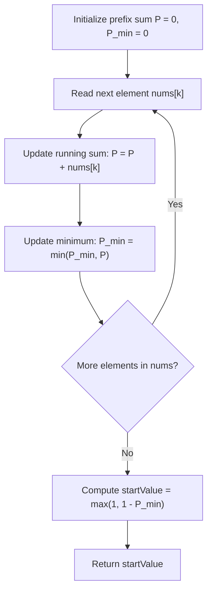

# Guided Example: Minimum Value to Get Positive Step by Step Sum

We trace the step-by-step execution of prefix-minimum tracking on a representative problem instance:

- **Input:** $nums = [-3, 2, -3, 4, 2]$
- **Required Output:** $5$

This instance features negative step drops, positive recoveries, a global minimum valley reaching negative values, and illustrates how prefix sum bounds directly determine the minimal valid start value in a single pass.

---

## 1. Instance & Teaching Goal

We are given an array of integers $nums$. Starting from an initial positive integer $startValue \ge 1$, we compute the running cumulative sum step-by-step from left to right:
$$
S_k = startValue + \sum_{j=0}^k nums[j]
$$
The problem demands finding the minimum positive integer $startValue$ such that the running sum remains strictly positive at every step:
$$
S_k \ge 1 \quad \forall k \in [0, n - 1]
$$

In the given instance $nums = [-3, 2, -3, 4, 2]$:
- If we start with $4$, the running sum dips to $0$ at the third element ($4 - 3 + 2 - 3 = 0 < 1$), failing the requirement.
- If we start with $5$, the running sum values are $2, 4, 1, 5, 7$, all of which are $\ge 1$.

The primary teaching goal is to formulate the global prefix deficit mathematically: instead of testing start values via simulation or binary search, we maintain a running prefix sum and identify its lowest valley $P_{\min}$. The minimal required start value is then obtained directly via $startValue = \max(1, 1 - P_{\min})$.

---

## 2. Conceptual Foundation & Invariants

Let $P_k$ denote the standard prefix sum of the array without any initial offset:
$$
P_k = \sum_{j=0}^k nums[j] \quad \text{with } P_{-1} = 0
$$
The step-by-step running sum with starting value $V$ is:
$$
S_k = V + P_k
$$
The condition $S_k \ge 1$ for all $k$ is algebraically equivalent to:
$$
V + P_k \ge 1 \iff V \ge 1 - P_k \quad \forall k \in [0, n - 1]
$$
To satisfy this inequality for all prefix positions simultaneously, $V$ must be at least the maximum of the lower bounds:
$$
V \ge \max_{0 \le k < n} (1 - P_k) = 1 - \min_{0 \le k < n} P_k
$$
Since $startValue$ must also be a positive integer ($V \ge 1$), we take:
$$
startValue = \max\left(1, \, 1 - \min_{0 \le k < n} P_k\right)
$$

```
Running Prefix Sum Trajectory (without startValue):
  0 +---+
        |
 -1     |        * (P_1 = -1)
        |
 -2     |
        |
 -3     * (P_0 = -3)                      * (P_4 = 2)
        |
 -4     +-----------------* (P_2 = -4) <--- Global Valley P_min = -4
                          |
                          v
        Required StartValue = 1 - (-4) = 5
```

We establish tracking parameters across the linear scan:

| Parameter | Mathematical Meaning | Initial Value |
|---|---|---|
| $x$ | Current array element $nums[k]$ | First element $nums[0]$ |
| $P$ | Running cumulative prefix sum $\sum_{j=0}^k nums[j]$ | $0$ |
| $P_{\min}$ | Lowest prefix sum observed so far | $0$ (or $P_0$) |
| Lower Bound | Minimum offset required to keep sum $\ge 1$ | $1 - P_{\min}$ |

> **Invariant.** After inspecting prefix $nums[0 \dots k]$, $P$ equals $\sum_{j=0}^k nums[j]$ and $P_{\min} = \min_{0 \le j \le k} P_j$. Any candidate start value $V$ maintains $V + P_j \ge 1$ for all $j \le k$ if and only if $V \ge 1 - P_{\min}$.



---

## 3. Step-by-Step Worked Execution

### Step 1: Sequential Prefix Accumulation

We iterate through $nums = [-3, 2, -3, 4, 2]$, maintaining $P$ and $P_{\min}$:

1. **Element $k = 0$ ($nums[0] = -3$):**
   - $P = 0 + (-3) = -3$.
   - $P_{\min} = \min(0, -3) = -3$.
2. **Element $k = 1$ ($nums[1] = 2$):**
   - $P = -3 + 2 = -1$.
   - $P_{\min} = \min(-3, -1) = -3$.
3. **Element $k = 2$ ($nums[2] = -3$):**
   - $P = -1 + (-3) = -4$.
   - $P_{\min} = \min(-3, -4) = -4$ (new minimum).
4. **Element $k = 3$ ($nums[3] = 4$):**
   - $P = -4 + 4 = 0$.
   - $P_{\min} = \min(-4, 0) = -4$.
5. **Element $k = 4$ ($nums[4] = 2$):**
   - $P = 0 + 2 = 2$.
   - $P_{\min} = \min(-4, 2) = -4$.

| Step ($k$) | Value ($nums[k]$) | Running Prefix ($P$) | Valley Minimum ($P_{\min}$) | Needed Start ($1 - P_{\min}$) |
|---|---|---|---|---|
| $0$ | $-3$ | $-3$ | $-3$ | $1 - (-3) = 4$ |
| $1$ | $2$ | $-1$ | $-3$ | $1 - (-3) = 4$ |
| $2$ | $-3$ | $-4$ | $-4$ | $1 - (-4) = 5$ |
| $3$ | $4$ | $0$ | $-4$ | $1 - (-4) = 5$ |
| $4$ | $2$ | $2$ | $-4$ | $1 - (-4) = 5$ |

---

### Step 2: Calculate and Clamp Minimal Start Value

The overall minimum prefix sum across all steps is $P_{\min} = -4$.
We apply the threshold formula:
$$
startValue = \max(1, \, 1 - P_{\min}) = \max(1, \, 1 - (-4)) = \max(1, 5) = 5
$$

---

### Step 3: Validation Trace with $startValue = 5$

We verify that $startValue = 5$ maintains positive step sums throughout:
- Step $0$: $5 + (-3) = 2 \ge 1$ (Valid)
- Step $1$: $2 + 2 = 4 \ge 1$ (Valid)
- Step $2$: $4 + (-3) = 1 \ge 1$ (Valid, exact boundary reached!)
- Step $3$: $1 + 4 = 5 \ge 1$ (Valid)
- Step $4$: $5 + 2 = 7 \ge 1$ (Valid)

All step sums are $\ge 1$. If $startValue$ were $4$, step $2$ would produce $0 < 1$. Thus, $5$ is strictly optimal.

| Step ($k$) | Operation | Running Sum ($S_k$) | Status ($\ge 1$) |
|---|---|---|---|
| $0$ | $5 + (-3)$ | $2$ | Satisfied |
| $1$ | $2 + 2$ | $4$ | Satisfied |
| $2$ | $4 + (-3)$ | $1$ | Satisfied (Minimum positive bound) |
| $3$ | $1 + 4$ | $5$ | Satisfied |
| $4$ | $5 + 2$ | $7$ | Satisfied |

---

## 4. Complete Execution Trace

| Array Index ($k$) | Element $nums[k]$ | Prefix Sum $P_k$ | Minimum Encountered $P_{\min}$ | Candidate Bound $1 - P_{\min}$ |
|---|---|---|---|---|
| Initial | — | $0$ | $0$ | $1$ |
| $0$ | $-3$ | $-3$ | $-3$ | $4$ |
| $1$ | $2$ | $-1$ | $-3$ | $4$ |
| $2$ | $-3$ | $-4$ | $-4$ | $5$ |
| $3$ | $4$ | $0$ | $-4$ | $5$ |
| $4$ | $2$ | $2$ | $-4$ | $5$ |
| Finalization | — | — | Global $\min = -4$ | Output: $\max(1, 5) = 5$ |

---

## 5. Algorithmic Correctness

**Soundness.** For any chosen $startValue = V$, the running sum at index $k$ equals $V + P_k$. The worst-case running sum over the entire sequence occurs precisely at the index where $P_k$ is minimized, yielding $V + P_{\min}$. Choosing $V \ge 1 - P_{\min}$ guarantees $V + P_k \ge V + P_{\min} \ge 1$ for all $k$.

**Completeness.** If $V < 1 - P_{\min}$, then at the index $m$ where $P_m = P_{\min}$, the running sum evaluates to $V + P_m < (1 - P_{\min}) + P_{\min} = 1$. Since all running sums must be integers, this implies $S_m \le 0 < 1$, violating the condition. Furthermore, since $V$ must be positive, $V \ge 1$. Hence, $V = \max(1, 1 - P_{\min})$ is the unique minimal valid integer.

---

## 6. Traps This Instance Exposes

- **Strict Positivity Rule:** If all elements in $nums$ are positive (e.g. $[1, 2]$), $P_{\min} \ge 1$ and $1 - P_{\min} \le 0$. The formula must clamp to $\ge 1$ because $startValue$ must be a positive integer.
- **Off-by-One Threshold:** Requiring the sum to be positive means $S_k \ge 1$, not $S_k \ge 0$. Using $0 - P_{\min}$ instead of $1 - P_{\min}$ produces an off-by-one undercount.
- **Resetting Prefix Sum:** Resetting the accumulator to zero whenever it drops below zero (like Kadane's algorithm) is invalid because the starting value applies globally to all steps without resets.
- **Binary Search Redundancy:** Running a binary search on the answer takes $\mathcal{O}(n \log (\sum |nums|))$ time, whereas tracking the prefix minimum requires only a single $\mathcal{O}(n)$ scan.

---

## 7. Complexity Derivation

- **Time Complexity:** $\mathcal{O}(n)$, where $n$ is the length of `nums`. A single linear pass processes each element with constant-time additions and comparisons.
- **Auxiliary Space Complexity:** $\mathcal{O}(1)$. Only two scalar variables ($P$ and $P_{\min}$) are stored during execution.
