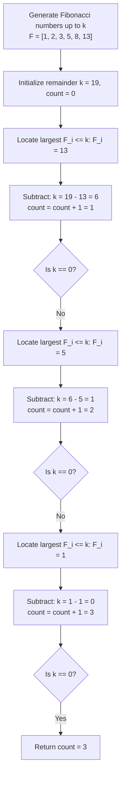

# Guided Example: Find the Minimum Number of Fibonacci Numbers Whose Sum Is K

We trace the step-by-step execution of Zeckendorf's greedy decomposition on a representative problem instance:

- **Input:** $k = 19$
- **Required Output:** $3$

This instance features multiple decomposition steps, skips across non-adjacent Fibonacci terms ($13$, $5$, $1$), and illustrates why greedily subtracting the largest available Fibonacci number guarantees the global minimum count of summands.

---

## 1. Instance & Teaching Goal

We are given an integer $k \ge 1$. We must find the minimum count of Fibonacci numbers that sum to exactly $k$, where the same Fibonacci number may be used multiple times if needed. Fibonacci numbers are defined by:
$$
F_1 = 1, \quad F_2 = 1, \quad F_n = F_{n-1} + F_{n-2} \quad (n \ge 3)
$$
The sequence begins: $1, 2, 3, 5, 8, 13, 21, 34, 55, \dots$

For $k = 19$:
- The largest Fibonacci number not exceeding $19$ is $13$.
- Subtracting $13$ leaves a remainder of $19 - 13 = 6$.
- The largest Fibonacci number not exceeding $6$ is $5$.
- Subtracting $5$ leaves a remainder of $6 - 5 = 1$.
- The largest Fibonacci number not exceeding $1$ is $1$.
- Subtracting $1$ leaves $0$, using a total of $3$ Fibonacci numbers: $13 + 5 + 1 = 19$.

The primary teaching goal is to understand Zeckendorf's theorem: any integer has a unique representation as a sum of non-consecutive Fibonacci numbers. Because the sum of all smaller non-consecutive Fibonacci numbers cannot reach $F_m$, choosing the largest Fibonacci number $\le k$ at every step is strictly necessary and optimal, enabling a greedy solution in logarithmic time instead of intractable exponential search or dynamic programming over $k \le 10^9$.

---

## 2. Conceptual Foundation & Invariants

Let $F_m$ be the largest Fibonacci number such that $F_m \le k$.
Consider the maximum sum achievable using only non-consecutive Fibonacci numbers strictly smaller than $F_m$:
$$
F_{m-1} + F_{m-3} + F_{m-5} + \dots = F_m - 1
$$
Because the sum of all smaller non-consecutive terms is strictly less than $F_m$:
$$
\sum_{i} F_{c_i} \le F_m - 1 < F_m \le k
$$
any representation of $k$ that avoids using $F_m$ must either:
1. Use consecutive terms, which can always be collapsed ($F_{j} + F_{j-1} = F_{j+1}$) to reduce term count.
2. Use duplicate terms, which can similarly be rewritten ($2F_j = F_{j+1} + F_{j-2}$ for $j \ge 3$) without increasing the total count.

Consequently, selecting $F_m$ never sacrifices optimality. We precompute all Fibonacci numbers up to $k$, then greedily subtract the largest available number until the remainder becomes $0$.

```
k = 19
Fibonacci candidates: [1, 2, 3, 5, 8, 13]  (21 > 19)

Step 1: Pick 13
        Remaining k: 19 - 13 = 6
        Count: 1

Step 2: Pick 5
        Remaining k: 6 - 5 = 1
        Count: 2

Step 3: Pick 1
        Remaining k: 1 - 1 = 0
        Count: 3 (Target reached!)
```

We define tracking variables for the greedy reduction:

| Parameter | Domain | Role in Algorithm |
|---|---|---|
| Remainder ($k$) | $[0, 10^9]$ | Value remaining to be decomposed |
| Candidate List | $\{F_i \mid F_i \le k\}$ | Precomputed sorted list of Fibonacci numbers |
| Search Pointer ($idx$) | Top-down index | Cursor tracking the largest Fibonacci candidate $\le k$ |
| Summand Count | $[0, \log_\phi k]$ | Number of Fibonacci numbers selected |

> **Invariant.** At each step, the selected Fibonacci number $F$ is the maximal Fibonacci number satisfying $F \le k$. The minimal number of Fibonacci summands required to form the original target equals the current summand count plus the minimal number of summands required to form the updated remainder $k$.



---

## 3. Step-by-Step Worked Execution

### Step 1: Precomputing Fibonacci Numbers up to $k = 19$

We generate distinct Fibonacci numbers starting from $1, 2$:
- $F_1 = 1$
- $F_2 = 2$
- $F_3 = 1 + 2 = 3$
- $F_4 = 2 + 3 = 5$
- $F_5 = 3 + 5 = 8$
- $F_6 = 5 + 8 = 13$
- Next would be $8 + 13 = 21 > 19$ (stop generation).

Candidate sequence: $[1, 2, 3, 5, 8, 13]$.

| Term Index ($i$) | Term Expression | Value | Relationship to $k = 19$ |
|---|---|---|---|
| $1$ | $F_1$ | $1$ | $< 19$ |
| $2$ | $F_2$ | $2$ | $< 19$ |
| $3$ | $F_3$ | $3$ | $< 19$ |
| $4$ | $F_4$ | $5$ | $< 19$ |
| $5$ | $F_5$ | $8$ | $< 19$ |
| $6$ | $F_6$ | $13$ | $\le 19$ (Largest candidate) |

---

### Step 2: First Greedy Subtraction ($F = 13$)

- Target remainder: $k = 19$.
- Largest candidate $\le 19$ is $13$.
- New remainder: $k \leftarrow 19 - 13 = 6$.
- Increment count: $count \leftarrow 0 + 1 = 1$.

| Step Number | Current $k$ | Selected Fibonacci Term | Calculation | Updated Remainder $k$ | Total Count |
|---|---|---|---|---|---|
| $1$ | $19$ | $13$ | $19 - 13$ | $6$ | $1$ |

---

### Step 3: Second Greedy Subtraction ($F = 5$)

- Target remainder: $k = 6$.
- Largest candidate $\le 6$ is $5$ (since $8 > 6$).
- New remainder: $k \leftarrow 6 - 5 = 1$.
- Increment count: $count \leftarrow 1 + 1 = 2$.

| Step Number | Current $k$ | Selected Fibonacci Term | Calculation | Updated Remainder $k$ | Total Count |
|---|---|---|---|---|---|
| $2$ | $6$ | $5$ | $6 - 5$ | $1$ | $2$ |

---

### Step 4: Third Greedy Subtraction ($F = 1$)

- Target remainder: $k = 1$.
- Largest candidate $\le 1$ is $1$ (since $2 > 1$).
- New remainder: $k \leftarrow 1 - 1 = 0$.
- Increment count: $count \leftarrow 2 + 1 = 3$.
- Remainder reaches $0$. Decomposition terminates.

| Step Number | Current $k$ | Selected Fibonacci Term | Calculation | Updated Remainder $k$ | Total Count |
|---|---|---|---|---|---|
| $3$ | $1$ | $1$ | $1 - 1$ | $0$ | $3$ |

Final minimal number of Fibonacci numbers used: $3$.

---

## 4. Complete Execution Trace

| Iteration | Initial Remainder ($k$) | Candidate Tested | Decision | New Remainder | Running Summand Count |
|---|---|---|---|---|---|
| Setup | $19$ | Generate $\le 19$ | Precompute $[1, 2, 3, 5, 8, 13]$ | $19$ | $0$ |
| $1$ | $19$ | $13$ | $13 \le 19 \implies$ Select | $6$ | $1$ |
| $2$ | $6$ | $8$ | $8 > 6 \implies$ Skip | $6$ | $1$ |
| $2$ | $6$ | $5$ | $5 \le 6 \implies$ Select | $1$ | $2$ |
| $3$ | $1$ | $3, 2$ | $> 1 \implies$ Skip | $1$ | $2$ |
| $3$ | $1$ | $1$ | $1 \le 1 \implies$ Select | $0$ | $3$ |
| Terminate | $0$ | None | $k = 0 \implies$ Emit count | $0$ | $3$ |

---

## 5. Algorithmic Correctness

**Soundness.** Every chosen term is an authentic Fibonacci number from the generated sequence. The sum of the chosen numbers equals $13 + 5 + 1 = 19 = k$. Because $k$ is reduced to $0$ strictly via subtractions of positive values, termination is guaranteed.

**Completeness.** By Zeckendorf's theorem, every positive integer has a unique representation as a sum of non-consecutive Fibonacci numbers. Since the sum of any combination of non-consecutive Fibonacci numbers strictly smaller than $F_m$ is bounded above by $F_m - 1 < k$, any valid representation of $k$ without $F_m$ would require multiple smaller terms whose sum could be regrouped into $F_m$ plus other terms. Hence, greedy choice preserves the global minimum number of summands.

---

## 6. Traps This Instance Exposes

- **Dynamic Programming on Value $k$:** Creating an array of size $k$ ($DP[i] = \min DP[i - F] + 1$) will cause memory exhaustion or timeout because $k \le 10^9$.
- **Ascending Greedy Choice:** Selecting the smallest Fibonacci number ($1 + 1 + \dots$) gives an arbitrarily large number of summands ($19$ ones instead of $3$ terms).
- **Duplicate Initial Ones:** Including both $F_1 = 1$ and $F_2 = 1$ in the candidate search list can cause redundant evaluations; deduplicating to $[1, 2, 3, 5, \dots]$ keeps the sequence strictly increasing.
- **Unbounded Search:** Searching beyond $k$ in the Fibonacci sequence is unnecessary; the generator can halt immediately once the next term exceeds $k$.

---

## 7. Complexity Derivation

- **Time Complexity:** $\mathcal{O}(\log_\phi k)$. The $n$-th Fibonacci number satisfies $F_n \approx \frac{\phi^n}{\sqrt{5}}$ where $\phi \approx 1.618$. For $k \le 10^9$, $F_{45} \approx 1.13 \times 10^9 > 10^9$, meaning the list contains at most $45$ numbers. Precomputation takes $45$ operations, and the reverse linear scan takes at most $45$ steps, executing in under $100$ operations total.
- **Auxiliary Space Complexity:** $\mathcal{O}(\log_\phi k)$. The precomputed list requires storage for at most $45$ integers.
