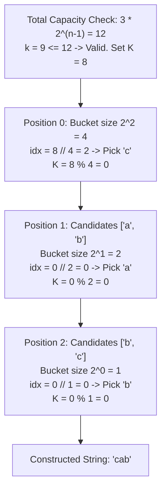

# Guided Example: The k-th Lexicographical String of All Happy Strings of Length n

We trace the step-by-step execution of direct combinatorial radix branching on a representative problem instance:

- **Input:** $n = 3, k = 9$
- **Required Output:** `"cab"`

This instance features non-trivial branching across the tertiary root and secondary descendant levels, illustrates $0$-indexed rank quotient arithmetic, and demonstrates direct $\mathcal{O}(n)$ string synthesis without generating the full exponential search tree.

---

## 1. Instance & Teaching Goal

A **happy string** of length $n$ is composed exclusively from the alphabet $\{'a', 'b', 'c'\}$ such that no two adjacent characters are identical:
$$
s[i] \neq s[i + 1] \quad \forall 0 \le i < n - 1
$$
We must determine the $k$-th lexicographically smallest happy string of length $n$, or return an empty string if fewer than $k$ happy strings exist.

For $n = 3$:
- The first character has $3$ choices ($'a', 'b', 'c'$).
- Each of the remaining $n - 1 = 2$ positions has exactly $2$ choices (the two letters differing from the preceding character).
- Total happy strings of length $3$: $3 \times 2^{3 - 1} = 3 \times 4 = 12$.

For $k = 9$, the target index falls within the valid range $[1, 12]$. Generating all $12$ strings reveals:
$$
[\text{"aba"}, \text{"abc"}, \text{"aca"}, \text{"acb"}, \text{"bab"}, \text{"bac"}, \text{"bca"}, \text{"bcb"}, \mathbf{\text{"cab"}}, \text{"cac"}, \text{"cba"}, \text{"cbc"}]
$$
The $9$-th string is `"cab"`.

The primary teaching goal is to construct the $k$-th string directly in $\mathcal{O}(n)$ time using combinatorial counting and quotient-remainder arithmetic, bypassing exhaustive recursion or exponential array generation.

---

## 2. Conceptual Foundation & Invariants

Let total happy strings of length $n$ be $T(n) = 3 \cdot 2^{n - 1}$. If $k > T(n)$, return `""` immediately. Otherwise, convert $k$ to $0$-based rank $K = k - 1 \in [0, T(n) - 1]$.

At position $0$:
- The tree branches into $3$ symmetric subtrees rooted at $'a', 'b', 'c'$.
- Each subtree spans $2^{n - 1}$ strings.
- Root branch index:
  $$
  idx_0 = \left\lfloor \frac{K}{2^{n - 1}} \right\rfloor \in \{0, 1, 2\}
  $$
  corresponding to alphabet $[ 'a', 'b', 'c' ]$.
- Update remainder: $K \leftarrow K \pmod{2^{n - 1}}$.

For each subsequent position $i$ from $1$ to $n - 1$:
- Two candidate characters are available from $\{'a', 'b', 'c'\} \setminus \{s[i - 1]\}$ in ascending order.
- Each branch spans $2^{n - 1 - i}$ strings.
- Branch index:
  $$
  idx_i = \left\lfloor \frac{K}{2^{n - 1 - i}} \right\rfloor \in \{0, 1\}
  $$
- Update remainder: $K \leftarrow K \pmod{2^{n - 1 - i}}$.

```
K = 8 (k = 9)
Root Choices: 'a' (0..3), 'b' (4..7), 'c' (8..11)
8 / 4 = 2  ==> Pick 'c'
Remaining K = 8 % 4 = 0

Sub-choices after 'c': ['a', 'b']
Block size: 2^(3-1-1) = 2
0 / 2 = 0  ==> Pick 'a'
Remaining K = 0 % 2 = 0

Sub-choices after 'a': ['b', 'c']
Block size: 2^(3-2-1) = 1
0 / 1 = 0  ==> Pick 'b'
Remaining K = 0 % 1 = 0

Constructed String: "c" + "a" + "b" = "cab"
```

We define tracking variables for the combinatorial descent:

| Variable | Domain | Pedagogical Meaning |
|---|---|---|
| Index $i$ | $0 \dots n - 1$ | Current character position being constructed |
| Rank $K$ | $[0, 3 \cdot 2^{n - 1} - 1]$ | Remaining $0$-based offset within current subtree |
| Block Size | $2^{n - 1 - i}$ (for $i \ge 1$) | Number of leaves beneath each candidate branch |
| Available Choices | Array of $2$ or $3$ chars | Lexicographically sorted valid successor characters |
| Selected Char | $'a', 'b'$, or $'c'$ | Character fixed at $s[i]$ |

> **Invariant.** At step $i$, the prefix $s[0 \dots i - 1]$ is a valid happy prefix, and the target string is guaranteed to reside at offset $K$ within the lexicographically sorted sub-forest of happy completions rooted at this prefix.



---

## 3. Step-by-Step Worked Execution

### Step 1: Capacity Validation and Base Rank Conversion

- Total capacity: $T(3) = 3 \cdot 2^{3 - 1} = 3 \cdot 4 = 12$.
- Target rank $k = 9 \le 12 \implies$ valid string exists.
- Convert to $0$-based rank:
  $$
  K = 9 - 1 = 8
  $$

| Parameter | Value | Interpretation |
|---|---|---|
| Total Happy Strings ($T(n)$) | $12$ | Capacity of depth-$3$ happy tree |
| Input $k$ | $9$ | $1$-based target index |
| Normalized Rank $K$ | $8$ | $0$-based target index |
| Feasibility | Satisfied | String exists in tree |

---

### Step 2: Selecting Character at Position $0$

- Root options: $['a', 'b', 'c']$.
- Block size per root branch: $2^{n - 1} = 2^2 = 4$.
- Branch index:
  $$
  idx_0 = \left\lfloor \frac{8}{4} \right\rfloor = 2
  $$
  Options$[2] = 'c'$.
- Update rank:
  $$
  K \leftarrow 8 \pmod 4 = 0
  $$
- Prefix state: $s = \text{"c"}$.

| Position ($i$) | Available Characters | Block Size | Quotient Calculation | Selected Character | Updated $K$ |
|---|---|---|---|---|---|
| $0$ | $['a', 'b', 'c']$ | $4$ | $\lfloor 8 / 4 \rfloor = 2$ | $'c'$ | $8 \pmod 4 = 0$ |

---

### Step 3: Selecting Character at Position $1$

- Preceding character: $'c'$.
- Valid choices: $\{'a', 'b', 'c'\} \setminus \{'c'\} = ['a', 'b']$.
- Block size per branch: $2^{n - 1 - 1} = 2^1 = 2$.
- Branch index:
  $$
  idx_1 = \left\lfloor \frac{0}{2} \right\rfloor = 0
  $$
  Options$[0] = 'a'$.
- Update rank:
  $$
  K \leftarrow 0 \pmod 2 = 0
  $$
- Prefix state: $s = \text{"ca"}$.

| Position ($i$) | Available Characters | Block Size | Quotient Calculation | Selected Character | Updated $K$ |
|---|---|---|---|---|---|
| $1$ | $['a', 'b']$ | $2$ | $\lfloor 0 / 2 \rfloor = 0$ | $'a'$ | $0 \pmod 2 = 0$ |

---

### Step 4: Selecting Character at Position $2$

- Preceding character: $'a'$.
- Valid choices: $\{'a', 'b', 'c'\} \setminus \{'a'\} = ['b', 'c']$.
- Block size per branch: $2^{n - 1 - 2} = 2^0 = 1$.
- Branch index:
  $$
  idx_2 = \left\lfloor \frac{0}{1} \right\rfloor = 0
  $$
  Options$[0] = 'b'$.
- Update rank:
  $$
  K \leftarrow 0 \pmod 1 = 0
  $$
- Final string: $s = \text{"cab"}$.

| Position ($i$) | Available Characters | Block Size | Quotient Calculation | Selected Character | Updated $K$ |
|---|---|---|---|---|---|
| $2$ | $['b', 'c']$ | $1$ | $\lfloor 0 / 1 \rfloor = 0$ | $'b'$ | $0 \pmod 1 = 0$ |

Target length $n = 3$ reached. Emitted string is `"cab"`.

---

## 4. Complete Execution Trace

| Position ($i$) | Preceding Char | Valid Options | Subtree Weight | Index Selection Formula | Chosen Char | Resulting Prefix |
|---|---|---|---|---|---|---|
| Start | None | $['a', 'b', 'c']$ | $4$ | $\lfloor 8 / 4 \rfloor = 2$ | $'c'$ | `"c"` |
| $1$ | $'c'$ | $['a', 'b']$ | $2$ | $\lfloor 0 / 2 \rfloor = 0$ | $'a'$ | `"ca"` |
| $2$ | $'a'$ | $['b', 'c']$ | $1$ | $\lfloor 0 / 1 \rfloor = 0$ | $'b'$ | `"cab"` |
| Result | — | — | — | Target length met | — | `"cab"` |

---

## 5. Algorithmic Correctness

**Soundness.** Every character choice explicitly excludes the immediately preceding character, ensuring that $s[i] \neq s[i - 1]$ holds universally. Because candidates at each step are sorted lexicographically ($'a' < 'b' < 'c'$), ordering subtrees by their block offsets preserves the exact global lexicographical order.

**Completeness.** The total number of leaves in the decision tree is $3 \cdot 2^{n - 1}$. The quotient and remainder decomposition bijectively maps each integer $K \in [0, 3 \cdot 2^{n - 1} - 1]$ to a unique path from root to leaf, guaranteeing that the $k$-th string is accurately identified.

---

## 6. Traps This Instance Exposes

- **$1$-Based vs $0$-Based Off-by-One:** Using $k$ directly without subtracting $1$ causes off-by-one errors across block divisions (e.g. $9 / 4 = 2$ but $8 / 4 = 2$, whereas $4 / 4 = 1$ instead of $3 / 4 = 0$).
- **Generating All Strings:** For $n = 10$, $3 \cdot 2^9 = 1536$ strings exist. While backtracking passes for small constraints, direct mathematical radix selection avoids unnecessary memory allocations and runs in strictly deterministic $\mathcal{O}(n)$ time.
- **Unsorted Candidate Sets:** Successor characters must always be evaluated in alphabetical order (e.g., after `'a'`, candidates must be `['b', 'c']`, not `['c', 'b']`).
- **Boundary Omission:** Forgetting the capacity guard when $k > 3 \cdot 2^{n - 1}$ causes index out-of-bounds errors on root selection rather than returning `""`.

---

## 7. Complexity Derivation

- **Time Complexity:** $\mathcal{O}(n)$. The algorithm performs exactly $n$ iterations. In each iteration, block sizes are computed via bit shifts ($1 \ll (n - 1 - i)$) in $\mathcal{O}(1)$ time, followed by $\mathcal{O}(1)$ division and modulo operations. Total time is strictly linear in $n$.
- **Auxiliary Space Complexity:** $\mathcal{O}(n)$ auxiliary memory to assemble and return the resulting character string of length $n$.
