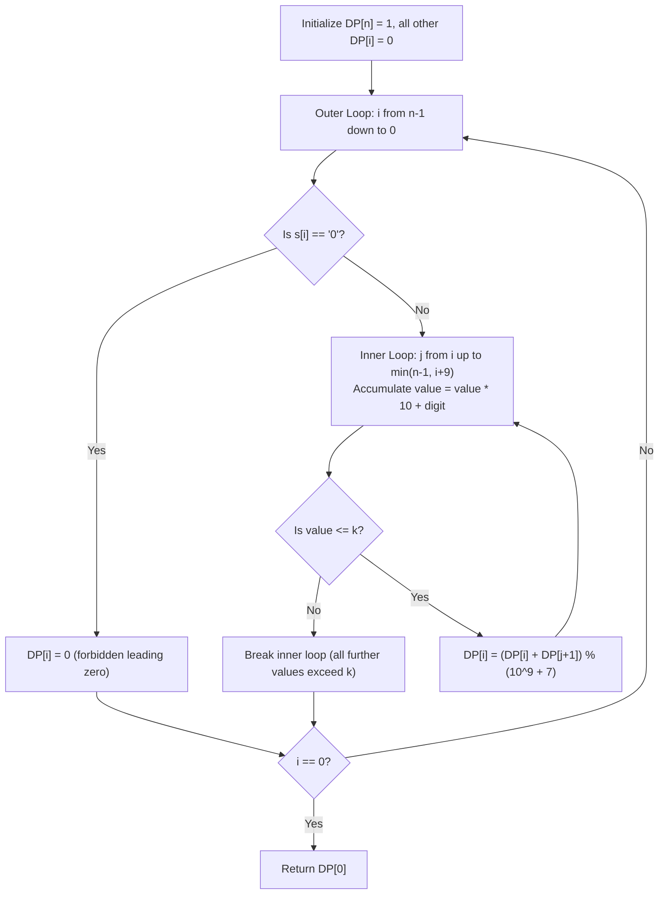

# Guided Example: Restore The Array

We trace the step-by-step execution of suffix-partition Dynamic Programming on a representative problem instance:

- **Input:** $s = \text{"1317"}, k = 2000$
- **Required Output:** $8$

This instance features multiple overlapping partition choices, numeric boundary comparisons against upper threshold $k$, and illustrates how suffix aggregation computes all valid non-empty number splits modulo $10^9 + 7$.

---

## 1. Instance & Teaching Goal

A sequence of integers in the range $[1, k]$ was concatenated into a continuous string of digits $s$ without separators. We must determine the number of distinct arrays of integers that could produce string $s$, subject to two constraints:
1. Every integer in the reconstructed array must satisfy $1 \le \text{num} \le k$.
2. No integer may contain leading zeros (e.g. `"0"` or `"07"` are forbidden).

Since the answer may be very large, the result must be computed modulo $10^9 + 7$.

In the instance $s = \text{"1317"}$ with $k = 2000$:
- Any single digit ($1, 3, 1, 7$) is in $[1, 2000]$.
- Any two-digit number ($13, 31, 17$) is in $[1, 2000]$.
- Any three-digit number ($131, 317$) is in $[1, 2000]$.
- The four-digit number $1317$ is $\le 2000$.
- All $2^{4 - 1} = 8$ potential partition ways are valid:
  $[1317]$, $[131, 7]$, $[13, 17]$, $[1, 317]$, $[13, 1, 7]$, $[1, 31, 7]$, $[1, 3, 17]$, $[1, 3, 1, 7]$.

The primary teaching goal is to formulate suffix dynamic programming where each state $DP[i]$ aggregates all valid choices for the first number starting at index $i$, exploiting the fact that numbers cannot exceed $k \le 10^9$ to restrict each transition to at most $10$ digits.

---

## 2. Conceptual Foundation & Invariants

Let $n = |s|$. We define $DP[i]$ as the number of valid arrays that can be formed from the suffix $s[i \dots n - 1]$.
- **Base Case:** $DP[n] = 1$, representing a successfully completed full partition.
- **Leading Zero Case:** If $s[i] = \text{'0'}$, then $DP[i] = 0$. No positive integer can have a leading zero, so no valid partition can begin with character `'0'` at index $i$.
- **General Recurrence:** If $s[i] \neq \text{'0'}$, we consider all valid integer tokens formed by prefix slices $s[i \dots j]$ for $i \le j < n$:
  $$
  DP[i] = \sum_{j = i}^{\min(n - 1, \, i + 9)} DP[j + 1] \quad \text{for all } j \text{ where } \text{value}(s[i \dots j]) \le k
  $$
  The search over $j$ terminates early if $\text{value}(s[i \dots j]) > k$, because appending more digits strictly increases the numeric value.

```
Suffix DP Formulation for s = "1317", k = 2000:
Index:    0    1    2    3    4 (Boundary)
Chars:    1    3    1    7    [End]
          |    |    |    |      |
DP:      [8]  [4]  [2]  [1]    [1]

From i = 0 ('1'):
  Pick "1"    (val 1 <= 2000)   ---> jumps to DP[1] = 4
  Pick "13"   (val 13 <= 2000)  ---> jumps to DP[2] = 2
  Pick "131"  (val 131 <= 2000) ---> jumps to DP[3] = 1
  Pick "1317" (val 1317 <= 2000)---> jumps to DP[4] = 1
  Total DP[0] = 4 + 2 + 1 + 1 = 8
```

We define tracking parameters for the dynamic programming table:

| State Parameter | Domain | Role in Recurrence |
|---|---|---|
| Suffix Index $i$ | $n \dots 0$ | Start index of the current unresolved suffix |
| End Index $j$ | $i \dots \min(n - 1, i + 9)$ | Terminal index of the leading integer candidate $s[i \dots j]$ |
| Running Value $V$ | Integer $\ge 0$ | Numerical value of candidate integer $s[i \dots j]$ |
| Table $DP[i]$ | $[0, 10^9 + 6]$ | Total valid partitions of suffix $s[i \dots n - 1] \pmod{10^9 + 7}$ |

> **Invariant.** For each index $i$ evaluated in reverse order from $n - 1$ down to $0$, $DP[i]$ stores the exact number of valid integer partitions of suffix $s[i \dots n - 1]$ such that every integer lies in $[1, k]$ and contains no leading zero.



---

## 3. Step-by-Step Worked Execution

### Step 1: Base Case Initialization ($DP[4] = 1$)

- Suffix length $n = 4$.
- Array allocation: $DP = [0, 0, 0, 0, 1]$.
- Base state: $DP[4] = 1$ representing an empty remaining suffix once all characters have been partitioned.

---

### Step 2: Compute State $DP[3]$ ($s[3] = \text{'7'}$)

- Start at $i = 3$, character is `'7'` $\neq$ `'0'`.
- Inner loop $j = 3$:
  - Token $s[3..3] = \text{"7"}$, numeric value $7 \le 2000$.
  - Valid token. Transition adds $DP[4]$:
    $$
    DP[3] = DP[4] = 1
    $$
- Updated table: $DP = [0, 0, 0, 1, 1]$.

| Index $i$ | Candidate Token | Numeric Value | Valid ($\le k$)? | Transition Term | Resulting $DP[i]$ |
|---|---|---|---|---|---|
| $3$ | `"7"` | $7$ | Yes | $+ DP[4] = 1$ | $1$ |

---

### Step 3: Compute State $DP[2]$ ($s[2] = \text{'1'}$)

- Start at $i = 2$, character is `'1'` $\neq$ `'0'`.
- Candidate $j = 2$:
  - Token $s[2..2] = \text{"1"}$, value $1 \le 2000 \implies + DP[3] = 1$.
- Candidate $j = 3$:
  - Token $s[2..3] = \text{"17"}$, value $17 \le 2000 \implies + DP[4] = 1$.
- Sum of transitions:
  $$
  DP[2] = DP[3] + DP[4] = 1 + 1 = 2
  $$
- Updated table: $DP = [0, 0, 2, 1, 1]$.

| Index $i$ | Candidate Token | Numeric Value | Valid ($\le k$)? | Transition Term | Resulting $DP[i]$ |
|---|---|---|---|---|---|
| $2$ | `"1"` | $1$ | Yes | $+ DP[3] = 1$ | $1$ |
| $2$ | `"17"` | $17$ | Yes | $+ DP[4] = 1$ | $1 + 1 = 2$ |

---

### Step 4: Compute State $DP[1]$ ($s[1] = \text{'3'}$)

- Start at $i = 1$, character is `'3'` $\neq$ `'0'`.
- Candidate $j = 1$:
  - Token $s[1..1] = \text{"3"}$, value $3 \le 2000 \implies + DP[2] = 2$.
- Candidate $j = 2$:
  - Token $s[1..2] = \text{"31"}$, value $31 \le 2000 \implies + DP[3] = 1$.
- Candidate $j = 3$:
  - Token $s[1..3] = \text{"317"}$, value $317 \le 2000 \implies + DP[4] = 1$.
- Sum of transitions:
  $$
  DP[1] = DP[2] + DP[3] + DP[4] = 2 + 1 + 1 = 4
  $$
- Updated table: $DP = [0, 4, 2, 1, 1]$.

| Index $i$ | Candidate Token | Numeric Value | Valid ($\le k$)? | Transition Term | Resulting $DP[i]$ |
|---|---|---|---|---|---|
| $1$ | `"3"` | $3$ | Yes | $+ DP[2] = 2$ | $2$ |
| $1$ | `"31"` | $31$ | Yes | $+ DP[3] = 1$ | $2 + 1 = 3$ |
| $1$ | `"317"` | $317$ | Yes | $+ DP[4] = 1$ | $3 + 1 = 4$ |

---

### Step 5: Compute State $DP[0]$ ($s[0] = \text{'1'}$)

- Start at $i = 0$, character is `'1'` $\neq$ `'0'`.
- Candidate $j = 0$:
  - Token $s[0..0] = \text{"1"}$, value $1 \le 2000 \implies + DP[1] = 4$.
- Candidate $j = 1$:
  - Token $s[0..1] = \text{"13"}$, value $13 \le 2000 \implies + DP[2] = 2$.
- Candidate $j = 2$:
  - Token $s[0..2] = \text{"131"}$, value $131 \le 2000 \implies + DP[3] = 1$.
- Candidate $j = 3$:
  - Token $s[0..3] = \text{"1317"}$, value $1317 \le 2000 \implies + DP[4] = 1$.
- Sum of transitions:
  $$
  DP[0] = DP[1] + DP[2] + DP[3] + DP[4] = 4 + 2 + 1 + 1 = 8
  $$
- Final answer: $DP[0] = 8$.

| Index $i$ | Candidate Token | Numeric Value | Valid ($\le k$)? | Transition Term | Resulting $DP[i]$ |
|---|---|---|---|---|---|
| $0$ | `"1"` | $1$ | Yes | $+ DP[1] = 4$ | $4$ |
| $0$ | `"13"` | $13$ | Yes | $+ DP[2] = 2$ | $4 + 2 = 6$ |
| $0$ | `"131"` | $131$ | Yes | $+ DP[3] = 1$ | $6 + 1 = 7$ |
| $0$ | `"1317"` | $1317$ | Yes | $+ DP[4] = 1$ | $7 + 1 = 8$ |

All indices processed. Final output value is $8$.

---

## 4. Complete Execution Trace

| Suffix Index ($i$) | Character $s[i]$ | Slices Evaluated ($s[i \dots j]$) | Substring Values | Sum Formula Applied | State $DP[i]$ |
|---|---|---|---|---|---|
| $4$ | Boundary | None | None | Base initialization | $1$ |
| $3$ | `'7'` | $[7]$ | $[7]$ | $DP[4]$ | $1$ |
| $2$ | `'1'` | $[1, 17]$ | $[1, 17]$ | $DP[3] + DP[4]$ | $2$ |
| $1$ | `'3'` | $[3, 31, 317]$ | $[3, 31, 317]$ | $DP[2] + DP[3] + DP[4]$ | $4$ |
| $0$ | `'1'` | $[1, 13, 131, 1317]$ | $[1, 13, 131, 1317]$ | $DP[1] + DP[2] + DP[3] + DP[4]$ | $8$ |

---

## 5. Algorithmic Correctness

**Soundness.** Every state transition corresponds to slicing a valid non-empty prefix token $s[i \dots j]$ whose numeric value strictly falls within $[1, k]$. Because transitions explicitly verify $s[i] \neq \text{'0'}$, no token can possess a leading zero. Every valid path from index $0$ to boundary $n$ represents an authentic partition of $s$.

**Completeness.** By mathematical induction on suffix length, if $DP[j + 1]$ correctly stores the count of valid partitions for all $j \ge i$, then summing $DP[j + 1]$ over all feasible first tokens $s[i \dots j]$ exhaustively accounts for all valid completions without duplication.

---

## 6. Traps This Instance Exposes

- **Leading Zero Invalidation:** If $s[i] = \text{'0'}$, setting $DP[i] > 0$ violates the condition that integers cannot contain leading zeros. A zero must contribute $0$ independent ways unless it forms the interior or tail of a larger multi-digit token starting at an earlier index.
- **Unbounded Numeric Accumulation:** Continuing the inner loop when $\text{value} > k$ wastes cycles and risks numeric overflow; since all digits are non-negative, once $\text{value} > k$, all larger slices will also exceed $k$.
- **Modulo Omission:** Failing to apply modulo $10^9 + 7$ at each addition can cause integer overflow for large input lengths ($n \le 10^5$).
- **Digit Length Ceiling:** Since $k \le 10^9$, no valid integer can have more than $10$ digits; capping the inner loop at $10$ iterations ensures strict $\mathcal{O}(n)$ runtime.

---

## 7. Complexity Derivation

- **Time Complexity:** $\mathcal{O}(n \cdot \log_{10} k)$, where $n \le 10^5$ and $k \le 10^9$. The outer loop runs $n$ times. Since $k \le 10^9$, any number with more than $10$ digits exceeds $k$, so the inner loop executes at most $\min(n - i, 10)$ times. Total operations are bounded by $10n \le 10^6$, running well within normal execution limits.
- **Auxiliary Space Complexity:** $\mathcal{O}(n)$ to store the DP table of size $n + 1$ (or $\mathcal{O}(\log_{10} k)$ using a circular sliding window of size $11$).