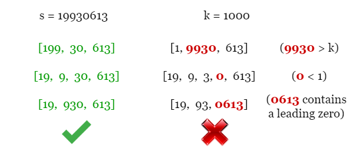
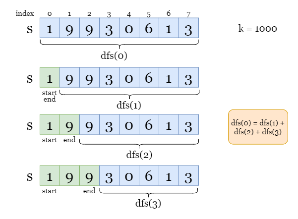
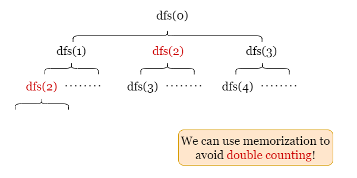
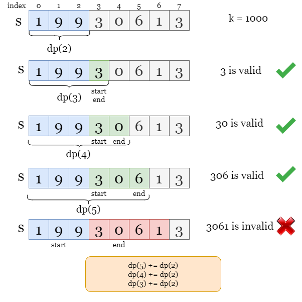
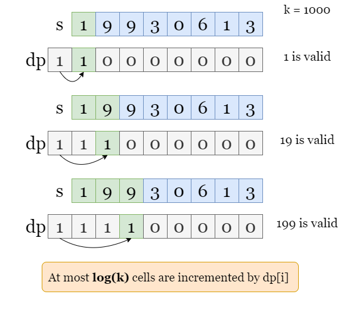
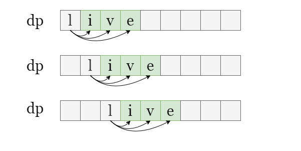
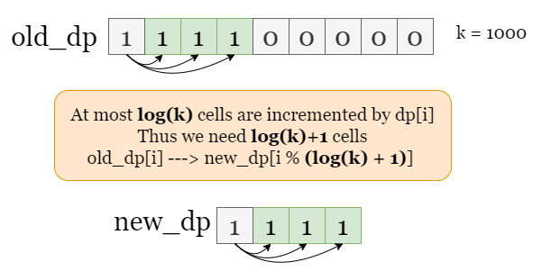
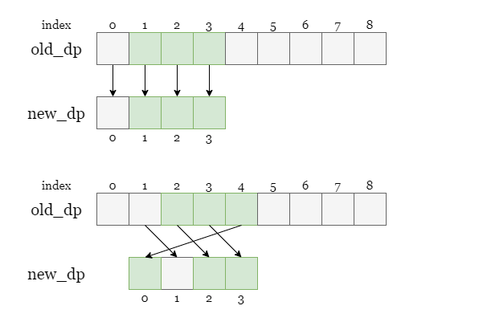

[TOC]

## Solution

---

### Overview

For example, we have $s = 19930613$ and $k = 1000$. Some of the valid arrays are colored in green because they can be printed as `s`. However, the red arrays are invalid since they either contain leading zeros or are invalid integers.



---

### Approach 1: Dynamic Programming (Top Down)

#### Intuition

In order to find all arrays that can be printed as the entire string `s`, we can start with finding all possible first integers, as shown in the picture below, we find 3 possible first integers, `1`, `19`, and `199`. For each case, we can continue moving on to the remaining substring and solve the subproblems and so on. The tree-like structure of this problem implies that we can use the depth-first-search method to solve it.

Suppose the size of the input string is `m`, let `dfs(x)` be the number of arrays for the suffix substring $s[x ~ m - 1]$.



Write the process in the picture above:
- If we let `1` be the first number, then we shall look for `dfs(1)`, the number of arrays that can be printed as $s[1 ~ m - 1]$.

- If we let `19` be the first number, then we shall look for `dfs(2)`, the number of arrays that can be printed as $s[2 ~ m - 1]$.

- If we let `199` be the first number, then we shall look for `dfs(3)`, the number of arrays that can be printed as $s[3 ~ m - 1]$.

In conclusion, the above observation can be rewritten as $dfs(0) = dfs(1) + dfs(2) + dfs(3)$. We can move on to `dfs(1)` and solve this subproblem, then move on to `dfs(2)`, and so on, we will handle all subproblems before getting `dfs(0)`.

However, there might be repeated computation, we can use an auxiliary array `dp` as memory to avoid double counting. We update $\text{dp}[x] = dfs(x)$ immediately after getting the value of `dfs(x)`, so we don't need to recalculate `dfs(start)` later.



The recursion stops when we reach base cases below, we can just return the corresponding value:

- If the digit $s[start]$ equals `0`, it means we can't find any valid array since leading zeros are not allowed. Return `0`.

- If the index `start` equals `m` (the length of `s`), it means we are looking for the number of arrays that can be printed as an empty string. Only the empty array works, so we return `1`.

<br>

#### Algorithm

1) Create an array `dp` of size $m + 1$, to store the value of `dfs(x)`.

2) To get the value of `dfs(start)`, if a non-zero $\text{dp}[start]$ exists, it means we have already got its value, return $\text{dp}[start]$. Otherwise:
- If $s[start] = 0$, return `0`.
- If $start = m$, return `1`.
- Initialize $count = 0$, the number of valid arrays.
- Then we look for every possible ending index `end` by iterating over indexes from `start`. If `s[start ~ end]` represents a valid integer, we continue looking for the subproblem $dfs(end + 1)$ and update `count` as $count += dfs(end + 1)$.
- Update $\text{dp}[start]$ as `dfs(start)`.

3) Return `dfs(0)`.

#### Implementation

```python
class Solution:
    def numberOfArrays(self, s: str, k: int) -> int:
        m, n = len(s), len(str(k))
        mod = 10 ** 9 + 7
        dp = [0] * (m + 1)

        # Number of possible splits for s[start ~ m-1].
        def dfs(start):
            # If we have already updated dp[start], return it.
            if dp[start]:
                return dp[start]

            # There is only 1 split for an empty string.
            if start == m:
                return 1

            # Number can't have leading zeros.
            if s[start] == '0':
                return 0

            # For all possible starting number, add the number of arrays
            # that can be printed as the remaining string to count.
            count = 0
            for end in range(start, m):
                curr_number = s[start: end + 1]
                if int(curr_number) > k:
                    break
                count += dfs(end + 1)

            # Update dp[start] so we don't recalculate it later.
            dp[start] = count % mod
            return count

        return dfs(0) % mod
```

#### Complexity Analysis

Let $m$ be the length of the input string `s`.

* Time complexity: $O(m \cdot \log k)$

- We create `dp` of length $m + 1$ for memory, it takes $O(m)$ steps to update them.
- At each step $s[start]$, we look for all possible ending index `end`. In the worst-case scenario, we will iterate over $\log k$ indexes before `currNumber` is larger than `k`, because each iteration increases `currNumber` by a magnitude.

- To sum up, the overall time complexity is $O(m \cdot \log k)$.

* Space complexity: $O(m)$

- We create an array `dp` of length $m + 1$.

<br/>

---

### Approach 2: Dynamic Programming (Bottom Up)

#### Intuition

We can also solve this problem iteratively. That is, to solve the subproblem first, then move on to larger problems.

Similarly, we let $\text{dp}[i]$ be the number of arrays for the prefix substring `s[0 ~ i]`, we will iterate over every index before getting $dp[m - 1]$. Suppose we have found $dp[start - 1]$. Then we move on to the index `start` and iterate for the ending index `end` and check if the integer made of `s[start ~ end]` is valid. If `s[start ~ end]` represents a valid integer, it means every valid array that can be printed as $s[0 ~ start - 1]$ can also be printed as `s[0 ~ end]` by appending the integer `s[start ~ end]`, so we increment $\text{dp}[end]$ by $dp[start - 1]$.

As shown in the picture below, imagine that we have found $\text{dp}[2]$.

- $s[3 ~ 3] = 3$ is a valid number, it means every array that can be printed as `s[0 ~ 2]` can also be printed as `s[0 ~ 3]` by appending `3`.
- $s[3 ~ 4] = 30$ is a valid number, it means every array that can be printed as `s[0 ~ 2]` can also be printed as `s[0 ~ 4]` by appending `30`.
- $s[3 ~ 5] = 306$ is a valid number, it means every array that can be printed as `s[0 ~ 2]` can also be printed as `s[0 ~ 5]` by appending `306`.



We create an array `dp` as memory where $\text{dp}[i]$ stores the number of arrays that can be printed as the prefix string `s[0 ~ i-1]`. Initialize $\text{dp}[0] = 1$ as there is one array (empty array) that can be printed as an empty string.

Back to the example above, suppose we have updated $\text{dp}[3]$.
- $s[3 ~ 3] = 3$ is a valid number, so we update $\text{dp}[4] += \text{dp}[3]$.
- $s[3 ~ 4] = 30$ is a valid number, so we update $\text{dp}[5] += \text{dp}[3]$.
- $s[3 ~ 5] = 306$ is a valid number, so we update $\text{dp}[6] += \text{dp}[3]$.

Once we finish the iteration, $\text{dp}[m]$ is the number of arrays that can be printed as the entire string `s`.

<br>

#### Algorithm

1) Let `m` be the size of input string `s`. We create an array `dp` of size $m + 1$. Set $\text{dp}[0] = 1$.

2) Iterate over each starting index `start`. If $s[start] = 0$, repeat step 2 and move on to the next index. Otherwise:
- Start an inner iteration over the ending index `end` from `start`.
- If the number represented by `s[start ~ end]` is valid, increment $dp[end + 1]$ by $\text{dp}[start]$.

3) Return $dp[m + 1]$ when the iteration ends.

#### Implementation

```python
class Solution:
    def numberOfArrays(self, s: str, k: int) -> int:
        m, n = len(s), len(str(k))
        mod = 10 ** 9 + 7

        # dp[i] records the number of arrays that can be printed as
        # the prefix substring s[0 ~ i - 1]
        dp = [1] + [0] * m

        # Iterate over every digit, for each digit s[start]:
        for start in range(m):
            if s[start] == '0':
                continue
            count = 0

            # Iterate over ending digit end and find all valid numbers
            # s[start ~ end].
            for end in range(start, m):
                curr_number = s[start:end + 1]
                if int(curr_number) > k:
                    break

                # If s[start ~ end] is valid, increment dp[end + 1] by dp[start].
                dp[end + 1] += dp[start]
                dp[end + 1] %= mod

        return dp[-1]
```

#### Complexity Analysis

Let $m$ be the length of the input string `s`.

* Time complexity: $O(m \cdot \log k)$

- We create `dp` of length $m + 1$ as memory, it takes $O(m)$ steps to update them.
- At each iteration step $s[start]$, we look for all possible ending index `end`. In the worst-case scenario, we have to traverse $\log k$ indexes before `currNumber` is larger than `k`. This is because each iteration increases `currNumber` by a magnitude.

- To sum up, the overall time complexity is $O(m \cdot \log k)$.

* Space complexity: $O(m)$

- We create an array `dp` of size $m + 1$.

<br/>

---

### Approach 3: Dynamic Programming (with less space complexity)

#### Intuition

In approach 2, we create an array `dp` of size $m + 1$. At each iteration step for the ending index $s[end]$, we increment $dp[end + 1]$ by $\text{dp}[start]$. Each iteration over `end` increases the current integer made by `s[start ~ end]` by a magnitude, thus there are at most $(\log k)$ cells we need to update before the integer exceeds `k`.

The question is, can we reduce the size of `dp` if only part of it ($(\log k)$) are used each time?



As shown in the picture below, at most $\log k$ cells are updated at each step. Once we pass the starting index `start` and move on to the next starting index $start + 1$, we will never need the value of $\text{dp}[start]$ anymore. This implies that we don't need to store the entire `dp` as we did in approach 2. Instead, we can use less space by only maintaining a 'live window' of size $\log k + 1$.



We can create $\text{new}_{dp}$ of size $\log k + 1$. For distinction, let's call the previous array $\text{old}_{dp}$. Since the $\text{new}_{dp}$ might be shorter than `s`, whenever we need to update $\text{new}_{dp}[x]$ as we did for $\text{old}_{dp}[x]$, we can get the remainder of the index `x` for modulo $\log k + 1$ as $x\ \% \ (\log k + 1)$ and update $\text{new\\_dp} [x\ \% \ (\log k + 1)]$ to avoid the case of index out of range.



In the example below, the size of 'live' window is `4`. If we move to the next starting index `1`, $\text{new}_{dp}[0]$ will represent $\text{old}_{dp}[4]$.



Before we move on to the next starting index $start + 1$, we need to reset the value representing the current starting index `start` as `0`, that is, $\text{new\\_dp} [\text{start}\ \% \ (\log k + 1)] = 0$. The reasons are as we said before:

> Once we pass the index `start` and move on to the next index, we will never need the value of $\text{dp}[start]$ anymore.

Thus $\text{new\\_dp} [\text{start}\ \% \ (\log k + 1)]$ doesn't represent the cell $\text{old\\_dp} [\text{start}]$ anymore, but the cell with a larger index $\text{old\\_dp} [\text{start} +  \log k + 1]$, so we need to reset it as `0` and update it in the further steps.

<br>

#### Algorithm

1) We create an array `dp` of size $log k + 1$. Set $\text{dp}[0] = 1$.

2) Iterate over each starting index `start`. If $s[start] = 0$, set $dp[start \% (log k + 1)]$ as `0`. Repeat step 2 and move on to the next index. Otherwise:
- Start an inner iteration over the ending index `end` from `start`.
- If the number represented by `s[start ~ end]` is valid, increment $dp[(end + 1) \% (log k + 1)]$ by $dp[start \% (log k + 1)]$.
- Set $dp[start \% (log k + 1)]$ as `0`.
3) Return $dp[(m + 1) \% (log k + 1)]$ when the iteration ends.

#### Implementation

```python
class Solution:
    def numberOfArrays(self, s: str, k: int) -> int:
        m, n = len(s), len(str(k))
        mod = 10 ** 9 + 7
        # dp[i % (n + 1)] records the number of arrays that can be printed as
        # the prefix substring s[0 ~ i - 1]
        dp = [1] + [0] * n

        # Iterate over every digit, for each digit s[start]:
        for start in range(m):
            if s[start] == '0':
                dp[start % (n + 1)] = 0
                continue

            # Iterate over ending digit end and find all valid numbers
            # s[start ~ end].
            for end in range(start, m):
                if int(s[start : end + 1]) > k:
                    break

                # If s[start ~ end] is valid, increment dp[(end + 1) % (n + 1)] by dp[start].
                dp[(end + 1) % (n + 1)] += dp[start % (n + 1)]
                dp[(end + 1) % (n + 1)] %= mod

            # Set dp[start % (n + 1)] as 0.
            dp[start % (n + 1)] = 0

        return dp[m % (n + 1)]
```

#### Complexity Analysis

Let $m$ be the length of the input string `s`.

* Time complexity: $O(m \cdot \log k)$

- It takes $O(m)$ steps to iterate over string `s`.
- At each iteration step $s[start]$, we will look for all possible ending index `end`. In the worst-case scenario, we have to traverse $\log k$ indexes before `currNumber` is larger than `k`. This is because each iteration increases `currNumber` by a magnitude.

- To sum up, the overall time complexity is $O(m \cdot \log k)$.

* Space complexity: $O(log k)$

- We create an array `dp` of size $(\log k)$.

<br/>