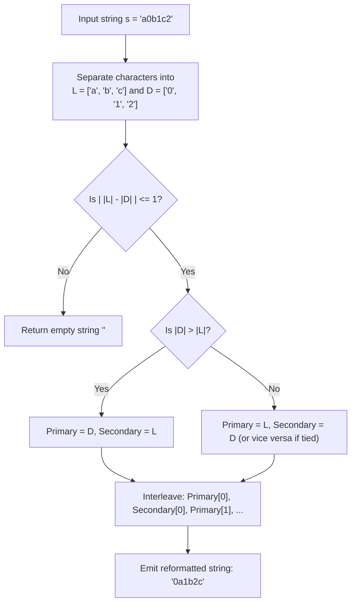

# Guided Example: Reformat The String

We trace the step-by-step execution of character partition interleaving on a representative problem instance:

- **Input:** $s = \text{"a0b1c2"}$
- **Required Output:** `"0a1b2c"` (or any valid alternating permutation such as `"a0b1c2"`)

This instance features balanced letter and digit partitions, demonstrates the pigeonhole constraint for strict type alternation, and illustrates interleaved two-stream reconstruction.

---

## 1. Instance & Teaching Goal

We are given an alphanumeric string $s$ containing lowercase English letters and decimal digits. We must find a permutation of $s$ such that no two adjacent characters share the same type (i.e. letters and digits alternate strictly). If no such permutation is possible, we must return an empty string `""`.

In the input $s = \text{"a0b1c2"}$:
- The string contains $3$ letters: $['a', 'b', 'c']$.
- The string contains $3$ digits: $['0', '1', '2']$.
- Because $|L| = |D| = 3$, the counts differ by $0$, allowing a perfect alternating sequence starting with either a digit (`"0a1b2c"`) or a letter (`"a0b1c2"`).

The primary teaching goal is to recognize the pigeonhole condition: alternating two distinct character sets requires their cardinalities to satisfy:
$$
\big| |L| - |D| \big| \le 1
$$
If this condition is violated, returning `""` is mandatory. When satisfied, the larger collection (or either, if tied) must take the leading position, followed by sequential interleaving.

---

## 2. Conceptual Foundation & Invariants

Let $L$ denote the multiset of alphabetic characters in $s$ and $D$ denote the multiset of numeric digits in $s$.
In any valid alternating string of length $n = |L| + |D|$:
- Two letters cannot be adjacent: every letter must be followed by a digit, except possibly the final character.
- Two digits cannot be adjacent: every digit must be followed by a letter, except possibly the final character.

This alternating structure implies:
$$
\begin{cases}
|L| = |D| + 1 & \implies \text{String must begin and end with a letter} \\
|D| = |L| + 1 & \implies \text{String must begin and end with a digit} \\
|L| = |D| & \implies \text{String may begin with either type} \\
\big| |L| - |D| \big| > 1 & \implies \text{Impossible; return } \text{""}
\end{cases}
$$

```
Input: "a0b1c2"
Partition:
  Letters (L): ['a', 'b', 'c']  (Size = 3)
  Digits  (D): ['0', '1', '2']  (Size = 3)

Delta: |3 - 3| = 0 <= 1  ==> Valid!

Interleaving Pipeline (starting with Digit):
Position:   0     1     2     3     4     5
Type:     Digit Letter Digit Letter Digit Letter
Source:    D[0]  L[0]  D[1]  L[1]  D[2]  L[2]
Char:      '0'   'a'   '1'   'b'   '2'   'c'
Output:   "0a1b2c"
```

We define tracking variables for the partition and reconstruction:

| State Variable | Type & Domain | Pedagogical Role |
|---|---|---|
| Letters List ($L$) | Array of characters $\in ['a' \dots 'z']$ | Partition of alphabetic tokens |
| Digits List ($D$) | Array of characters $\in ['0' \dots '9']$ | Partition of numeric tokens |
| Primary Stream ($A$) | Reference to $L$ or $D$ | Larger partition (assigned to even indices $0, 2, 4, \dots$) |
| Secondary Stream ($B$) | Reference to $D$ or $L$ | Smaller partition (assigned to odd indices $1, 3, 5, \dots$) |
| Output Buffer | Array of length $n$ | Reconstructed alternating string |

> **Invariant.** The difference in counts $| |L| - |D| | \le 1$ is a necessary and sufficient condition for the existence of an alternating permutation. The reconstructed string places the larger collection at index parity $0, 2, 4, \dots$ and the smaller at $1, 3, 5, \dots$, ensuring no adjacent elements share type.



---

## 3. Step-by-Step Worked Execution

### Step 1: Character Classification and Extraction

We scan the input string $s = \text{"a0b1c2"}$ character by character:
- Index $0$: `'a'` is a letter $\implies L = ['a']$.
- Index $1$: `'0'` is a digit $\implies D = ['0']$.
- Index $2$: `'b'` is a letter $\implies L = ['a', 'b']$.
- Index $3$: `'1'` is a digit $\implies D = ['0', '1']$.
- Index $4$: `'c'` is a letter $\implies L = ['a', 'b', 'c']$.
- Index $5$: `'2'` is a digit $\implies D = ['0', '1', '2']$.

| Scan Index | Observed Character | Type Identified | Current $L$ | Current $D$ |
|---|---|---|---|---|
| $0$ | `'a'` | Letter | $['a']$ | $[]$ |
| $1$ | `'0'` | Digit | $['a']$ | $['0']$ |
| $2$ | `'b'` | Letter | $['a', 'b']$ | $['0']$ |
| $3$ | `'1'` | Digit | $['a', 'b']$ | $['0', '1']$ |
| $4$ | `'c'` | Letter | $['a', 'b', 'c']$ | $['0', '1']$ |
| $5$ | `'2'` | Digit | $['a', 'b', 'c']$ | $['0', '1', '2']$ |

---

### Step 2: Cardinality and Parity Validation

We evaluate lengths:
- $|L| = 3$
- $|D| = 3$
- Difference: $| |L| - |D| | = |3 - 3| = 0 \le 1$.
- Feasibility check passes. Since sizes are equal, we may choose either stream to lead. Selecting digits $D$ as the leading stream yields primary $A = D$ and secondary $B = L$.

| Metric | Measured Value | Threshold Requirement | Outcome |
|---|---|---|---|
| Count of Letters ($|L|$) | $3$ | Non-negative integer | $3$ tokens |
| Count of Digits ($|D|$) | $3$ | Non-negative integer | $3$ tokens |
| Absolute Difference | $|3 - 3| = 0$ | $\le 1$ | Feasible alternating configuration |

---

### Step 3: Alternating Interleaving Assembly

We interleave elements from $A = ['0', '1', '2']$ and $B = ['a', 'b', 'c']$:
1. Pair $0$: Append $A[0] = \text{'0'}$, then $B[0] = \text{'a'} \implies \text{"0a"}$.
2. Pair $1$: Append $A[1] = \text{'1'}$, then $B[1] = \text{'b'} \implies \text{"0a1b"}$.
3. Pair $2$: Append $A[2] = \text{'2'}$, then $B[2] = \text{'c'} \implies \text{"0a1b2c"}$.
4. If $A$ had one extra element, it would be appended as the final character. Here both streams are exhausted simultaneously.

| Iteration ($k$) | Primary Element ($A[k]$) | Secondary Element ($B[k]$) | Appended Slice | Cumulative Result |
|---|---|---|---|---|
| $0$ | `'0'` | `'a'` | `"0a"` | `"0a"` |
| $1$ | `'1'` | `'b'` | `"1b"` | `"0a1b"` |
| $2$ | `'2'` | `'c'` | `"2c"` | `"0a1b2c"` |

Final constructed string: `"0a1b2c"`.

---

## 4. Complete Execution Trace

| Step Phase | Target Entity | Action Performed | Resulting State |
|---|---|---|---|
| Scan | Input $s$ | Partition into letters $L$ and digits $D$ | $L = ['a', 'b', 'c'], D = ['0', '1', '2']$ |
| Validate | Count difference | Verify $| |L| - |D| | \le 1$ | $0 \le 1 \implies$ Valid |
| Align | Stream ordering | Set primary $A = D$, secondary $B = L$ | Lead type = Digit |
| Interleave | Pair $0$ | Emit $D[0], L[0]$ | Buffer = `"0a"` |
| Interleave | Pair $1$ | Emit $D[1], L[1]$ | Buffer = `"0a1b"` |
| Interleave | Pair $2$ | Emit $D[2], L[2]$ | Buffer = `"0a1b2c"` |
| Terminate | Output string | Verify all characters used | Emit `"0a1b2c"` |

---

## 5. Algorithmic Correctness

**Soundness.** Every character in the output string is drawn directly from the input without duplication or omissions. Because the output alternates between elements of $L$ and elements of $D$, no two letters and no two digits can ever be placed in adjacent positions.

**Completeness.** By the pigeonhole principle, if $k$ objects of type 1 are separated by objects of type 2, at least $k - 1$ objects of type 2 are required. Thus $| |L| - |D| | > 1$ makes adjacent collisions mathematically unavoidable, proving that returning `""` in such cases is exact and exhaustive.

---

## 6. Traps This Instance Exposes

- **Wrong Leading Parity:** If $|L| = |D| + 1$ and the algorithm mistakenly starts with a digit, the final two characters will both be letters, violating the alternation condition.
- **Infeasible Delta Handling:** For strings like `"leetcode"` ($8$ letters, $0$ digits), forgetting to check $| |L| - |D| | \le 1$ would cause out-of-bounds access or produce invalid clustered output instead of `""`.
- **Character Loss:** Using in-place pointer swaps without careful loop termination can overwrite characters before they are repositioned.
- **Empty Output Fallback:** The contract requires returning an empty string `""` on impossible inputs, not `null` or a partial string.

---

## 7. Complexity Derivation

- **Time Complexity:** $\mathcal{O}(n)$, where $n$ is the length of string $s$. The classification pass takes $\mathcal{O}(n)$ time, the length checks take $\mathcal{O}(1)$ time, and the interleaving loop takes $\mathcal{O}(n)$ time.
- **Auxiliary Space Complexity:** $\mathcal{O}(n)$ auxiliary space to hold the partitioned arrays $L$ and $D$, plus the assembled output string.
