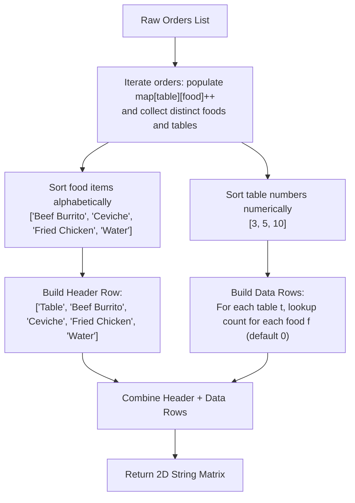

# Guided Example: Display Table of Food Orders in a Restaurant

We trace the step-by-step execution of two-dimensional cross-tabulation (pivot table construction) on a representative problem instance:

- **Input:**
  $$
  orders = [
    [\text{"David"}, \text{"3"}, \text{"Ceviche"}],
    [\text{"Corina"}, \text{"10"}, \text{"Beef Burrito"}],
    [\text{"David"}, \text{"3"}, \text{"Fried Chicken"}],
    [\text{"Carla"}, \text{"5"}, \text{"Water"}],
    [\text{"Carla"}, \text{"5"}, \text{"Ceviche"}],
    [\text{"Rous"}, \text{"3"}, \text{"Ceviche"}]
  ]
  $$
- **Required Output:**
  $$
  [
    [\text{"Table"}, \text{"Beef Burrito"}, \text{"Ceviche"}, \text{"Fried Chicken"}, \text{"Water"}],
    [\text{"3"}, \text{"0"}, \text{"2"}, \text{"1"}, \text{"0"}],
    [\text{"5"}, \text{"0"}, \text{"1"}, \text{"0"}, \text{"1"}],
    [\text{"10"}, \text{"1"}, \text{"0"}, \text{"0"}, \text{"0"}]
  ]
  $$

This instance features multiple orders per table, identical dishes ordered multiple times at the same table (Ceviche at table $3$), tables ordering different subsets of dishes, and demonstrates the dual-sorting requirement: food items sorted alphabetically, and table numbers sorted numerically.

---

## 1. Instance & Teaching Goal

We are given an array of order records, each containing a customer name, a table number (as a string), and an ordered food item. We must transform these flat order events into a formatted restaurant **display table** (a cross-tabulation matrix):
- The header row starts with `"Table"`, followed by all unique food items appearing across the dataset in **alphabetical order**.
- Each subsequent row corresponds to a table that placed at least one order.
- Table rows must appear in **numerically increasing order** of table number (e.g. $3 < 5 < 10$, not string order where `"10"` precedes `"3"`).
- Each cell contains the total count of the specified food item ordered at that table, formatted as a string (defaulting to `"0"` if none were ordered).
- Customer names are ignored in the final display.

The primary teaching goal is to model pivot table aggregation using a two-level nested hash map, separate row and column dimension projections, apply heterogeneous sorting criteria (alphabetical vs numerical), and format matrix cells with zero-fill semantics.

---

## 2. Conceptual Foundation & Invariants

A relational order record is a tuple $\langle \text{customer}, \text{table}, \text{food} \rangle$.
1. **Dimension Extraction:**
   - Column dimension: Set of all distinct food items:
     $$
     \mathcal{F} = \text{sort}_{\text{alphabetical}} \left( \bigcup \pi_{\text{food}}(orders) \right)
     $$
   - Row dimension: Set of all distinct table identifiers:
     $$
     \mathcal{T} = \text{sort}_{\text{numerical}} \left( \bigcup \pi_{\text{table}}(orders) \right)
     $$
2. **Aggregation Function:**
   For each table $t \in \mathcal{T}$ and food item $f \in \mathcal{F}$:
   $$
   C(t, f) = \sum_{\langle c, t', f' \rangle \in orders} \mathbf{1}_{\{t' = t \land f' = f\}}
   $$
3. **Grid Assembly:**
   - Header row: $\langle \text{"Table"}, f_1, f_2, \dots, f_{|\mathcal{F}|} \rangle$.
   - Data row for table $t$: $\langle \text{str}(t), \text{str}(C(t, f_1)), \dots, \text{str}(C(t, f_{|\mathcal{F}|})) \rangle$.

```
Aggregation Grid (Pivot Matrix):
Tables (Rows) \ Foods (Cols) | Beef Burrito | Ceviche | Fried Chicken | Water
-----------------------------+--------------+---------+---------------+-------
Table 3                      |      0       |    2    |       1       |   0
Table 5                      |      0       |    1    |       0       |   1
Table 10                     |      1       |    0    |       0       |   0

Sort Invariants:
Columns: "Beef Burrito" < "Ceviche" < "Fried Chicken" < "Water" (Alphabetical)
Rows:    3 < 5 < 10 (Numerical, avoiding "10" < "3")
```

We define tracking variables for cross-tabulation:

| State Variable | Data Type | Role in Pipeline |
|---|---|---|
| Food Items Set ($\mathcal{F}$) | Ordered array of strings | Distinct food names defining matrix columns |
| Table Numbers Set ($\mathcal{T}$) | Ordered array of integers | Distinct table IDs defining matrix rows |
| Frequency Map ($M$) | Nested map: $\text{table} \to (\text{food} \to \text{count})$ | Running tally of ordered quantities |
| Matrix Output | 2D array of strings | Assembled display table |

> **Invariant.** For every table $t \in \mathcal{T}$ and food item $f \in \mathcal{F}$, the count cell in row $t$, column $f$ equals the exact number of matching order entries in $orders$, represented as a string without null placeholders.



---

## 3. Step-by-Step Worked Execution

### Step 1: Ingest Orders into Nested Frequency Map

We iterate through all $6$ order tuples and update the tally:
1. `["David", "3", "Ceviche"]` $\implies M[3][\text{"Ceviche"}] = 1$.
2. `["Corina", "10", "Beef Burrito"]` $\implies M[10][\text{"Beef Burrito"}] = 1$.
3. `["David", "3", "Fried Chicken"]` $\implies M[3][\text{"Fried Chicken"}] = 1$.
4. `["Carla", "5", "Water"]` $\implies M[5][\text{"Water"}] = 1$.
5. `["Carla", "5", "Ceviche"]` $\implies M[5][\text{"Ceviche"}] = 1$.
6. `["Rous", "3", "Ceviche"]` $\implies M[3][\text{"Ceviche"}]$ increments from $1$ to $2$.

| Order Record | Table Key | Food Key | Updated Count at $M[\text{table}][\text{food}]$ |
|---|---|---|---|
| `["David", "3", "Ceviche"]` | $3$ | Ceviche | $1$ |
| `["Corina", "10", "Beef Burrito"]` | $10$ | Beef Burrito | $1$ |
| `["David", "3", "Fried Chicken"]` | $3$ | Fried Chicken | $1$ |
| `["Carla", "5", "Water"]` | $5$ | Water | $1$ |
| `["Carla", "5", "Ceviche"]` | $5$ | Ceviche | $1$ |
| `["Rous", "3", "Ceviche"]` | $3$ | Ceviche | $2$ (Accumulated) |

---

### Step 2: Extract and Sort Column and Row Dimensions

- **Unique Food Items:**
  Set: $\{\text{"Ceviche"}, \text{"Beef Burrito"}, \text{"Fried Chicken"}, \text{"Water"}\}$.
  Alphabetical sort:
  $$
  \mathcal{F} = [\text{"Beef Burrito"}, \text{"Ceviche"}, \text{"Fried Chicken"}, \text{"Water"}]
  $$
- **Unique Tables:**
  Set of integers: $\{3, 10, 5\}$.
  Numerical sort:
  $$
  \mathcal{T} = [3, 5, 10]
  $$

| Dimension | Raw Discovered Set | Sorting Criteria | Resulting Ordered Dimension |
|---|---|---|---|
| Columns (Food) | $\{\text{Ceviche}, \text{Beef Burrito}, \text{Fried Chicken}, \text{Water}\}$ | Alphabetical (Lexicographical) | `["Beef Burrito", "Ceviche", "Fried Chicken", "Water"]` |
| Rows (Tables) | $\{3, 10, 5\}$ | Numerical ($\text{int}(t)$ ascending) | `[3, 5, 10]` |

---

### Step 3: Construct the Header Row

The first row starts with `"Table"`, followed by all entries of $\mathcal{F}$:
$$
\text{Header} = [\text{"Table"}, \text{"Beef Burrito"}, \text{"Ceviche"}, \text{"Fried Chicken"}, \text{"Water"}]
$$

---

### Step 4: Construct Data Rows with Zero Filling

For each table in $\mathcal{T} = [3, 5, 10]$, inspect each food item in $\mathcal{F}$:
- **Table 3:**
  - `"Beef Burrito"`: count is $0$.
  - `"Ceviche"`: count is $2$.
  - `"Fried Chicken"`: count is $1$.
  - `"Water"`: count is $0$.
  - Row: `["3", "0", "2", "1", "0"]`.
- **Table 5:**
  - `"Beef Burrito"`: count is $0$.
  - `"Ceviche"`: count is $1$.
  - `"Fried Chicken"`: count is $0$.
  - `"Water"`: count is $1$.
  - Row: `["5", "0", "1", "0", "1"]`.
- **Table 10:**
  - `"Beef Burrito"`: count is $1$.
  - `"Ceviche"`: count is $0$.
  - `"Fried Chicken"`: count is $0$.
  - `"Water"`: count is $0$.
  - Row: `["10", "1", "0", "0", "0"]`.

| Table ($t$) | Count(Beef Burrito) | Count(Ceviche) | Count(Fried Chicken) | Count(Water) | Materialized String Row |
|---|---|---|---|---|---|
| $3$ | $0$ | $2$ | $1$ | $0$ | `["3", "0", "2", "1", "0"]` |
| $5$ | $0$ | $1$ | $0$ | $1$ | `["5", "0", "1", "0", "1"]` |
| $10$ | $1$ | $0$ | $0$ | $0$ | `["10", "1", "0", "0", "0"]` |

---

## 4. Complete Execution Trace

| Step | Operation Target | Action | Resulting Matrix State |
|---|---|---|---|
| 1 | Order processing | Stream all $6$ order tuples into nested map | Table $3$: Ceviche $\times 2$, Chicken $\times 1$<br/>Table $5$: Water $\times 1$, Ceviche $\times 1$<br/>Table $10$: Burrito $\times 1$ |
| 2 | Header generation | Prepend `"Table"` to alphabetical food list | Row $0$: `["Table", "Beef Burrito", "Ceviche", "Fried Chicken", "Water"]` |
| 3 | Row 1 (Table 3) | Query food counts for table $3$ | Row $1$: `["3", "0", "2", "1", "0"]` |
| 4 | Row 2 (Table 5) | Query food counts for table $5$ | Row $2$: `["5", "0", "1", "0", "1"]` |
| 5 | Row 3 (Table 10) | Query food counts for table $10$ | Row $3$: `["10", "1", "0", "0", "0"]` |
| 6 | Emission | Bundle header and data rows | Final $4 \times 5$ string matrix |

---

## 5. Algorithmic Correctness

**Soundness.** Every order contributes exactly once to the count cell determined by its table number and food item. Table numbers are sorted strictly by numeric value ($3 < 5 < 10$), and food items are sorted lexicographically. Every missing dish at a table evaluates to count $0$, ensuring that the matrix has uniform column count and contains no missing values.

**Completeness.** All unique tables and food items mentioned in $orders$ are collected into their respective sets. No active table or ordered dish is omitted. The Cartesian product of $\mathcal{T} \times \mathcal{F}$ guarantees that every possible table-food pair is accounted for in the output.

---

## 6. Traps This Instance Exposes

- **Lexicographical Table Sorting:** Sorting table numbers as strings causes `"10"` to appear before `"3"` and `"5"`. Tables must be cast to integers for sorting, and then converted back to strings for display.
- **Null Instead of Zero:** When a table has not ordered a particular item, omitting the cell or outputting empty string/null violates the rectangular matrix requirement; `"0"` is required.
- **Leaking Customer Names:** Including customer names in the table violates the schema; customer names must be discarded during aggregation.
- **Unsorted Columns:** Outputting columns in order of first discovery rather than alphabetical order fails the format specification.

---

## 7. Complexity Derivation

- **Time Complexity:** $\mathcal{O}(N + F \log F + T \log T + T \cdot F)$, where $N$ is the number of orders ($N \le 5 \cdot 10^4$), $F$ is the number of distinct food items, and $T$ is the number of distinct tables ($T \le 500$). Aggregating orders into hash maps takes $\mathcal{O}(N)$. Sorting unique food items takes $\mathcal{O}(F \log F)$ and sorting tables takes $\mathcal{O}(T \log T)$. Constructing the output grid requires filling $T \times F$ cells. Total runtime is linear with respect to order volume and grid size.
- **Auxiliary Space Complexity:** $\mathcal{O}(T \cdot F + N)$ to store the nested frequency map, distinct sets, and the resulting $2D$ string matrix.
