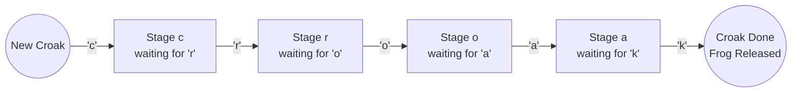

# Guided Example: Minimum Number of Frogs Croaking

We trace the step-by-step execution of state-machine concurrency tracking on a representative problem instance:

- **Input:** $croakOfFrogs = \text{"crcoakroak"}$
- **Required Output:** $2$

This instance features interleaved croaks from multiple frogs, demonstrates state-stage progression through `'c'`, `'r'`, `'o'`, `'a'`, `'k'`, captures the moment of peak concurrency where two frogs are croaking simultaneously, and verifies frog reuse upon completion.

---

## 1. Instance & Teaching Goal

We are given a string `croakOfFrogs` composed of mixed characters from multiple frogs. Each frog must produce the sequence of five letters `'c'`, `'r'`, `'o'`, `'a'`, `'k'` in strict sequential order. Once a frog finishes emitting `'k'`, it becomes idle and may immediately begin a new croak. Multiple frogs can croak concurrently.

Our goal is to compute the **minimum number of different frogs** required to produce the observed sequence, or return `-1` if the string cannot be formed by valid, completed croaks.

In `croakOfFrogs = "crcoakroak"`:
- Characters $0$ and $1$ (`"cr"`) are produced by Frog 1.
- Character $2$ (`"c"`) starts a second croak while Frog 1 is still active, requiring Frog 2.
- Characters $3, 4, 5$ (`"oak"`) complete Frog 1's croak, leaving Frog 2 as the sole active frog.
- Characters $6, 7, 8, 9$ (`"roak"`) complete Frog 2's croak.
- The peak number of simultaneously active frogs is $2$.

The primary teaching goal is to model sequential token production as an ordered finite state machine, where each character advances a frog from stage $j - 1$ to stage $j$, and the minimum frog count corresponds to the maximum concurrent active state load.

---

## 2. Conceptual Foundation & Invariants

A croak consists of four intermediate waiting stages and one terminal release:
1. Stage $c$: Frogs that produced `'c'` and are waiting for `'r'`.
2. Stage $r$: Frogs that produced `'r'` and are waiting for `'o'`.
3. Stage $o$: Frogs that produced `'o'` and are waiting for `'a'`.
4. Stage $a$: Frogs that produced `'a'` and are waiting for `'k'`.

When observing character $ch$:
- **If $ch = \text{'c'}$:** A new croak begins. Increment $c \leftarrow c + 1$ and increase active count $active \leftarrow active + 1$. Update $peak \leftarrow \max(peak, active)$.
- **If $ch = \text{'r'}$:** A frog waiting in stage $c$ moves to stage $r$. Requires $c > 0$ (otherwise invalid $\implies -1$). Update $c \leftarrow c - 1, r \leftarrow r + 1$.
- **If $ch = \text{'o'}$:** Requires $r > 0$ (otherwise $-1$). Update $r \leftarrow r - 1, o \leftarrow o + 1$.
- **If $ch = \text{'a'}$:** Requires $o > 0$ (otherwise $-1$). Update $o \leftarrow o - 1, a \leftarrow a + 1$.
- **If $ch = \text{'k'}$:** Requires $a > 0$ (otherwise $-1$). Update $a \leftarrow a - 1$ and decrement $active \leftarrow active - 1$.

At the conclusion of the string:
- All frogs must have completed their croaks: $c = r = o = a = active = 0$.
- If any stage has remaining frogs, the string is incomplete $\implies -1$.

```
Timeline of Overlapping Croaks for "crcoakroak":
Index:   0   1   2   3   4   5   6   7   8   9
Char:    c   r   c   o   a   k   r   o   a   k
----------------------------------------------
Frog 1: [c - r ----- o - a - k]  (Finishes at 5)
Frog 2:         [c ------------- r - o - a - k] (Finishes at 9)
----------------------------------------------
Active:  1   1   2   2   2   1   1   1   1   0
                 ^
                 Peak Concurrency = 2 Frogs
```

We define tracking variables across the string:

| State Variable | Meaning | Initial State |
|---|---|---|
| Counters $c, r, o, a$ | Frogs currently waiting at intermediate stages | All $0$ |
| $active$ | Total frogs currently in mid-croak ($c + r + o + a$) | $0$ |
| $peak$ | Maximum value of $active$ achieved | $0$ |

> **Invariant.** At any position, each stage counter represents the exact count of frogs ready to consume the next character of the sequence `"croak"`. A character is valid if and only if its predecessor stage counter is strictly positive.



---

## 3. Step-by-Step Worked Execution

We trace the $10$ characters of `"crcoakroak"`:

1. **Index 0 (`'c'`):** New croak starts. $c \leftarrow 1$, $active \leftarrow 1$, $peak \leftarrow 1$.
2. **Index 1 (`'r'`):** $c = 1 > 0$. Move frog: $c \leftarrow 0, r \leftarrow 1$. Active remains $1$.
3. **Index 2 (`'c'`):** New croak starts while Frog 1 is at stage $r$. $c \leftarrow 1$, $active \leftarrow 2$, $peak \leftarrow \max(1, 2) = 2$.
4. **Index 3 (`'o'`):** $r = 1 > 0$. Advance Frog 1: $r \leftarrow 0, o \leftarrow 1$. Active is $2$.
5. **Index 4 (`'a'`):** $o = 1 > 0$. Advance Frog 1: $o \leftarrow 0, a \leftarrow 1$. Active is $2$.
6. **Index 5 (`'k'`):** $a = 1 > 0$. Frog 1 completes croak! $a \leftarrow 0$, $active \leftarrow 2 - 1 = 1$.
7. **Index 6 (`'r'`):** $c = 1 > 0$. Advance Frog 2: $c \leftarrow 0, r \leftarrow 1$. Active is $1$.
8. **Index 7 (`'o'`):** $r = 1 > 0$. Advance Frog 2: $r \leftarrow 0, o \leftarrow 1$. Active is $1$.
9. **Index 8 (`'a'`):** $o = 1 > 0$. Advance Frog 2: $o \leftarrow 0, a \leftarrow 1$. Active is $1$.
10. **Index 9 (`'k'`):** $a = 1 > 0$. Frog 2 completes croak! $a \leftarrow 0$, $active \leftarrow 1 - 1 = 0$.

| Index | Character | Stage Action | $(c, r, o, a)$ | Current Active | Peak Active |
|---|---|---|---|---|---|
| $0$ | `'c'` | Start Frog 1 | $(1, 0, 0, 0)$ | $1$ | $1$ |
| $1$ | `'r'` | Frog 1: $c \to r$ | $(0, 1, 0, 0)$ | $1$ | $1$ |
| $2$ | `'c'` | Start Frog 2 | $(1, 1, 0, 0)$ | $2$ | $2$ |
| $3$ | `'o'` | Frog 1: $r \to o$ | $(1, 0, 1, 0)$ | $2$ | $2$ |
| $4$ | `'a'` | Frog 1: $o \to a$ | $(1, 0, 0, 1)$ | $2$ | $2$ |
| $5$ | `'k'` | Frog 1 done | $(1, 0, 0, 0)$ | $1$ | $2$ |
| $6$ | `'r'` | Frog 2: $c \to r$ | $(0, 1, 0, 0)$ | $1$ | $2$ |
| $7$ | `'o'` | Frog 2: $r \to o$ | $(0, 0, 1, 0)$ | $1$ | $2$ |
| $8$ | `'a'` | Frog 2: $o \to a$ | $(0, 0, 0, 1)$ | $1$ | $2$ |
| $9$ | `'k'` | Frog 2 done | $(0, 0, 0, 0)$ | $0$ | $2$ |

---

### Step 11: Final Validation Check

At string end:
- $c = 0, r = 0, o = 0, a = 0$.
- $active = 0$.
- String length $10$ is divisible by $5$ ($2$ full croaks).
- All checks pass. Return $peak = 2$.

---

## 4. Complete Execution Trace

| Phase | Read Head | Token Processed | Valid Predecessor? | Transition Applied | Active Count |
|---|---|---|---|---|---|
| Initialization | Start | — | — | All stages set to $0$ | $0$ |
| Prefix Step 1 | $0$ | `'c'` | Yes (Root trigger) | $c \leftarrow 1$ | $1$ |
| Prefix Step 2 | $1$ | `'r'` | Yes ($c = 1$) | $c \leftarrow 0, r \leftarrow 1$ | $1$ |
| Overlap Trigger | $2$ | `'c'` | Yes (Root trigger) | $c \leftarrow 1$ | $2$ (Peak) |
| Interleaved Step 1 | $3$ | `'o'` | Yes ($r = 1$) | $r \leftarrow 0, o \leftarrow 1$ | $2$ |
| Interleaved Step 2 | $4$ | `'a'` | Yes ($o = 1$) | $o \leftarrow 0, a \leftarrow 1$ | $2$ |
| Release 1 | $5$ | `'k'` | Yes ($a = 1$) | $a \leftarrow 0$, complete | $1$ |
| Resume Frog 2 | $6$ | `'r'` | Yes ($c = 1$) | $c \leftarrow 0, r \leftarrow 1$ | $1$ |
| Suffix Step 1 | $7$ | `'o'` | Yes ($r = 1$) | $r \leftarrow 0, o \leftarrow 1$ | $1$ |
| Suffix Step 2 | $8$ | `'a'` | Yes ($o = 1$) | $o \leftarrow 0, a \leftarrow 1$ | $1$ |
| Release 2 | $9$ | `'k'` | Yes ($a = 1$) | $a \leftarrow 0$, complete | $0$ |
| Verification | End | — | All stages $= 0$ | Confirm zero residuals | Output: $2$ |

---

## 5. Algorithmic Correctness

**Soundness.** A frog is only advanced to stage $j$ if another frog is currently waiting in stage $j - 1$. The total number of frogs active at any point equals the sum of frogs in stages $c, r, o, a$. Because a single frog cannot produce two characters at the exact same moment across distinct croaks, the peak active count represents a strict lower bound on distinct frogs needed.

**Completeness.** Since completed frogs are immediately returned to the idle pool upon emitting `'k'`, the algorithm reuses frogs greedily. By Dilworth's theorem on poset chain decompositions, greedy reuse of completed resources achieves the minimal chain partition, proving that $peak$ is both sufficient and globally minimal.

---

## 6. Traps This Instance Exposes

- **Missing Predecessor Stage:** If a character like `'r'` appears when $c = 0$, an invalid sequence is detected and the algorithm must immediately return `-1`.
- **Incomplete Croaks at String End:** A string like `"croakc"` has valid prefixes, but leaves $c = 1$ at the end. Forgetting to verify $c = r = o = a = 0$ accepts incomplete croaks.
- **Counting Total Croaks Instead of Concurrent Frogs:** Returning the total number of `'c'` occurrences gives the total croak count, not the minimum distinct frogs needed simultaneously.
- **Foreign Characters:** Any character other than `'c'`, `'r'`, `'o'`, `'a'`, `'k'` immediately invalidates the input.

---

## 7. Complexity Derivation

- **Time Complexity:** $\mathcal{O}(n)$, where $n$ is the length of `croakOfFrogs`. The string is scanned in a single linear pass with $\mathcal{O}(1)$ counter updates per character.
- **Auxiliary Space Complexity:** $\mathcal{O}(1)$. Only $6$ integer variables ($c, r, o, a, active, peak$) are used.
